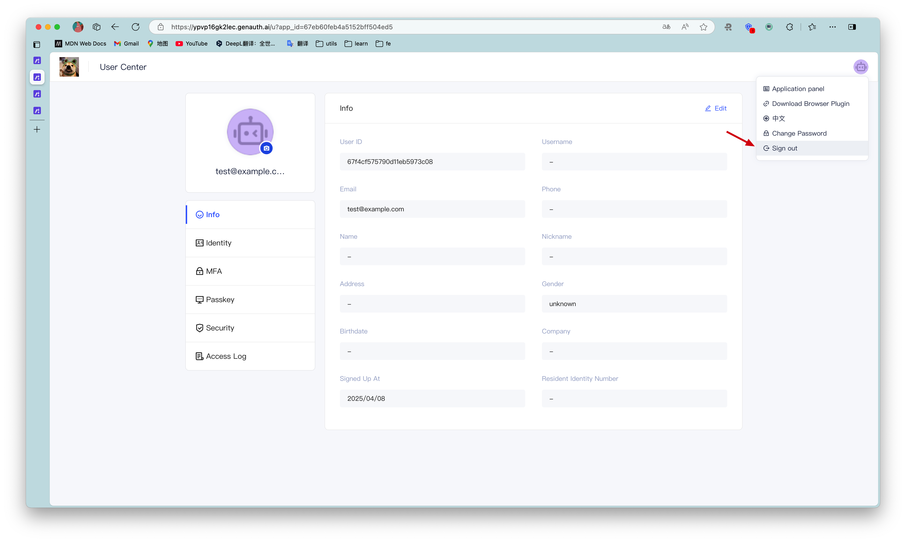
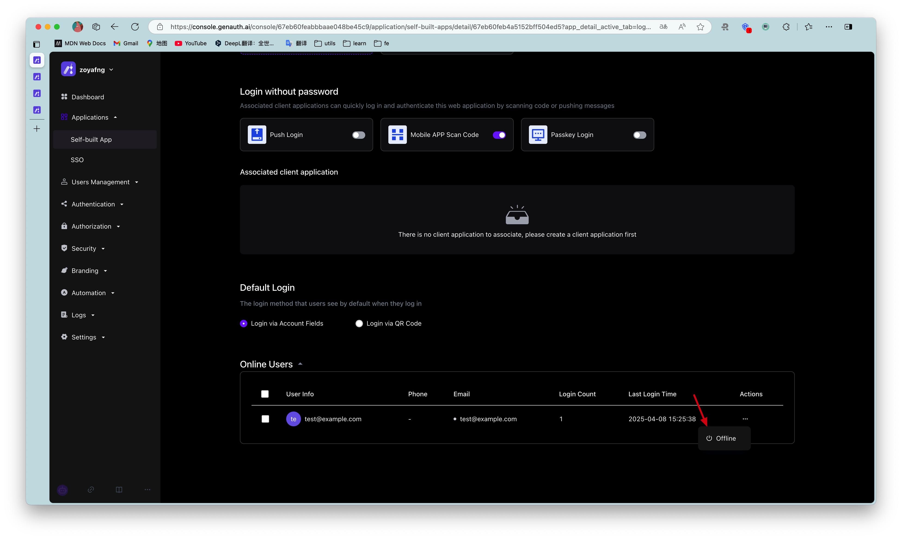

# Logout

<LastUpdated/>

{{$localeConfig.brandName}} supports multiple ways to log out:

- [Logout from the personal center](#Logout from the personal center): This method is suitable for scenarios where you use the online personal center hosted by {{$localeConfig.brandName}};
- [Logout from the front end](#Logout from the front end): This method is suitable for almost any scenario;
- [Logout from the back end](#Logout from the back end): This method is suitable for scenarios where administrators call APIs to force users to log out;
- [Force users to log out](#Force users to log out): This method is suitable for scenarios where administrators use the console to force users to log out.

## Logout from the personal center

End users can visit `https://appdomain.genauth.ai/u` to enter the personal center, click the avatar in the upper right corner, and click Logout.



## Logout from the frontend

Guide your end users to log out by visiting `https://appdomain.genauth.ai/login/profile/logout?redirect_uri={{CALLBACK_URL}}`. redirect_uri can be filled with a callback address after logout, for example, you can jump to your business homepage.

> Note ⚠️: You need to use `encodeURIComponent` to URL Encode the callback link.

## Logout from the backend

If you need to log out a {{$localeConfig.brandName}} user in the backend, you need to access the following interface:

- Interface description: The user pool administrator logs out the {{$localeConfig.brandName}} user in the backend.
- Interface address: `POST` `https://<your application domain name>.genauth.ai/api/applications/:appId/kick-active-users`
- Request header:

| Parameter             | Type   | Required | Description                   |
| --------------------- | ------ | -------- | ----------------------------- |
| x-authing-userpool-id | string | Yes      | User pool ID.                 |
| Authorization         | string | Yes      | User pool administrator token |

- Request parameters:

| Parameter | Type     | Required | Description     |
| --------- | -------- | -------- | --------------- |
| userIds   | string[] | Yes      | User ID array.  |
| appId     | string   | Yes      | Application ID. |

- Return data:

```json
{
  "code": 200,
  "message": "Forced offline successful"
}
```

## Force user offline

User pool administrators can force users to log off through **Console** > **Application** > **Login management**.


