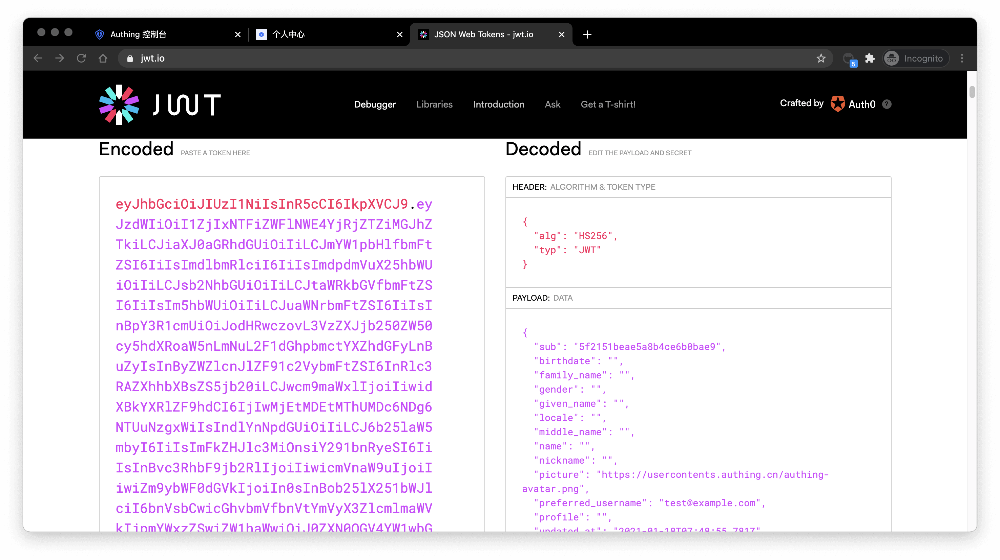

# Complete authentication using the embedded login component

<LastUpdated/>

The embedded login component (Guard) is considered to be the best balance between flexibility and integration. This mode is recommended if the integration requires a deeper level of customization or if [hosted mode](../use-hosted-login-page.md) cannot be used in some scenarios where the front-end and back-end are separated. The embedded login component is built and updated by {{$localeConfig.brandName}}, uses industry best practice security design, and only requires a few lines of JavaScript code to integrate into your project. It can be loaded directly from CDN or NPM, or built from source code. GenAuth login components also provide multiple integration modes for Javascript native, React, Vue, and Angular, which can be seamlessly integrated in any of your projects and enjoy a high degree of customization flexibility. For more detailed introduction, please see [Integrate GenAuth Guard](/reference/guard/).

::: hint-info
You can check [Hosted Login Page vs Embeddable Login Component](/concepts/embeded-vs-hosted.md) to understand the difference between the {{$localeConfig.brandName}} hosted login page and the embedded login component.
:::

## Embedded Login Component Introduction

The {{$localeConfig.brandName}} embedded login component integrates the following functions:

- Login: including account and password login (including mobile phone number + password, email + password, username + password), verification code login (SMS verification code, email verification code) and mobile APP scan code.
- Registration: including mobile phone verification code registration and username and password registration.
- Social login, such as GitHub login (need to be configured in the background first).
- APP scan code login (need to connect to APP scan code login first).
- Mini program scan code login (need to be configured in the background first).
- Enterprise identity source login (need to configure the enterprise identity source).
- Forgot password and reset password.
- MFA authentication.

It has the following features:

- Lightweight: All resources packaged together are only a few hundred kb;
- Responsive: Compatible with mobile and PC web pages;
- Customizable: Can support complete UI customization functions.

<iframe src="https://codesandbox.io/embed/red-microservice-6613h?fontsize=14&hidenavigation=1&theme=dark"
     style="width:100%; height:500px; border:0; border-radius: 4px; overflow:hidden;"
     title="authing-react-guard"
     allow="accelerometer; ambient-light-sensor; camera; encrypted-media; geolocation; gyroscope; hid; microphone; midi; payment; usb; vr; xr-spatial-tracking"
     sandbox="allow-forms allow-modals allow-popups allow-presentation allow-same-origin allow-scripts"
></iframe>

</br>

## Access process of different front-end frameworks

No matter which framework you use, you need to use the application's `appId`, please [go to the console to obtain](https://console.genauth.ai) first. For the location of **APP ID**, please refer to [Application Configuration](https://docs.genauth.ai/guides/app-new/create-app/app-configuration.html).

<StackSelector snippet="ui-components-example" selectLabel="Select front-end framework" :order="['react', 'react18', 'vue', 'vue3', 'angular', 'native-javascript']"/>

## Verify whether the user's Token is valid on the back end

The `token` field of the user information is a standard [OIDC IdToken](/concepts/id-token.md). You can verify this `token` on the back end using the application's ID and Secret.

Example `token` As follows:

```
eyJhbGciOiJIUzI1NiIsInR5cCI6IkpXVCJ9.eyJzdWIiOiI1ZjIxNTFiZWFlNWE4YjRjZTZiMGJhZTkiLCJiaXJ0aGRhdGUiOiIiLCJmYW1pbHlfbmFtZSI6IiIsImdlbmRlciI6IiIsImdpdmVuX25hbWUiOiIiLCJsb2 NhbGUiOiIiLCJtaWRkbGVfbmFtZSI6IiIsIm5hbWUiOiIiLCJuaWNrbmFtZSI6IiIsInBpY3R1cmUiOiJodHRwcz ovL3VzZXJjb250ZW50cy5hdXRoaW5nLmNuL2F1dGhpbmctYXZhdGFyLnBuZyIsInByZWZlcnJlZF91c2VybmFtZSI 6InRlc3RAZXhhbXBsZS5jb20iLCJwcm9maWxlIjoiIiwidXBkYXRlZF9hdCI6IjIwMjEtMDEtMThUMDc6NDg6NTU uNzgxWiIsIndlYnNpdGUiOiIiLCJ6b25laW5mbyI6IiIsImFkZHJlc3MiOnsiY291bnRyeSI6IiIsInBvc3RhbF9j b2RlIjoiIiwicmVnaW9uIjoiIiwiZm9ybWF0dGVkIjoiIn0sInBob25lX251bWJlciI6bnVsbCwicGhvbmVfbnVt YmVyX3ZlcmlmaWVkIjpmYWxzZSwiZW1haWwiOiJ0ZXN0QGV4YW1wbGUuY29tIiwiZW1haWxfdmVyaWZpZWQiOmZhb HNlLCJkYXRhIjp7InR5cGUiOiJ1c2VyIiwidXNlclBvb2xJZCI6IjVhOWZhMjZjZjg2MzVhMDAwMTg1NTI4YyIsI mFwcElkIjoiNjAwNTNiNzQxNjQ3OGRlMmU4OGZhYjQzIiwiaWQiOiI1ZjIxNTFiZWFlNWE4YjRjZTZiMGJhZTkiLC J1c2VySWQiOiI1ZjIxNTFiZWFlNWE4YjRjZTZiMGJhZTkiLCJfaWQiOiI1ZjIxNTFiZWFlNWE4YjRjZTZiMGJhZT kiLCJwaG9uZSI6bnVsbCwiZW1haWwiOiJ0ZXN0QGV4YW1wbGUuY29tIiwidXNlcm5hbWUiOiJ0ZXN0QGV4YW1wbGU uY29tIiwidW5pb25pZCI6bnVsbCwib3BlbmlkIjpudWxsLCJjbGllbnRJZCI6IjVhOWZhMjZjZjg2MzVhMDAwMTg 1NTI4YyJ9LCJ1c2VycG9vbF9pZCI6IjVhOWZhMjZjZjg2MzVhMDAwMTg1NTI4YyIsImF1ZCI6IjYwMDUzYjc0MTY0 NzhkZTJlODhmYWI0MyIsImV4cCI6MTYxMjE2NTg4OCwiaWF0IjoxNjEwOTU2Mjg4LCJpc3MiOiJodHRwczovL3NhbXBsZS1hcHAuYXV0aGluZy5jbi9vaWRjIn0.SNyGBffF-zBqDQFINGxUJZrWSAADHQhbEOsKvnH4SLg
```

You can Decode this ID Token in [JWT.IO](https://jwt.io/) (domestic users can visit this [mirror site](https://jwt.yelexin.cn)):



The `sub` field is the user's ID, and the `aud` field is the application's ID. You can learn the detailed meaning of each field of OIDC `IdToken` through [Microsoft identity platform ID tokens](https://docs.microsoft.com/en-us/azure/active-directory/develop/id-tokens).

Basically all languages ​​provide libraries for verifying `IdToken`. Taking Node.js as an example, you can use [JSON Web Token](https://www.npmjs.com/package/jsonwebtoken) to verify `IdToken`:

```javascript
const jwt = require("jsonwebtoken");

try {
  const data = jwt.verify("YOUR_ID_TOKEN", "YOUR_APP_SECRET");
} catch (error) {
  // token might be invalid or expired
  console.error(error);
}
```

If the verification is successful, you can get the user's unique ID through the sub field, and then you can combine the user ID with your own business! If you need to grant different roles and permissions to different users, you can learn how to grant roles and permissions to users for fine-grained permission control.

## Detailed parameter and event list

{{$localeConfig.brandName}} embedded login component supports high customization. In addition to customizing basic configurations such as title and logo, you can also configure different login methods and fully customize the style through custom CSS. In addition to successful login events, {{$localeConfig.brandName}} embedded login component also encapsulates successful registration, login failure, login registration method switching and other events. For detailed documents, please see [Login Component (Guard) Documentation](/reference/guard/).
