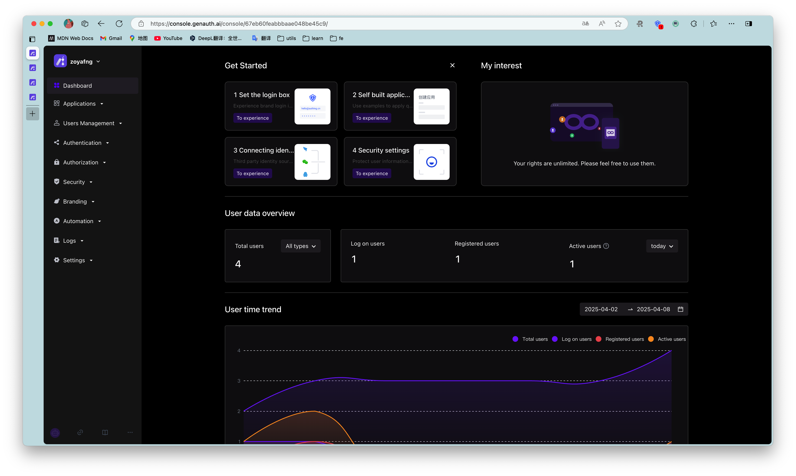

---
meta:
  - name: description
    content: Console Overview
---

# Console Overview

<LastUpdated/>

The console is where you manage and configure all GenAuth resources. This article will help you learn how to use the GenAuth console to improve your productivity!

In the [GenAuth console](https://console.genauth.ai/console/userpool) you can configure and modify GenAuth resources, users and other information.

::: img-description
Overview of the console
:::

The following will introduce each module of the console **from top to bottom** according to the navigation menu on the left side of the console:

<table>
  <thead>
    <tr>
      <th style="text-align:left">Module</th>
      <th style="text-align:left">Description</th>
    </tr>
  </thead>
  <tbody>
   <tr>
      <td style="text-align:left"><b>Overview</b></td>
      <td style="text-align:left">
     Display various statistics of the system and users, including:
        <ul>
            <li>Display the total number of applications. </li>
            <li>Display the total number of users. </li>
            <li>Display login and new user statistics. </li>
            <li>View the number of user logins, changes in the number of logins, application login information, user distribution and other statistics over a period of time in a variety of graphical methods. </li>
        </ul>
      </td>
    </tr>
        <tr>
      <td style="text-align:left"><b>Application</b></td>
      <td style="text-align:left">
      You can configure single sign-on (SSO) in the <b>Application</b> module, including:
        <ul>
          <li>Integrate third-party applications. </li>
          <li>As a service provider (SP), integrate APP into GenAuth:</li>
          <ul> ​
         <li>You can configure basic application information, default page display, and integrate OIDC / SAML2 / CAS / OAuth 2.0 / protocol for the application. </li>​
         <li>Configure login method. </li>​
         <li>Perform access authorization. </li>​
          <li>Customize application login box, security rules, and identity branding. </li>​
          <li>Perform tenant configuration. </li>​
         </ul>
         </li>
          <li>As an identity provider (IDP), it provides external authentication. </li>
        </ul>
      </td>
    </tr>
    <tr>
      <td style="text-align:left"><b>Identity source management</b></td>
      <td style="text-align:left">
        
Connect to third-party identity sources, support applications to authenticate and authorize login through third-party identity sources, and support customer-defined databases to store user data, as follows: 

        <ul>
          <li>Connect to enterprise identity sources (OIDC, SAML, office applications such as DingTalk, WeChat for Enterprise). </li>
          <li>Configure social login. </li>
          <li>Customize database. </li>
        </ul>
      </td>
    </tr>
    <tr>
<td style="text-align:left"><b>User Management</b></td>
      <td style="text-align:left">
        
Manage all organization and user information in the system, including:

        <ul>
          <li>Create and manage users.</li>
          <li>Create and manage user groups.</li>
          <li>Create and manage organizations.</li>
<li>Create synchronization tasks to achieve upstream/downstream synchronization of organization information and user information.</li>
<li>Use LDAP protocol to view, modify, add and delete user information.</li>
<li>Configure registration whitelist. After enabling, only users in the whitelist can register. </li>
        </ul>
      </td>
    </tr>
    <tr>
      <td style="text-align:left"><b>Permission management</b></td>
      <td style="text-align:left">
        
Refined permission management based on resources, RBAC (Role-Based Access Control) and ABAC (Attribute-Based Access Control), including:

        <ul>
          <li>Add and manage resources, and configure resource operation types.</li>
          <li>Add and manage roles, assign users and organizations to roles, and authorize resource operations for roles.</li>
          <li>Grant resource access, modification and other permissions to certain subjects through certain authorization rules. </li>
        </ul>
        </td>
    </tr>
    <tr>
      <td style="text-align:left"><b>Security Settings</b></td>
      <td style="text-align:left">
        
Configure security policies for the development process, password settings, and two-factor authentication, including: 

        <ul>
          <li>Configure user pool-level basic, registration, and login security rules.
          
Security domains (Allowed Origins) are URLs that are allowed to make requests to the GenAuth API from JavaScript (usually used with CORS). By default, the system allows you to use all URLs (\*). This field allows you to enter additional origins if needed. You can separate multiple valid URLs by line, and use wildcards at the subdomain level (for example: [https://\*.sample.com. ](https://*.sample.com). ) Query strings and hash information are not considered when validating these URLs. If query strings and hash information are included, the system will automatically ignore the entire domain name. 

          </li>
          <li>Customize password strength, encryption method, and password rotation policy. </li>
          <li>Configure user pool-level secondary authentication. </li>
        </ul>
      </td>
    </tr>
    <tr>
      <td style="text-align:left"><b>Branding</b></td>
      <td style="text-align:left">
        
You can customize the login panel and configure information completion according to different corporate brand requirements. 

        <ol>
          <li>Configure the login box style. </li>
          <li>Upload custom CSS. </li>
          <li>Configure login registration user agreement. </li>
          <li>Configure message email and SMS reminders. </li>
        </ol>
      </td>
    </tr>
    <tr>
      <td style="text-align:left"><b>Automation</b></td>
      <td style="text-align:left">
        
GenAuth's Pipeline, Webhook, and custom password functions greatly improve the flexibility and scalability of the authentication process, enabling users to automatically handle complex scenarios. 

        <ul>
          <li>Pipeline</li>
          <li>Webhook</li>
        </ul>
      </td>
    </tr>
    <tr>
      <td style="text-align:left"><b>Audit log</b></td>
      <td style="text-align:left">
        
You can view user operation logs and administrator logs here. 

      </td>
    </tr>
    <tr>
      <td style="text-align:left"><b>Settings</b>
      </td>
      <td style="text-align:left">
      
Edit or delete user pools, modify development environment variables, etc.:

      <ul>
        <li>User pool basic information settings</li>
        <li>Expense management
Service upgrades and order details can be viewed here.
</li>
        <li>Extended fields</li>
        <li>Environment variables
Environment variables are a set of Key-Value pairs (similar to operating system environment variables). You can manage some constant values ​​in environment variables for use in scenarios such as Pipeline, SAML field mapping, and custom data.
</li>
        <li>Collaborative administrator
Invite users in the user pool or developers in GenAuth's official user pool to help you manage the user pool. Authorized developers will see the user pool on the user pool list page. 
</li>
      </ul>
      </td>
    </tr>
  </tbody>
</table>
