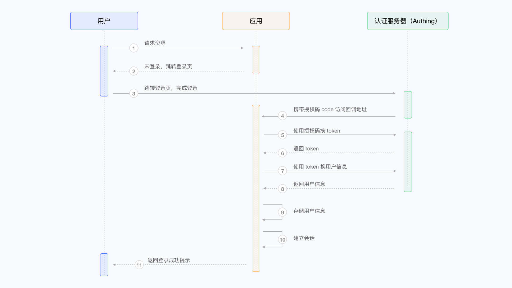
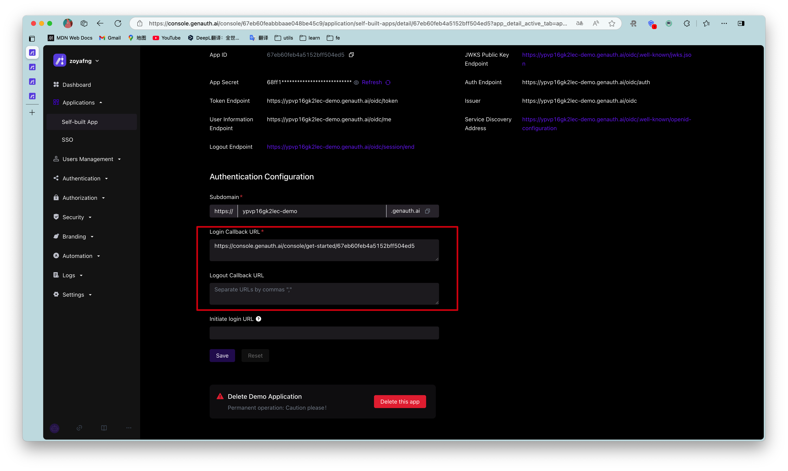
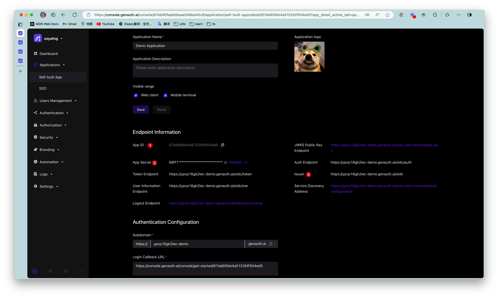
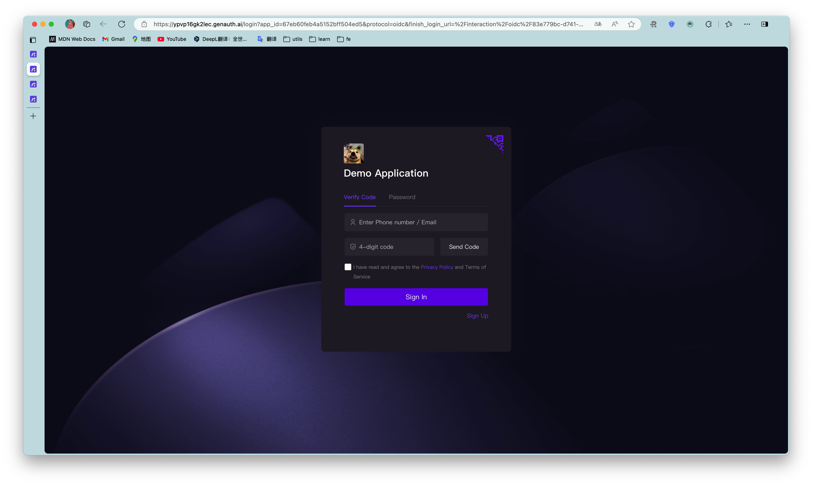
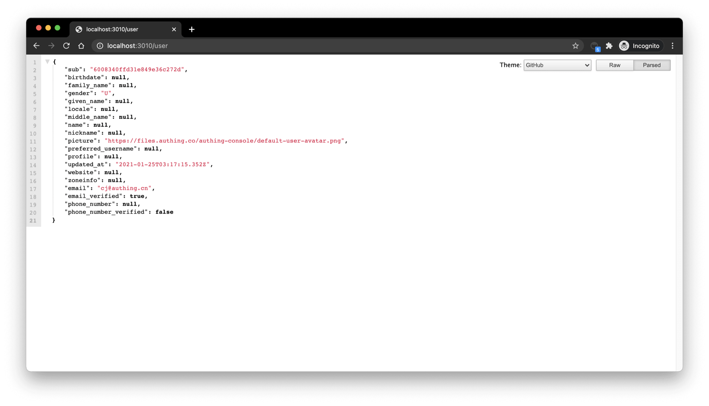
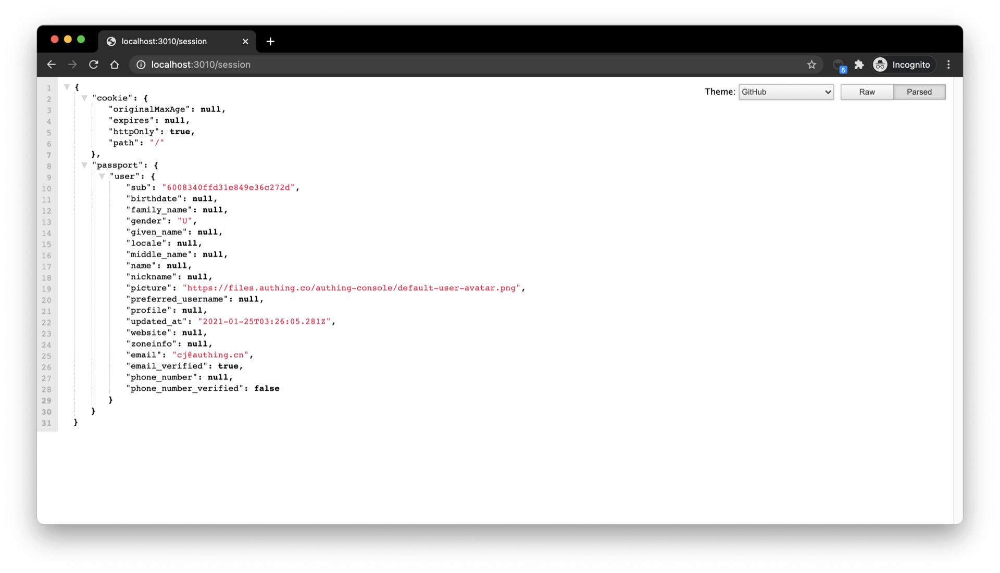

# Integrate {{$localeConfig.brandName}} in a standard web application

<LastUpdated/>

This article takes the Node.js web framework [Express](https://expressjs.com/) as an example to introduce how to quickly access {{$localeConfig.brandName}} in traditional web projects (such as Express MVC, Django, PHP Laravel, etc.) to implement functions such as login, logout, and obtaining user information.

There are three parties involved here: the end user browser, the application server, and the {{$localeConfig.brandName}} server. The complete process is as follows:

1. The end user browser requests the application service and finds that the user is not logged in, so it jumps to the login page hosted by {{$localeConfig.brandName}}.
2. After the user completes the login on this login page, the end user browser will carry the authorization code (Authorization Code) and other data in the request parameters to jump to the callback chain pre-configured by the application server.
3. The application server uses the authorization code to request the {{$localeConfig.brandName}} server in exchange for user information.
4. After the application server obtains the user information, it establishes a session with the end user.
5. The end user receives a successful login prompt, and the authentication process is completed.

The flow chart is as follows:



## Configure in {{$localeConfig.brandName}}

Before you start, you need to [create an application](/docs/guides/app-new/create-app/create-app.md) in {{$localeConfig.brandName}}. You can create an application on the application list page of the {{$localeConfig.brandName}} console.

### Configure callback link

Path: **Application->Self-built application->Application details page->Application configuration->Authentication configuration**

When the user successfully logs in at {{$localeConfig.brandName}}, the browser will jump to the callback link (Callback URL) you configured. This callback link should be a route in your application, and you need to complete operations such as exchanging user information in this route. You must configure this callback link, otherwise the user will not be able to log in, and an `invalid_redirect_uri` error prompt will be displayed.

The callback link for this sample code is `https://console.genauth.ai/console/get-started`, copy it to the **Login callback URL** configuration item, and then click **Save**. For more information, see [**Application Configuration**](/guides/app-new/create-app/app-configuration.md)



### Configure logout callback link

You need to configure the callback address (Logout URLs) after logging out. The URL that users return to after logging out of the {{$localeConfig.brandName}} hosted login page. You must configure this callback URL, otherwise users will not be able to log out and will be shown a `misconfiguration` error message.
The callback URL for this sample code is `http://localhost:3000`, copy it to the **Logout callback URL** configuration item, and then click Save.

## Integrate {{$localeConfig.brandName}} into your system

### Install dependencies

This is a node.js example, you need to install [openid-client](http://github.com/panva/node-openid-client) and [passportjs](http://www.passportjs.org/) that support the standard OIDC protocol.

```bash
yarn add express express-session passport openid-client
```

> Java developers can use [spring-security](https://spring.io/projects/spring-security) of the Spring framework. For detailed access process, please refer to the [document](/frameworks/spring-security/).

### Initialization

At the beginning of the project, we need to initialize the `Issuer` of `openid-client`. The initialization parameters are as follows:

- client_id: OIDC Client ID, which is your [application ID](/guides/faqs/get-app-id-and-secret.md) in {{$localeConfig.brandName}};
- client_secret: OIDC Client Secret, which is your [application secret](/guides/faqs/get-app-id-and-secret.md) in {{$localeConfig.brandName}};
- issuer: OIDC Issuer, which you can get in the endpoint information of the application.

The acquisition method is shown in the figure. You need to save these contents or remember the acquisition method, as you may use it frequently in the future:



For demonstration purposes, `passport.serializeUser` directly passes `user` to the callback function `done`, which will store the user information in `req.session.passport.user`. This is not recommended in a formal production environment, because if the user information is modified and `session` is not updated, data inconsistency will occur. The second parameter passed to the callback function `done` by `passport.deserializeUser` will be mounted on `req.user`. If you don't know enough about [passport.js](http://www.passportjs.org), it is recommended to read the [passport.js official documentation](http://www.passportjs.org/docs/) first.

```javascript
passport.serializeUser(function (user, done) {
  console.log("serializeUser", user);
  done(null, user.sub);
});
passport.deserializeUser(function (userId, done) {
  console.log("deserializeUser", userId);
  done(null, userId);
});
```

The detailed sample code is as follows:

```javascript
const express = require("express");
const session = require("express-session");
const passport = require("passport");
const { Strategy, Issuer } = require("openid-client");

const OIDC_CLIENT_ID = "YOUR_APPLICATION_ID";
const OIDC_CLIENT_SECRET = "YOUR_APPLICATION_SECRET";
const OIDC_ISSUER = "YOUR_OIDC_ISSUER";
const REDIRECT_URI = "http://localhost:3000/auth/callback";

(async () => {
  const issuer = await Issuer.discover(OIDC_ISSUER);
  const client = new issuer.Client({
    client_id: OIDC_CLIENT_ID,
    client_secret: OIDC_CLIENT_SECRET,
    id_token_signed_response_alg: "HS256",
    token_endpoint_auth_method: "client_secret_post",
  });

  passport.use(
    "oidc",
    new Strategy(
      {
        client,
        params: {
          redirect_uri: REDIRECT_URI,
          scope: "openid profile email phone",
          grant_type: "authorization_code",
          response_type: "code",
        },
      },
      (tokenset, userinfo, done) => {
        return done(null, userinfo);
      }
    )
  );

  passport.serializeUser(function (user, done) {
    done(null, user);
  });
  passport.deserializeUser(function (user, done) {
    done(null, user);
  });

  const app = express();
  app.use(
    session({
      secret: "secret",
      resave: true,
      saveUninitialized: true,
    })
  );
  app.use(passport.initialize());
  app.use(passport.session());
  app.listen(3010, () =>
    console.log(`Example app listening at http://localhost:3010 🚀`)
  );
})();
```

### Complete the login logic

First, we initialize a login route:

```javascript
app.get("/login", passport.authenticate("oidc"));
app.get(
  "/auth/callback",
  passport.authenticate("oidc", {
    successRedirect: "/user",
    failureRedirect: "/403",
  })
);
```

When calling `/login`, `passport.authenticate` is called, and the system will jump to the online login address of the {{$localeConfig.brandName}} OIDC Provider:



After logging in using any of the login methods, the browser will jump to `http://localhost:3000/auth/callback` (this is the callback link we configured in the application details in the first step), where it will obtain user information from the {{$localeConfig.brandName}} server, and then jump to the `/user` route after successfully obtaining the user information.

### Complete the logic of displaying user information

Next, we will implement the logic of the `/user` route. As mentioned earlier, after the user logs in successfully, the user information will be mounted on `req.user`, so here we add the following simple logic:

```javascript
app.get("/user", (req, res) => {
  res.send(req.user);
});
app.get("/session", (req, res) => {
  res.send(req.session);
});
```

Visit `/user` to see the user information of the currently logged in user:



Visit `/session` to see the `session` of the currently logged in user:



### Complete the logout logic

Finally, we implement the logout logic:

1. First, clear the current application through `req.session.destroy()` `session`;
2. Jump to the logout link of the OIDC application.

```javascript
const OIDC_LOGOUT_URL = "{{YOUR_APP_DOMAIN}}/login/profile/logout";
const LOGOUT_REDIRECT_URL = "http://localhost:3000";
app.get("/logout", (req, res) => {
  req.session.destroy();
  const logoutUrl = `${OIDC_LOGOUT_URL}?app_id=${OIDC_CLIENT_ID}&redirect_uri=${LOGOUT_REDIRECT_URL}`;
  res.redirect(logoutUrl);
});
```
