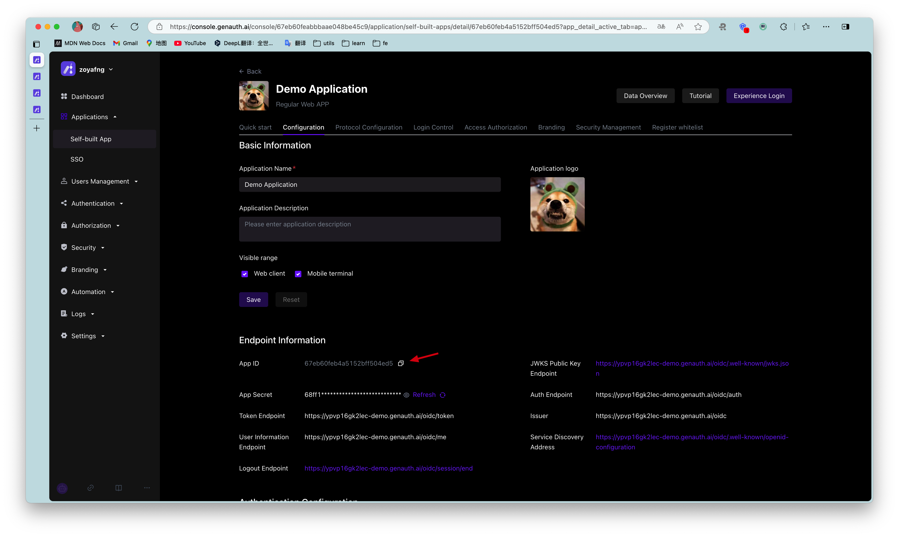

# Integrating {{$localeConfig.brandName}} in a Single Page Web Application (SPA)

<LastUpdated/>

A single page web application (SPA) is a model of a web application or website that interacts with the user by dynamically rewriting the current page, rather than reloading a whole new page from the server. This approach avoids interrupting the user experience by switching between pages, making the application more like a desktop application. In a single page web application, all the necessary code (HTML, JavaScript, and CSS) is retrieved through the load of a single page, or appropriate resources are dynamically loaded and added to the page as needed (usually in response to user actions). Interaction with a single page web application usually involves dynamic communication with a backend server.

The easiest way to integrate {{$localeConfig.brandName}} in a SPA application is to use the [embedded login component](/reference/guard/) and [Javascript SDK](/reference/sdk-for-node/) provided by {{$localeConfig.brandName}} for login and authentication. This article takes the React project as an example.

## Get the application ID

After logging in to {{$localeConfig.brandName}}, {{$localeConfig.brandName}} will create a default user pool and application for you. You can also create your own application. In the application details, you can get the application ID. Click the copy button to copy it:



## Integrate {{$localeConfig.brandName}} into your SPA application

### Install the {{$localeConfig.brandName}} login component

```bash
yarn add @authing/react-ui-components

# OR

npm i @authing/react-ui-components --save
```

`@authing/react-ui-components` contains some React components provided by {{$localeConfig.brandName}} and obtains [AuthenticationClient](/sdk/sdk-for-node/authentication/AuthenticationClient) APIs, including the [AuthingGuard](/reference/guard/) login component.

### Configure AuthingGuard

```js
import React from "react";
import ReactDOM from "react-dom";
import { Guard } from "@authing/react-ui-components";
// Import css file
import "@authing/react-ui-components/lib/index.min.css";

const App = () => {
  const appId = "GEN_AUTH_APP_ID";

  // Login successful
  const onLogin = (userInfo) => {
    console.log(userInfo);
    // You can redirect to other pages here
    // ...
  };

  return <AuthingGuard appId={appId} onLogin={onLogin} />;
};

ReactDOM.render(<App />, root);
```

By passing in `appId`, `AuthingGuard` can display the login box for login.

### Logout

Now that you can log in, you need a way to log out, which can be achieved through [AuthenticationClient](/sdk/sdk-for-node/authentication/AuthenticationClient) .

```js
// src/index.js

import { initAuthClient } from "@authing/react-ui-components";
// Initialize AuthenticationClient in the project entry file
initAuthClient({
  appId: "GEN_AUTH_APP_ID",
});
```

```js
import React from "react";
import { getAuthClient } from "@authing/react-ui-components";

const LogoutButton = () => {
  return <button onClick={() => getAuthClient().logout()}>Logout</button>;
};

export default LogoutButton;
```

### Get user information

After the user logs in, you may also need to get the user information of the currently logged in user.

```js
// src/index.js

import { initAuthClient } from "@authing/react-ui-components";
// Initialize AuthenticationClient in the project entry file
initAuthClient({
  appId: "GEN_AUTH_APP_ID",
});
```

```js
import React, { useState, useEffect } from "react";
import { getAuthClient } from "@authing/react-ui-components";
const UserInfo = () => {
  const [user, setUser] = useState();
  const [isAuthenticated, setIsAuthenticated] = useState(true);
  useEffect(() => {
    getAuthClient()
      .getCurrentUser()
      .then((userInfo) => {
        if (userInfo) {
          setUser(userInfo);
        } else {
          setIsAuthenticated(false);
        }
      });
  }, []);

  return isAuthenticated ? (
    user ? (
      <div>
        
        <h2>{user.username}</h2>
        <p>{user.email}</p>
      </div>
    ) : (
      <div>Loading...</div>
    )
  ) : (
    <h3>Not logged in yet</h3>
  );
};

export default UserInfo;
```

`getCurrentUser` can get the information of the currently logged in user. If not logged in, it will return `null`
