# Administrator-related operations

<LastUpdated/>

Administrators can open a trial period for a user pool, view the comparison of rights and interests of each version in the user pool, and upgrade the current user pool version.

## Open a trial period

Both new and old users can open a trial period for user pools in different scenarios to experience all the rights and interests under the corresponding user pool. This section describes how to open a trial period for new and old users.

::: hint-info
* Only new user pools can be opened for a trial period. Existing user pools cannot be opened for a trial period directly.
* Note: After the trial period expires, if the user pool is not upgraded, all rights and interests of the corresponding user pool will be closed and cannot be used anymore.
:::

### Open a trial period for new users

To open a trial period, administrators need to perform the following steps:

1. New users register on the official website according to the prompts. After successful authentication, click the **Start using** button.

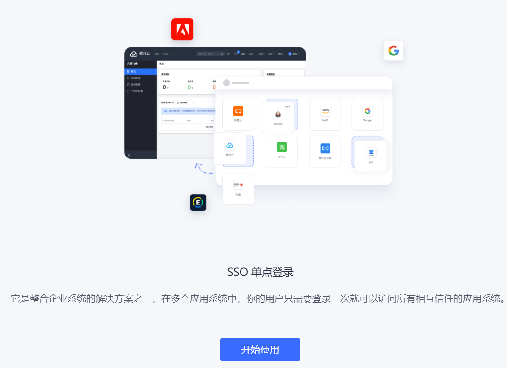

2. Select the user pool type for which the trial period is to be opened (here ToB is used as an example), and click the **Create User Pool** button.  It will be prompted that the trial period has been opened for the current user pool.

::: hint-info
* According to different user usage scenarios, user pools can be divided into ToE (enterprise employees), ToB (customers), and ToC (end users). An account can be opened for each scenario during the free stage and can only open a trial period once.
* The prompt to open the trial period is checked by default at the bottom of the page. Select a user pool and click **Create User Pool** to open a 30-day trial period for the created user pool by default. If you uncheck it, a free version of the user pool will be created.
:::

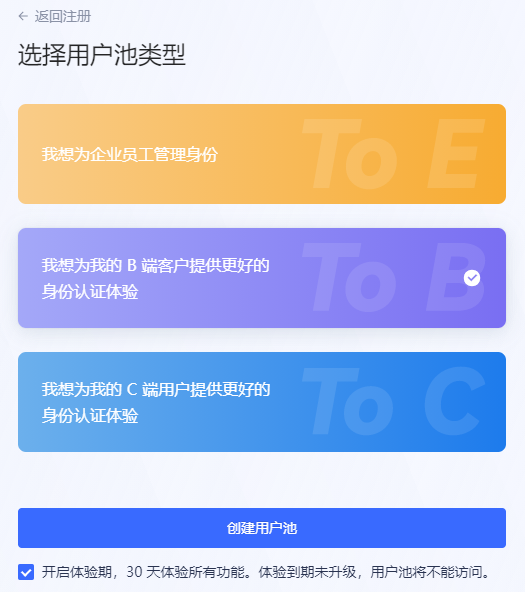

3. Enter the user pool name, complete the current account mobile phone number information, enter the received verification code, and click **Complete creation**.

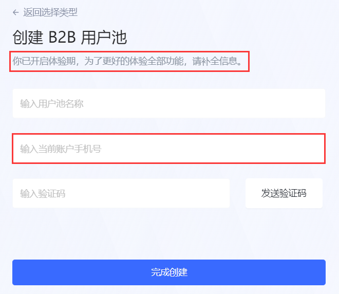

::: hint-info
* New users need to provide a mobile phone number so that {{$localeConfig.brandName}} can understand your experience and provide you with direct service.
* For users who register with a mobile phone number, there is no need to add a mobile phone number.
:::

So far, the registration of new users has been completed and the trial period has been opened for the created user pool. New users enter the user pool homepage and can now start to experience all the benefits in the user pool.

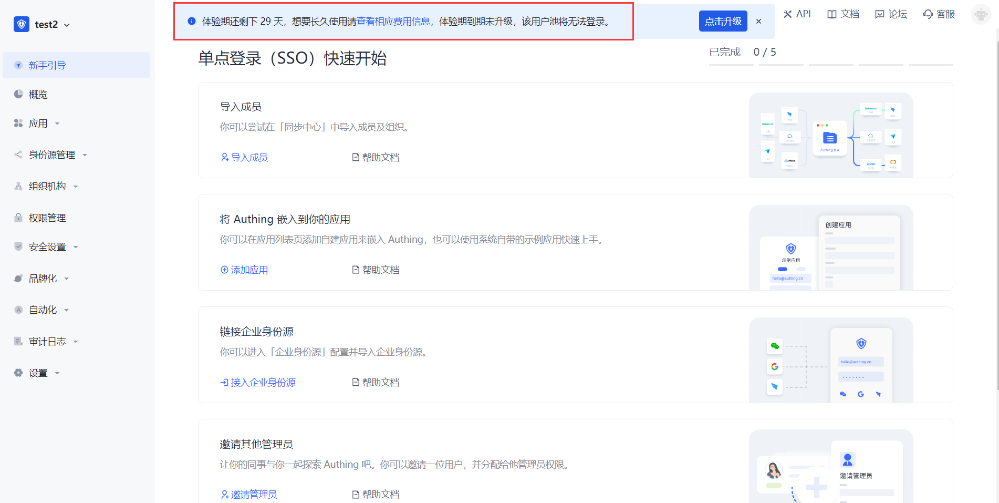

### Open trial period for old users

For registered users, you can create user pools for different scenarios and open trial periods for them.

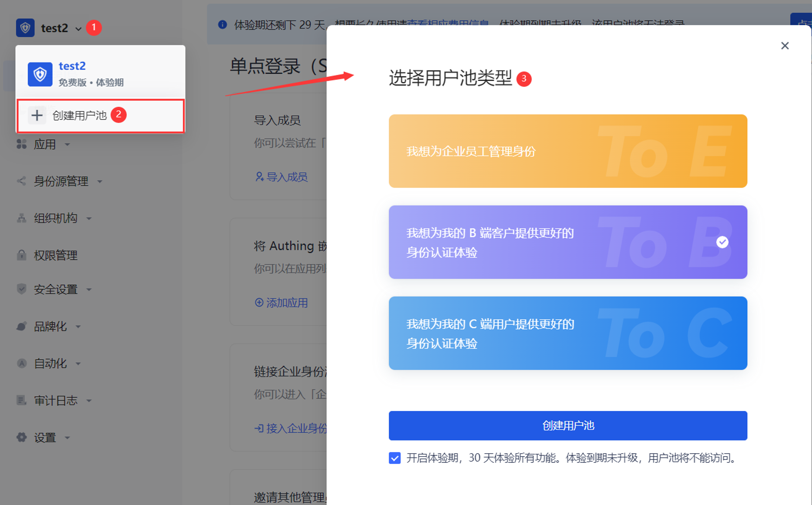

To open a trial period for old users, follow these steps:

1. Click the user pool drop-down button in the upper left corner of the page.

2. Click **+ Create user pool**.

3. Select the user pool type and click the **Create user pool** button.

4. Enter the user pool name and click **Finish creation**.

::: hint-info
The system will determine whether the old user has registered a mobile phone number. If so, there is no need to complete the mobile phone information here; otherwise, it is required.
:::

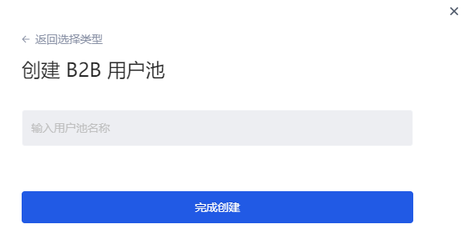

### User pool experience period prompt

After the experience period is activated, the experience period prompt appears in the following locations to help users quickly identify that the current user pool has activated the experience period and prompt the user experience period countdown:

* Top of all pages on the hosting page

::: hint-info
For the user pool of each scenario, the same experience period strategy prompt is provided at the top of the page:
  * Display the remaining days of the experience period (29->0 countdown).
  * The prompt can be turned off in the first 20 days of the experience period; after 20 days, the prompt cannot be turned off.
  * Click **View the corresponding fee information** to jump to the **Settings->Fee Management** page to view the current **version information** of the user pool (including the comparison list of benefits of each user pool version), **usage information** and **order management** information.
  * Click the **Click to Upgrade** button in the prompt to jump to **Settings->Expense Management->Version Information->Version Upgrade** module to upgrade the user pool version.
:::

* User pool drop-down list

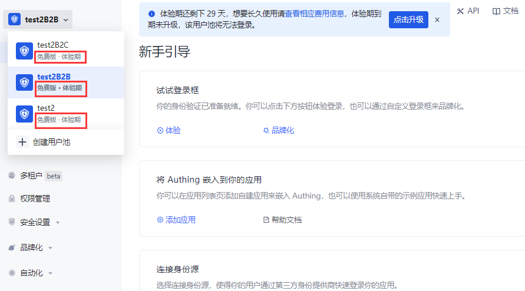

* User pool management page

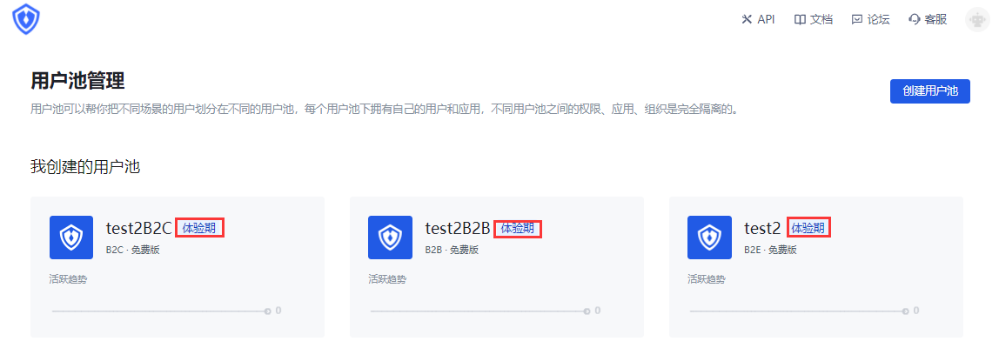

## View the comparison of benefits

### Version information

Path: **Settings->Expense Management->Version Information->Version Comparison**

Each scenario user pool supports multiple benefit versions, and different versions provide different benefits and usage. During the trial period, all benefits of each version are integrated, and the usage of each benefit adopts the minimum usage in each version (i.e., tiered benefits), which will not exceed the limit of the higher version.

Under the **Expense Management** menu, a comparison of benefits between user pool versions is provided. Administrators can view the differences in benefits provided by each user pool version and the restrictions on the usage of each benefit authorization in each version.

::: hint-info
* The following figure takes the ToB scenario user pool as an example to illustrate the rights and corresponding usage open to users when the trial period is based on the free version.
* If the rights are updated during the trial period, they will be updated synchronously for the current user pool, and the trial period strategy will not be affected.
:::

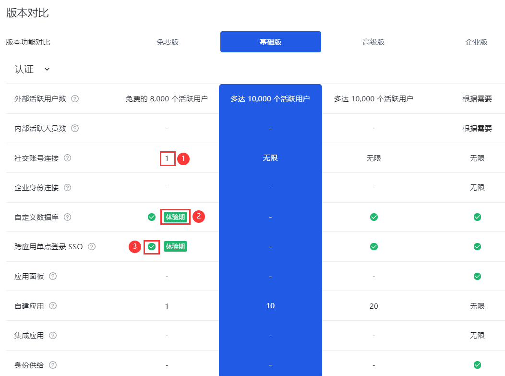

|Serial number|Description|
|----|----|
|1|Indicates the current rights limit, and the number is the authorized usage. |
|2|Indicates that the current function is a trial period right, and the free version does not have this right. |
|3|Indicates that the current rights are unlimited. |

### Usage information

Path: **Settings->Expense Management->Usage Information**

Administrators can view the detailed usage information of each right enjoyed by the current user pool during the trial period on the **Usage Information** tab.

The benefit card marked with **Trial Period** indicates that the current benefit exceeds the free version benefit and is a trial benefit during the trial period.

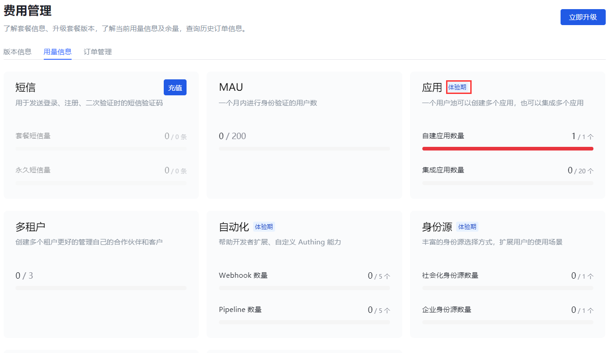

## User upgrade

### End of trial period

* The trial period is up to 30 days. If the user pool is not upgraded after the expiration, the trial period will automatically end.

* If the user upgrades the user pool version before the 30-day trial period, the trial period will end in advance and the upgraded version will be charged. At this time, the overflow benefits (part of the premium version benefits enjoyed during the trial period) can no longer be used.

#### SMS and email notifications

On the day of creation, the administrator will receive an email and SMS to notify that the trial period has been opened.

On the seventh day, third day, day before expiration, and day of expiration, the administrator will receive SMS and email to remind the expiration.
#### System page prompts

There will always be a countdown reminder at the top of each system page ten days before expiration, which cannot be turned off.

### Trial period expires without upgrade

When a new user registers, the current version is the free version. After the trial period expires, if there is no upgraded version, all benefits of the trial user pool will be deactivated (including the free benefits of the user pool).

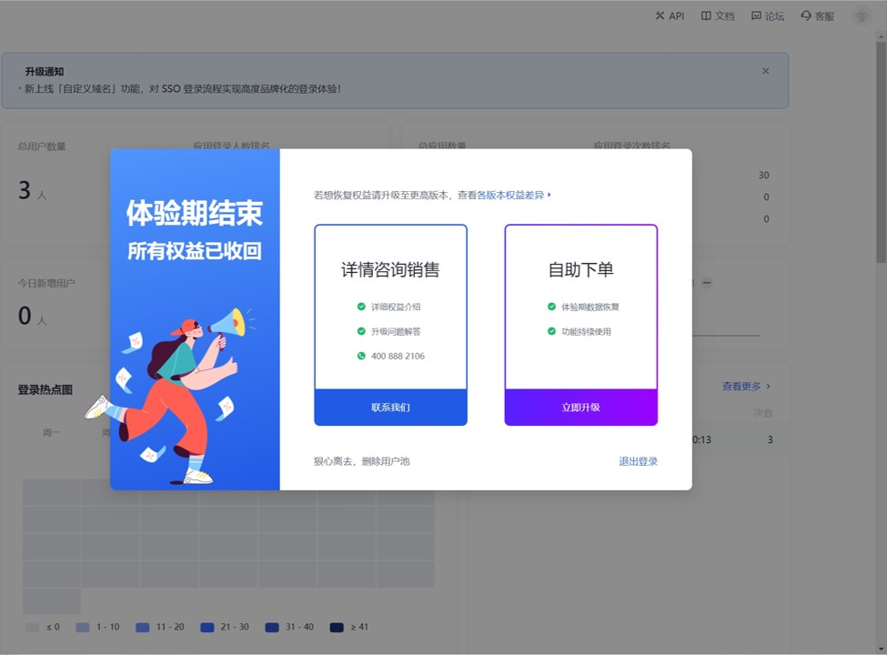

* Administrators can click **Contact us**, fill in contact information, and describe the problem.

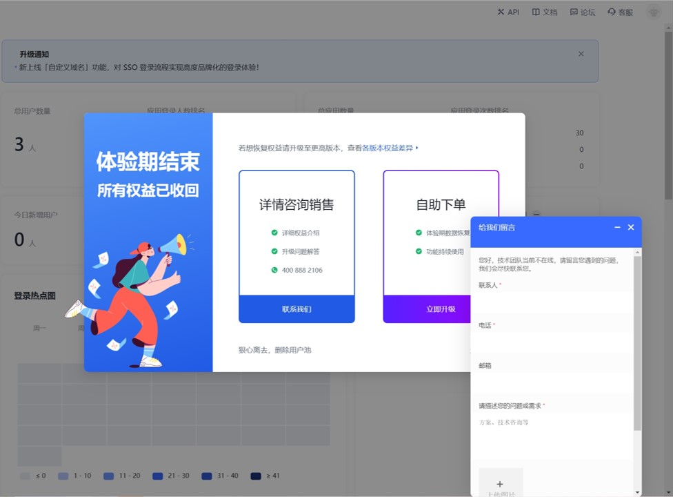

* You can also click **Upgrade now** to jump to the **Expense Management** page and upgrade to a higher-level version to continue to enjoy the user pool benefits.

* You can also click "**Leave ruthlessly, delete user pool**" at the bottom of the pop-up page to delete the current user pool.

::: hint-info
After deleting the user pool, all data during the trial period will be deleted and cannot be restored!
:::

### User upgrade after the trial period expires

Path: **Settings->Expense Management->Version Information->Version Upgrade**

#### Upgrade to Basic Version

Applicable to: ToC, ToB scenarios

After the trial period expires, if the user pool is upgraded from the free version to the basic version, the overflow benefits will no longer be available (but will still be visible).

To upgrade to the basic version, follow these steps:

1. In the **Version Upgrade** module, click the **Upgrade Now** button on the card where the **Basic Version** is located.

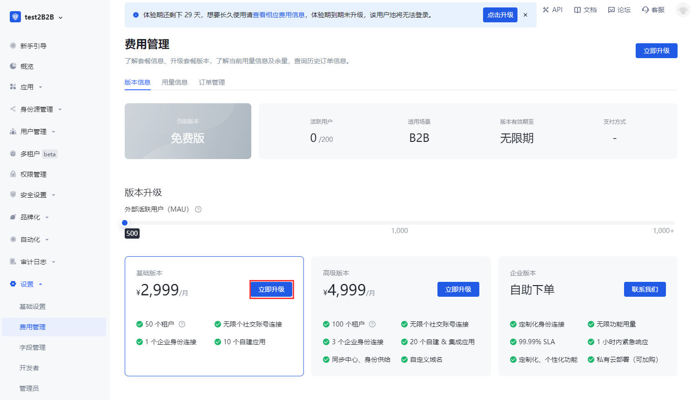

2. In the pop-up prompt window, browse the overflow benefits that the premium version has but the basic version does not support.   You can also click **Differences in benefits between versions** in the pop-up window to view the details of the benefits supported by each version (see [Version Comparison](#View Benefit Comparison) for details).

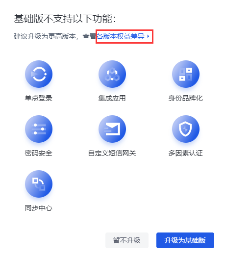

::: hint-info
If you still need to use the overflow rights, you can exit the current operation and execute [Upgrade to Advanced Edition](#Upgrade to Advanced Edition).
:::

3. Click the **Upgrade to Basic Edition** button.  Click **Do not upgrade for now** to exit the version upgrade operation and give up upgrading to the Basic Edition.

4. Click **Go to real-name authentication**.

::: hint-info
According to relevant laws and regulations, personal or corporate real-name authentication must be completed before placing an order.
:::

5. Select the authentication type: **Personal authentication** or **Corporate authentication**, and click **Start authentication**.

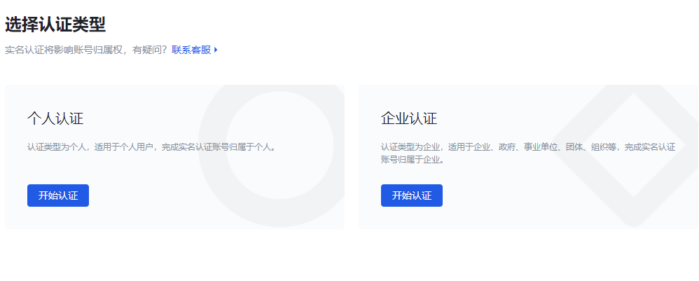

6. Fill in the authentication information and click **Submit authentication**.

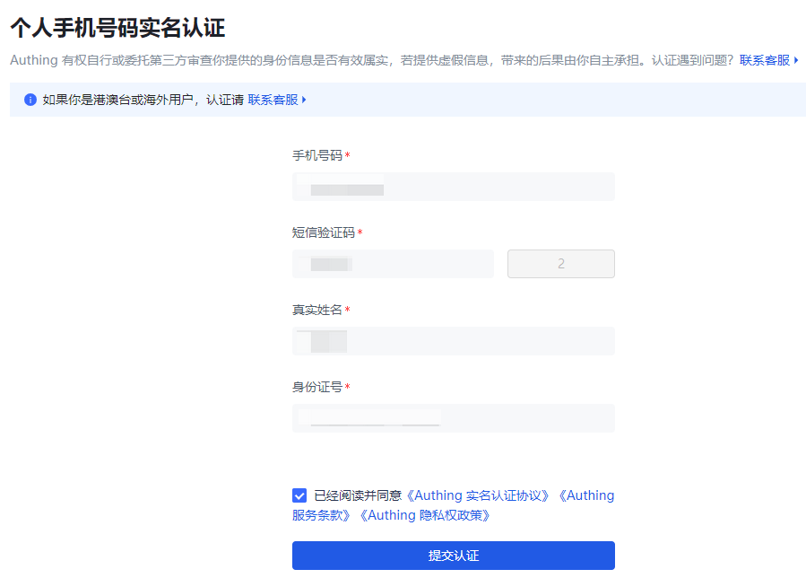

::: img-description
Personal real-name authentication
:::

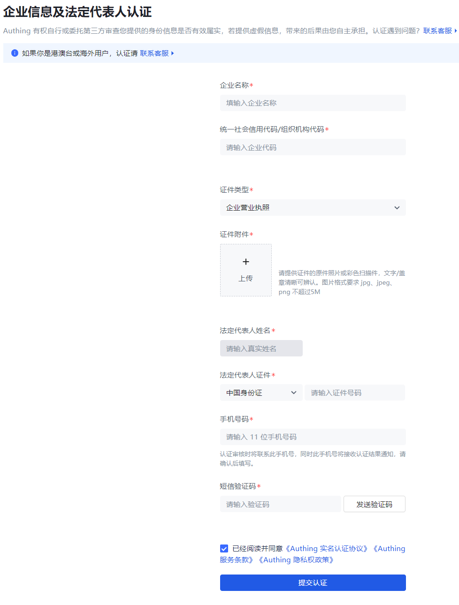

::: img-description
Enterprise authentication
:::

The system prompts that the authentication is successful and returns to the **Expense Management->Version Upgrade** page after a few seconds.

7. Click the **Upgrade Now** button on the **Basic Version** card again.   Enter the payment page.

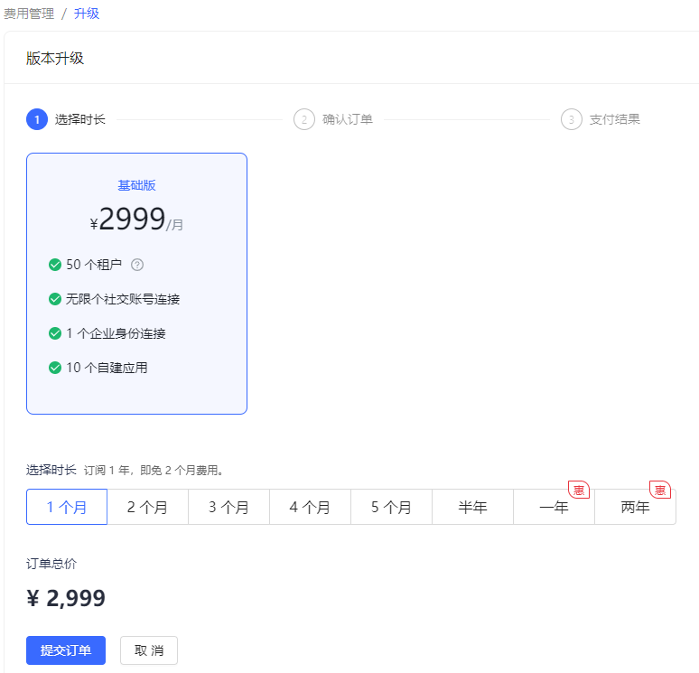

8. You can select the usage period of the new version here and click **Submit Order**.

::: hint-info
For usage periods exceeding one year, {{$localeConfig.brandName}} provides a preferential policy: two months of free fees for every full year.
:::

9. Select **Payment Method**, check **Service Agreement**, and click **Pay Now**.

::: hint-info
Users need to complete the payment within two hours, otherwise the transaction will be closed.
:::

10. Scan the QR code in the pop-up window to pay.

#### Upgrade to the advanced version

Applicable to: ToC, ToB, ToE scenarios

After upgrading to the advanced version, all benefits are available, and the usage of some benefits will increase.

::: hint-info
After the trial period upgrade, the user data during the trial period is still visible.
:::

To upgrade to the advanced version, perform the following steps:

1. In the **Version Upgrade** module, click the **Upgrade Now** button on the card where the **Advanced Version** is located.

2. If real-name authentication has not been performed, perform personal/enterprise real-name authentication as described in [Upgrade to Basic Version Steps 5, 6](#Upgrade to Basic Version).

3. Click the **Upgrade Now** button on the card where the **Advanced Version** is located again.  Go to the payment page.

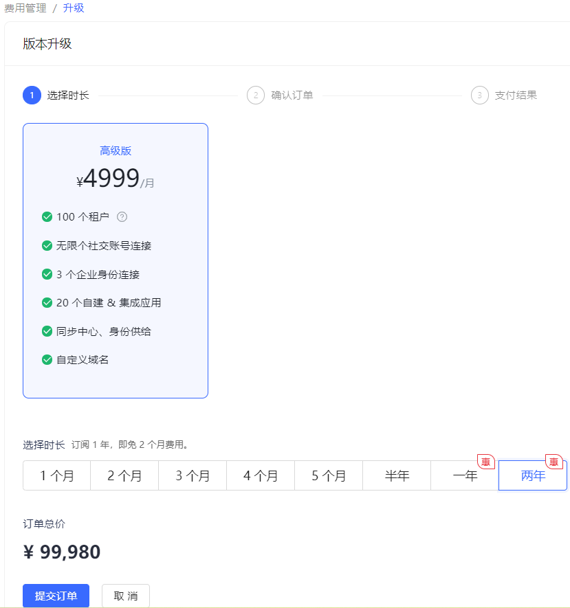

4. Refer to [Upgrade to Basic Version Steps 8-10](#Upgrade to Basic Version) to make payment.

At this point, the upgrade to the advanced version is complete.