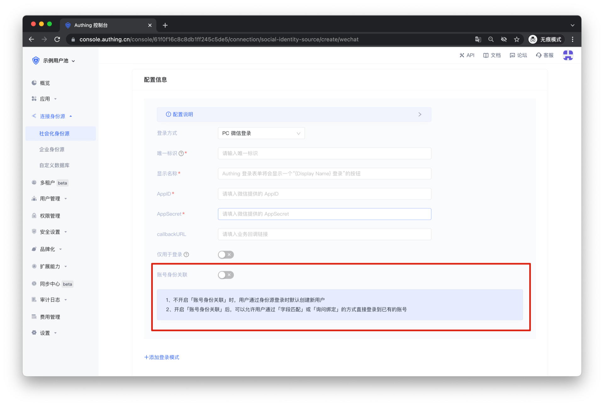
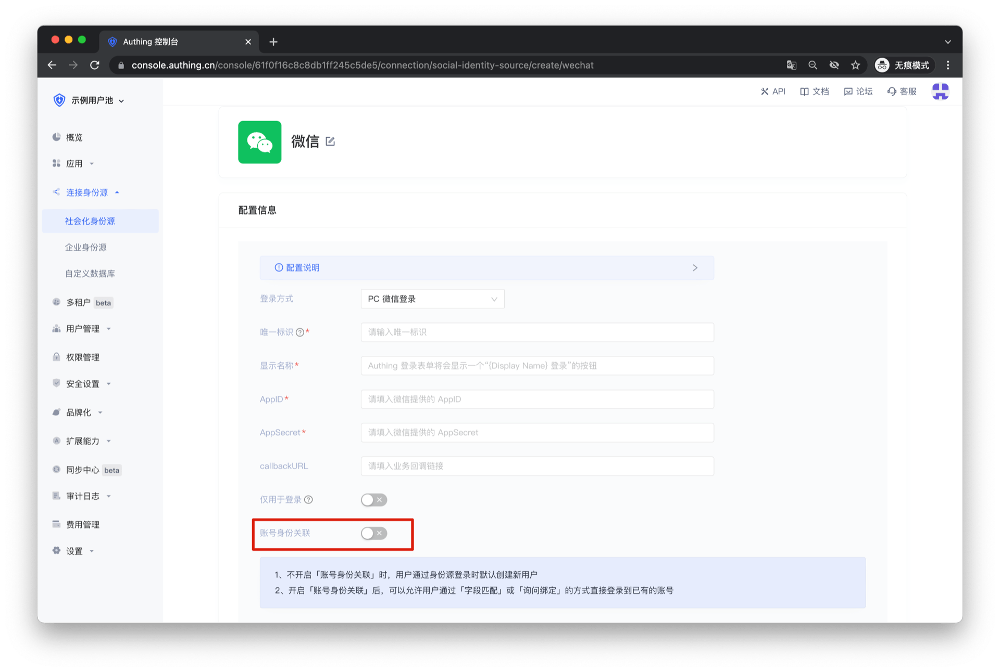
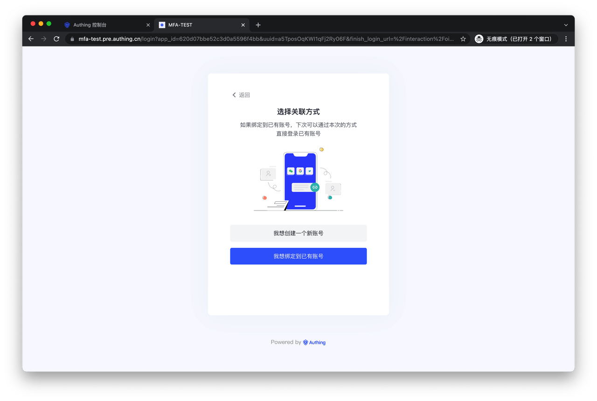
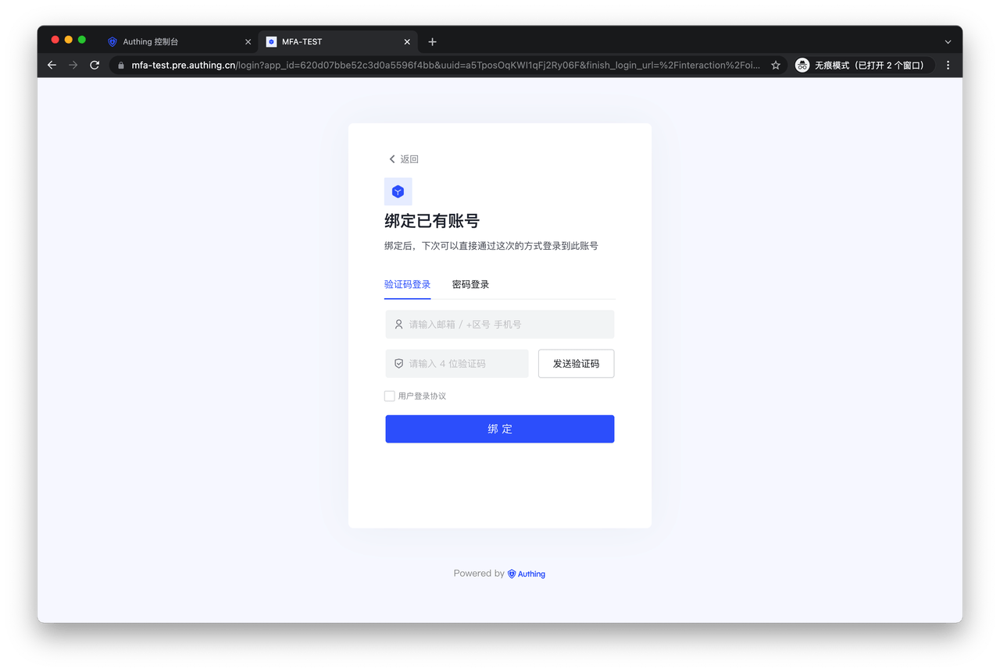

# Account association for identity source connection

<LastUpdated/>

Use the "Account association for identity source connection" function to allow your users to log in directly to existing accounts when logging in using the social identity source and enterprise identity source you configured. You can see the relevant configuration items when creating an identity source connection.

## Function introduction

## Instructions

When **"Account identity association"** is not enabled, a new user is created in the user pool by default when a user logs in through an identity source for the first time.

If **"Only for login"** is enabled, users who log in using an identity source for the first time will not be able to complete the login, and only old users can log in using the identity source.

After enabling **"Account identity association"**, you can select the user's "Identity source account association method", allowing users to log in directly to existing accounts through "field matching" or "query binding".

It should be noted that GenAuth only supports the "account matching" function for identity source connections that can obtain the user's mobile phone number and email address. For details, see: [Account matching rules for identity source connection | GenAuth documentation](./user-mapping.md)

If you choose **"Ask for Binding"** to associate the account of the identity source, you need to configure the binding method that users can use on the "Account Ask for Binding" page.

## User Journey

After completing the relevant configuration of the inquiry binding in the GenAuth console, your users will be prompted to choose whether to "Create a new account" or "Bind to an existing account" when logging in using the identity source.

If the user selects "I want to create a new account", a new user will be created in the user pool. If the user selects "I want to bind to an existing account", it will jump to the following page:

Your users can enter existing account information here. After clicking "Bind", the identity source used for this login will be bound to the existing account as a login method. The user can log in to the same account directly through the current identity source login method in the future.

In addition, the current application's "Login Protocol", "Security Settings" and other configurations will still take effect on the "Account Binding" page to continue to protect the user's login process.
