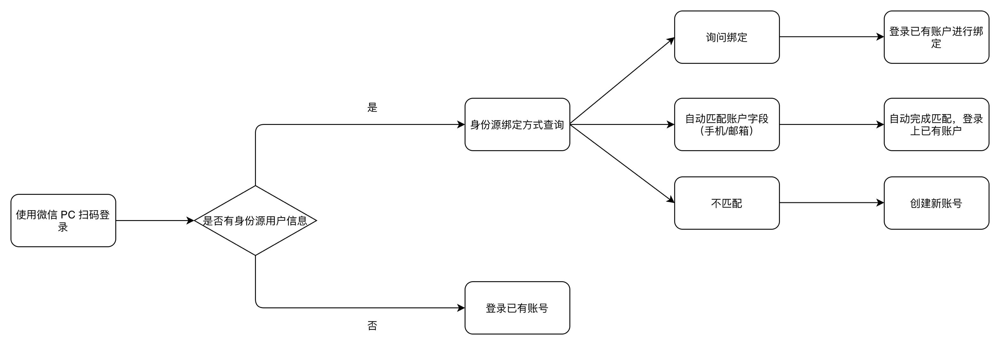

# Account Binding

<LastUpdated/>

GenAuth supports login in various ways:

- Conventional methods are that your users log in using their account password, SMS/email verification code.

- Another convenient method is that if you configure third-party account login, your users can log in directly through their third-party account.

## Under what circumstances do you need the account binding function?

Let's imagine a common scenario:

You are going to start using the user pool of {{$localeConfig.brandName}}. Since your business is already in formal operation, you have accumulated some existing users. So first you import existing users into your GenAuth user pool:

At this point, the user information in your user list may already include the corresponding user's mobile phone number, email address, username, and other information:

In this case, you hope to use the third-party account login capability provided by {{$localeConfig.brandName}} so that your users do not have to enter their account password every time they log in, but can log in directly with one click.

At this point you may have a question: How can you ensure that users can log in to the same account through different login methods when logging in to your application integrated in {{$localeConfig.brandName}} through a third-party account?

## User journey

Before we start to introduce the account binding function in detail, we first take the "PC WeChat QR code scanning" identity source login method as an example to introduce the role of the account binding function of {{$localeConfig.brandName}} in your user login journey. See the figure below for details:

## Function overview

When you configure a third-party identity source in {{$localeConfig.brandName}}, you can use the "account binding" function to ensure that your users will eventually log in to the same account no matter which method they use to log in, thereby ensuring the uniqueness of each user's account in {{$localeConfig.brandName}}.

{{$localeConfig.brandName}} supports two ways to implement account binding:

- **Ask Binding**

- **Field Matching**

Take Github as an example:

You can choose a more suitable account binding mode based on the type of identity source used and the expected user journey.

## Field Matching

"Field Matching" applies to identity sources that can obtain the unique field of the {{$localeConfig.brandName}} user account.

### Function

After turning on "Field Matching", when your user logs in through this identity source for the first time, we will use the fields you configured pulled from the identity source to match the corresponding fields in the GenAuth user pool. There are two possible results of the match:

1. Successful match: The user will directly log in to the matched account successfully and complete the binding of the account and the identity information;
2. Failed match: A new account will be automatically created in your user pool. When the user logs in again using this method, he will log in to the newly created account. In particular, if your app prohibits registration, then when the match fails, the user will be prohibited from creating a new account and will not be able to log in, ensuring the security of your app access.

### User Usage Journey

After enabling field matching according to the above steps, when your user logs in through this identity source for the **first time**, he will go through the following path (using Github as an example):

Step 1: Log in using Github

Step 2: Get the user's email address from Github and match the email address with the existing users in your user pool

Step 3:

- Matching success: Log in to an existing account
- Matching failure: Create a user/prohibit registration

### Administrator configuration steps

1. Find "Account Binding" in the identity source configuration area you want to use and turn on the switch
2. Select "Field Matching"
3. Select the field to use for matching (mobile phone number/email address/other fields)

Using Github as an example:

## Ask Binding

"Field Matching" is applicable to identity sources that can obtain the unique field of the GenAuth user account. For other identity sources that cannot obtain key user information due to restrictions on third-party accounts themselves, you can use "Ask Binding" to achieve the purpose of user account binding.

### Function

You have configured a third-party account login method for your users, and there are already some existing user accounts in your user pool. After you complete the third-party account configuration, users can log in more conveniently through the third-party account. You want to ensure that old users can still log in to their original accounts using the new login method.

### User Usage Journey

After following the above steps to enable the query binding, when your users log in through this identity source for the **first time**, they will go through the following path (taking WeChat public account scanning code login as an example):

Step 1: Scan the code using WeChat public account

Step 2: Select "Create a new account" or "Bind an existing account"

If the user chooses "Create a new account", the account binding process will be skipped, and a new independent user account will be created directly in the GenAuth user pool after successful login;

If the user chooses "Bind an existing account", the third step will be entered.

Step 3: Enter the account to be bound

Enter an existing third-party account in the GenAuth user pool that is not bound to other third-party accounts (in this case, not bound to other WeChat accounts), and the user will complete the account binding journey.

In addition to binding an account when logging in, your users can also directly bind a third-party account in the **[Personal Center](https://docs.genauth.ai/concepts/application.html#%E8%AE%BF%E9%97%AE%E5%9C%A8%E7%BA%BF%E7%89%88%E7%9A%84%E4%B8%AA%E4%BA%BA%E4%B8%AD%E5%BF%83)** (regardless of whether you use GenAuth's Personal Center or your own Personal Center) (you can also unbind it yourself). After completing the binding, you can log in to the same account through any login method (regular account password, third-party account).

### Administrator configuration steps

1. Find "Account Binding" in the identity source configuration area you want to use and turn on the switch
2. Select "Ask for Binding"
3. Select the supported binding method (mobile phone verification code, email verification code, account password, mobile phone number password, email password)

Take Github as an example:

## Full identity source account binding function support status

Based on the limitations of various third-party identity sources, the current GenAuth account binding function implementation is as shown in the following table. You can find the corresponding identity source through global search to view the support status of the current account binding function.

<aside>
💡 Legend: ✅-Supported; ❌-Not supported; ⌛️-Supported, waiting to be launched; / -Not involved

</aside>

| Identity source name      | Login method                                                                  | Support field matching | Match by email | Match by phone number | Match by other fields | Open query binding |
| ------------------------- | ----------------------------------------------------------------------------- | ---------------------- | -------------- | --------------------- | --------------------- | ------------------ |
| Gitlab (gitlab)           | Web                                                                           | Yes                    | ✅             | ❌                    | ❌                    | ✅                 |
| WeChat (wechat)           | PC web scan code                                                              | ❌                     | /              | /                     | /                     | ✅                 |
| WeChat (wechat)           | WeChat web authorization                                                      | ❌                     | /              | /                     | /                     | ⌛️                |
| WeChat (wechat)           | APP pulls up mini program                                                     | ❌                     | /              | /                     | /                     | ⌛️                |
| WeChat (wechat)           | WeChat mobile terminal                                                        | ❌                     | /              | /                     | /                     | ⌛️                |
| WeChat (wechat)           | PC small login scan code                                                      | ✅                     | ❌             | ✅                    | ❌                    | ⌛️                |
| WeChat (Wechat)           | WeChat public account follow                                                  | ❌                     | /              | /                     | /                     | ✅                 |
| WeChat (Wechat)           | Mini program                                                                  | ✅                     | ❌             | ✅                    | ❌                    | ⌛️                |
| Github                    | Web                                                                           | ✅                     | ✅             | ❌                    | ❌                    | ✅                 |
| Enterprise WeChat (WeCom) | Enterprise WeChat self-built application scan code                            | ✅                     | ✅             | ✅                    | ❌                    | ⌛️                |
| Enterprise WeChat (WeCom) | Enterprise WeChat self-built application scan code (pending development mode) | ✅                     | ✅             | ✅                    | ❌                    | ⌛️                |
| Enterprise WeChat (WeCom) | Enterprise WeChat service provider application scan code                      | ❌                     | /              | /                     | /                     | ⌛️                |
| Enterprise WeChat (WeCom) | Enterprise WeChat mobile terminal                                             | ✅                     | ✅             | ✅                    | ❌                    | ⌛️                |
| Enterprise WeChat (WeCom) | Enterprise WeChat mobile terminal (pending development mode)                  | ✅                     | ✅             | ✅                    | ❌                    | ⌛️                |
| Lark                      | Lark App Store App                                                            | ✅                     | ✅             | ✅                    | ❌                    | ⌛️                |
| Lark                      | Lark Enterprise Self-built App                                                | ✅                     | ✅             | ✅                    | ❌                    | ⌛️                |
| Slack                     | Web                                                                           | ✅                     | ✅             | ❌                    | ❌                    | ⌛️                |
| DingTalk                  | DingTalk H5 micro-app (enterprise internal development)                       | ✅                     | ✅             | ✅                    | ❌                    | ⌛️                |
| LinkedIn                  | Web                                                                           | ❌                     | /              | /                     | /                     | ⌛️                |
| Twitter                   | Web                                                                           | ❌                     | /              | /                     | /                     | ⌛️                |
| Facebook                  | Web                                                                           | ✅                     | ✅             | /                     | /                     | ⌛️                |
| Baidu                     | Web                                                                           | ❌                     | /              | /                     | /                     | ⌛️                |
| Apple                     | Web                                                                           | ✅                     | ✅             | /                     | /                     | ⌛️                |
| Apple                     | Mobile                                                                        | ✅                     | ✅             | /                     | /                     | ⌛️                |
| Alipay                    | Web                                                                           | ❌                     | /              | /                     | /                     | ⌛️                |
| QQ                        | Web                                                                           | ❌                     | /              | /                     | /                     | ✅                 |
| Google                    | Web                                                                           | ✅                     | ✅             | ❌                    | ❌                    | ⌛️                |
| Google                    | Mobile                                                                        | ✅                     | ✅             | ❌                    | ❌                    | ⌛️                |
| OAuth 2.0                 | Web                                                                           | ✅                     | ✅             | ✅                    | ❌                    | ✅                 |
| OIDC                      | Web                                                                           | ✅                     | ✅             | ✅                    | ❌                    | ⌛️                |
| SMAL                      | Web                                                                           | ✅                     | ✅             | ✅                    | ✅(externalId)        | ⌛️                |
| CAS                       | Web                                                                           | ✅                     | ✅             | ✅                    | ❌                    | ⌛️                |
| LDAP                      | Web                                                                           | ✅                     | ✅             | ✅                    | ✅(username)          | ⌛️                |
| Azure AD                  | Web                                                                           | ✅                     | ✅             | ✅                    | ❌                    | ⌛️                |
| Windows AD                | Web                                                                           | ✅                     | ✅             | ✅                    | ✅（username）        | ⌛️                |
| Windows AD                | Password-free login within the windows domain                                 | ✅                     | ❌             | ❌                    | ✅（username）        | ⌛️                |
| QingCloud                 | Web                                                                           | ✅                     | ✅             | ✅                    | ❌                    | ⌛️                |
| Sina Weibo                | Scan the QR code on the web page                                              | ❌                     | /              | /                     | /                     | ✅                 |
| Gitee                     | Web                                                                           | ✅                     | ✅             | ❌                    | ❌                    | ✅                 |
| NetEase Yiton             | Web                                                                           | ✅                     | ❌             | ✅                    | ❌                    | ⌛️                |
| Instagram                 | Web                                                                           | ✅                     | ✅             | ❌                    | ❌                    | ⌛️                |
| Welink                    | Web                                                                           | ✅                     | ✅             | ❌                    | ❌                    | ⌛️                |
