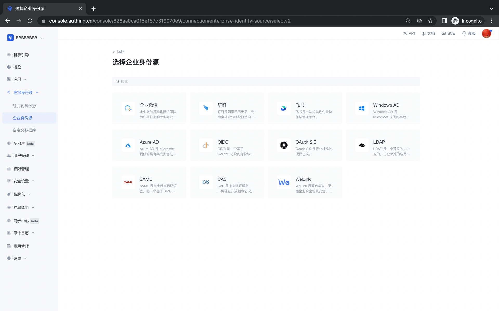

# Enterprise Identity Source

<LastUpdated/>

::: hint-info
For information about the {{$localeConfig.brandName}} user pool version that supports the "Enterprise Identity Source" feature benefit, please check the [Official Website "Pricing" page](https://www.genauth.ai/pricing). If your version does not support this benefit and you want to try it, you can activate the trial period. For an introduction to the trial period and how to activate it, please check [Trial Period](/guides/basics/trial/README.md).
:::

Enterprise Identity Source Login refers to the process of users using the enterprise's identity authentication information to authenticate and log in to internal company applications or third-party applications. In the {{$localeConfig.brandName}} console, enterprise identity sources include two categories: office applications (such as Lark, WeChat for Enterprise, DingTalk) and standard protocol applications (such as OIDC, SAML, CAS and other standard protocols). You can configure the enterprise identity source connection to use a third-party identity source to log in to the {{$localeConfig.brandName}} application and [import organizations and users from third-party identity sources](/guides/org/create-or-import-org/#Import organizations).

## Enterprise identity source login list

The following is a complete list of enterprise logins currently supported by the platform and related usage documents:

!!!include(common/enterprise-connections-table.md)!!!

## Enterprise login association method

Use the "Account association of identity source connection" function to allow your users to log in directly to existing accounts when logging in using the enterprise identity source you configured.

When **"Account Identity Association"** is not enabled, a new user is created in the user pool by default when a user logs in through an identity source for the first time. After enabling **"Account Identity Association"**, you can select the "Identity Source Account Association Method" for the user, allowing the user to directly bind and log in to an existing account through "Field Matching" or "Query Binding".

The following are the ways that the enterprise identity sources currently supported by the platform support account association:

!!!include(common/enterprise-connections-associated.md)!!!
