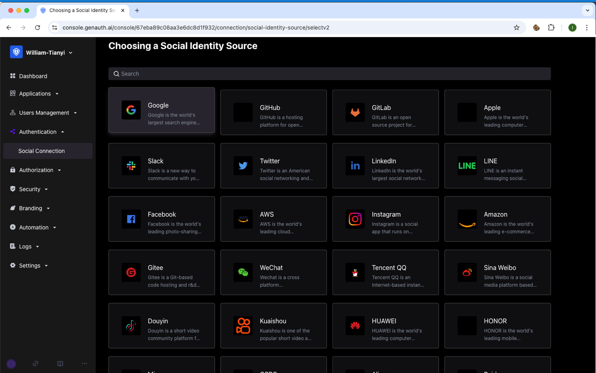

# Social Identity Source

<LastUpdated/>

::: hint-info
For information about the {{$localeConfig.brandName}} user pool version that supports the "Social Identity Source" feature, please check the [Official Website "Pricing" page](https://www.genauth.ai/pricing). If your version does not support this benefit and you want to try it out, you can activate the trial period. For an introduction to the trial period and how to activate it, please check the [Trial Period](/guides/basics/trial/README.md).
:::

Social identity source login refers to the process in which users use the identity authentication information of a third-party social platform to authenticate and log in to the current URL. Social login not only helps to simplify the user's login experience, but also provides users with a simpler and more convenient way to register and log in. In the [{{$localeConfig.brandName}} console](https://www.genauth.ai/), there are currently nearly 20 types of social logins supported at home and abroad, such as personal WeChat, Tencent QQ, Facebook, Google, Twitter, etc.

## Social login list

The following is a complete list of social logins currently supported by the platform and related usage documents:

!!!include(common/social-connections-table.md)!!!

## Social login association methods

Use the "Account association of identity source connection" function to allow your users to log in directly to existing accounts when logging in using the social identity source you configured.

When **"Account identity association"** is not enabled, a new user is created in the user pool by default when a user logs in through an identity source for the first time. After enabling **"Account identity association"**, you can select the user's "Identity source account association method", allowing users to directly bind and log in to existing accounts through "field matching" or "ask binding".

The following are the ways to associate accounts for social logins currently supported by the platform:

!!!include(common/social-connections-associated.md)!!!
