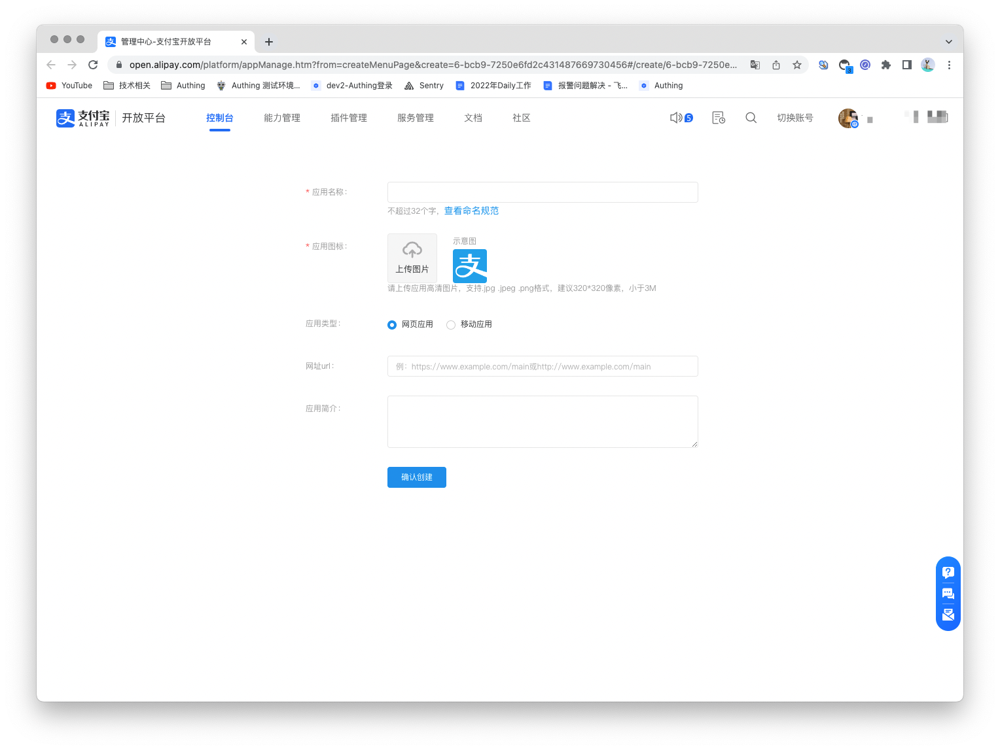
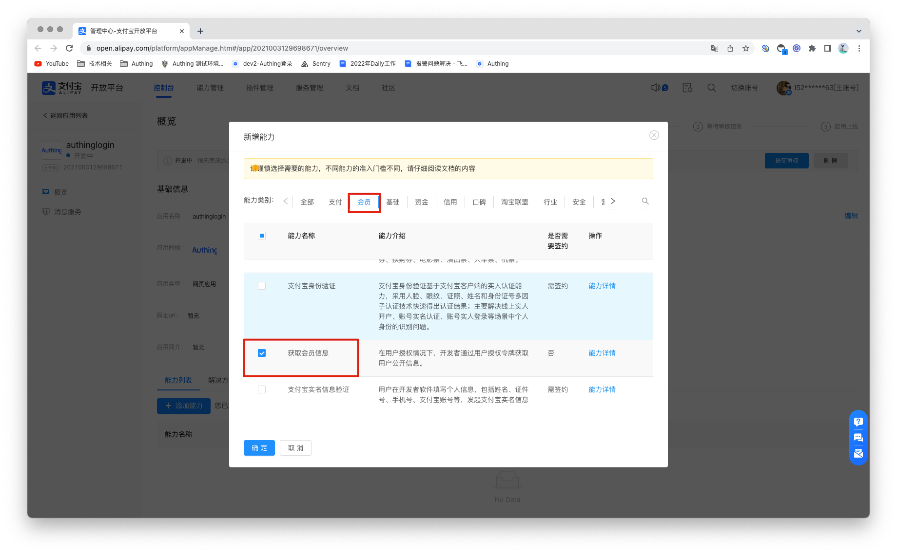

# Alipay

<LastUpdated/>

## Scenario Introduction

- **Overview**: Alipay social login is a user's secure login to a third-party application or website using Alipay as the identity source. Configure and enable Alipay social login in GenAuth to quickly obtain basic open information of Alipay through GenAuth and help users achieve password-free login.
- **Application scenario**: PC website, mobile terminal
- **Terminal user preview image**:

## Notes

1. Go to [Alipay Open Platform](https://open.alipay.com/) to register an Alipay open account;
2. Go to [Developer Center Console](https://open.alipay.com/dev/workspace) and follow the instructions to create a **Website Application**. Please make sure that your application has obtained the **Get Member Information** capability, otherwise you will not be able to log in with Alipay;
3. If you have not opened a GenAuth console account, please go to [GenAuth Console](https://www.genauth.ai/) to register a developer account;

## Step 1: Create an Alipay application

1.1 Log in to the Alipay Open Platform, enter the console, click the **Create Application** button in My Applications>Web & Mobile Applications to create a new application.

1.2 Enter the console of the created application, under the capability list, add capabilities, and add the "Get Member Information" capability.

1.3 Configure the development settings of the application. Under the development information under the development settings, set the interface signing method (key/method). You can generate a key using the [Alipay Key Generator](https://docs.open.alipay.com/291/106097/) or [OpenSSL (third-party tool)](https://docs.open.alipay.com/291/106130) provided by Alipay. For detailed information on how to obtain the key, please refer to the [Alipay Key Generation Instructions](https://opendocs.alipay.com/common/02khjo). For the key length, select RSA2, and for the key format, select PKCS1.

You need to save the application private key and application public key. Configure the application public key in Alipay and configure the application private key in the identity source of the GenAuth console.

For the interface signing method (key/method), select the signing mode "public key", enter the application public key and save it, then click Save Settings.

## Step 2: Configure Alipay in the GenAuth console

2.1 On the "Social Identity Source" page of the GenAuth Console, click the "Create Social Identity Source" button to enter the "Select Social Identity Source" page.

2.2 On the "Social Identity Source"-"Select Social Identity Source" page of the GenAuth Console, click the "Alipay" identity source button to enter the "Alipay Login Mode" page.

2.3 On the "Social Identity Source"-"Alipay" page of the GenAuth Console, configure the relevant field information.

| Field/Function          | Description                                                                                                                                                                            |
| ----------------------- | -------------------------------------------------------------------------------------------------------------------------------------------------------------------------------------- |
| Unique ID               | a. The unique ID consists of lowercase letters, numbers, and -, and its length is less than 32 bits. b. This is the unique ID of this connection and cannot be modified after setting. |
| Display Name            | This name will be displayed on the button of the terminal user's login interface.                                                                                                      |
| APPID                   | APPID, Alipay application ID.                                                                                                                                                          |
| Account ID              | Account ID, Alipay main account ID, usually a number starting with 2088.                                                                                                               |
| Application Private Key | Application private key, generated when setting up the Alipay application interface signature.                                                                                         |
| Callback Address        | Alipay valid OAuth jump URI. This URL needs to be configured to the Alipay application authorization callback address.                                                                 |
| Login Mode              | After turning on "Login Only Mode", you can only log in to existing accounts and cannot create new accounts. Please choose carefully.                                                  |

After the configuration is completed, click the "Create" or "Save" button to complete the creation.

2.4 After creating the Alipay identity source on the GenAuth console, you need to configure the callback address to the authorization callback address of the application on the Alipay open platform.

## Step 3: Development access

- **Recommended development access method**: Use a hosted login page
- **Advantages and disadvantages description**: Simple operation and maintenance, GenAuth is responsible for operation and maintenance. Each user pool has an independent secondary domain name; if you need to embed it into your application, you need to log in using the pop-up mode, that is: after clicking the login button, a window will pop up with the content of the login page hosted by GenAuth, or redirect the browser to the login page hosted by GenAuth.
- **Detailed access method**:

  3.1 Create an application in the GenAuth console. For details, see: [How to create an application in GenAuth](/guides/app-new/create-app/create-app.md).

  3.2 On the created Alipay identity source connection details page, open and associate an application created in the GenAuth console.

3.3 Experience Alipay third-party login on the login page.

