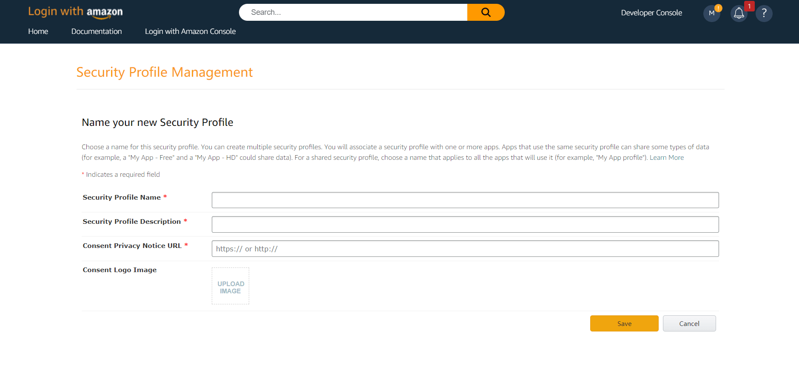

# Amazon Mobile

<LastUpdated/>

## Scenario Introduction

### Overview

Amazon social login is a user's secure login to a third-party application or website using Amazon as the identity source. Configure and enable Amazon's social login in {{$localeConfig.brandName}} to quickly obtain Amazon's basic open information and help users achieve password-free login through {{$localeConfig.brandName}}.

### Application Scenario

Mobile

### End User Preview

## Notes

- If you do not have an Amazon Open Platform account, please go to [Amazon Open Platform](https://developer.amazon.com/) to register a developer account.
- If you have not opened a {{$localeConfig.brandName}} console account, please go to the [{{$localeConfig.brandName}} console](https://www.genauth.ai/) to register a developer account.

## Step 1: Create a security profile on the Amazon Open Platform

1.1 Go to the [Amazon Open Platform](https://developer.amazon.com/) to create a security profile.

Click "Developer Console" -> "Login With Amazon" at the top of the page to create a security profile. If you encounter any problems during the process, please refer to the Amazon official [Documentation Login with Amazon](https://developer.amazon.com/zh/docs/login-with-amazon/register-ios.html) at the top of the page.

1.2 Record the **Security Profile ID**, and configure Android and iOS settings separately

1.2.1 **Configure Android**

Fill in the information, generate the **API Key** and record the generated **API Key**

1.2.2 **Configure iOS**

Fill in the information, generate **API Key** and record the generated **API Key**

## Step 2: Configure Amazon Mobile in the {{$localeConfig.brandName}} console

2.1 Please click the "Create Social Identity Source" button on the "Social Identity Source" page of the {{$localeConfig.brandName}} console to enter the "Select Social Identity Source" page.

2.2 Please go to the {{$localeConfig.brandName}} console's "Social Identity Source" - "Select Social Identity Source" page, click the "Amazon" identity source button to enter the "Amazon Mobile Login Mode" page.

2.3 Please go to the {{$localeConfig.brandName}} console's "Social Identity Source" - "Amazon Mobile" page to configure the relevant field information.

| Field/Function               | Description                                                                                                                                                                                                                                                                      |
| ---------------------------- | -------------------------------------------------------------------------------------------------------------------------------------------------------------------------------------------------------------------------------------------------------------------------------- |
| Unique ID                    | a. The unique ID consists of lowercase letters, numbers, and -, and is less than 32 bits long. b. This is the unique identifier of this connection and cannot be modified after setting.                                                                                         |
| Display Name                 | This name will be displayed on the button of the end user's login interface.                                                                                                                                                                                                     |
| Security Profile ID          | Amazon's "Security Profile ID" needs to be obtained on the Amazon Open Platform.                                                                                                                                                                                                 |
| API Key (Android)            | Amazon's "Security Profile" - "Android Settings" API Key needs to be obtained on the Amazon Open Platform.                                                                                                                                                                       |
| API Key (iOS)                | Amazon's "Security Profile" - "iOS Settings" API Key needs to be obtained on the Amazon Open Platform.                                                                                                                                                                           |
| Login Mode                   | After turning on "Login Only Mode", you can only log in to existing accounts and cannot create new accounts. Please choose carefully.                                                                                                                                            |
| Account Identity Association | When "Account Identity Association" is not turned on, a new user is created by default when a user logs in through an identity source. After turning on "Account Identity Association", users can be allowed to log in directly to an existing account through "Field Matching". |

After the configuration is completed, click the "Create" or "Save" button to complete the creation.

## Step 3: Development access

- **Recommended development access method**: SDK

- **Pros and cons description**: Simple operation and maintenance, which is handled by {{$localeConfig.brandName}}. Each user pool has an independent secondary domain name; if you need to embed it in your application, you need to log in using the pop-up mode, that is: after clicking the login button, a window will pop up with the login page hosted by {{$localeConfig.brandName}}, or redirect the browser to the login page hosted by {{$localeConfig.brandName}}.

- **Detailed access method**:

  3.1 Create an application in the {{$localeConfig.brandName}} console. For details, see: [How to create an application in {{$localeConfig.brandName}}](/guides/app-new/create-app/create-app.md)

  3.2 On the created "Amazon Mobile" identity source connection details page, open and associate an application created in the {{$localeConfig.brandName}} console

3.3 Experience Amazon third-party login on the login page (as shown in the [end-user preview](#end-user preview)).
