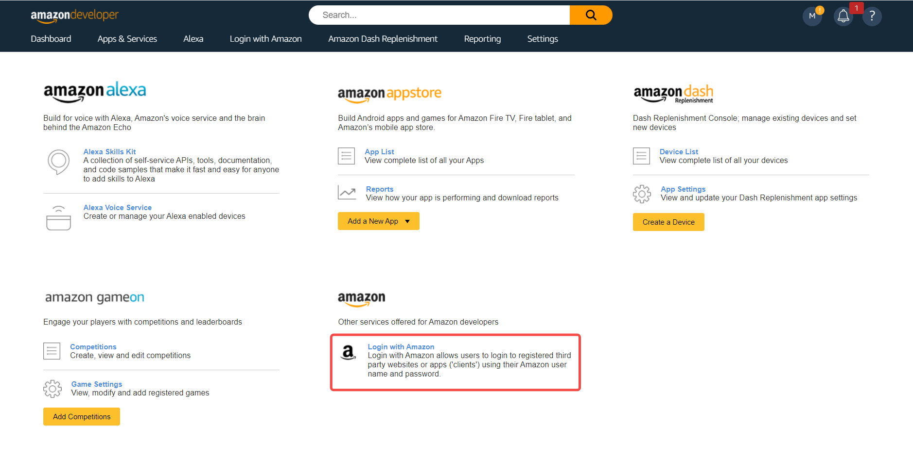

# Amazon

<LastUpdated/>

## Scenario Introduction

- **Overview**: Amazon social login allows users to log in to third-party applications or websites securely using Amazon as the identity source. Configure and enable Amazon social login in {{$localeConfig.brandName}} to quickly obtain Amazon's basic open information and help users log in without passwords through {{$localeConfig.brandName}}.
- **Application scenario**: PC website
- **Terminal user preview image**:

## Notes

- If you have not opened an Amazon Open Platform account, please go to [Amazon Open Platform](https://developer.amazon.com/) to register a developer account.
- If you have not opened a {{$localeConfig.brandName}} console account, please go to [{{$localeConfig.brandName}} console](https://www.genauth.ai/) to register a developer account.

## Step 1: Create a security profile on Amazon Open Platform

1.1 Go to [Amazon Open Platform](https://developer.amazon.com/) to create a security profile.

Click "Developer Console" -> "Login With Amazon" at the top of the page to create a security profile. If you encounter any problems during the process, please refer to Amazon's official [Documentation Login with Amazon](https://developer.amazon.com/zh/docs/login-with-amazon/authorization-code-grant.html) at the top of the page.

1.2 Configure Web Settings, record **Client ID** and **Client Secret**, which will be used in the next step

- Allowed Origin: Fill in `https://core.genauth.ai`
- Allowed Return URL: Fill in `https://core.genauth.ai/connection/social/{Unique Identifier}/{User Pool ID}/callback`, you need to replace `{Unique Identifier}` with the `Unique Identifier` filled in the identity source you are creating in {{$localeConfig.brandName}}, and `{User Pool ID}` with your [User Pool ID](/guides/faqs/get-userpool-id-and-secret.md)

## Step 2: Configure Amazon in the {{$localeConfig.brandName}} console

2.1 On the {{$localeConfig.brandName}} console's "Social Identity Source" page, click the "Create Social Identity Source" button to go to the "Select Social Identity Source" page.

2.2 On the {{$localeConfig.brandName}} console's "Social Identity Source" - "Select Social Identity Source" page, click the "Amazon" identity source button to go to the "Amazon Login Mode" page.

2.3 Please configure the relevant field information in the "Social Identity Source" - "Amazon" page of the {{$localeConfig.brandName}} console.

| Field/Function               | Description                                                                                                                                                                                                                                                                                         |
| ---------------------------- | --------------------------------------------------------------------------------------------------------------------------------------------------------------------------------------------------------------------------------------------------------------------------------------------------- |
| Unique ID                    | a. The unique ID consists of lowercase letters, numbers, and -, and its length is less than 32 bits. b. This is the unique ID of this connection and cannot be modified after setting.                                                                                                              |
| Display Name                 | This name will be displayed on the button of the end user's login interface.                                                                                                                                                                                                                        |
| Client ID                    | The client ID of Amazon "Security Profile" - "Web Settings" needs to be obtained on the Amazon Open Platform.                                                                                                                                                                                       |
| Client key                   | The client key of Amazon's "Security Profile" - "Web Settings" needs to be obtained on the Amazon Open Platform.                                                                                                                                                                                    |
| Callback address             | Github valid jump URI. This URL needs to be configured to the Allowed Return URLs under Amazon Web Settings.                                                                                                                                                                                        |
| Login mode                   | After turning on "Login-only mode", you can only log in to existing accounts, and cannot create new accounts. Please choose carefully.                                                                                                                                                              |
| Account identity association | When "Account identity association" is not turned on, a new user is created by default when a user logs in through an identity source. After turning on "Account identity association", users can be allowed to log in directly to an existing account through "Field Matching" or "Query Binding". |

After the configuration is completed, click the "Create" or "Save" button to complete the creation.

After creating the Amazon identity source on the {{$localeConfig.brandName}} console, you need to configure the callback address to the **Allowed Return URLs** in the **Web Settings** information on the Amazon Open Platform.

## Step 3: Development access

- **Recommended development access method**: Use a hosted login page

- **Pros and cons description**: Simple operation and maintenance, {{$localeConfig.brandName}} is responsible for operation and maintenance. Each user pool has an independent secondary domain name; if you need to embed it in your application, you need to log in using the pop-up mode, that is: after clicking the login button, a window will pop up with the login page hosted by {{$localeConfig.brandName}}, or redirect the browser to the login page hosted by {{$localeConfig.brandName}}.

- **Detailed access method**:

  3.1 Create an application in the {{$localeConfig.brandName}} console. For details, see: [How to create an application in {{$localeConfig.brandName}}](/guides/app-new/create-app/create-app.md)

  3.2 On the created "Amazon" identity source connection details page, open and associate an application created in the {{$localeConfig.brandName}} console

3.3 Click the "Experience Login" button of the {{$localeConfig.brandName}} console application to experience the "Amazon" login in the pop-up login window

