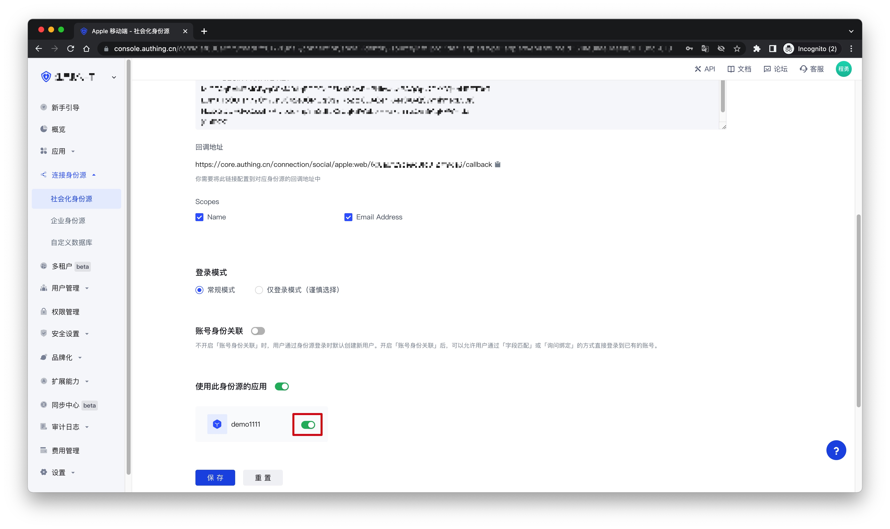

# Apple Mobile

<LastUpdated />

## Scenario Introduction

- **Overview**: Apple social login allows users to log in to third-party applications or websites securely using Apple as the identity source. Configure and enable Apple's social login in {{$localeConfig.brandName}} to quickly obtain Apple's basic open information and help users log in without passwords through {{$localeConfig.brandName}}.
- **Application scenario**: iOS mobile
- **Terminal user preview image**:

## Notes

- Please make sure you have applied for an Apple developer account, otherwise you will not be able to perform the following operations. [Apply for personal and company account addresses](https://developer.apple.com/programs/), [Apply for enterprise account addresses](https://developer.apple.com/programs/enterprise/);
- If you have not opened a {{$localeConfig.brandName}} console account, please go to the [{{$localeConfig.brandName}} console](https://www.genauth.ai/) to register a developer account;

## Step 1: Configure in the Apple Developer Center

### 1.1 Get Team ID

Go to the [Membership page](https://developer.apple.com/account/#/membership) of the [Apple Developer Portal](https://developer.apple.com/account/#) and record the `Team ID`:

### 1.2 Create an App ID

1. In **Apple Developer Portal**, **Certificates, Identifiers & Profiles** > **Identifiers** page, click the ➕ icon to create an app:

2. Select **App IDs** and click the **Continue** button to continue:

3. Select the application type and click the **Continue** button to continue:

4. Fill in **Description** and **Bundle ID**, and find **Sign in with Apple** below and check it. Please record this **Bundle ID**:

5. Finally, click the **Continue** button, confirm the information on the page that opens, and click the **Register** button to create the application.

### 1.3 Create a Service ID

1. Go back to the **Certificates, Identifiers & Profiles** > **Identifiers** page, click the ➕ icon, select **Services IDs** and then click the **Continue** button to continue:

2. Fill in **Description** and **Identifier**, then click the **Continue** button, and on the confirmation page that opens, click the **Register** button to create the Service:

3. Find the Service you just created, select **Sign In with Apple**, click **Configure**:

4. Fill in **Domains and Subdomains** and **Return URLs**:

- **Domains and Subdomains**: Please fill in `core.genauth.ai`
- **Return URLs**: Please fill in the **Callback Address** field information obtained on the [{{$localeConfig.brandName}} console](https://www.genauth.ai/):
  

5. Click **Save**, **Continue**, and finally click **Register**, and record the **Service ID**.

### 1.4 Configure Signing Key

1. Go back to the **Certificates, Identifiers & Profiles** page, switch to the **Keys** tab, and click the ➕ icon:

2. Enter a name and check **Sign in with Apple**, click **Configure**, and make sure the selected **Primary App ID** is the one you just created:

3. Click **Save**, **Continue**, and finally click **Register**.

4. After creation, record the **Key ID** and click **Download** to download the key:

## Step 2: Configure Apple apps in the {{$localeConfig.brandName}} console

2.1 On the {{$localeConfig.brandName}} console's "Social Identity Source" page, click the "Create Social Identity Source" button to enter the "Select Social Identity Source" page.

2.2 On the Select Social Identity Source page, click the Apple card.

2.3 Continue to click the Apple Mobile login mode, or click **… Add** to open the Apple Mobile configuration page.

2.4 On the Apple Mobile configuration page, fill in the relevant fields.

| Field                        | Description                                                                                                                                                                                                                                                                                         |
| ---------------------------- | --------------------------------------------------------------------------------------------------------------------------------------------------------------------------------------------------------------------------------------------------------------------------------------------------- | --- |
| Unique ID                    | a. The unique ID consists of lowercase letters, numbers, and -, and its length is less than 32 bits.  b. This is the unique ID of this connection and cannot be modified after setting.                                                                                                        |
| Display Name                 | This name will be displayed on the button of the end user's login interface.                                                                                                                                                                                                                        |
| Bundle ID                    | Please enter Apple's Bundle ID.                                                                                                                                                                                                                                                                     |
| Team ID                      | Apple developer team ID.                                                                                                                                                                                                                                                                            |
| Key ID                       | The ID of the Apple Signing Key.                                                                                                                                                                                                                                                                    |
| Key                          | The content of the Apple Signing Key.                                                                                                                                                                                                                                                               |
| Callback Address             | a. Paste the callback address on the Create App page of the Apple Developer Platform;   b. Make sure that the unique identifier in the callback address is consistent with the unique identifier in the created identity source;                                                               |     |
| Scopes                       | You can check `Name` and `Email Address`.                                                                                                                                                                                                                                                           |
| Login Mode                   | After turning on "Login Only Mode", you can only log in to existing accounts, not create new accounts. Please choose carefully.                                                                                                                                                                     |
| Account Identity Association | When "Account Identity Association" is not turned on, a new user is created by default when a user logs in through an identity source. After turning on "Account Identity Association", users can be allowed to log in directly to an existing account through "Field Matching" or "Query Binding". |

2.5 After the configuration is completed, click the "Create" or "Save" button to complete the creation.

## Step 3: Development access

- **Recommended development access method**: SDK
- **Pros and cons description**: Access is simple, only a few lines of code are needed. Highest degree of customizability.
- **Detailed access method**:

  3.1 Please access your iOS app according to [Apple Login SDK Access Document](https://docs.genauth.ai/reference/sdk-for-ios/social/apple.html);

  3.2 Create an app in the {{$localeConfig.brandName}} console. For details, see: [How to create an app in {{$localeConfig.brandName}}](/guides/app-new/create-app/create-app.md)

  3.3 On the created "Apple" identity source connection details page, open and associate a mobile app created in the {{$localeConfig.brandName}} console;
  

  3.4 Go to the associated mobile APP to experience the APP login function.

  
