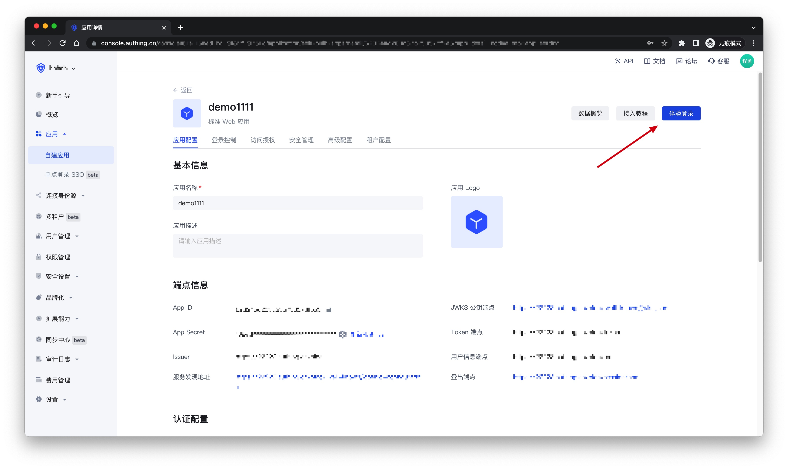

# Apple Web

<LastUpdated />

## Scenario Introduction

- **Overview**: Apple social login allows users to log in to third-party applications or websites securely using Apple as the identity source. Configure and enable Apple's social login in {{$localeConfig.brandName}} to quickly obtain Apple's basic open information and help users log in without passwords through {{$localeConfig.brandName}}.
- **Application scenario**: PC website
- **Terminal user preview image**:

## Notes

- Please make sure you have applied for an Apple developer account, otherwise you will not be able to perform the following operations. Apply for personal and company accounts at: [https://developer.apple.com/programs/](https://developer.apple.com/programs/), apply for enterprise accounts at: [https://developer.apple.com/programs/enterprise/](https://developer.apple.com/programs/enterprise/)
- If you have not opened a {{$localeConfig.brandName}} console account, please go to the [{{$localeConfig.brandName}} console](https://www.genauth.ai/) to register a developer account

## Step 1: Configure in the Apple Developer Center

### Get Team ID

Go to the [Membership page](https://developer.apple.com/account/#/membership) of the [Apple Developer Portal](https://developer.apple.com/account/#) and record `Team ID`:

### Create an App ID

1. In the Apple Developer Portal, **Certificates, Identifiers & Profiles** > **Identifiers** page, click the ➕ icon to create an app:

2. Select **App IDs** and click the **Continue** button to continue:

3. Select the application type and click **Continue** button to continue:

4. Fill in **Description** and **Bundle ID**, and find **Sign in with Apple** below and check it. Please record this **Bundle ID**:

5. Finally, click the **Continue** button, confirm the information on the page that opens, and click the **Register** button to create the app.

### Create a Service ID

1. Go back to the **Certificates, Identifiers & Profiles** > **Identifiers** page, click the ➕ icon, select **Services IDs** and then click the **Continue** button to continue:

2. Fill in **Description** and **Identifier**, then click the **Continue** button. On the confirmation page that opens, click the **Register** button to create the Service:

3. Find the Service you just created and select **Sign In with Apple**, click **Configure**:

4. Fill in **Domains and Subdomains** and **Return URLs**:

- **Domains and Subdomains**: Please fill in `core.genauth.ai`
- **Return URLs**: Please fill in `https://core.genauth.ai/connection/social/{Unique Identifier}/{YOUR_USER_POOL_ID}/callback`, and replace `{Unique Identifier}` with the `Unique Identifier` filled in the identity source you are creating in GenAuth, and replace `{YOUR_USER_POOL_ID}` with your [User Pool ID](/guides/faqs/get-userpool-id-and-secret.md)

5. Click **Save**, **Continue**, and finally click **Register**, and record the **Service ID**.

### Configure Signing Key

1. Go back to the **Certificates, Identifiers & Profiles** page, switch to the **Keys** tab, and click the ➕ icon:

2. Enter a name and check **Sign in with Apple**, click **Configure**, and make sure the **Primary App ID** selected is the one you just created:

3. Click **Save**, **Continue**, and finally **Register**.

4. After creation, record the **Key ID**, and then click **Download** to download the key:

## Step 2: Configure Apple applications in the {{$localeConfig.brandName}} console

2.1 On the "Social Identity Source" page of the {{$localeConfig.brandName}} console, click the "Create Social Identity Source" button to enter the "Select Social Identity Source" page.

2.2 On the "Select Social Identity Source" page, click the "Apple" card.

2.3 Continue to click the "Apple Web" login mode, or click "**… Add**" to open the "Apple Web" configuration page.

2.4 On the "Apple Web" configuration page, fill in the relevant field information.

| Field                        | Description                                                                                                                                                                                                                                                                                         |
| ---------------------------- | --------------------------------------------------------------------------------------------------------------------------------------------------------------------------------------------------------------------------------------------------------------------------------------------------- |
| Unique ID                    | a. The unique ID consists of lowercase letters, numbers, and -, and its length is less than 32 bits.  b. This is the unique ID of this connection and cannot be modified after setting.                                                                                                        |
| Display Name                 | This name will be displayed on the button of the end user's login interface.                                                                                                                                                                                                                        |
| Services Identifier          | The ID of the Apple Service.                                                                                                                                                                                                                                                                        |
| Team ID                      | The ID of the Apple Developer Team.                                                                                                                                                                                                                                                                 |
| Key ID                       | The ID of the Apple Signing Key.                                                                                                                                                                                                                                                                    |
| Key                          | The content of the Apple Signing Key.                                                                                                                                                                                                                                                               |
| Scopes                       | You can check `Name` and `Email Address`.                                                                                                                                                                                                                                                           |
| Login Mode                   | After turning on "Login Only Mode", you can only log in to existing accounts, and cannot create new accounts. Please choose carefully.                                                                                                                                                              |
| Account Identity Association | When "Account Identity Association" is not turned on, a new user is created by default when a user logs in through an identity source. After turning on "Account Identity Association", users can be allowed to log in directly to an existing account through "Field Matching" or "Query Binding". |

2.5 After the configuration is completed, click the "Create" or "Save" button to complete the creation.

## Step 3: Development Access

- **Recommended Development Access Method**: Use Hosted Login Page
- **Pros and Cons Description**: Simple operation and maintenance, which is handled by {{$localeConfig.brandName}}. Each user pool has an independent secondary domain name; if you need to embed it into your application, you need to use the pop-up mode to log in, that is: after clicking the login button, a window will pop up with the content of the {{$localeConfig.brandName}} hosted login page, or redirect the browser to the {{$localeConfig.brandName}} hosted login page.
- **Detailed access method**:

  3.1 Create an application in the {{$localeConfig.brandName}} console. For details, see: [How to create an application in {{$localeConfig.brandName}}](/guides/app-new/create-app/create-app.md)

  3.2 On the created "Apple" identity source connection details page, open and associate an application created in the {{$localeConfig.brandName}} console
  

  3.3 Click the "Experience Login" button of the {{$localeConfig.brandName}} console application to experience the "Apple" login in the pop-up login window
  

