# AWS

<LastUpdated />

## Scenario Introduction

- **Overview**: AWS social login allows users to log in to third-party applications or websites securely using AWS as the identity source. Configure and enable AWS social login in {{$localeConfig.brandName}} to quickly obtain basic AWS information and help users log in without passwords.
- **Application scenario**: PC website
- **End user preview image**:

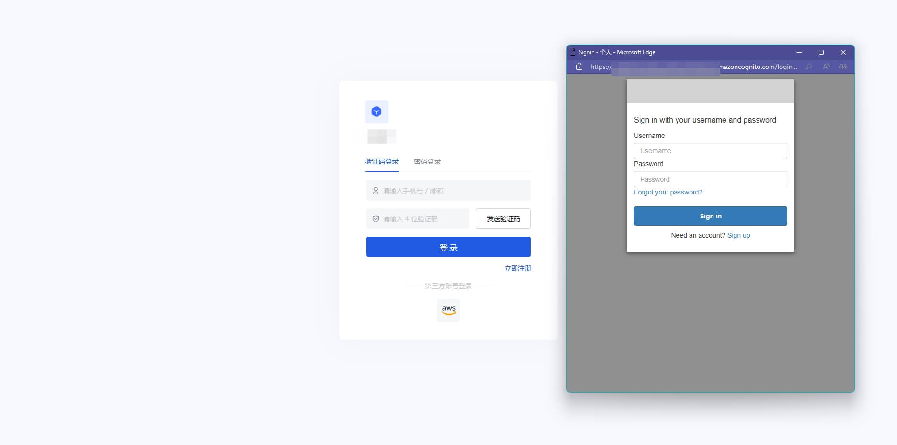

## Notes

- If you don't have an AWS account yet, please go to the [AWS console](https://console.aws.amazon.com/) to register as a developer.
- If you have not opened a {{$localeConfig.brandName}} console account, please go to the [{{$localeConfig.brandName}} console](https://www.genauth.ai/) to register a developer account

## Step 1: Create a server application in AWS

Go to the [Amazon Cognito console](https://console.aws.amazon.com/cognito/home) and click **Create User Pool**:
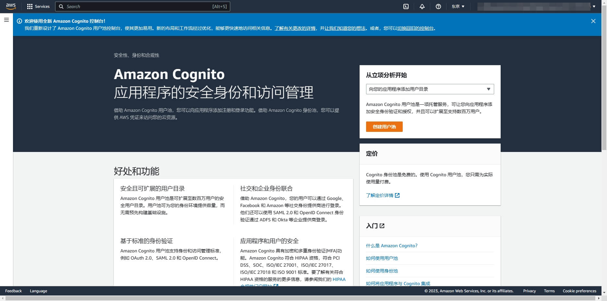

On the **Configure Experience Login** page, check the boxes as needed **User Login Options**:
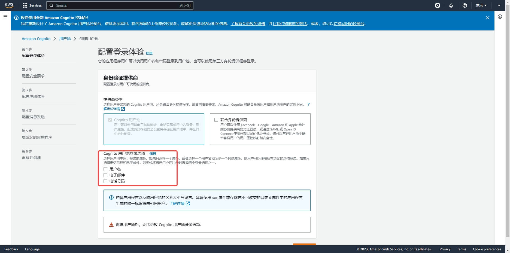

On the **Configure Security Requirements** page, select the Login Security Configuration as needed and click Next:
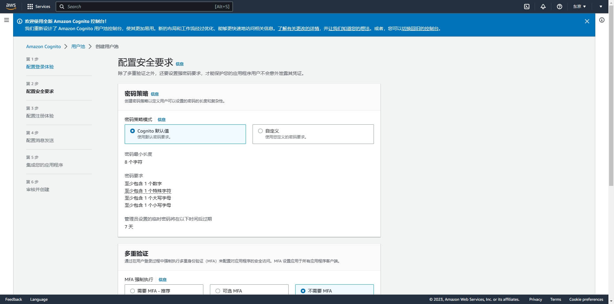

On the **Configure Registration Experience** page, select the Registration Experience Configuration as needed and click Next:
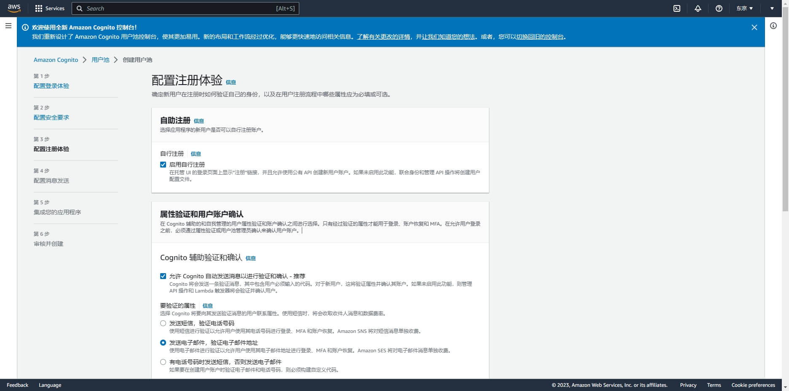

On the **Configure Messaging** page, select the Messaging Configuration as needed and click Next:
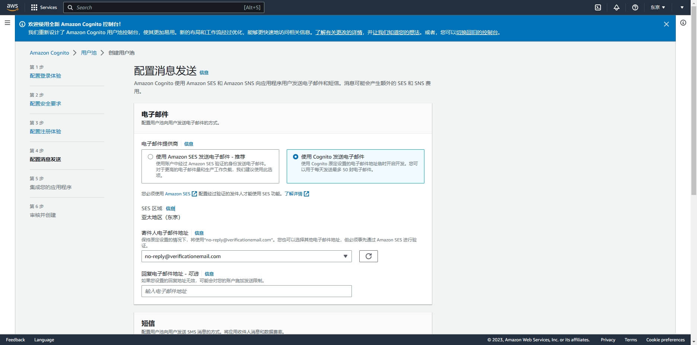

On the **Integrate Your App** page, fill in the User Pool Name
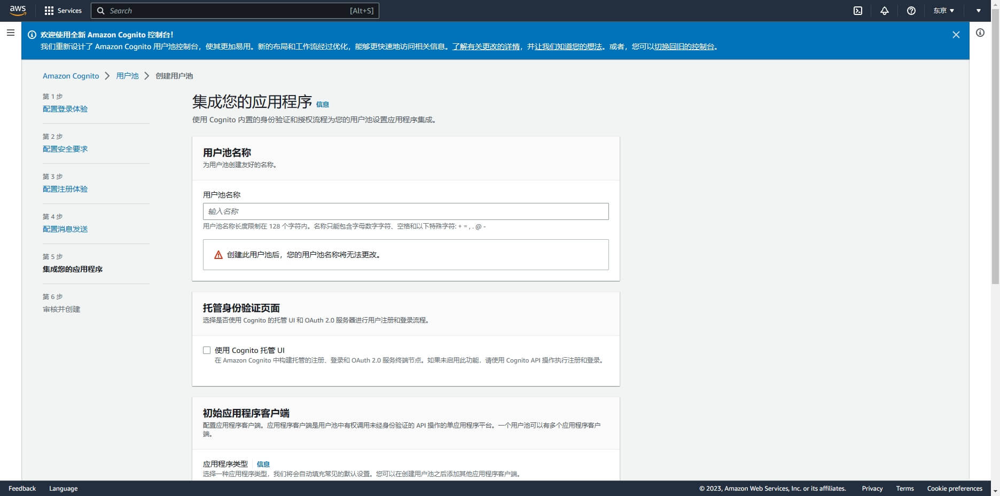

Scroll down, check **Use Cognito Hosted UI**, and fill in a custom Cognito domain
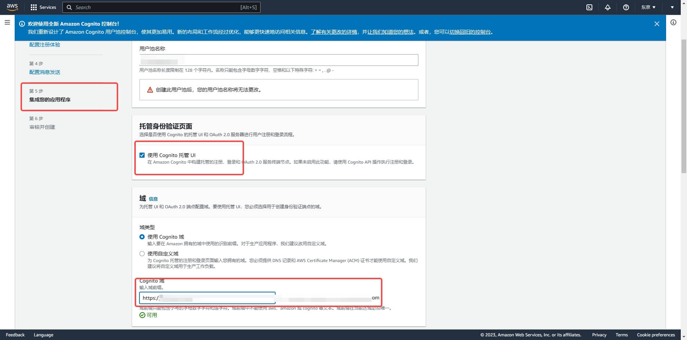

Scroll down, Initialize App Client, select **Confidential Client**, and define the application client name;

Application callback address: fill in `https://core.genauth.ai/connection/social/{Unique ID}/{User Pool ID}/callback`, you need to replace `{Unique ID}` with the `Unique ID` filled in the identity source you are creating in {{$localeConfig.brandName}}, and `{User Pool ID}` with your [User Pool ID](/guides/faqs/get-userpool-id-and-secret.md)
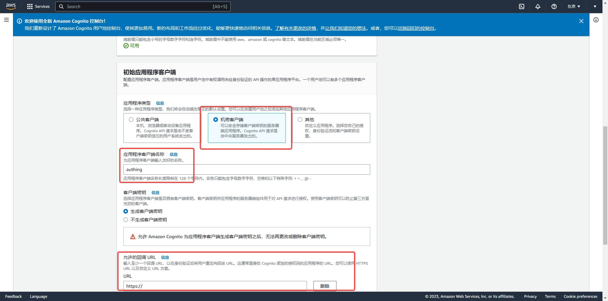

On the **Review and Create** page, confirm the configuration and create the user pool:

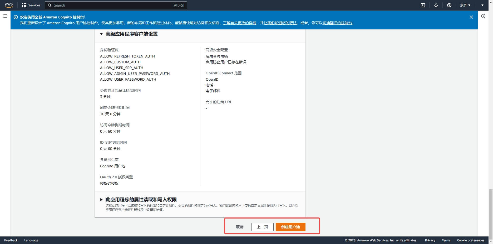

After the creation is completed, on the **User Pool** page, get the Cognito domain

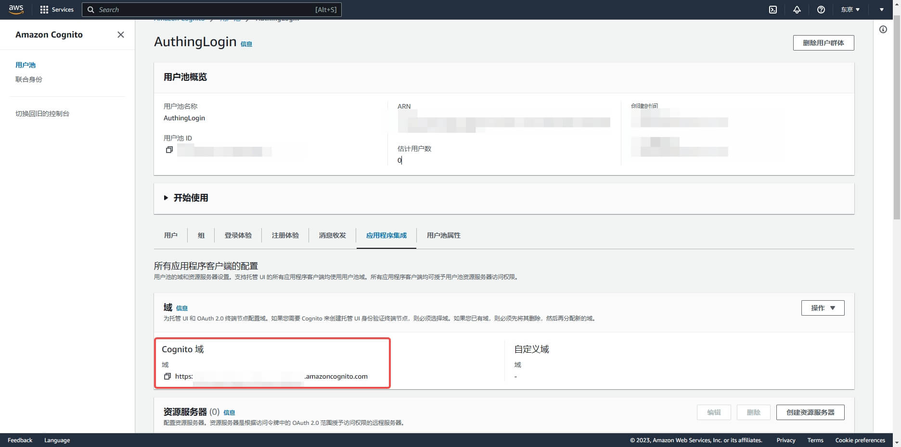

Swipe down to enter the application details page and record the `Client ID` and `Client secret`, which will be needed in the next step.

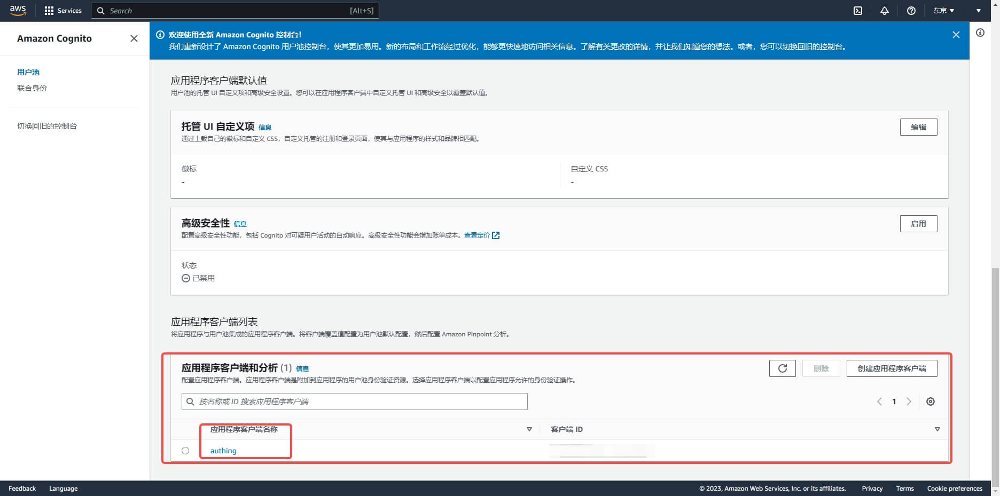

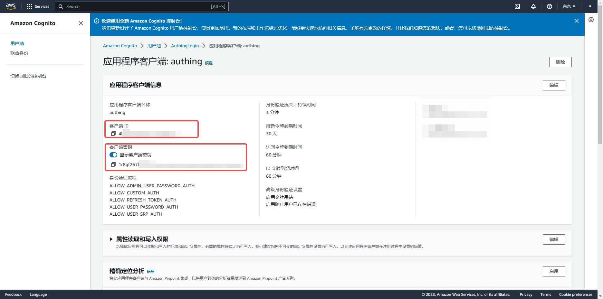

## Step 2: Configure AWS application configuration in the {{$localeConfig.brandName}} console

2.1 On the "Social Identity Source" page of the {{$localeConfig.brandName}} console, click the "Create Social Identity Source" button to enter the "Select Social Identity Source" page.

2.2 On the "Select Social Identity Source" page, click the "AWS" card.
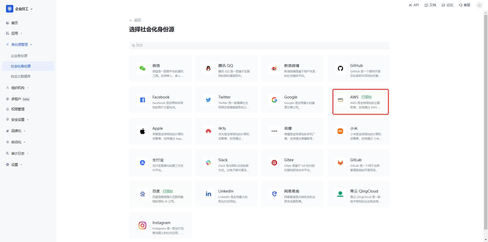

2.3 On the "AWS" configuration page, fill in the relevant field information.
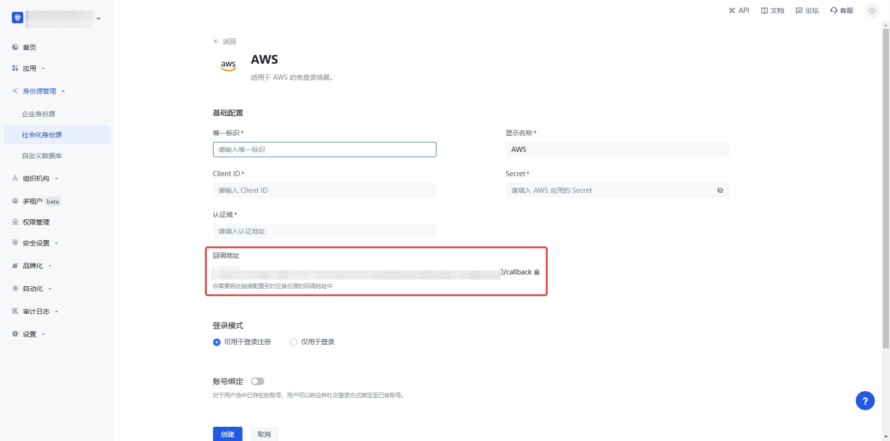

| Field                        | Description                                                                                                                                                                                                                                                                                         |
| ---------------------------- | --------------------------------------------------------------------------------------------------------------------------------------------------------------------------------------------------------------------------------------------------------------------------------------------------- |
| Unique ID                    | a. The unique ID consists of lowercase letters, numbers, and -, and is less than 32 bits long.  b. This is the unique ID for this connection and cannot be modified after it is set.                                                                                                           |
| Display Name                 | This name will be displayed on the button on the end user's login interface.                                                                                                                                                                                                                        |
| Authentication Domain        | The Cognito domain name configured in the AWS User Pool console.                                                                                                                                                                                                                                    |
| Client ID                    | The AWS client ID obtained in the previous step.                                                                                                                                                                                                                                                    |
| Client Secret                | The AWS client secret obtained in the previous step.                                                                                                                                                                                                                                                |
| Login Mode                   | After turning on "Login Only Mode", you can only log in to existing accounts, not create new accounts. Please choose carefully.                                                                                                                                                                     |
| Account Identity Association | When "Account Identity Association" is not turned on, a new user is created by default when a user logs in through an identity source. After turning on "Account Identity Association", users can be allowed to log in directly to an existing account through "Field Matching" or "Query Binding". |

2.4 After the configuration is completed, click the "Create" or "Save" button to complete the creation.

## Step 3: Development Access

- **Recommended Development Access Method**: Use Hosted Login Page
- **Pros and Cons Description**: Simple operation and maintenance, which is handled by {{$localeConfig.brandName}}. Each user pool has an independent secondary domain name; if you need to embed it into your application, you need to use the pop-up mode to log in, that is: after clicking the login button, a window will pop up with the content of the {{$localeConfig.brandName}} hosted login page, or redirect the browser to the {{$localeConfig.brandName}} hosted login page.
- **Detailed access method**:

  3.1 Create an application in the {{$localeConfig.brandName}} console. For details, see: [How to create an application in {{$localeConfig.brandName}}](/guides/app-new/create-app/create-app.md)

  3.2 On the created "AWS" identity source connection details page, open and associate an application created in the {{$localeConfig.brandName}} console

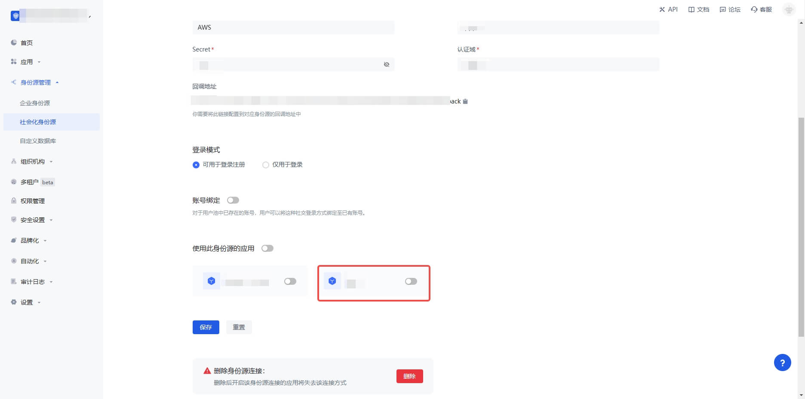

3.3 Click the "Experience Login" button of the {{$localeConfig.brandName}} console application to experience "AWS" login in the pop-up login window

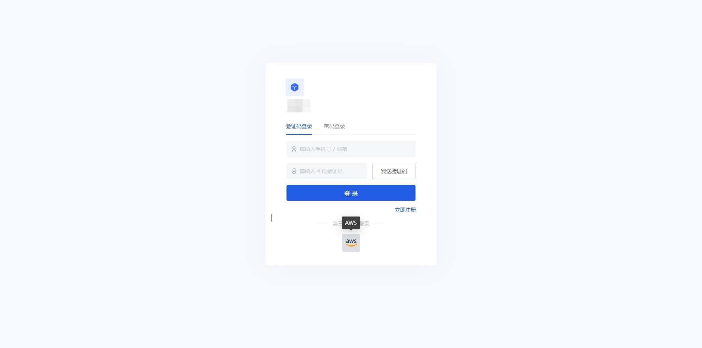
