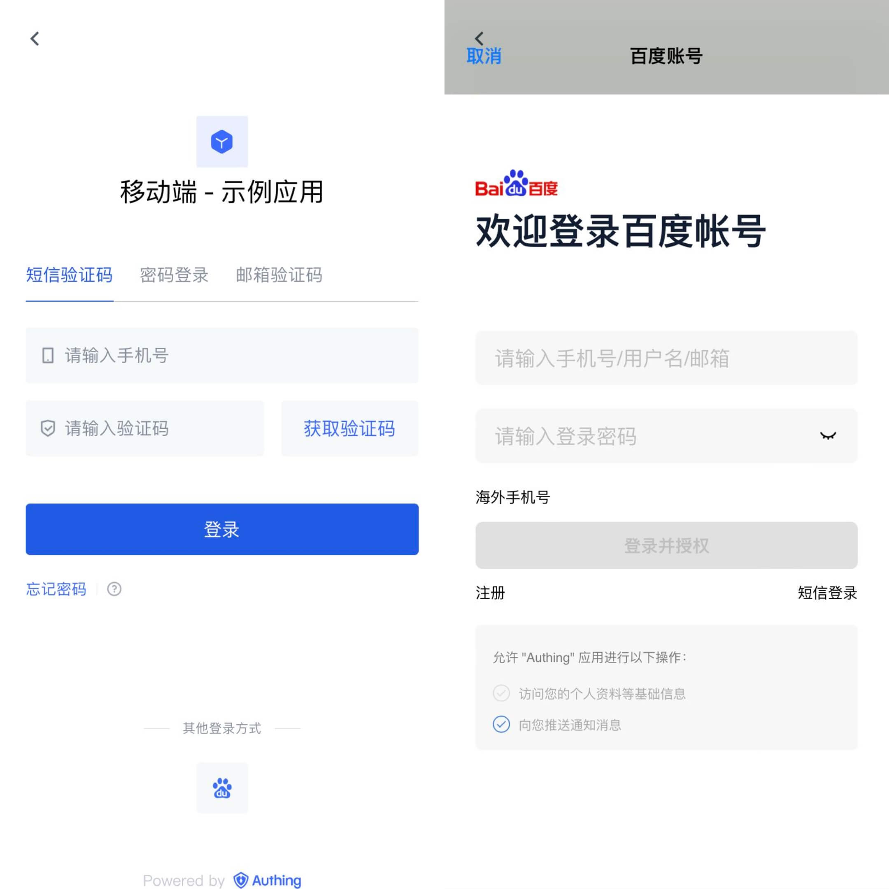
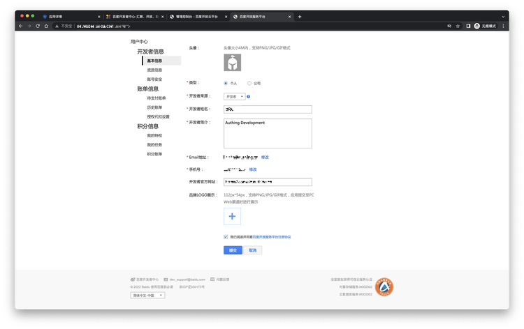
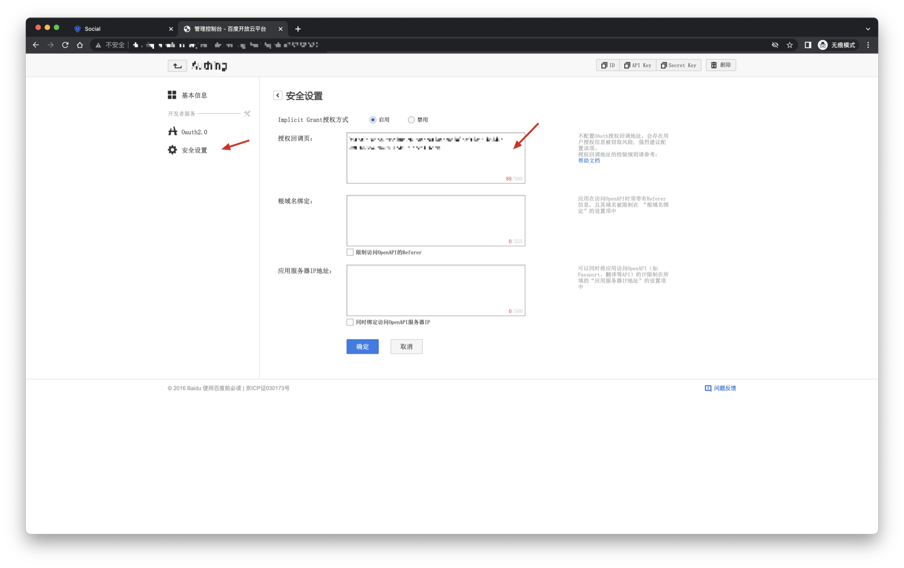
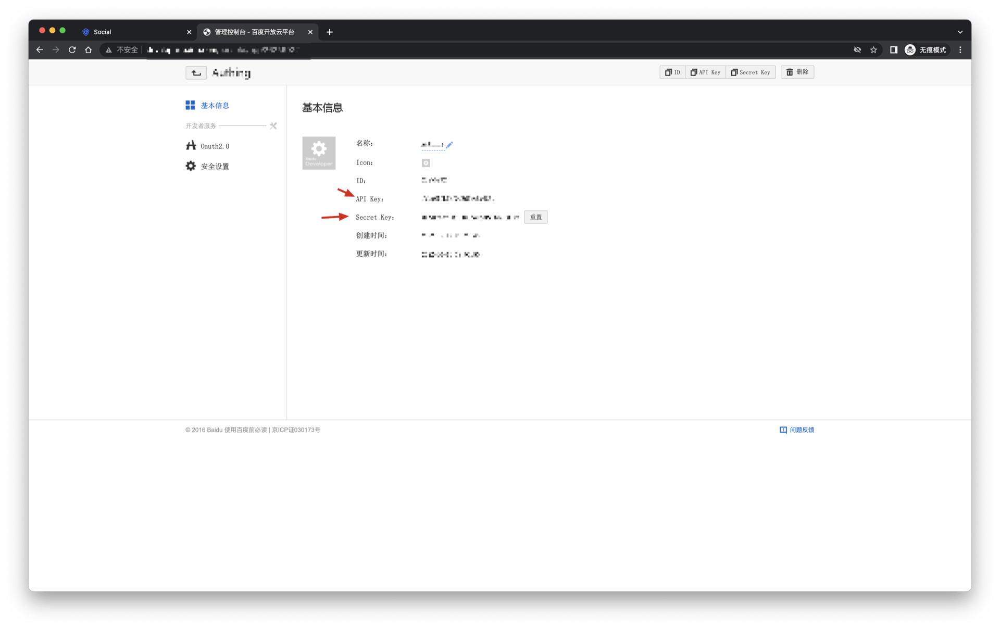
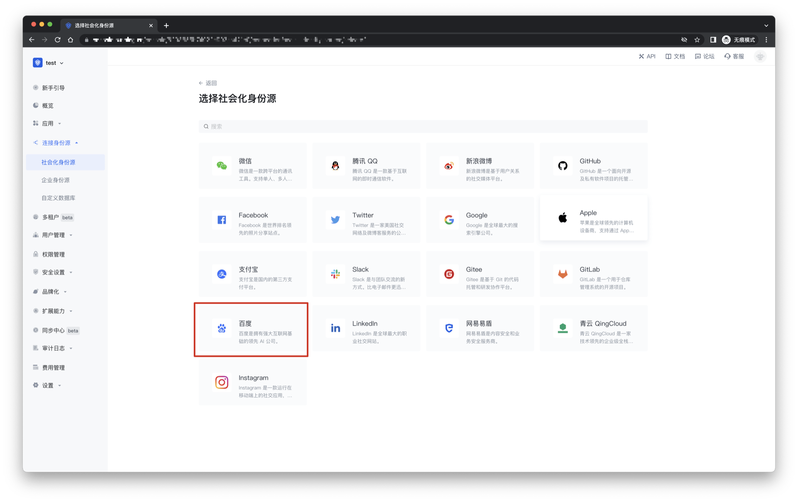
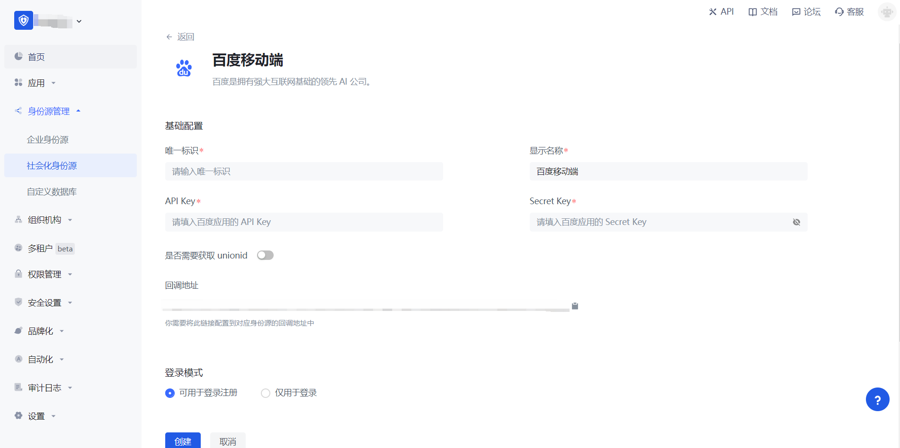
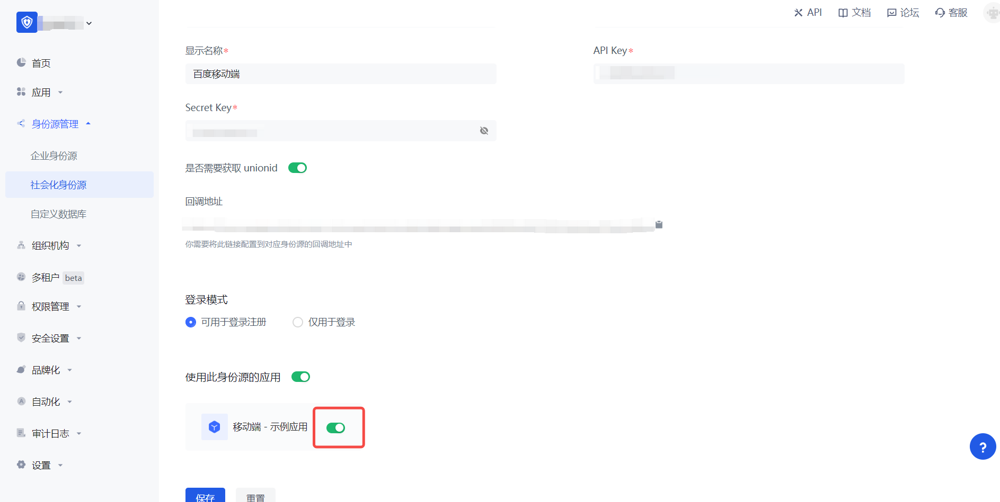

# Baidu Mobile

<LastUpdated/>

## Scenario Introduction

### Overview

Baidu social login is a user's secure login to a third-party application or website using Baidu as the identity source. Configure and enable Baidu's social login in {{$localeConfig.brandName}} to quickly obtain Baidu's basic open information and help users achieve password-free login through {{$localeConfig.brandName}}.

### Application Scenario

Mobile

### Terminal User Preview

## Notes

- If you have not registered a Baidu developer account, please go to [Baidu Developer Center](https://developer.baidu.com/) to register a developer account first.
- Baidu Developer Center - [User Center](http://developer.baidu.com/user/info)
- If you have not opened a {{$localeConfig.brandName}} console account, please go to [{{$localeConfig.brandName}} console](https://www.genauth.ai/) to register a developer account.

## Step 1: Create a mobile application on Baidu Open Platform

- Register [Baidu Developer Center](https://developer.baidu.com/), log in and go to [Baidu Developer Service Management Console](http://developer.baidu.com/console#app/project), fill in the developer information, and create a project (application):

- After the creation is complete, you need to record the API Key (Client ID) and Secret Key (Client Secret) of the application, which will be used later.

On the security settings page, set the authorization callback page address to: `https://core.genauth.ai/connection/social/<Unique Identifier>/<USERPOOL_ID>/callback`, you need to replace `<Unique Identifier>` with your `Unique Identifier`, and `<USERPOOL_ID>` with your [User Pool ID](/guides/faqs/get-userpool-id-and-secret.md)

## Step 2: Configure Baidu in the {{$localeConfig.brandName}} console

2.1 Please click the "Create Social Identity Source" button on the "Social Identity Source" page of the {{$localeConfig.brandName}} console to enter the "Select Social Identity Source" page.

2.2 Please go to the {{$localeConfig.brandName}} console's "Social Identity Source" - "Select Social Identity Source" page, click the "Baidu" identity source button to enter the "Baidu Login Mode" page.

2.3 Please go to the {{$localeConfig.brandName}} console's "Social Identity Source" - "Baidu Mobile" page to configure the relevant field information.

| Field/Function                 | Description                                                                                                                                                                            |
| ------------------------------ | -------------------------------------------------------------------------------------------------------------------------------------------------------------------------------------- |
| Unique ID                      | a. The unique ID consists of lowercase letters, numbers, and -, and its length is less than 32 bits. b. This is the unique ID of this connection and cannot be modified after setting. |
| Display Name                   | This name will be displayed on the button of the terminal user's login interface.                                                                                                      |
| API Key                        | Baidu application ID, which needs to be obtained on the Baidu Developer Center.                                                                                                        |
| Secret Key                     | Baidu application secret key, which needs to be obtained on the Baidu Developer Center.                                                                                                |
| Do you need to obtain unionid? | After enabling, you can obtain the Baidu user unified ID, which is unique to the current developer account.                                                                            |
| Callback address               | Baidu Developer Center valid jump URI. This URL needs to be configured on the Baidu Developer Center.                                                                                  |
| Login mode                     | After enabling "Login-only mode", you can only log in to existing accounts, and cannot create new accounts. Please choose carefully.                                                   |

After the configuration is completed, click the "Create" or "Save" button to complete the creation.

After creating the Baidu identity source on the {{$localeConfig.brandName}} console, you need to configure the callback address to the authorization callback page on Baidu.

## Step 3: Development access

- **Recommended development access method**: SDK

- **Advantages and disadvantages**: Simple operation and maintenance, which is handled by {{$localeConfig.brandName}}. Each user pool has an independent secondary domain name; if you need to embed it in your application, you need to log in using the pop-up mode, that is: after clicking the login button, a window will pop up with the login page hosted by {{$localeConfig.brandName}}, or redirect the browser to the login page hosted by {{$localeConfig.brandName}}.

- **Detailed access method**:

  3.1 Create an application in the {{$localeConfig.brandName}} console. For details, see: [How to create an application in {{$localeConfig.brandName}}](/guides/app-new/create-app/create-app.md)

  3.2 On the created Baidu identity source connection details page, open and associate an application created in the {{$localeConfig.brandName}} console

3.3 Experience Baidu third-party login on the login page. (As shown in the [End User Preview](#End User Preview)).
