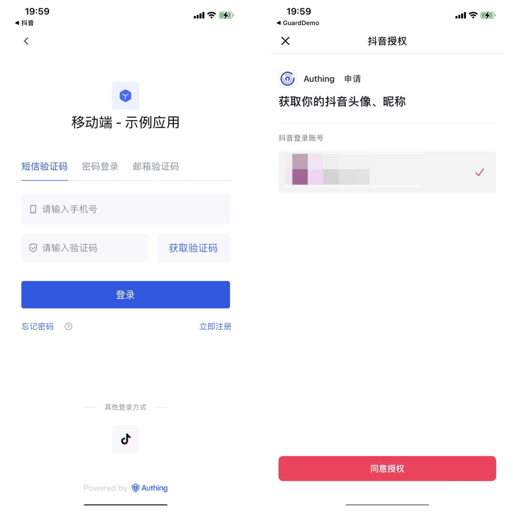
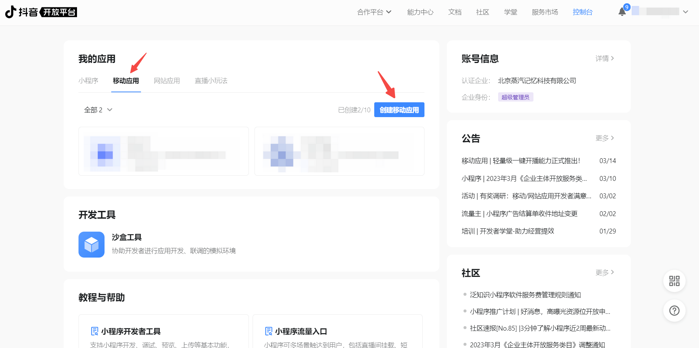
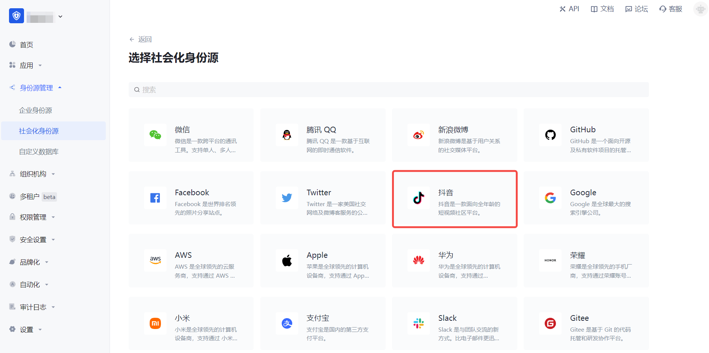
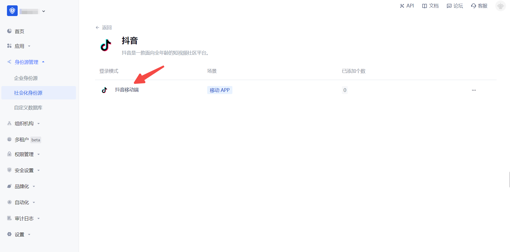
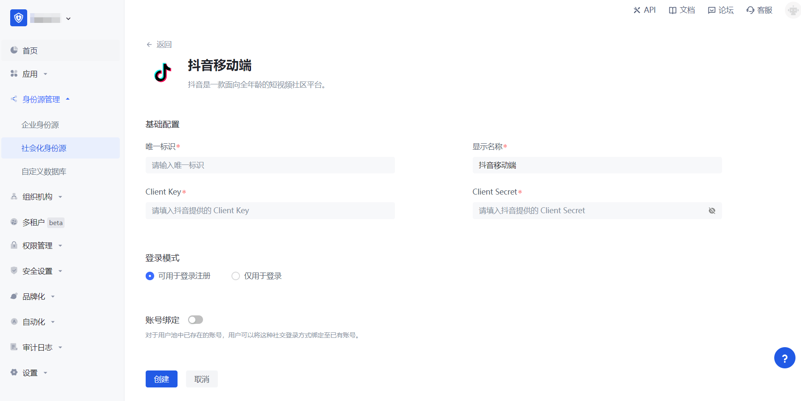
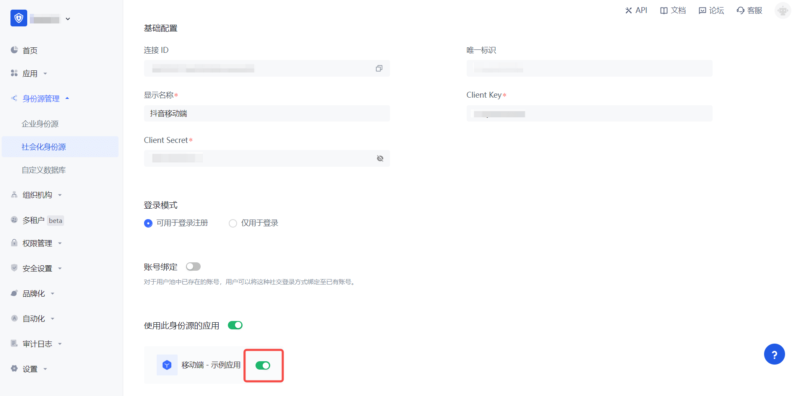

# Douyin Mobile

<LastUpdated/>

## Scenario Introduction

### Overview

Douyin social login is a user's secure login to a third-party application or website using Douyin as the identity source. Configure and enable Douyin social login in {{$localeConfig.brandName}} to quickly obtain Douyin's basic open information and help users achieve password-free login through {{$localeConfig.brandName}}.

### Application Scenario

Mobile

### End User Preview

## Notes

- If you have not opened a Douyin Open Platform account, please go to [Douyin Open Platform](https://developer.open-douyin.com/) to register a developer account.
- You can create an application only after it is approved.
- If you have not opened a {{$localeConfig.brandName}} console account, please go to the [{{$localeConfig.brandName}} console](https://www.genauth.ai/) to register a developer account.

## Step 1: Create a mobile app on the Douyin Open Platform

Go to the [Douyin Open Platform](https://developer.open-douyin.com/console?type=3) to create a mobile app.

Click the console on the upper left of the page to complete the registration and initiate the review, then click "Mobile App" and "Create App" in turn to create a mobile app that uses Douyin to log in. If you encounter any problems during the process, please refer to the Douyin official "Documentation" at the top of the page.

## Step 2: Configure Douyin mobile terminal in the {{$localeConfig.brandName}} console

2.1 Please click the "Create Social Identity Source" button on the "Social Identity Source" page of the {{$localeConfig.brandName}} console to enter the "Select Social Identity Source" page.

2.2 Please click the "Douyin" identity source button on the "Social Identity Source"-"Select Social Identity Source" page of the {{$localeConfig.brandName}} console to enter the "Douyin Mobile Terminal Login Mode" page.

2.3 Please configure the relevant field information on the "Social Identity Source" - "Douyin Mobile" page of the {{$localeConfig.brandName}} console.

| Field/Function               | Description                                                                                                                                                                                                                                                                      |
| ---------------------------- | -------------------------------------------------------------------------------------------------------------------------------------------------------------------------------------------------------------------------------------------------------------------------------- |
| Unique ID                    | a. The unique ID consists of lowercase letters, numbers, and -, and its length is less than 32 bits. b. This is the unique ID of this connection and cannot be modified after setting.                                                                                           |
| Display Name                 | This name will be displayed on the button of the terminal user's login interface.                                                                                                                                                                                                |
| Client Key                   | The Client Key of the Douyin mobile application needs to be obtained on the Douyin Open Platform.                                                                                                                                                                                |
| Client Secret                | The Client Secret of the Douyin mobile application needs to be obtained on the Douyin Open Platform.                                                                                                                                                                             |
| Login mode                   | After turning on "Login only mode", you can only log in to existing accounts, and you cannot create new accounts. Please choose carefully.                                                                                                                                       |
| Account identity association | When "Account identity association" is not turned on, a new user is created by default when a user logs in through an identity source. After turning on "Account identity association", users can be allowed to log in directly to an existing account through "field matching". |

After the configuration is completed, click the "Create" or "Save" button to complete the creation.

## Step 3: Development access

- **Recommended development access method**: SDK

- **Pros and cons description**: Simple operation and maintenance, which is handled by {{$localeConfig.brandName}}. Each user pool has an independent secondary domain name; if you need to embed it in your application, you need to log in using the pop-up mode, that is: after clicking the login button, a window will pop up with the login page hosted by {{$localeConfig.brandName}}, or redirect the browser to the login page hosted by {{$localeConfig.brandName}}.

- **Detailed access method**:

  3.1 Create an application in the {{$localeConfig.brandName}} console. For details, see: [How to create an application in {{$localeConfig.brandName}}](/guides/app-new/create-app/create-app.md)

  3.2 On the created "TikTok Mobile" identity source connection details page, open and associate an application created in the {{$localeConfig.brandName}} console

3.3 Experience TikTok third-party login on the login page (as shown in the [end user preview](#end user preview)).
