# Facebook Mobile

<LastUpdated />

## Scenario Introduction

### Overview

GenAuth provides developers with a way to quickly jump to Facebook login and obtain user information in mobile (iOS or Android) applications. Facebook account access can be completed by simply calling the GenAuth mobile SDK.

### Application Scenario

Mobile APP

### End User Preview Image

Pull up the Facebook page in the mobile application to log in.

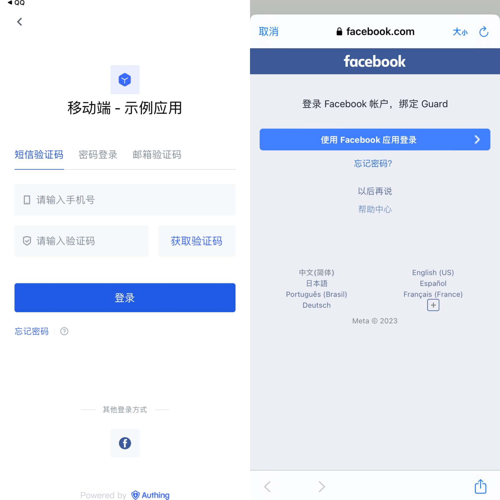

## Preparation

- If you don't have a Facebook account, please go to [Facebook](https://www.facebook.com/) to register first.
  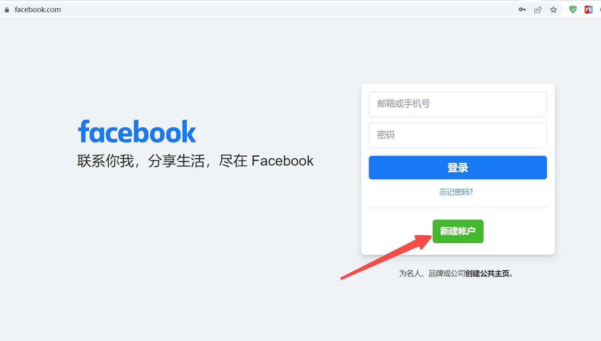

- Open the Facebook Developer Platform, please go to [Facebook Developer Platform](https://developers.facebook.com/) to log in, complete the account information according to the page prompts, and complete the registration.

- If you have not opened a GenAuth console account, please go to [{{$localeConfig.brandName}} Console Console](https://www.genauth.ai/) to register a developer account.

## Configuration steps

### Step 1: Create an application on the Facebook Developer Platform

1. Create a Facebook application and obtain the application number and application key

- After completing the registration and login of the [Facebook Developer Platform](https://developers.facebook.com/apps/?show_reminder=true), click "Create an application".

   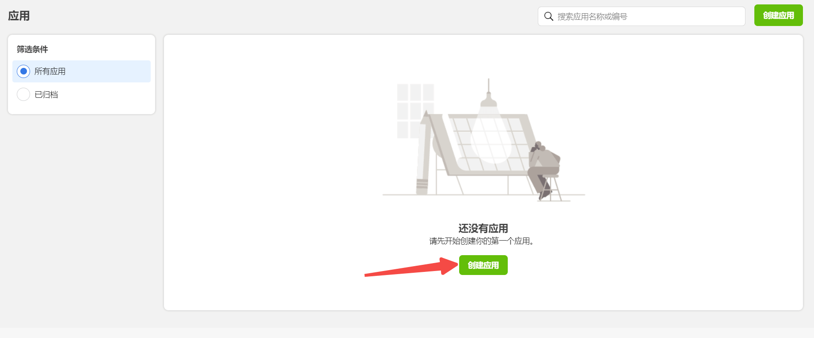

- Select the application type and click "Continue".

   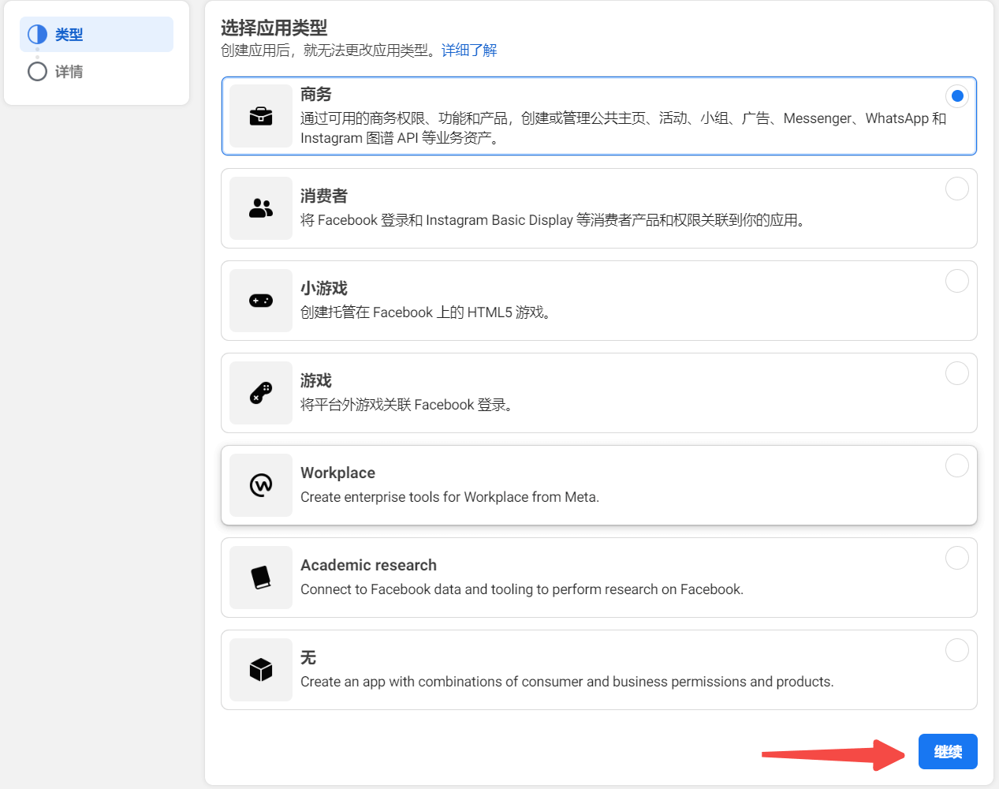

- After filling in the application display name and application contact email, click "Create App".
  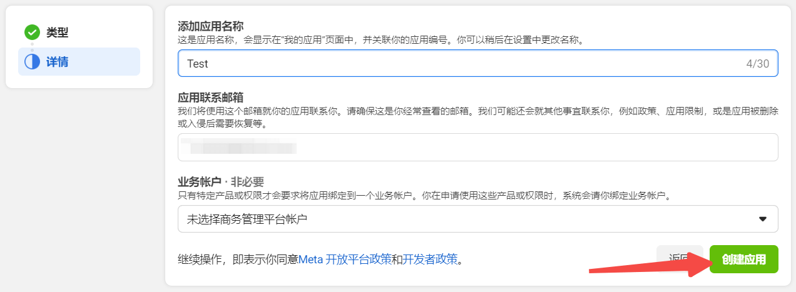

2. In Settings -> Basic, click Add Platform
   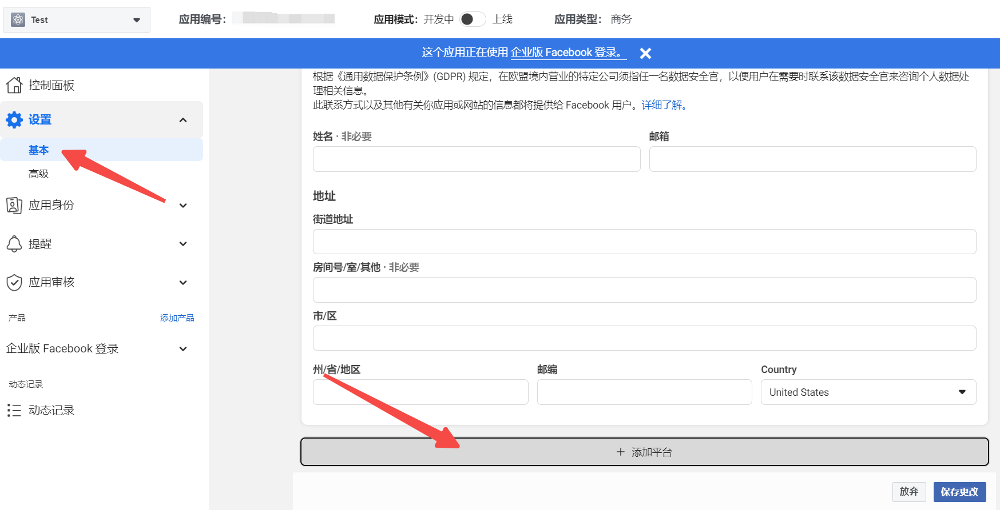

   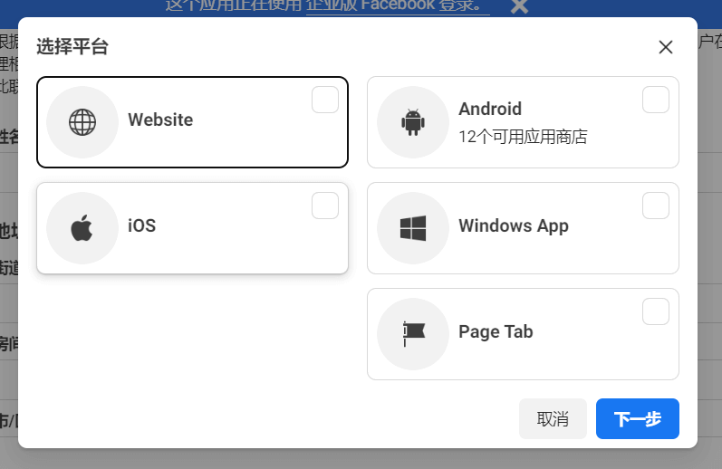

3. In Settings -> Basic, check the App ID and App Key

   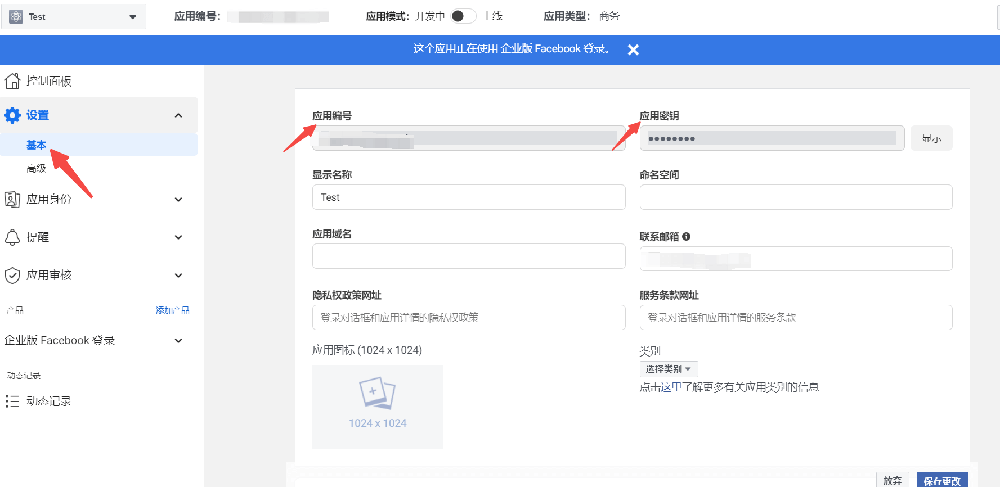

4. In Products, set **Facebook Login**.

   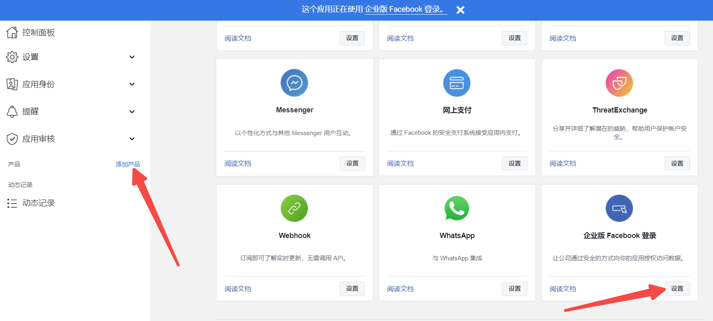

#### Android

Please refer to [Facebook Login for Android — Quick Start](https://developers.facebook.com/docs/facebook-login/android)

::: hint-info

- You need to log in to your mobile app background to obtain **Package name** (Android app package name) and **SHA-1 certificate fingerprint** (Android app's SHA-1).
- It will take some time for the settings to take effect after being saved, please be patient.
  :::

#### iOS

Please refer to [Facebook Login for iOS — Quick Start](https://developers.facebook.com/docs/facebook-login/ios)

::: hint-info

- You can get **Bundle ID** in [Apple Store Connect](https://appstoreconnect.apple.com/apps).
  :::

### Step 2: Configure Facebook mobile login in the GenAuth console

1. On the **Social Identity Source** page of the Atuhing console, click the **Create Social Identity Source** button to enter the **Select Social Identity Source** page.

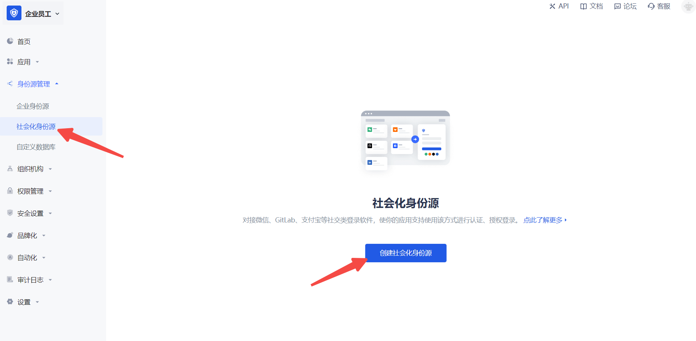

2. On the **Identity Source Management->Social Identity Source->Select Social Identity** page of the GenAuth console, click the "Facebook" identity source card to enter the Facebook login mode selection page.

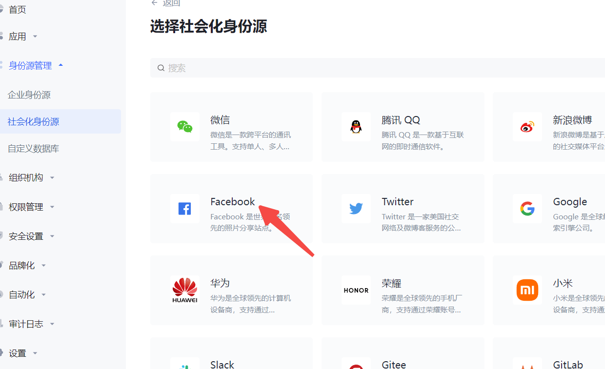

3. Select **Facebook Mobile** to enter.

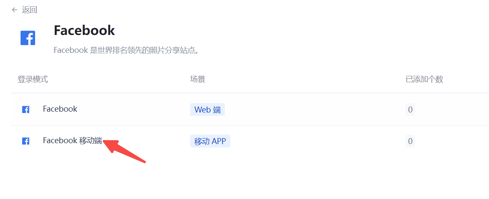

4. Please configure the relevant field information on the "Social Identity Source" - "Facebook Mobile" page of the {{$localeConfig.brandName}} console.

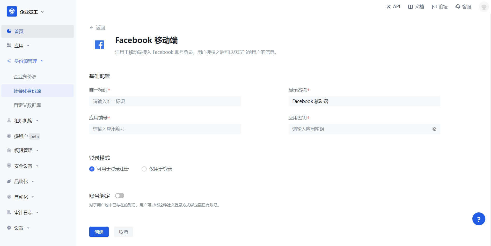

<table>
<tr>
<th>Field</th>
<th>Description</th>
</tr>

<tr>
<td>Unique ID</td>
<td>
<ul>
<li>The unique ID consists of lowercase letters, numbers, and -, and is less than 32 bits in length. </li>
<li>This is the unique ID of this connection and cannot be modified after setting. </li>
</ul></td>
</tr>

<tr>
<td>Display Name</td>
<td>This name will be displayed on the button of the end user's login interface. </td>
</tr>

<tr>
<td>Application ID</td>
<td>Enter the application ID applied on the Facebook developer platform. In "Settings" -> "Basics", obtain the "Application ID". </td>
</tr>

<tr>
<td>Application Key</td>
<td>Enter the application key of the application applied on the Facebook developer platform. In "Settings" -> "Basics", obtain the "Application Key". </td>
</tr>

<tr>
<td>Login Mode</td>
<td>After turning on <b>Login Only Mode</b>, you can only log in to existing accounts, and cannot create new accounts. Please choose carefully. </td>
</tr>

<tr>
<td>Account Binding</td>
<td>When <b>Account Binding</b> is not enabled, a new user is created by default when a user logs in through an identity source; when <b>Account Binding</b> is enabled, users can be allowed to log in directly to an existing account through <b>Field Matching</b>. </td>
</tr>
</table>

### Step 3: Development Access

---

- **Recommended Development Access Method**: SDK

- **Pros and Cons**: Simple operation and maintenance, GenAuth is responsible for operation and maintenance. Each user pool has an independent secondary domain name; if you need to embed it into your application, you need to log in using the pop-up mode, that is: after clicking the login button, a window will pop up with the login page hosted by GenAuth, or redirect the browser to the login page hosted by GenAuth.

- **Detailed access method**:

  3.1 Create an application in the GenAuth console. For details, see: [How to create an application in GenAuth](/guides/app-new/create-app/create-app.md).

  3.2 On the created Facebook identity source connection details page, open and associate an application created in the GenAuth console.

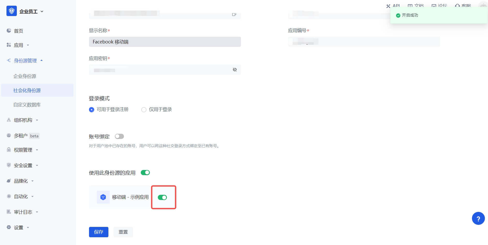

3.3 Experience Facebook third-party login on the login page (as shown in the [end user preview](#end user preview)).
