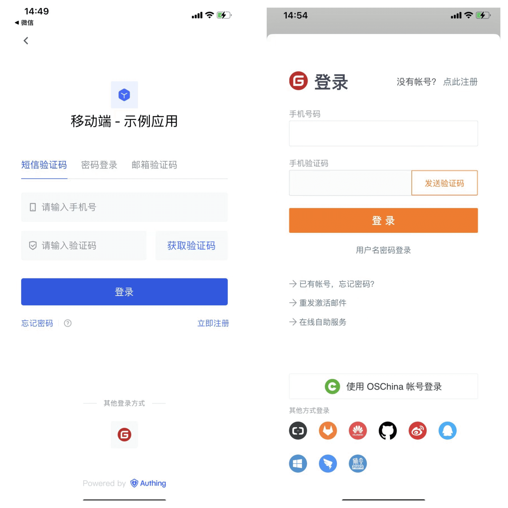
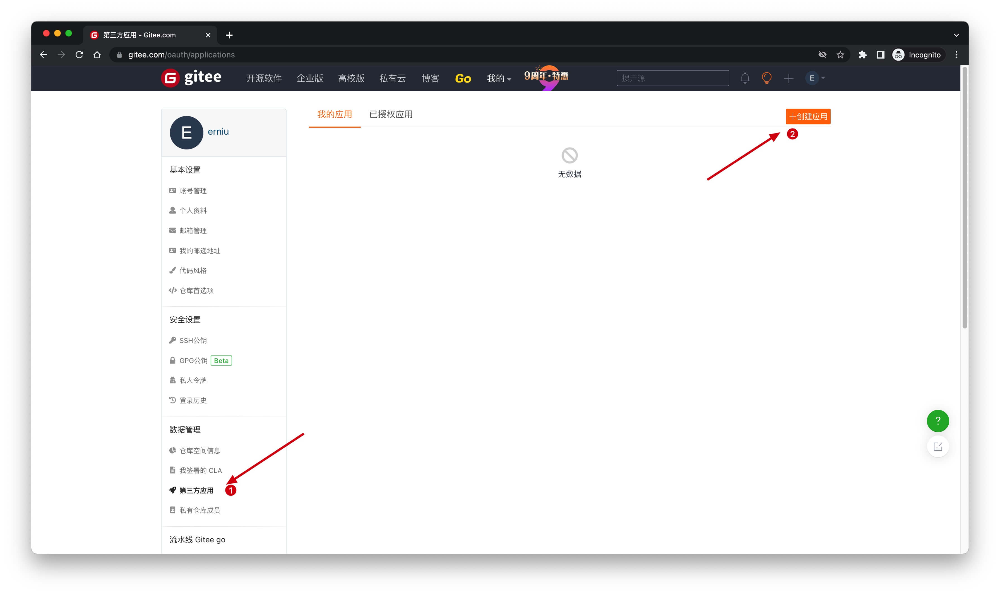
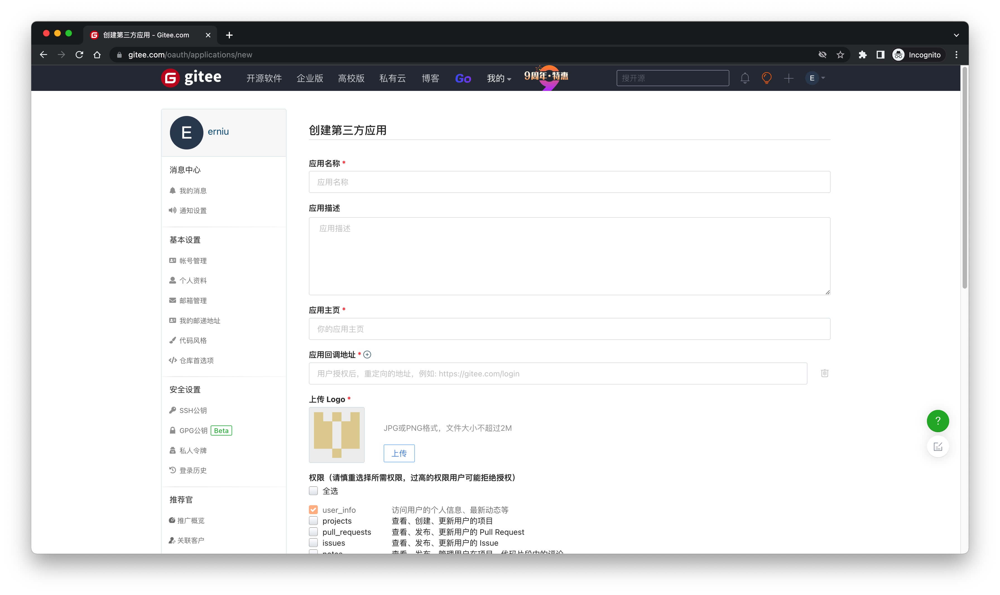
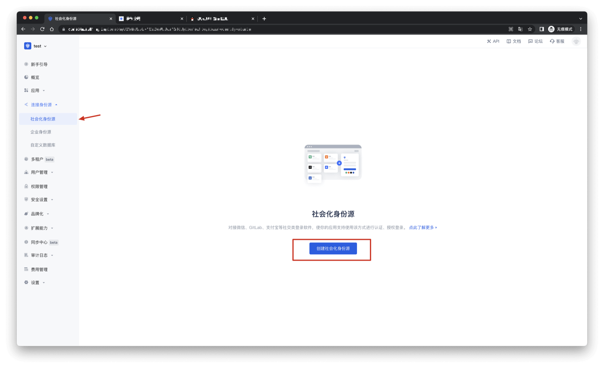
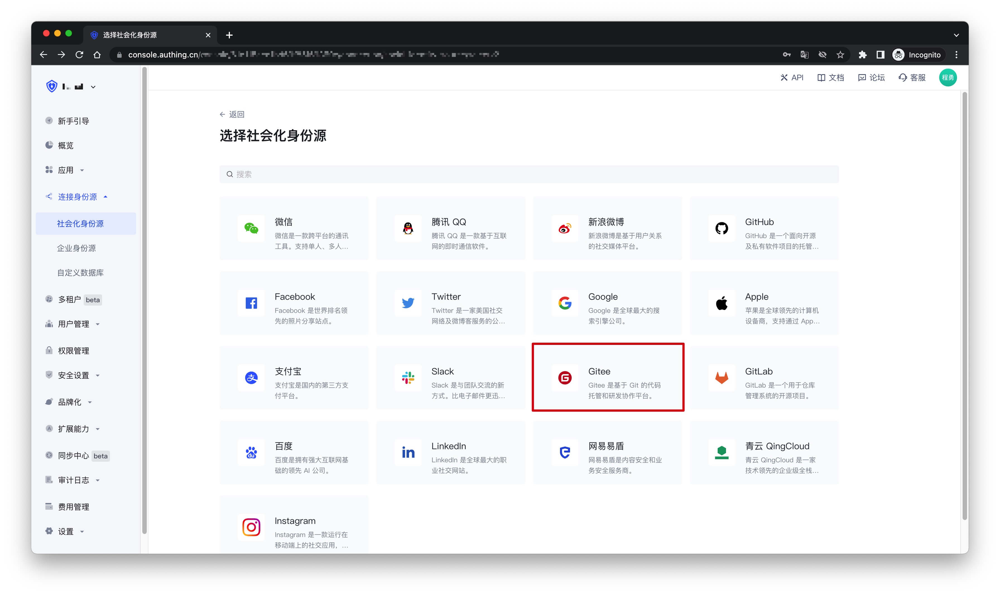
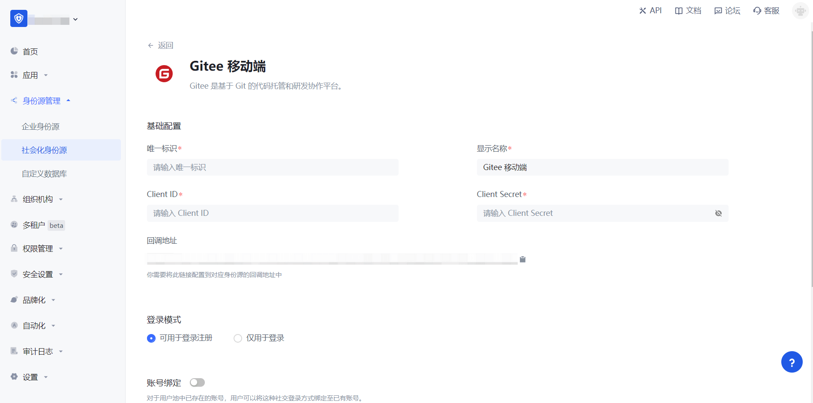
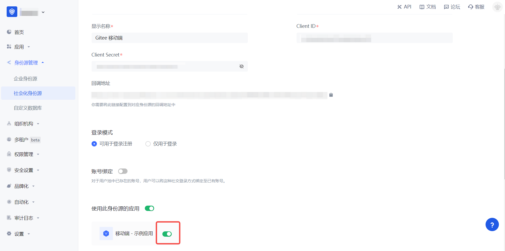

# Gitee Mobile

<LastUpdated />

## Scenario Introduction

### Overview

Gitee social login allows users to log in to third-party applications or websites securely using Gitee as the identity source. Configure and enable Gitee social login in {{$localeConfig.brandName}} to quickly obtain Gitee's basic open information and help users log in without passwords.

### Application scenarios

Mobile

### Preview image for terminal users:

## Notes

- If you don't have a Gitee account, please go to [gitee.com](https://gitee.com/signup) to register an account
- If you haven't opened a {{$localeConfig.brandName}} console account, please go to [{{$localeConfig.brandName}} console](https://www.genauth.ai/) to register a developer account

## Step 1: Create an OAuth application in Gitee

Enter Gitee's application management page and click "**Create application**":

On the Create application page, configure the following information:

- Application callback address: Fill in `https://core.genauth.ai/connection/social/{Unique ID}/{User Pool ID}/callback`. You need to replace `{Unique ID}` with the `Unique ID` filled in the identity source you are creating in {{$localeConfig.brandName}}, and replace `{User Pool ID}` with your [User Pool ID](/guides/faqs/get-userpool-id-and-secret.md)

Finally, click "**Create Application**". After the creation is completed, you need to record the `Client ID` and `Client Secret`, which will be used in the next step.

## Step 2: Configure Gitee application configuration in the {{$localeConfig.brandName}} console

2.1 On the "Social Identity Source" page of the {{$localeConfig.brandName}} console, click the "Create Social Identity Source" button to enter the "Select Social Identity Source" page.

2.2 On the "Select Social Identity Source" page, click the "Gitee"-"Gitee Mobile" card.

2.3 On the "Gitee Mobile" configuration page, fill in the relevant field information.

| Field                        | Description                                                                                                                                                                                                                                                                                       |
| ---------------------------- | ------------------------------------------------------------------------------------------------------------------------------------------------------------------------------------------------------------------------------------------------------------------------------------------------- |
| Unique ID                    | a. The unique ID consists of lowercase letters, numbers, and -, and its length is less than 32 bits.  b. This is the unique ID of this connection and cannot be modified after setting.                                                                                                      |
| Display Name                 | This name will be displayed on the button of the terminal user's login interface.                                                                                                                                                                                                                 |
| Client ID                    | The Gitee application ID obtained in the previous step.                                                                                                                                                                                                                                           |
| Client Secret                | The Gitee application Secret obtained in the previous step.                                                                                                                                                                                                                                       |
| Login Mode                   | After turning on "Login Only Mode", you can only log in to existing accounts and cannot create new accounts. Please choose carefully.                                                                                                                                                             |
| Account Identity Association | When "Account Identity Association" is not turned on, a new user is created by default when a user logs in through an identity source. After turning on "Account Identity Association", users can be allowed to log in directly to existing accounts through "Field Matching" or "Query Binding". |

2.4 After the configuration is completed, click the "Create" or "Save" button to complete the creation.

## Step 3: Development Access

- **Recommended development access method**: SDK
- **Advantages and disadvantages**: Simple operation and maintenance, which is responsible for operation and maintenance by {{$localeConfig.brandName}}. Each user pool has an independent secondary domain name; if you need to embed it in your application, you need to log in using the pop-up mode, that is: after clicking the login button, a window will pop up with the content of the login page hosted by {{$localeConfig.brandName}}, or redirect the browser to the login page hosted by {{$localeConfig.brandName}}.
- **Detailed access method**:

  3.1 Create an application in the {{$localeConfig.brandName}} console. For details, see: [How to create an application in {{$localeConfig.brandName}}](/guides/app-new/create-app/create-app.md)

  3.2 On the created "Gitee Mobile" identity source connection details page, open and associate an application created in the {{$localeConfig.brandName}} console

3.3 Experience Gitee third-party login on the login page (as shown in the [end user preview](#end user preview)).
