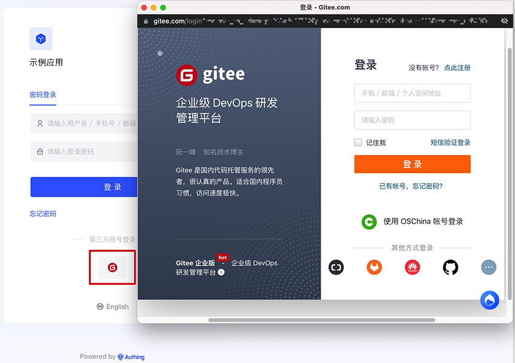
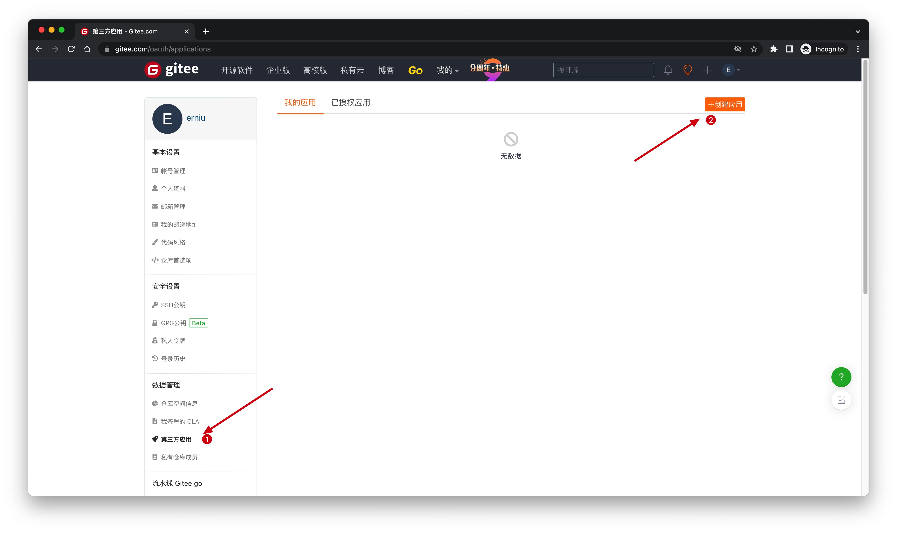
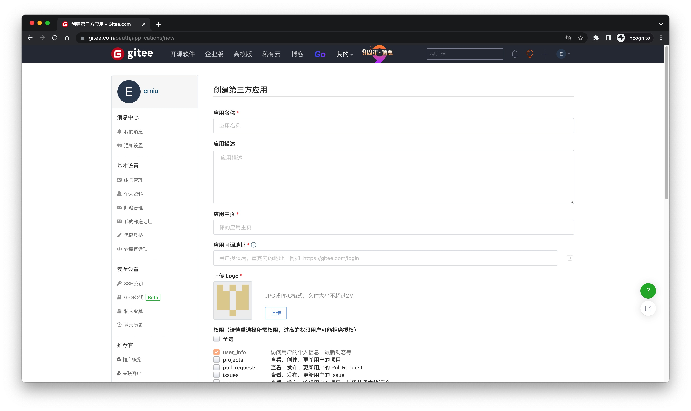
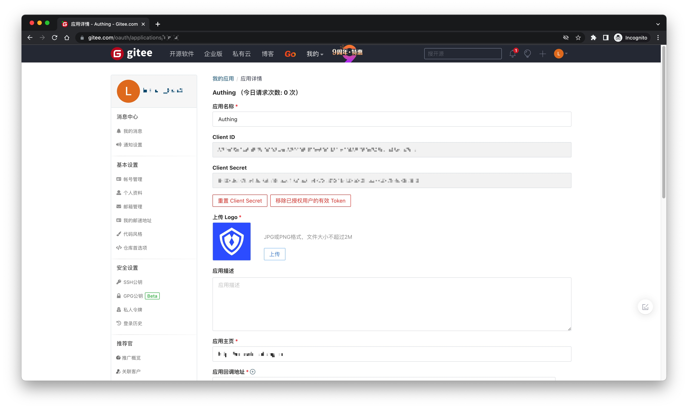
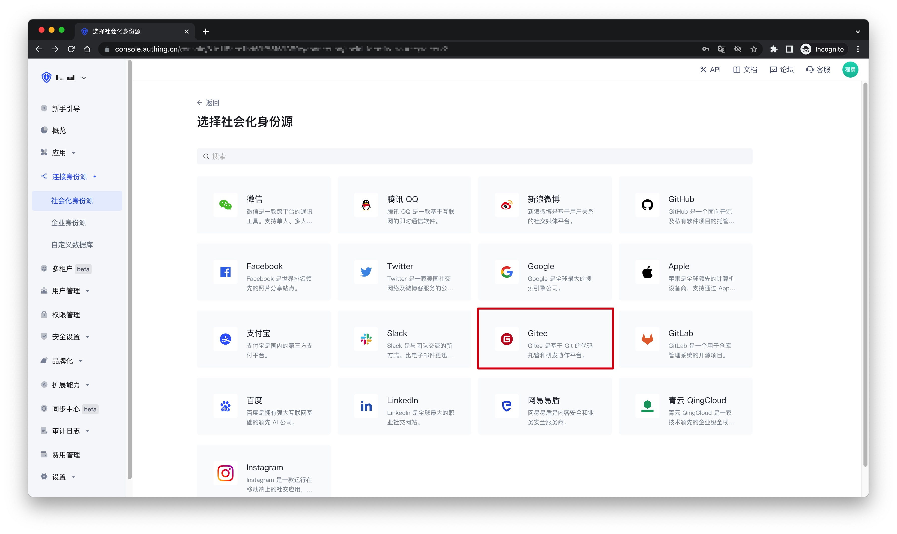
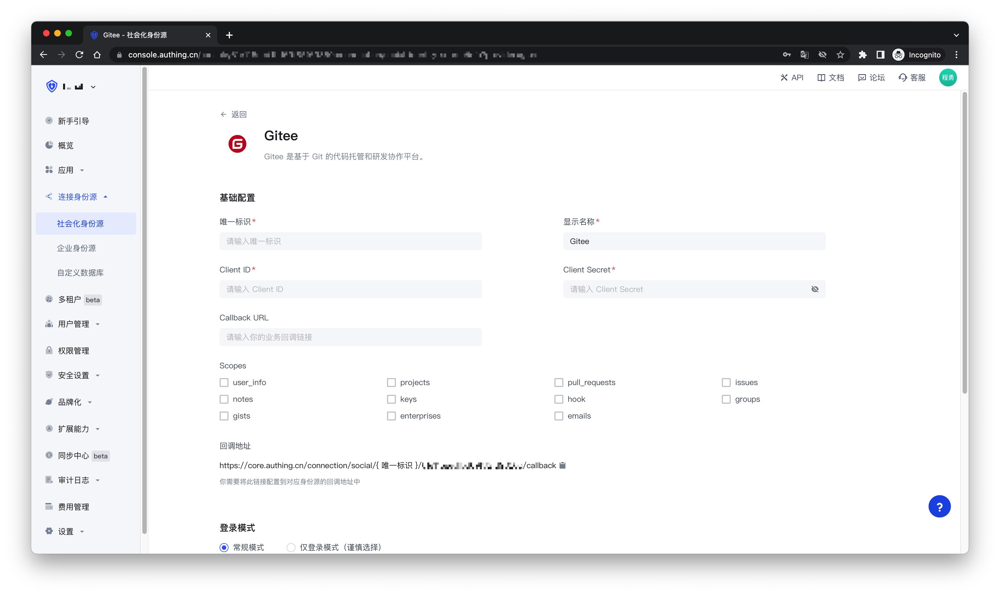
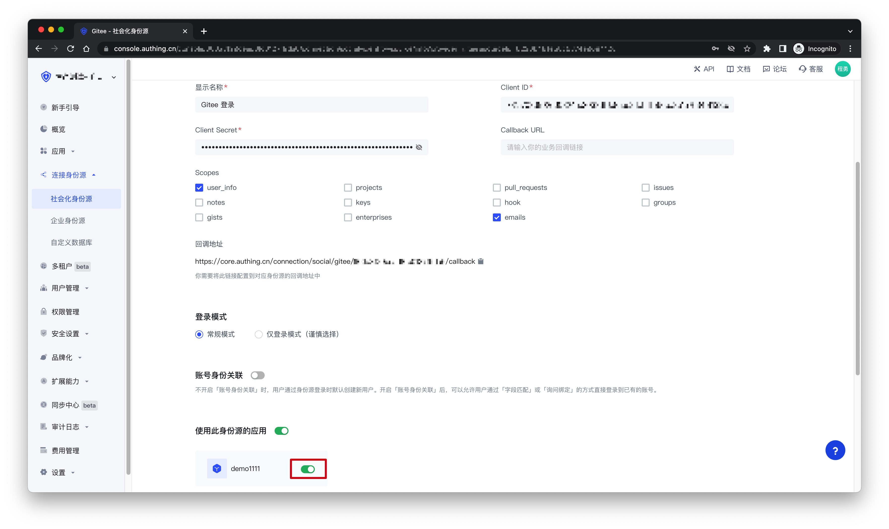
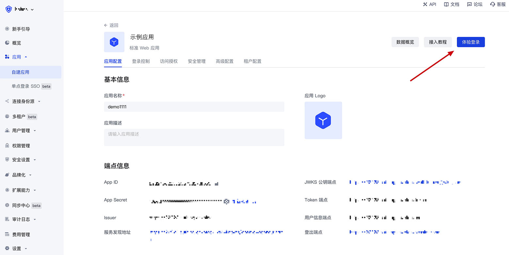
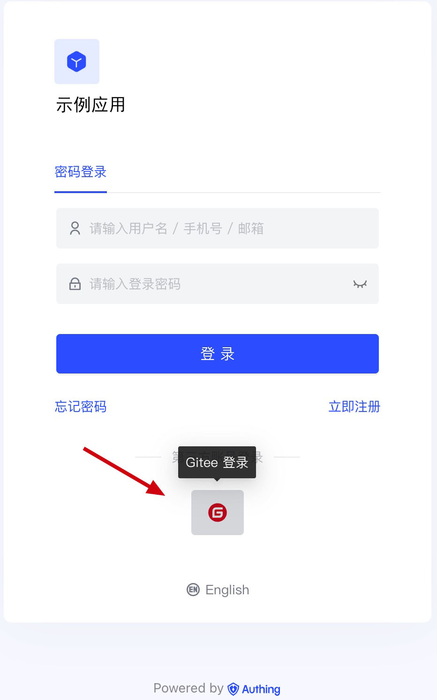

# Gitee

<LastUpdated />

## Scenario Introduction

- **Overview**: Gitee social login allows users to log in to third-party applications or websites securely using Gitee as the identity source. Configure and enable Gitee social login in {{$localeConfig.brandName}} to quickly obtain Gitee's basic open information and help users log in without passwords.
- **Application scenario**: PC website
- **End user preview**:

## Notes

- If you don’t have a Gitee account yet, please go to [gitee.com](https://gitee.com/signup) to register an account
- If you haven’t opened a {{$localeConfig.brandName}} console account, please go to [{{$localeConfig.brandName}} console](https://www.genauth.ai/) to register a developer account

## Step 1: Create an OAuth application in Gitee

Go to Gitee’s application management page and click "**Create an application**":

On the Create an application page, configure the following information:

- Application callback address: Fill in `https://core.genauth.ai/connection/social/{Unique ID}/{User Pool ID}/callback`, you need to replace `{Unique ID}` with the one you are using Fill in the `Unique Identifier` of the identity source created by {{$localeConfig.brandName}}, and replace `{User Pool ID}` with your [User Pool ID](/guides/faqs/get-userpool-id-and-secret.md)

Finally, click "**Create Application**". After the creation is completed, you need to record the `Client ID` and `Client Secret`, which will be used in the next step.

## Step 2: Configure Gitee application configuration in the {{$localeConfig.brandName}} console

2.1 Please click the "Create Social Identity Source" button on the "Social Identity Source" page of the {{$localeConfig.brandName}} console to enter the "Select Social Identity Source" page.

2.2 On the "Select Social Identity Source" page, click the "Gitee" card.

2.3 On the "Gitee" configuration page, fill in the relevant field information.

| Field                        | Description                                                                                                                                                                                                                                                                                          |
| ---------------------------- | ---------------------------------------------------------------------------------------------------------------------------------------------------------------------------------------------------------------------------------------------------------------------------------------------------- |
| Unique ID                    | a. The unique ID consists of lowercase letters, numbers, and -, and its length is less than 32 bits.  b. This is the unique ID of this connection and cannot be modified after setting.                                                                                                         |
| Display Name                 | This name will be displayed on the button of the terminal user's login interface.                                                                                                                                                                                                                    |
| Client ID                    | The Gitee application ID obtained in the previous step.                                                                                                                                                                                                                                              |
| Client Secret                | The Gitee application Secret obtained in the previous step.                                                                                                                                                                                                                                          |
| Callback URL                 | You can fill in your business callback address. After the user completes the login, the browser will jump to this address.                                                                                                                                                                           |
| Scopes                       | By default, {{$localeConfig.brandName}} will only apply for authorization of basic user information (such as avatar, nickname, etc.) from the user. If you need more advanced permissions, you can check the corresponding options.                                                                  |
| Login mode                   | After turning on "Login only mode", you can only log in to existing accounts, and you cannot create new accounts. Please choose carefully.                                                                                                                                                           |
| Account identity association | When "Account identity association" is not turned on, a new user is created by default when the user logs in through the identity source. After turning on "Account identity association", users can be allowed to log in directly to existing accounts through "field matching" or "query binding". |

2.4 After the configuration is completed, click the "Create" or "Save" button to complete the creation.

## Step 3: Development access

- **Recommended development access method**: Use hosted login page
- **Advantages and disadvantages description**: Simple operation and maintenance, {{$localeConfig.brandName}} is responsible for operation and maintenance. Each user pool has an independent secondary domain name; if you need to embed it in your application, you need to use the pop-up mode to log in, that is: after clicking the login button, a window will pop up with the login page hosted by {{$localeConfig.brandName}}, or redirect the browser to the login page hosted by {{$localeConfig.brandName}}.
- **Detailed access method**:

  3.1 Create an application in the {{$localeConfig.brandName}} console. For details, see: [How to create an application in {{$localeConfig.brandName}}](/guides/app-new/create-app/create-app.md)

  3.2 On the created "Gitee" identity source connection details page, open and associate an application created in the {{$localeConfig.brandName}} console

3.3 Click the "Experience Login" button of the {{$localeConfig.brandName}} console application to experience the "Gitee" login in the pop-up login window

  
