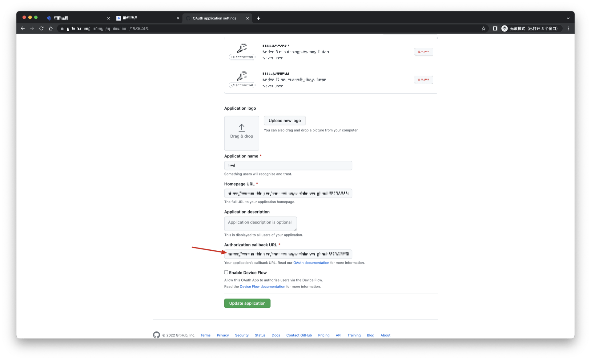

# Github

<LastUpdated/>

## Scenario Introduction

- **Overview**: Github social login allows users to log in to third-party applications or websites securely using Github as the identity source. Configure and enable Github social login in {{$localeConfig.brandName}} to quickly obtain Github's basic open information and help users log in without passwords.
- **Application scenario**: PC website
- **Terminal user preview image**:

## Notes

- If you do not have a Github account, please go to [GitHub](https://www.github.com) to register a developer account first.
- Follow the [GitHub documentation](https://docs.github.com/cn/developers/apps/building-oauth-apps/creating-an-oauth-app) instructions to create a GitHub OAuth application and record the application's Client ID and Client Secret.
- If you don't have a {{$localeConfig.brandName}} console account, please go to the [{{$localeConfig.brandName}} console](https://www.genauth.ai/) to register a developer account.

## Step 1: Create an OAuth application in Github

- In the upper-right corner of any Github page, click your profile photo, and then click Settings.

- In the left column, click <> Developer Settings.

- In the left sidebar, click OAuth Applications.

- Click New OAuth App.

- In "Application name", enter a name for your application.

- In Homepage URL, enter the full URL of your application's website.

- In Authorization callback URL, enter the callback URL for your application.

During the application creation process, you need to configure the allowed callback address. Please use the following settings: `https://core.genauth.ai/connection/social/<Unique Identifier>/<USERPOOL_ID>/callback`. You need to replace `<Unique Identifier>` with your `Unique Identifier` and `<USERPOOL_ID>` with your [User Pool ID](/guides/faqs/get-userpool-id-and-secret.md)

## Step 2: Configure Github in the {{$localeConfig.brandName}} console

2.1 Please click the "Create Social Identity Source" button on the "Social Identity Source" page of the {{$localeConfig.brandName}} console to enter the "Select Social Identity Source" page.

2.2 Please go to the {{$localeConfig.brandName}} console's "Social Identity Source" - "Select Social Identity Source" page, click the "Github" identity source button to enter the "Github Login Mode" page.

2.3 Please go to the {{$localeConfig.brandName}} console's "Social Identity Source" - "Github" page to configure the relevant field information.

| Field/Function               | Description                                                                                                                                                                                                                                                                            |
| ---------------------------- | -------------------------------------------------------------------------------------------------------------------------------------------------------------------------------------------------------------------------------------------------------------------------------------- |
| Unique ID                    | a. The unique ID consists of lowercase letters, numbers, and -, and is less than 32 bits long. b. This is the unique ID of this connection and cannot be modified after setting.                                                                                                       |
| Display name                 | This name will be displayed on the button of the end user's login interface.                                                                                                                                                                                                           |
| Client ID                    | Github ID, which needs to be obtained on Github.                                                                                                                                                                                                                                       |
| Client secrets               | Github key, which needs to be obtained on Github.                                                                                                                                                                                                                                      |
| Callback URL                 | You can fill in your business callback address. After the user completes the login, the browser will jump to this address.                                                                                                                                                             |
| Scopes                       | By default, {{$localeConfig.brandName}} will only request authorization for basic user information (such as avatar, nickname, etc.) from the user. If you need more advanced permissions, you can check the corresponding options.                                                     |
| Callback URL                 | Github valid jump URI. This URL needs to be configured on Github.                                                                                                                                                                                                                      |
| Login mode                   | After turning on "Login only mode", you can only log in to existing accounts, and cannot create new accounts. Please choose carefully.                                                                                                                                                 |
| Account identity association | When "Account identity association" is not turned on, a new user is created by default when the user logs in through the identity source. After turning on "Account Identity Association", users can log in directly to existing accounts through "Field Matching" or "Query Binding". |

After configuration is complete, click the "Create" or "Save" button to complete the creation.

After creating the Github identity source on the {{$localeConfig.brandName}} console, you need to configure the callback address to the Authorization callback URL on Github.

## Step 3: Development Access

- **Recommended Development Access Method**: Use Hosted Login Page

- **Pros and Cons Description**: Simple operation and maintenance, {{$localeConfig.brandName}} is responsible for operation and maintenance. Each user pool has an independent secondary domain name; if you need to embed it into your application, you need to use the pop-up mode to log in, that is: after clicking the login button, a window will pop up with the content of the {{$localeConfig.brandName}} hosted login page, or redirect the browser to the {{$localeConfig.brandName}} hosted login page.

- **Detailed access method**:

  3.1 Create an application in the {{$localeConfig.brandName}} console. For details, see: [How to create an application in {{$localeConfig.brandName}}](/guides/app-new/create-app/create-app.md)

  3.2 On the created Github identity source connection details page, open and associate an application created in the {{$localeConfig.brandName}} console

3.3 Experience Github third-party login on the login page

