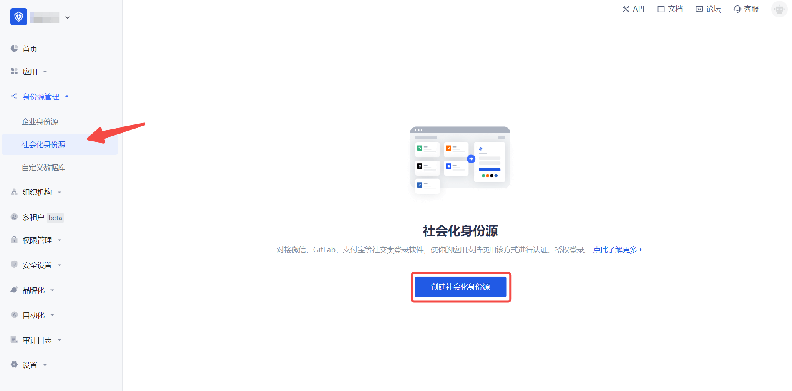

# GitLab Mobile

<LastUpdated/>

## Scenario Introduction

### Overview

GitLab social login allows users to log in to third-party applications or websites securely using GitLab as the identity source. Configure and enable GitLab social login in {{$localeConfig.brandName}} to quickly obtain GitLab's basic open information and help users log in without passwords.

### Application Scenarios

Mobile

### End User Preview

## Notes

- If you don't have a GitLab account yet, please go to [GitLab.com](https://gitlab.com/users/sign_up/) to register an account.

* If you don't have a {{$localeConfig.brandName}} console account, please go to the [{{$localeConfig.brandName}} console](https://www.genauth.ai/) to register a developer account.

## Step 1: Create an application on GitLab (or your GitLab instance)

- Click your profile picture in the upper right corner and click **Edit Profile**.

- Click **Applications** in the left navigation bar.

- Create an application, edit the application information **Name**, **Redirect URI**, add **Scopes**: check `api`, `read_user`.

- Click **Save Application**.

- After the creation is complete, record the **Application ID** and **Secret**, which will be needed in the next step.

During the application creation process, you need to configure the allowed callback address. Please use the following settings: `https://core.genauth.ai/connection/social/<Unique Identifier>/<USERPOOL_ID>/callback`. You need to replace `<Unique Identifier>` with your `Unique Identifier` and `<USERPOOL_ID>` with your [User Pool ID](/guides/faqs/get-userpool-id-and-secret.md)

## Step 2: Configure GitLab Mobile in the {{$localeConfig.brandName}} console

2.1 Please click the "Create Social Identity Source" button on the "Social Identity Source" page of the {{$localeConfig.brandName}} console to enter the "Select Social Identity Source" page.

2.2 In the {{$localeConfig.brandName}} console, go to "Social Identity Source" - "Select Social Identity Source", click the "GitLab" identity source card, and enter the "GitLab Mobile Login Mode" page.

2.3 In the {{$localeConfig.brandName}} console, go to "Social Identity Source" - "GitLab Mobile" page, and configure the relevant field information.

| Field/Function               | Description                                                                                                                                                                                                                                                                    |
| ---------------------------- | ------------------------------------------------------------------------------------------------------------------------------------------------------------------------------------------------------------------------------------------------------------------------------ |
| Unique ID                    | a. The unique ID consists of lowercase letters, numbers, and -, and is less than 32 characters long. b. This is the unique ID for this connection and cannot be modified after setting.                                                                                        |
| Display Name                 | This name will be displayed on the button of the end user's login interface.                                                                                                                                                                                                   |
| Base URL                     | By default, GitLab.com is used as the authentication endpoint. You can also specify any private GitLab instance, such as `https://gitlab.example.com/`.                                                                                                                        |
| Application ID               | The GitLab application ID obtained in the previous step.                                                                                                                                                                                                                       |
| Secret                       | The GitLab application key obtained in the previous step.                                                                                                                                                                                                                      |
| Callback URL                 | GitLab valid redirect URI. This URL needs to be configured on the `Redirect URI` of the GitLab application.                                                                                                                                                                    |
| Login Mode                   | After turning on "Login Only Mode", you can only log in to existing accounts, not create new accounts. Please choose carefully.                                                                                                                                                |
| Account Identity Association | When "Account Identity Association" is not enabled, a new user is created by default when a user logs in through an identity source. After turning on "Account Identity Association", users can be allowed to log in directly to an existing account through "Field Matching". |

After the configuration is completed, click the "Create" or "Save" button to complete the creation.

After creating the "GitLab Mobile" identity source on the {{$localeConfig.brandName}} console, you need to configure the callback address to the Callback URL on GitLab.

## Step 3: Development Access

- **Recommended development access method**: SDK

- **Pros and cons description**: Simple operation and maintenance, {{$localeConfig.brandName}} is responsible for operation and maintenance. Each user pool has an independent secondary domain name; if you need to embed it in your application, you need to log in using the pop-up mode, that is: after clicking the login button, a window will pop up with the content of the login page hosted by {{$localeConfig.brandName}}, or redirect the browser to the login page hosted by {{$localeConfig.brandName}}.

- **Detailed access method**:

  3.1 Create an application in the {{$localeConfig.brandName}} console. For details, see: [How to create an application in {{$localeConfig.brandName}}](/guides/app-new/create-app/create-app.md)

  3.2 On the created GitLab mobile identity source connection details page, enable and associate an application created in the {{$localeConfig.brandName}} console

3.3 Experience GitLab third-party login on the login page (as shown in the [end user preview](#end user preview)).
