# GitLab

<LastUpdated />

## Scenario Introduction

### Overview

GitLab social login allows users to log in to third-party applications or websites securely using GitLab as the identity source. Configure and enable GitLab social login in {{$localeConfig.brandName}} to quickly obtain basic public information of GitLab and help users log in without passwords.

### Application Scenario

PC Website

### Terminal User Preview

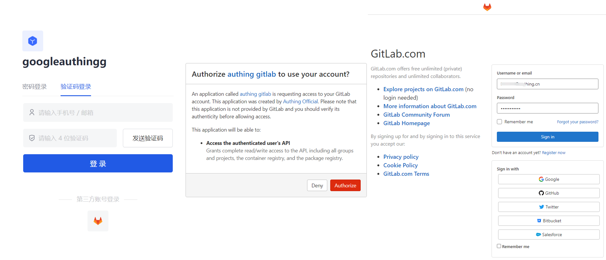

## Preparation

- If you don't have a GitLab account yet, please go to [GitLab.com](https://gitlab.com/users/sign_up/) to register an account.
- If you have not opened a {{$localeConfig.brandName}} console account, please go to the [{{$localeConfig.brandName}} console](https://www.genauth.ai/) to register a developer account.

## Configuration steps

### Step 1: Configure GitLab's unique identifier in the {{$localeConfig.brandName}} console

1. In the {{$localeConfig.brandName}} console, in **Identity Source Management->Social Identity Source**, click the **Create Social Identity Source** button to enter the **Select Social Identity Source** page.

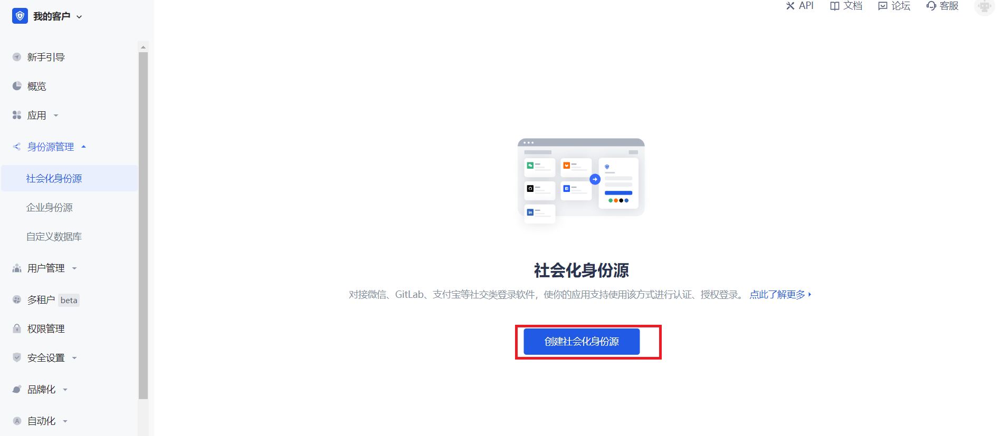

2. Click the "GitLab" card.

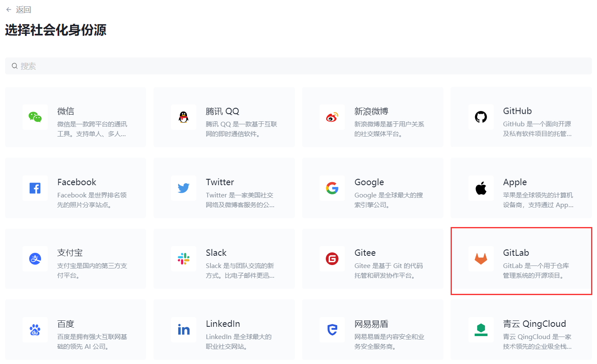

3. Set the unique identifier on the **GitLab** configuration page.

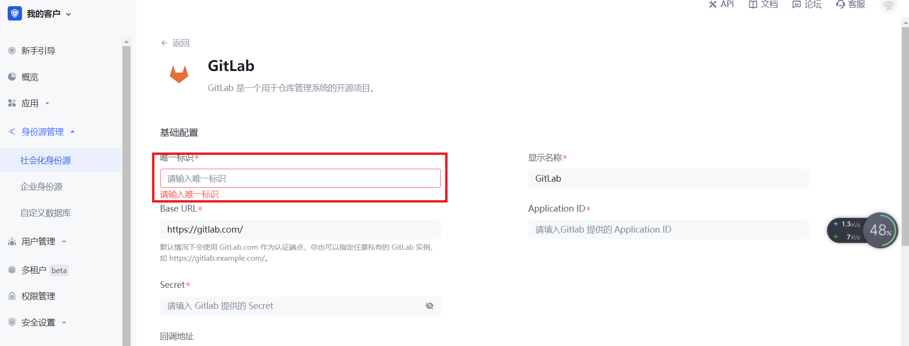

4. Record the **callback address** that is automatically generated based on the unique identifier. You will need it later. Leave this page aside for now and configure other information later.

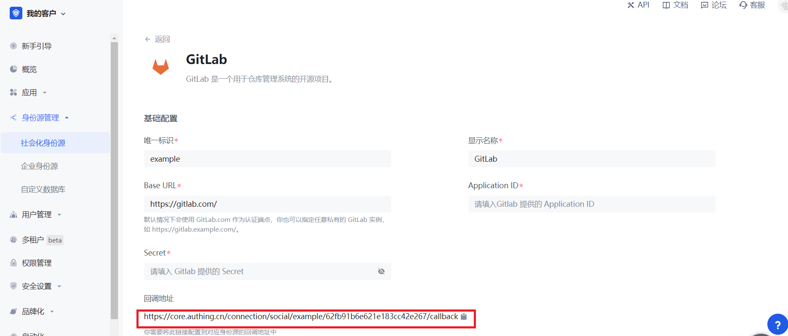

### Step 2: Create an application on GitLab (or your GitLab instance)

1. Click your profile picture in the upper right corner and click **Edit Profile**.

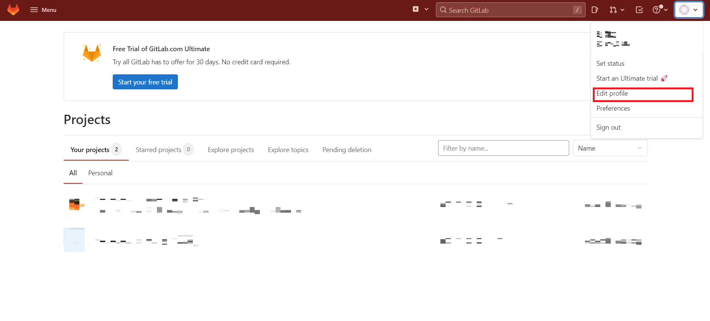

2. Click **Applications** in the left navigation bar.

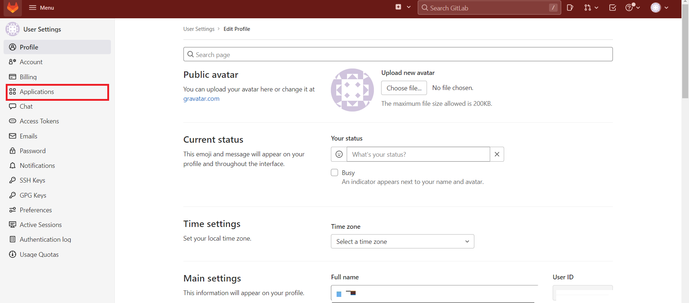

3. Configure the application name.

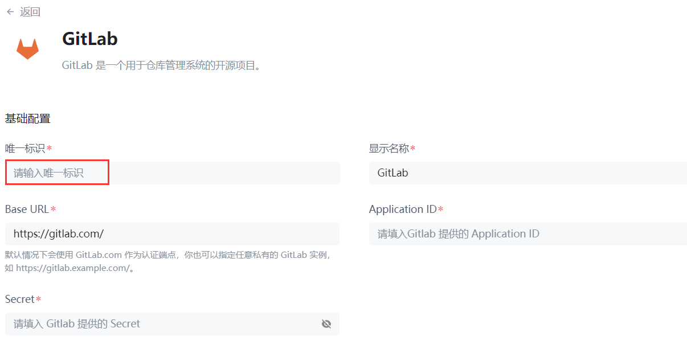

4. Configure **Redirect URI** and fill in the callback address you just recorded.

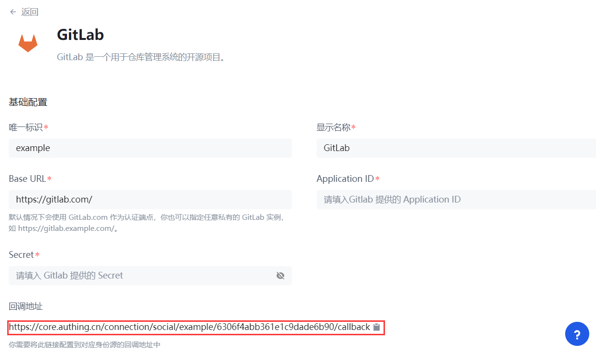

5. Add **Scopes**: Check `api` and `read_user`.

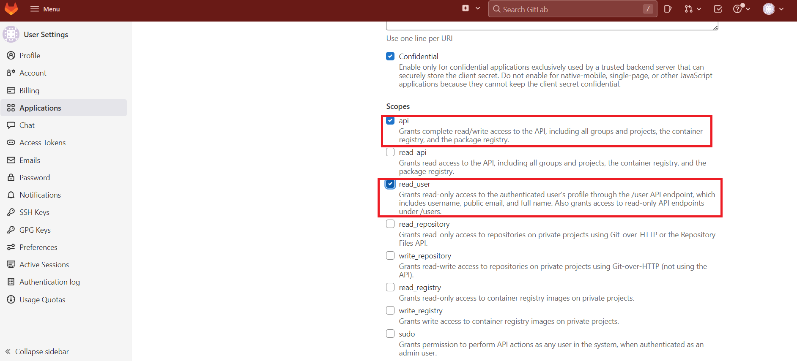

6. Click **Save Application**.

7. After the creation is complete, record the **Application ID** and **Secret**, which will be used in the next step.

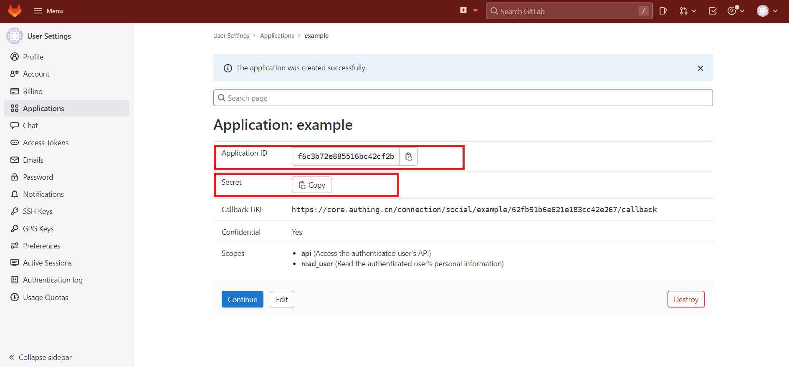

### Step 3: Complete the configuration of Gitlab other information in the console

1. Fill in the **Application ID** and **Secret** just recorded.

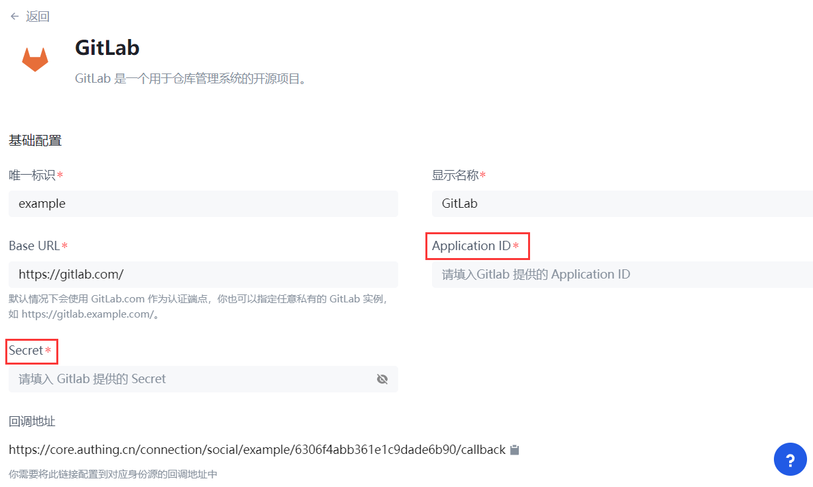

2. Choose to modify other information. If you do not modify, use the default option (this step is optional).

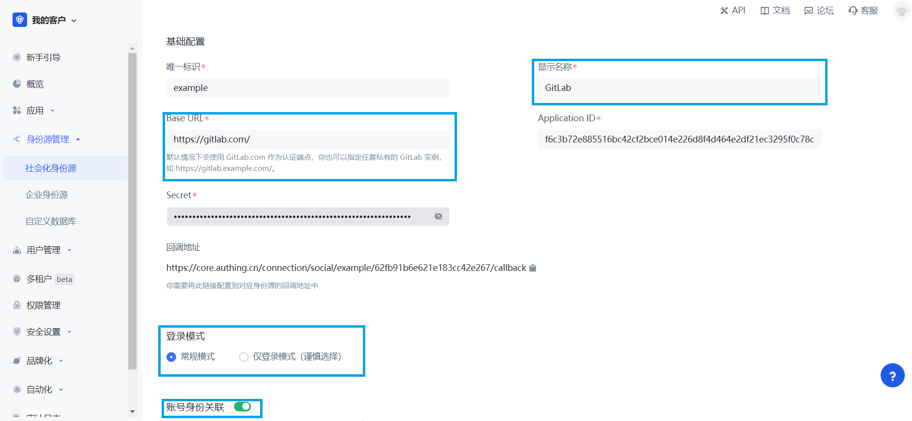

| Field                        | Description                                                                                                                                                                                                                                                                             |
| ---------------------------- | --------------------------------------------------------------------------------------------------------------------------------------------------------------------------------------------------------------------------------------------------------------------------------------- |
| Unique ID                    | _ The unique ID consists of lowercase letters, numbers, and `-`, and is less than 32 characters long.  _ This is the unique ID for this connection and cannot be modified after setting.                                                                                           |
| Display Name                 | This name will be displayed on the button of the end user's login interface.                                                                                                                                                                                                            |
| Base URL                     | By default, GitLab.com is used as the authentication endpoint. You can also specify any private GitLab instance, such as `https://gitlab.example.com/`.                                                                                                                                 |
| Application ID               | The GitLab application ID obtained in the previous step.                                                                                                                                                                                                                                |
| Secret                       | The GitLab application key obtained in the previous step.                                                                                                                                                                                                                               |
| Login Mode                   | After turning on **Login-only mode**, you can only log in to existing accounts, and cannot create new accounts. Please choose carefully.                                                                                                                                                |
| Account Identity Association | When **Account Identity Association** is not enabled, a new user is created by default when a user logs in through an identity source; when **Account Identity Association** is enabled, users can log in directly to an existing account through **Field Match** or **Query Binding**. |

3. After the configuration is complete, click **Create** or **Save** to complete the creation.

### Step 4: Development Access

#### Recommended Development Access Method

Use a hosted login page.

#### Advantages and Disadvantages

Operation and maintenance are simple, and {{$localeConfig.brandName}} is responsible for operation and maintenance. Each user pool has an independent second-level domain name. If you need to embed it into your application, you need to log in using the pop-up mode, that is: after clicking the **Login** button, a window will pop up with the login page hosted by {{$localeConfig.brandName}}, or redirect the browser to the login page hosted by {{$localeConfig.brandName}}.

#### Detailed access method

1. Create an application in the {{$localeConfig.brandName}} console. For details, see: [How to create an application in {{$localeConfig.brandName}}](/guides/app-new/create-app/create-app.md).

2. On the created "GitLab" identity source connection details page, open and associate an application created in the {{$localeConfig.brandName}} console.

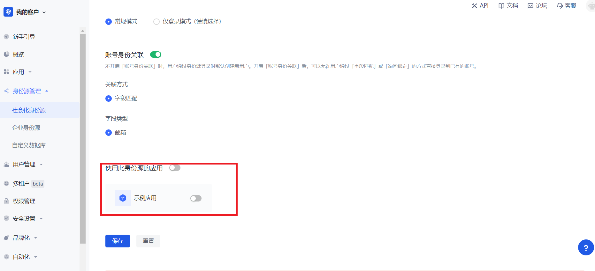

3. Click the {{$localeConfig.brandName}} console application **Experience login** button to experience GitLab login in the pop-up login window.

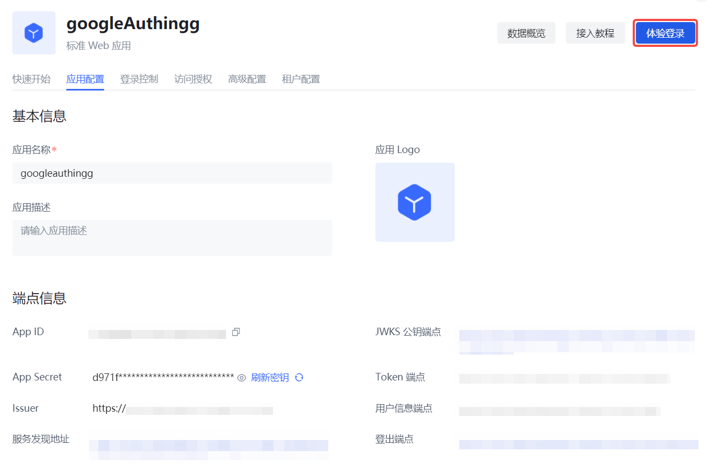
