# Google Mobile

<LastUpdated />

## Scenario Introduction

### Overview

GenAuth provides developers with a way to quickly jump to Google login to obtain user information in mobile (iOS or Android) applications. Google account access can be completed by simply calling the GenAuth mobile SDK.

### Application Scenario

Mobile APP

### End User Preview

Pull up the Google page in the mobile application to log in.

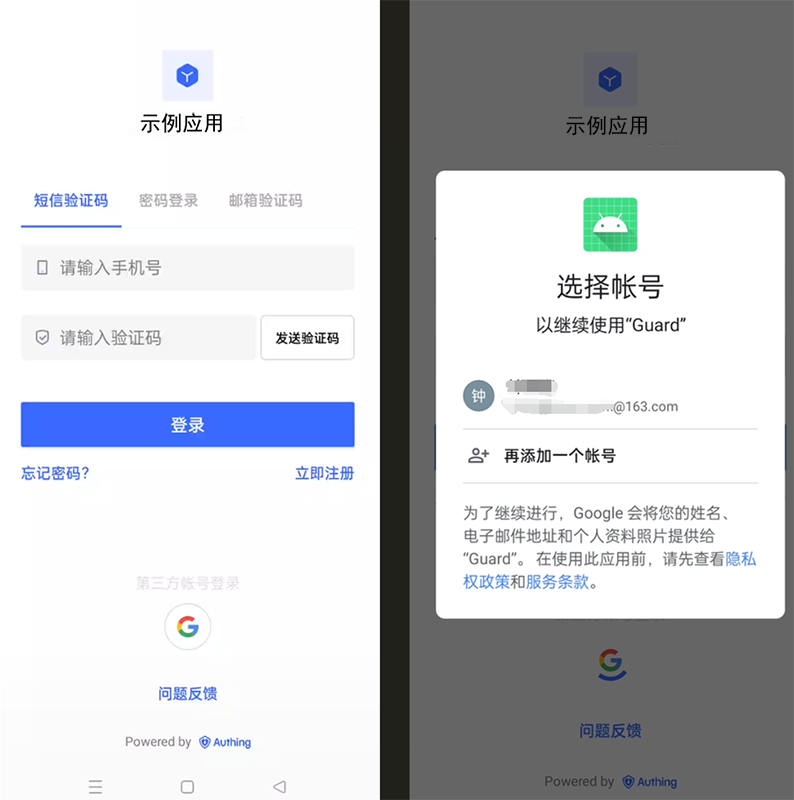

## Preparation

- If you don't have a Google account, please go to [Google](https://accounts.google.com/signin/identifier?hl=zh-TW&continue=https%3A%2F%2Fwww.google.com%2F&ec=GAlAmgQ&flowName=GlifWebSignIn&flowEntry=AddSession) to register.

- If you don't have a GenAuth console account, please go to [{{$localeConfig.brandName}} Console](https://www.genauth.ai/) to register a developer account.

## Configuration steps

### Step 1: Create three OAuth client IDs in Google Open Platform

#### Web application

1. Open the [Google API Console Credentials](https://console.cloud.google.com/apis/credentials) console.

2. On the **Credentials** page, select **CREATE CREDENTIALS->OAuth client ID** at the top.

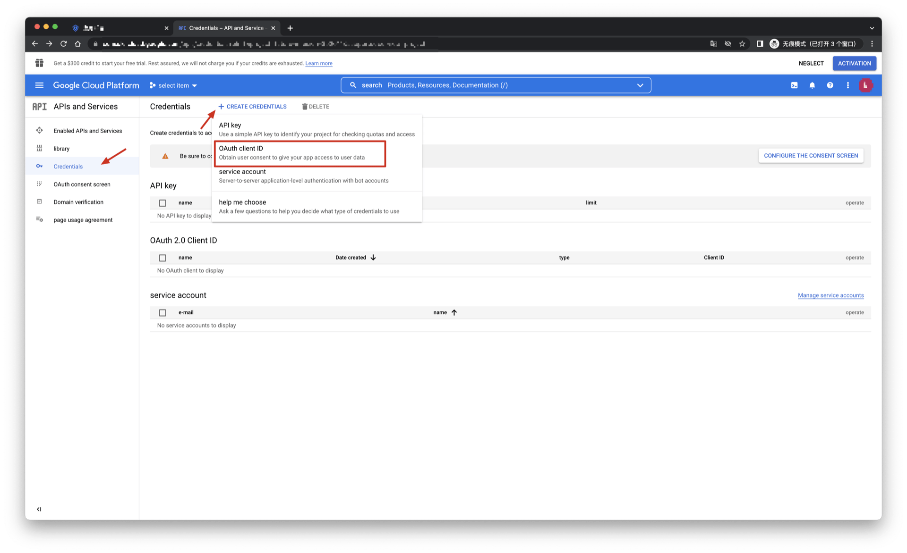

3. Select **Application type** as **Web application**, fill in **Name** and **Authorized redirect URIs** (temporarily write a valid address), and click the **CREATE** button.

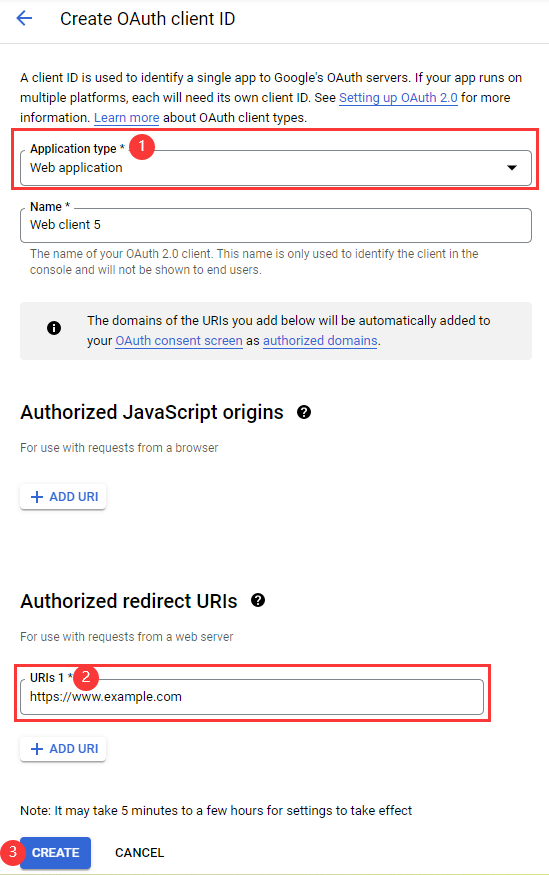

4. After the creation is successful, you can get **Your Client ID** and **Your Client Secret** of this application on the next page, record them.

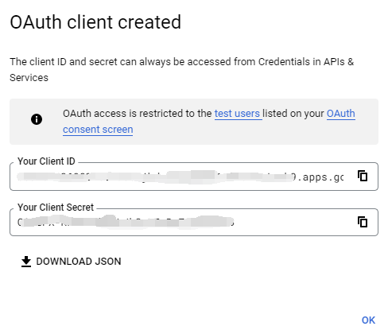

#### Android

1. Open the [Google API Console Credentials](https://console.cloud.google.com/apis/credentials) console.

2. On the **Credentials** page, select **CREATE CREDENTIALS->OAuth client ID** at the top.

3. Select **Application type** as **Android**, fill in **Name**, **Package name** and **SHA-1 certificate fingerprint**, and click the **CREATE** button.

::: hint-info

- You need to log in to your mobile app backend to obtain **Package name** (Android app package name) and **SHA-1 certificate fingerprint** (Android app's SHA-1).
- It takes some time for the settings to take effect after being saved, please wait patiently.
  :::

4. Download and save the JSON file on the viewing page and hand it over to the Android development engineer (for subsequent detailed operations, please refer to Google Mobile Developer Documentation - Android).

#### iOS

1. Open the [Google API Console Credentials](https://console.cloud.google.com/apis/credentials) console.

2. On the **Credentials** page, select **CREATE CREDENTIALS->OAuth client ID** at the top.

3. Select **Application type** as **iOS**, fill in **Bundle ID**, **App Store ID** and **Team ID**, and click **CREATE** button.

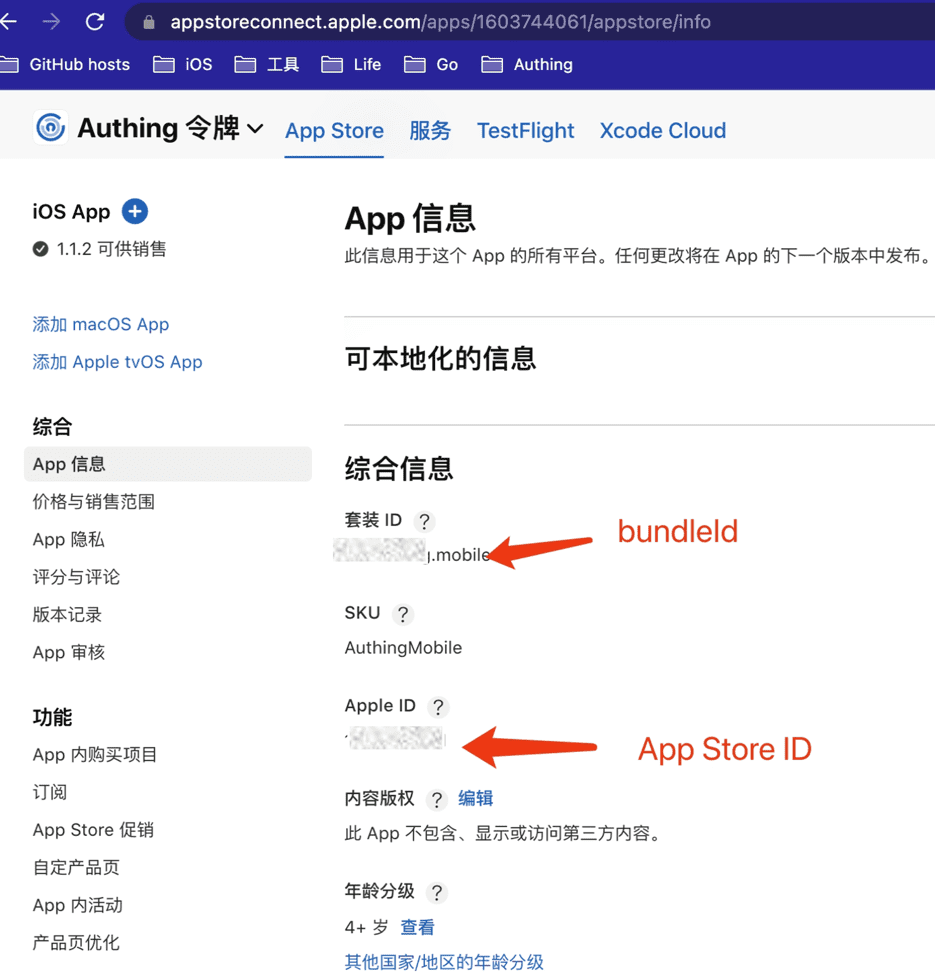

::: img-description
Bundle ID and App Store ID
:::

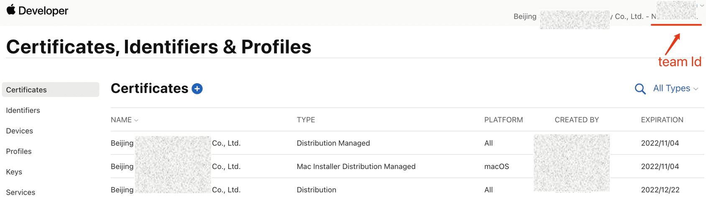

::: img-description
Team ID
:::

::: hint-info

- You can get **Bundle ID** and **App Store ID** at [Apple Store Connect](https://appstoreconnect.apple.com/apps).
- You can get the **Team ID** in the [Apple Developer Backend](https://developer.apple.com/account/resources/certificates/list).
- It will take some time for the settings to take effect after being saved, please wait patiently.
  :::

4. Download and save the corresponding PLIST file and hand it over to the iOS development engineer (for subsequent detailed operations, please refer to the Google Mobile Developer Documentation - iOS).

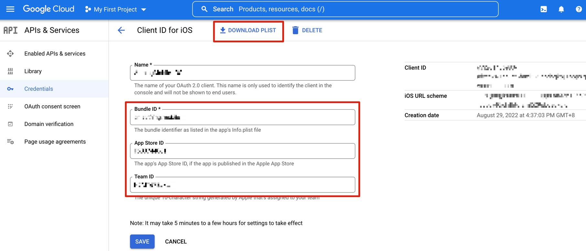

### Step 2: Configure Google Mobile Login in the GenAuth Console

1. On the **Social Identity Source** page of the Atuhing console, click the **Create Social Identity Source** button to enter the **Select Social Identity Source** page.

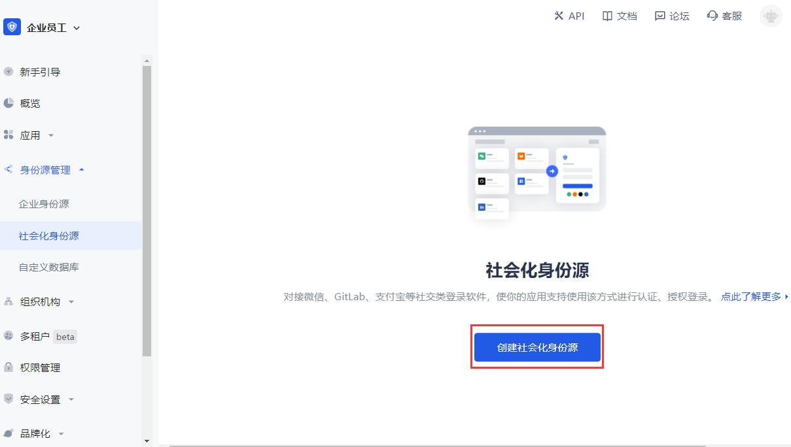

2. On the **Identity Source Management->Social Identity Source->Select Social Identity** page of the GenAuth console, click the "Google" identity source card to enter the Google login mode selection page.

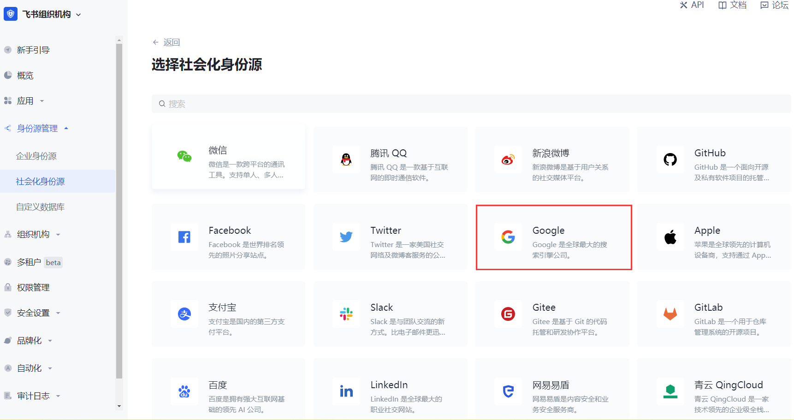

3. Select **Google Mobile** to enter.

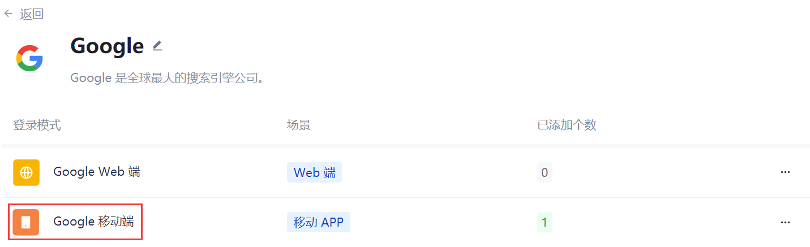

4. On the **Google Mobile** page of the GenAuth console, configure the relevant field information.

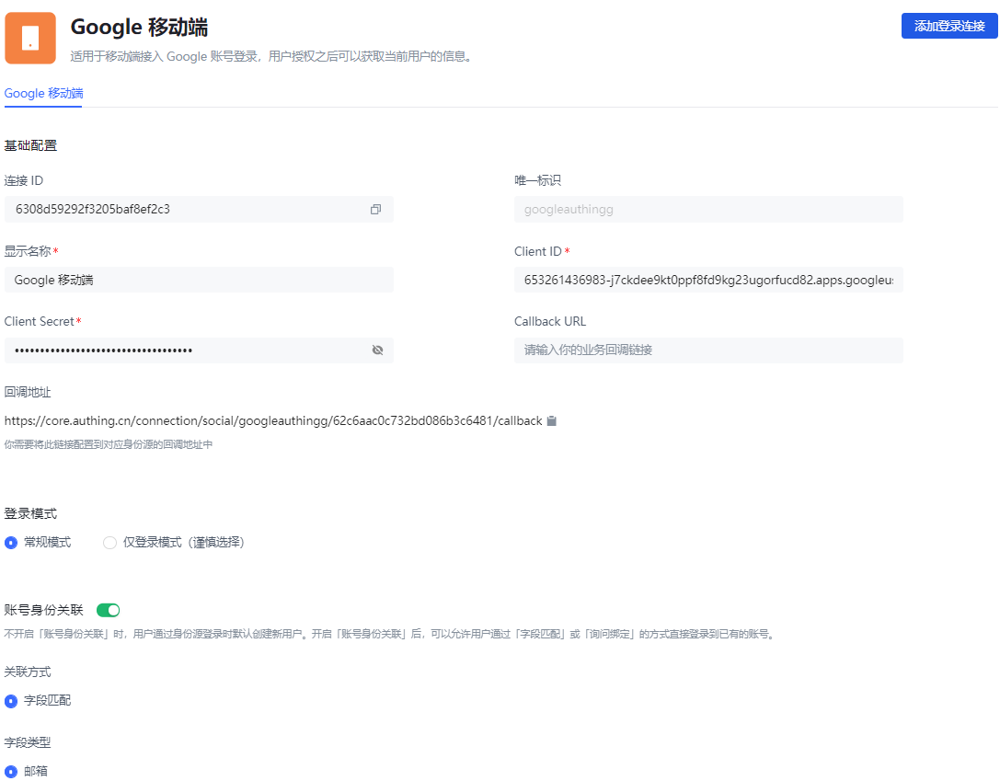

<table>
<tr>
<th>Field</th>
<th>Description</th>
</tr>

<tr>
<td>Unique ID</td>
<td>
<ul>
<li>The unique ID consists of lowercase letters, numbers, and -, and is less than 32 bits long. </li>
<li>This is the unique ID of this connection and cannot be modified after setting. </li>
</ul></td>
</tr>

<tr>
<td>Display Name</td>
<td>This name will be displayed on the button of the terminal user's login interface. </td>
</tr>

<tr>
<td>Client ID</td>
<td>Fill in <b>Your Client ID</b> obtained when <b>Application type</b> is <b>Web application</b> on the Google Open Platform. </td>
</tr>

<tr>
<td>Client Secret</td>
<td>Fill in the <b>Client Secret</b> obtained when <b>Application type</b> is <b>Web application</b> on the Google Open Platform. </td>
</tr>

<tr>
<td>Callback URL</td>
<td>You can fill in your business callback address. After the user completes the login, the browser will jump to this address. </td>
</tr>

<tr>
<td>Callback address</td>
<td>Google valid jump URI. This URL needs to be configured on the Google Open Platform. </td>
</tr>

<tr>
<td>Login mode</td>
<td>After turning on <b>Login only mode</b>, you can only log in to existing accounts, and cannot create new accounts. Please choose carefully. </td>
</tr>

<tr>
<td>Account Identity Association</td>
<td>When <b>Account Identity Association</b> is not enabled, a new user is created by default when a user logs in through an identity source; when <b>Account Identity Association</b> is enabled, users can be allowed to log in directly to an existing account through <b>Field Matching</b> or <b>Query Binding</b>. </td>
</tr>
</table>

5. After the configuration is complete, click the **Create** or **Save** button to complete the creation.

::: hint-info
After creating the Google identity source on the GenAuth console, you need to configure the callback address to the **Authorized redirect URI** on the Google Open Platform.
:::

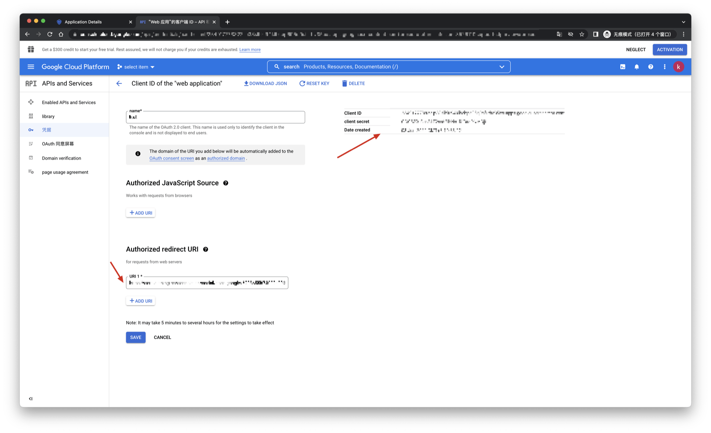

### Step 3: Development access

---

#### Recommended development access method

SDK

#### Advantages and disadvantages

Simple operation and maintenance, which is handled by GenAuth. Each user pool has an independent secondary domain name; if you need to embed it in your application, you need to log in using the pop-up mode, that is: after clicking the login button, a window will pop up with the login page hosted by GenAuth, or redirect the browser to the login page hosted by GenAuth.

#### Detailed access method

1. Create an application in the GenAuth console. For details, see: [How to create an application in GenAuth](/guides/app-new/create-app/create-app.md).

2. On the created Google identity source connection details page, open and associate an application created in the GenAuth console.

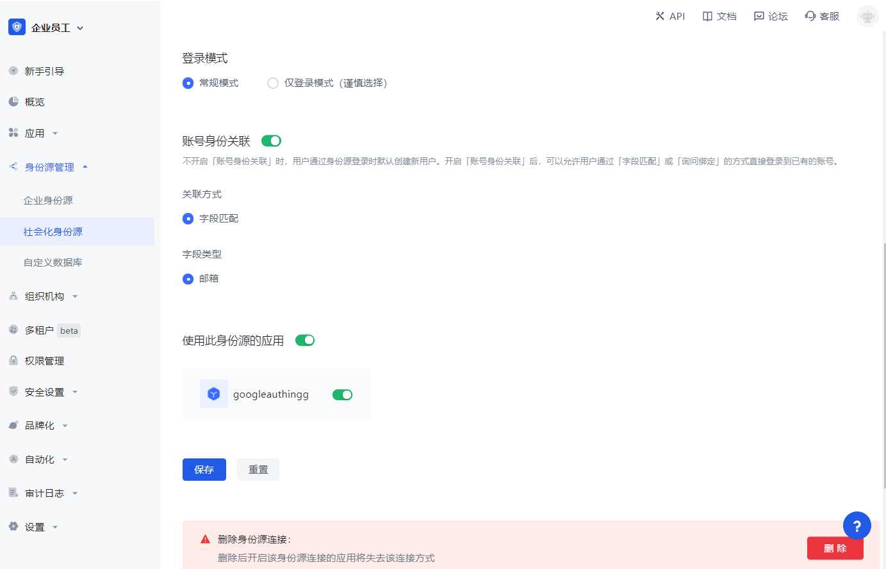

3. Experience Google third-party login on the login page (as shown in the [end-user preview image](#end-user preview image)).
