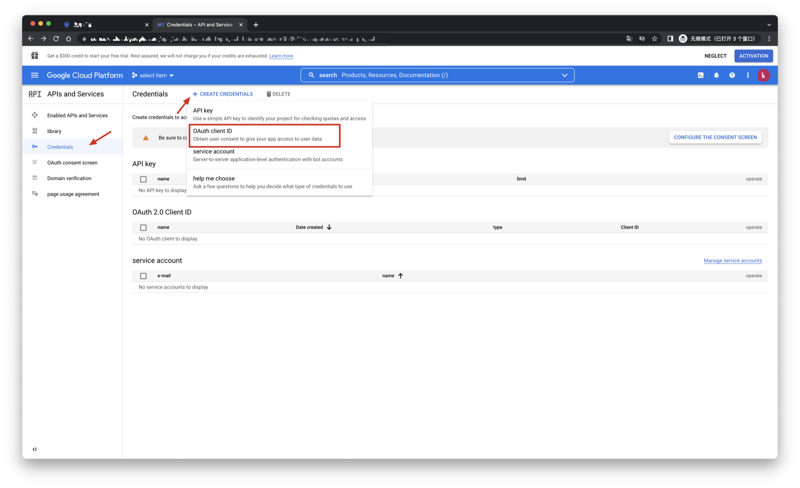

# Google

<LastUpdated/>

## Scenario Introduction

- **Overview**: Google social login allows users to log in to third-party applications or websites securely using Google as the identity source. Configure and enable Google social login in {{$localeConfig.brandName}} to quickly obtain basic open information from Google and help users log in without passwords.
- **Application scenario**: Web end
- **End user preview image**:

## Notes

- If you have not opened a Google account, please go to the [Google Developer Console](https://accounts.google.com/signin/identifier?hl=zh-TW&continue=https%3A%2F%2Fwww.google.com%2F&ec=GAlAmgQ&flowName=GlifWebSignIn&flowEntry=AddSession) to register an email address.
- If you have not opened a {{$localeConfig.brandName}} console account, please go to the [{{$localeConfig.brandName}} console](https://www.genauth.ai/) to register a developer account.

## Step 1: Create an OAuth application in the Google Developer Console

- Open the [Google API Console Credentials](https://console.cloud.google.com/apis/credentials) console.

- On the Credentials page, click Create credentials, and then select OAuth client ID.

- Select the application type as Web Application, and fill in Authorized redirect URIs.

- Click the [Create] button;

- After the creation is successful, you can get the Client ID and Client Secret of this application on the next page, which you need to record.

## Step 2: Configure Google in the {{$localeConfig.brandName}} console

2.1 On the {{$localeConfig.brandName}} console's "Social Identity Source" page, click the "Create Social Identity Source" button to go to the "Select Social Identity Source" page.

2.2 On the {{$localeConfig.brandName}} console's "Social Identity Source" - "Select Social Identity Source" page, click the "Google" identity source button to go to the "Google Sign-in Mode" page.

2.3 On the {{$localeConfig.brandName}} console's "Social Identity Source" - "Google" page, configure the relevant field information.

| Field/Function                   | Description                                                                                                                                                                                                                                                                                       |
| -------------------------------- | ------------------------------------------------------------------------------------------------------------------------------------------------------------------------------------------------------------------------------------------------------------------------------------------------- |
| Unique ID                        | a. The unique ID consists of lowercase letters, numbers, and -, and is less than 32 bits long. b. This is the unique ID of this connection and cannot be modified after setting.                                                                                                                  |
| Display Name                     | This name will be displayed on the button of the end user's login interface.                                                                                                                                                                                                                      |
| Client ID                        | Google ID, which needs to be obtained on the Google Open Platform.                                                                                                                                                                                                                                |
| Client secrets                   | Google key, which needs to be obtained on the Google Open Platform.                                                                                                                                                                                                                               |
| Domain Verification File Name    | Google domain verification HTML file name, such as xxxx.html                                                                                                                                                                                                                                      |
| Domain Verification File Content | Google domain verification HTML file content                                                                                                                                                                                                                                                      |
| Callback URL                     | You can fill in your business callback address. After the user completes the login, the browser will jump to this address.                                                                                                                                                                        |
| Scopes                           | By default, {{$localeConfig.brandName}} will only request authorization for basic user information (such as avatar, nickname, etc.) from users. If you need more advanced permissions, you can check the corresponding options.                                                                   |
| Callback address                 | Google valid redirect URI. This URL needs to be configured on the Google Open Platform.                                                                                                                                                                                                           |
| Login mode                       | After turning on "Login-only mode", you can only log in to existing accounts, and cannot create new accounts. Please choose carefully.                                                                                                                                                            |
| Account identity association     | When "Account identity association" is not turned on, a new user is created by default when a user logs in through an identity source. After turning on "Account identity association", users can be allowed to log in directly to an existing account through "Field matching" or "Ask Binding". |

After the configuration is completed, click the "Create" or "Save" button to complete the creation.

After creating the Google identity source on the {{$localeConfig.brandName}} console, you need to configure the callback address to the Authorized redirect URI on the Google Open Platform.

## Step 3: Development access

- **Recommended development access method**: Use a hosted login page

- **Pros and cons description**: Simple operation and maintenance, {{$localeConfig.brandName}} is responsible for operation and maintenance. Each user pool has an independent secondary domain name; if you need to embed it in your application, you need to log in using the pop-up mode, that is: after clicking the login button, a window will pop up with the content of the {{$localeConfig.brandName}} hosted login page, or redirect the browser to the {{$localeConfig.brandName}} hosted login page.

- **Detailed access method**:

  3.1 Create an application in the {{$localeConfig.brandName}} console. For details, see: [How to create an application in {{$localeConfig.brandName}}](/guides/app-new/create-app/create-app.md)

  3.2 On the created Google identity source connection details page, open and associate an application created in the {{$localeConfig.brandName}} console

3.3 Experience Google third-party login on the login page

