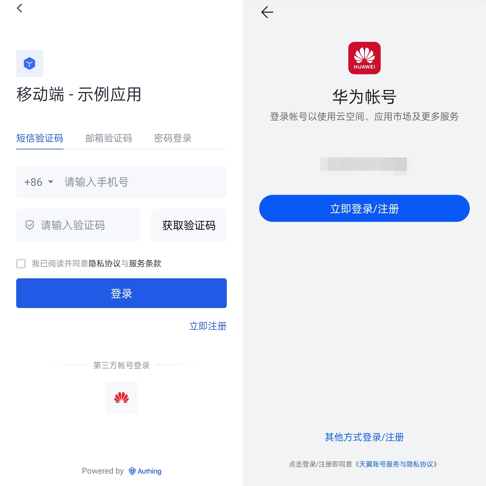
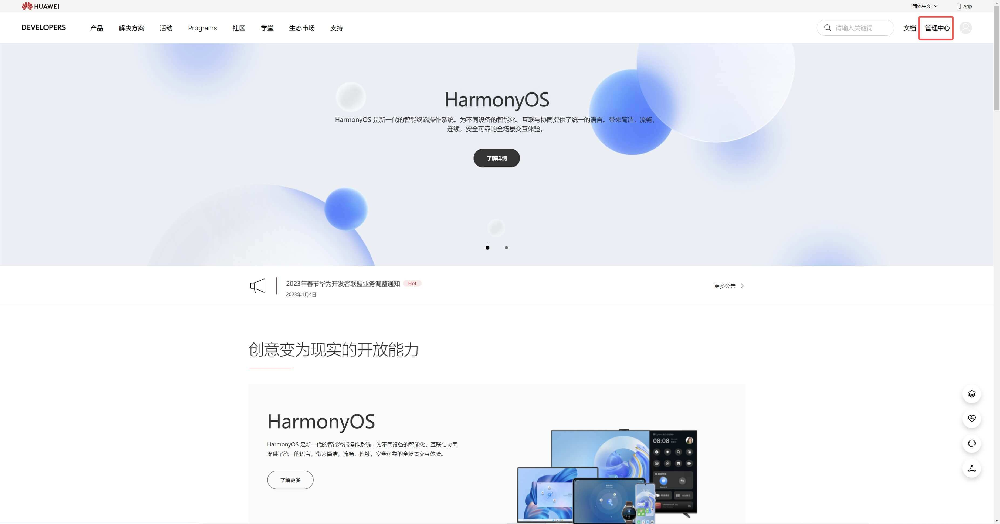
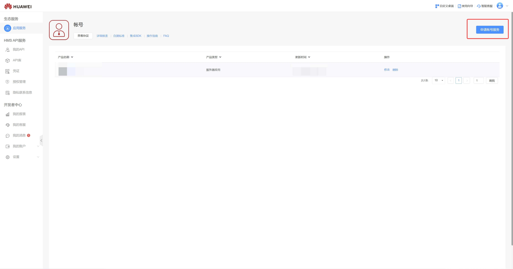
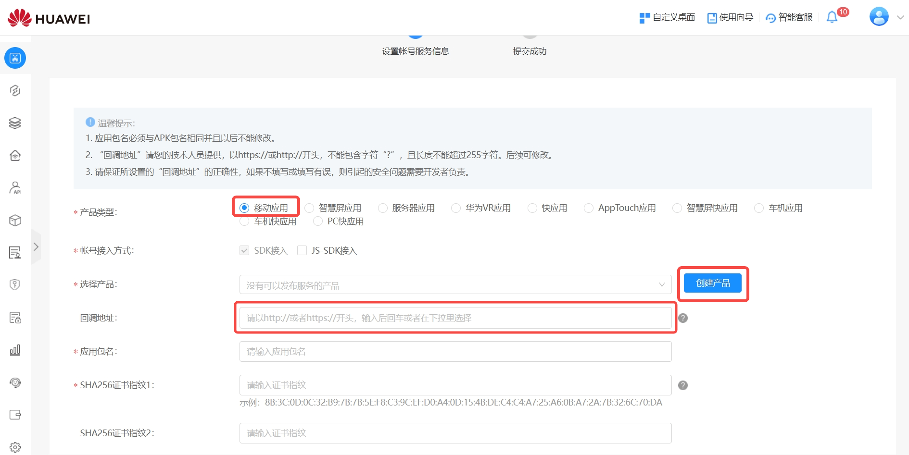
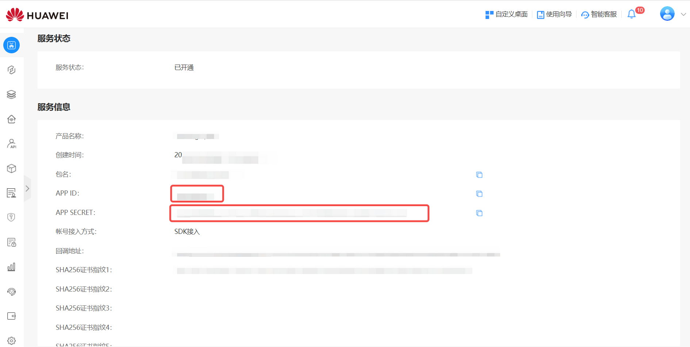
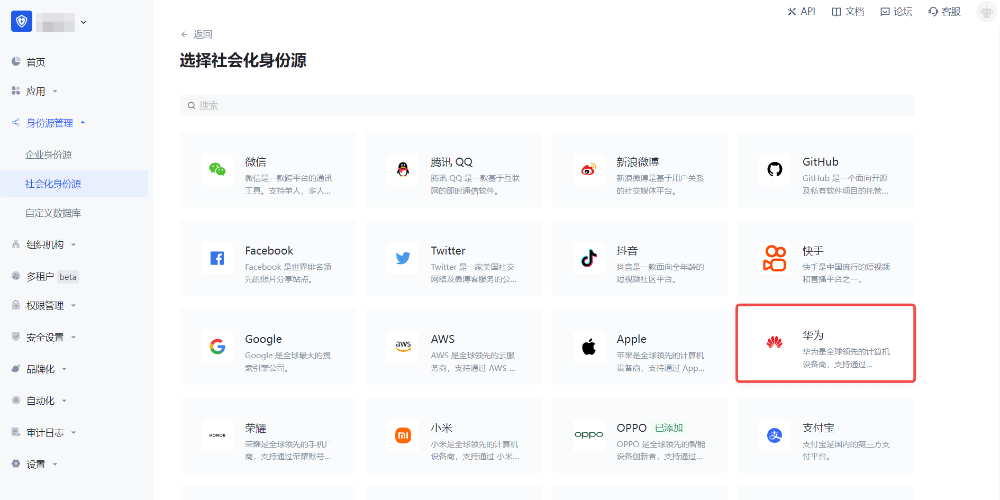
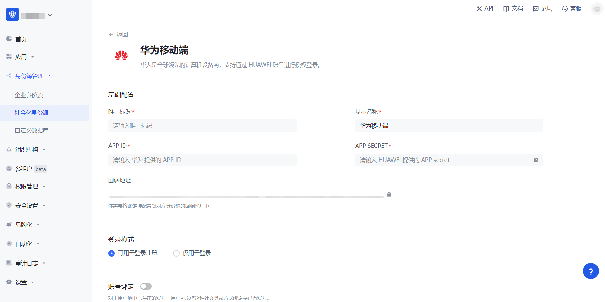
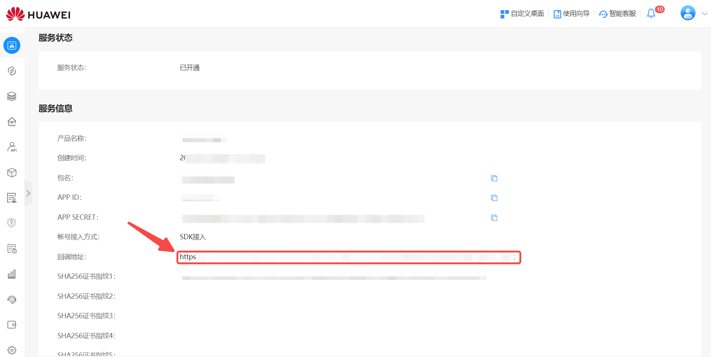
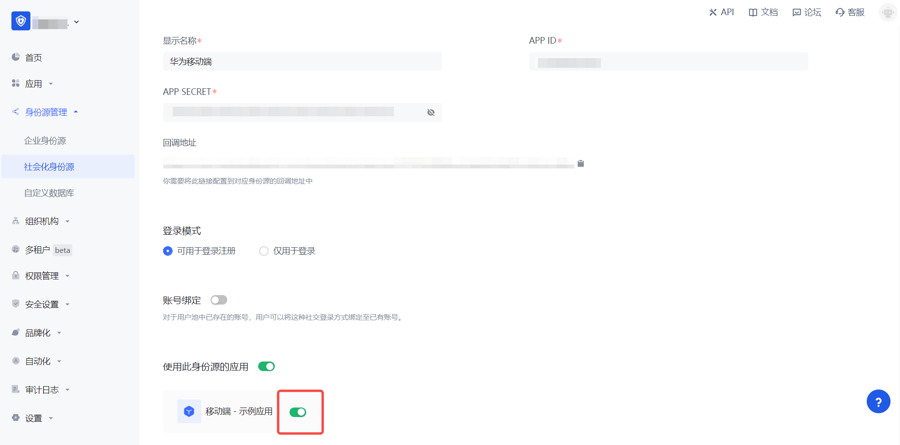

# Huawei Mobile

<LastUpdated />

## Scenario Introduction

### Overview

Huawei social login allows users to log in to third-party applications or websites securely using Huawei as the identity source. Configure and enable Huawei's social login in {{$localeConfig.brandName}} to quickly obtain Huawei's basic open information and help users log in without passwords.

### Application scenarios

Mobile

### Terminal user preview

## Notes

- If you do not have a Huawei account, please go to the [Huawei Developer Alliance website](https://developer.huawei.com/consumer/cn) to register as a developer and complete real-name authentication. For specific methods, please refer to [Huawei Account Registration and Authentication](https://developer.huawei.com/consumer/cn/doc/start/registration-and-verification-0000001053628148).
- If you have not opened a {{$localeConfig.brandName}} console account, please go to [{{$localeConfig.brandName}} console](https://www.genauth.ai/) to register a developer account

## Step 1: Create a server application on Huawei

Log in to [Huawei Developer Alliance official website](https://developer.huawei.com/consumer/cn/), click **Management Center**:

On the **Management Center** page, click **Account**:

On the **Account** page, click **Apply for Account Service**:

Select **Product Type**, select **Create Product**, and configure **Application callback address**

- Application callback address: Fill in `https://core.genauth.ai/connection/social/{Unique ID}/{User Pool ID}/callback`. You need to replace `{Unique ID}` with the `Unique ID` filled in the identity source you are creating in {{$localeConfig.brandName}}, and replace `{User Pool ID}` with your [User Pool ID](/guides/faqs/get-userpool-id-and-secret.md)

Finally, click "**Submit**". After the creation is completed, you need to record the `APP ID` and `APP SECRET`, which will be used in the next step.

## Step 2: Configure Huawei Mobile App Configuration in the {{$localeConfig.brandName}} console

2.1 On the "Social Identity Source" page of the {{$localeConfig.brandName}} console, click the "Create Social Identity Source" button to enter the "Select Social Identity Source" page.

2.2 On the "Select Social Identity Source" page, click the "Huawei" identity source button to enter the "Huawei Mobile Login Mode" page.

2.3 On the "Huawei Mobile" configuration page, fill in the relevant field information.

| Field                        | Description                                                                                                                                                                                                                                                                      |
| ---------------------------- | -------------------------------------------------------------------------------------------------------------------------------------------------------------------------------------------------------------------------------------------------------------------------------- |
| Unique ID                    | a. The unique ID consists of lowercase letters, numbers, and -, and its length is less than 32 bits.  b. This is the unique ID of this connection and cannot be modified after setting.                                                                                     |
| Display Name                 | This name will be displayed on the button of the terminal user's login interface.                                                                                                                                                                                                |
| APP ID                       | The Huawei application ID obtained in the previous step.                                                                                                                                                                                                                         |
| APP Secret                   | The Huawei application Secret obtained in the previous step.                                                                                                                                                                                                                     |
| Login Mode                   | After turning on "Login Only Mode", you can only log in to existing accounts and cannot create new accounts. Please choose carefully.                                                                                                                                            |
| Account Identity Association | When "Account Identity Association" is not turned on, a new user is created by default when a user logs in through an identity source. After turning on "Account Identity Association", users can be allowed to log in directly to an existing account through "Field Matching". |

2.4 After the configuration is completed, click "Create" or "Save" to complete the creation.

After creating the Xiaomi mobile identity source on the {{$localeConfig.brandName}} console, you need to configure the callback address to the authorized callback address in the mobile application information on the Xiaomi Open Platform.

## Step 3: Development Access

- **Recommended development access method**: SDK
- **Pros and cons description**: Simple operation and maintenance, {{$localeConfig.brandName}} is responsible for operation and maintenance. Each user pool has an independent secondary domain name; if you need to embed it in your application, you need to log in using the pop-up mode, that is: after clicking the login button, a window will pop up with the content of the login page hosted by {{$localeConfig.brandName}}, or redirect the browser to the login page hosted by {{$localeConfig.brandName}}.
- **Detailed access method**:

  3.1 Create an application in the {{$localeConfig.brandName}} console. For details, see: [How to create an application in {{$localeConfig.brandName}}](/guides/app-new/create-app/create-app.md)

  3.2 On the created "Huawei Mobile" identity source connection details page, open and associate an application created in the {{$localeConfig.brandName}} console

3.3 Experience Huawei third-party login on the login page (as shown in the [end user preview image](#end user preview image)).
