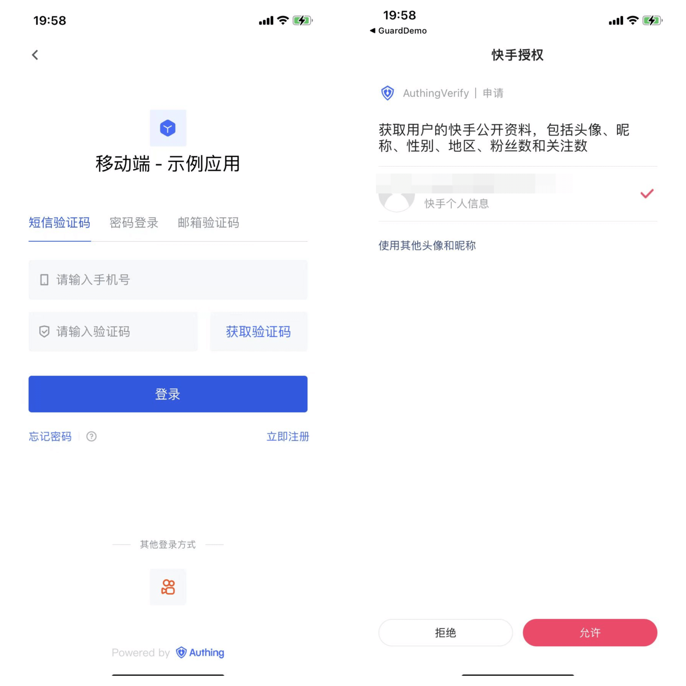
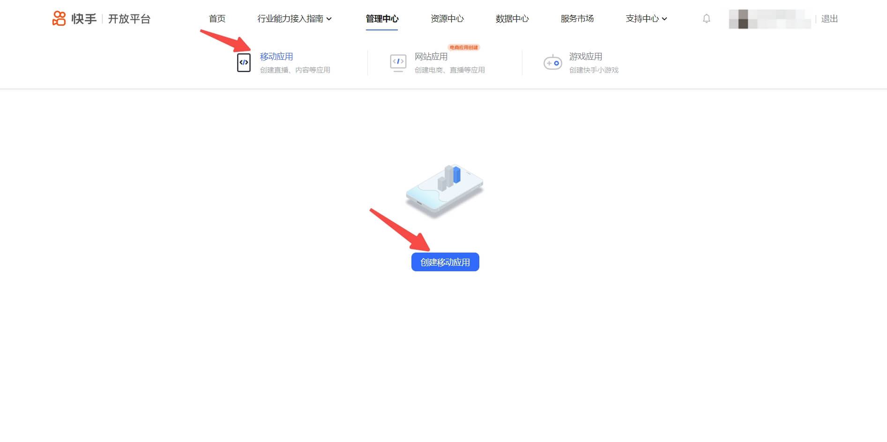
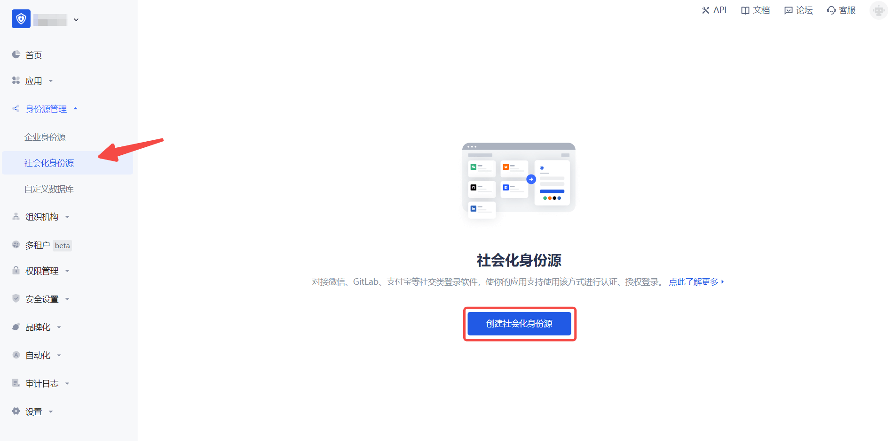
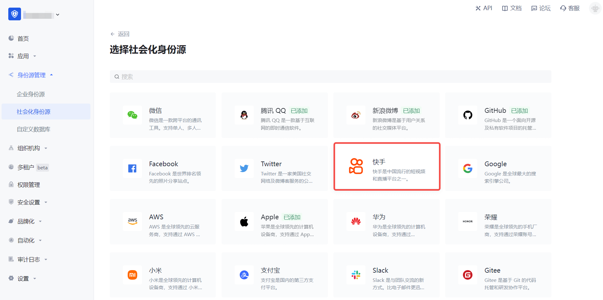
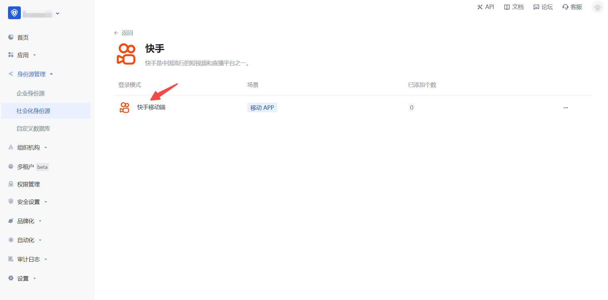
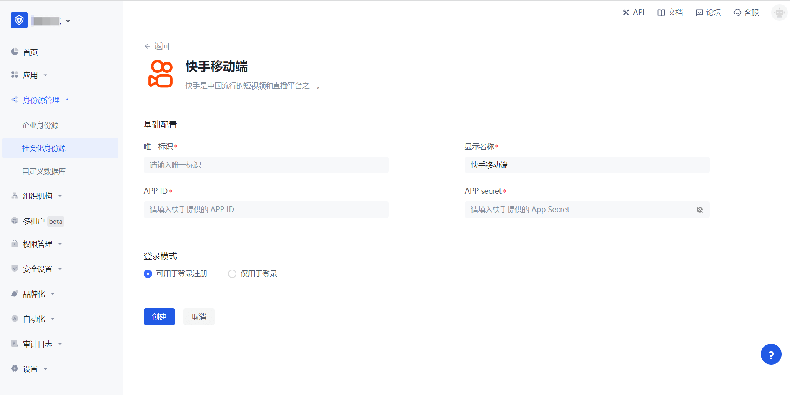
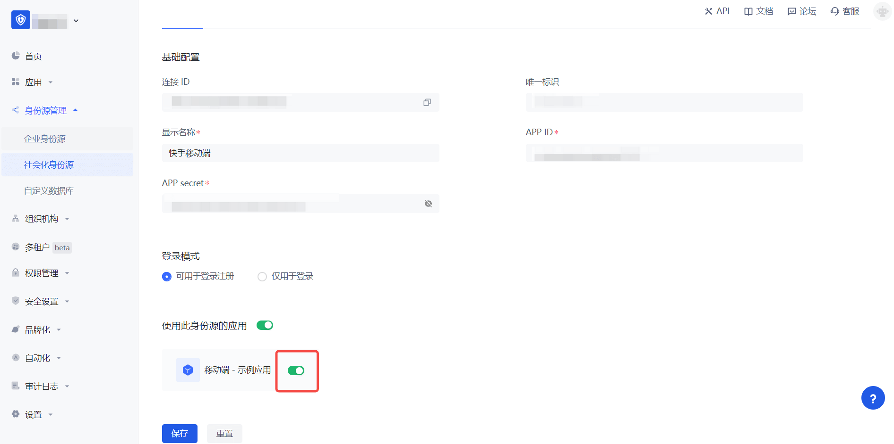

# Kuaishou Mobile

<LastUpdated/>

## Scenario Introduction

### Overview

Kuaishou social login is a user's secure login to a third-party application or website using Kuaishou as the identity source. Configure and enable Kuaishou social login in {{$localeConfig.brandName}} to quickly obtain Kuaishou's basic open information and help users log in without passwords through {{$localeConfig.brandName}}.

### Application Scenario

Mobile

### Terminal User Preview

## Notes

- If you have not opened a Kuaishou Open Platform account, please go to [Kuaishou Open Platform](https://open.kuaishou.com/) to register a developer account.
- Complete the authentication on Kuaishou Open Platform and [developer registration](https://open.kuaishou.com/platform/openApi?menu=6).
- Create [Create a mobile app](https://open.kuaishou.com/platform/openApi?menu=7).
- If you have not opened a {{$localeConfig.brandName}} console account, please go to the [{{$localeConfig.brandName}} console](https://www.genauth.ai/) to register a developer account.

## Step 1: Create a mobile app on Kuaishou Open Platform

Go to [Kuaishou Open Platform](https://open.kuaishou.com/platform/controllCenter/mobile) and create a mobile app.

Click "Admin Center" at the top of the page, then click "Mobile Apps" and "Create App" in turn to create a mobile app that uses Kuaishou to log in. If you encounter any problems during the process, please refer to the Kuaishou official "Documentation" at the top of the page.

## Step 2: Configure Kuaishou in the {{$localeConfig.brandName}} console

2.1 Please click the "Create Social Identity Source" button on the "Social Identity Source" page of the {{$localeConfig.brandName}} console to enter the "Select Social Identity Source" page.

2.2 Please click the "Kuaishou" identity source button on the "Social Identity Source"-"Select Social Identity Source" page of the {{$localeConfig.brandName}} console to enter the "Kuaishou Mobile Login Mode" page.

2.3 Please configure the relevant field information on the "Social Identity Source" - "Kuaishou Mobile" page of the {{$localeConfig.brandName}} console.

| Field/Function | Description                                                                                                                                                                            |
| -------------- | -------------------------------------------------------------------------------------------------------------------------------------------------------------------------------------- |
| Unique ID      | a. The unique ID consists of lowercase letters, numbers, and -, and its length is less than 32 bits. b. This is the unique ID of this connection and cannot be modified after setting. |
| Display Name   | This name will be displayed on the button of the terminal user's login interface.                                                                                                      |
| App Key        | The App Key of the Kuaishou mobile application needs to be obtained on the Kuaishou Open Platform.                                                                                     |
| App Secret     | The App Secret of Kuaishou mobile app needs to be obtained on Kuaishou Open Platform.                                                                                                  |
| Login Mode     | After turning on "Login Only Mode", you can only log in to existing accounts, and cannot create new accounts. Please choose carefully.                                                 |

After the configuration is completed, click the "Create" or "Save" button to complete the creation.

## Step 3: Development Access

- **Recommended Development Access Method**: SDK

- **Pros and Cons Description**: Simple operation and maintenance, which is responsible for operation and maintenance by {{$localeConfig.brandName}}. Each user pool has an independent secondary domain name; if you need to embed it into your application, you need to log in using the pop-up mode, that is: after clicking the login button, a window will pop up, and the content is the login page hosted by {{$localeConfig.brandName}}, or redirect the browser to the login page hosted by {{$localeConfig.brandName}}.

- **Detailed access method**:

  3.1 Create an application in the {{$localeConfig.brandName}} console. For details, see: [How to create an application in {{$localeConfig.brandName}}](/guides/app-new/create-app/create-app.md)

  3.2 On the created Kuaishou mobile identity source connection details page, open and associate an application created in the {{$localeConfig.brandName}} console

3.3 Experience Kuaishou third-party login on the login page (as shown in the [end user preview image](#end user preview image)).
