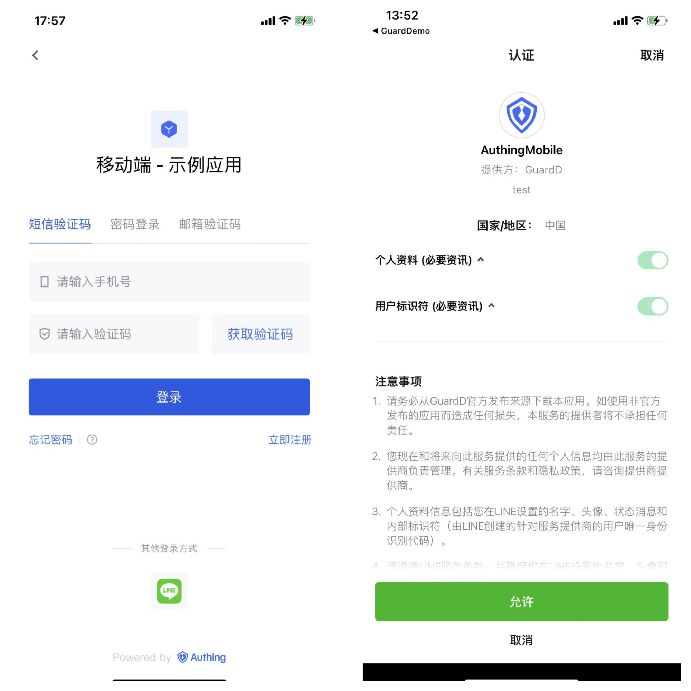
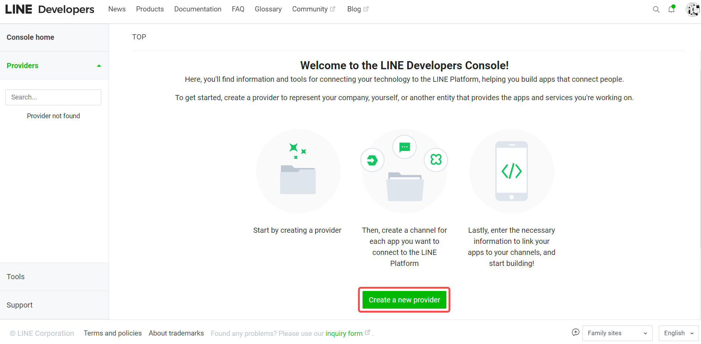
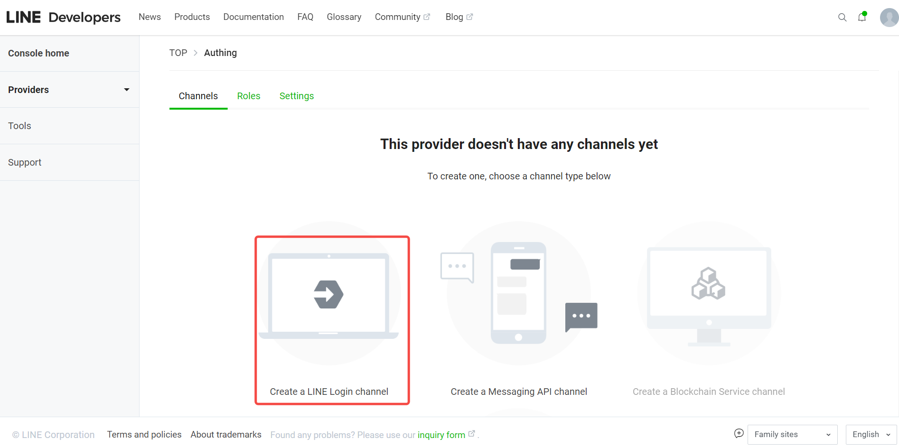
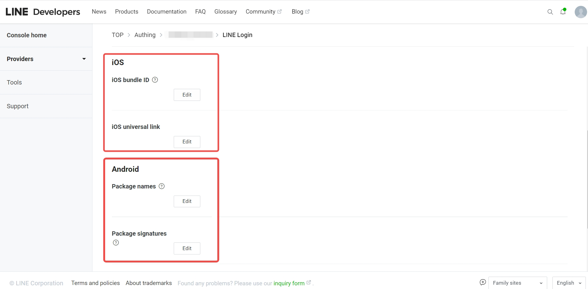
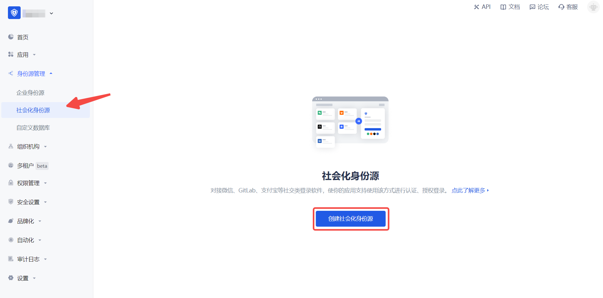
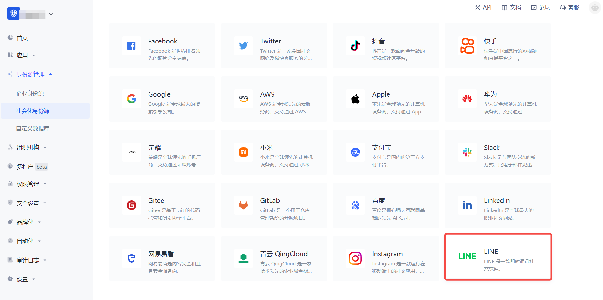
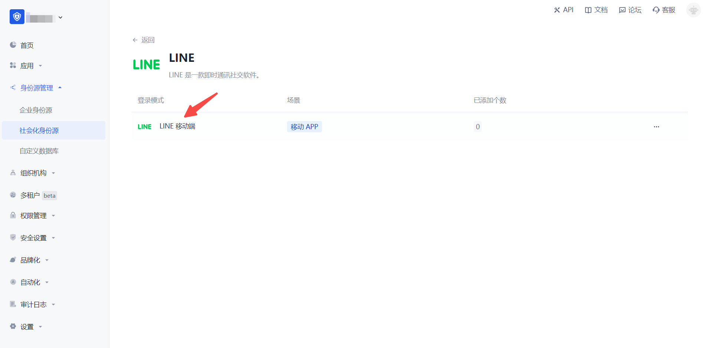
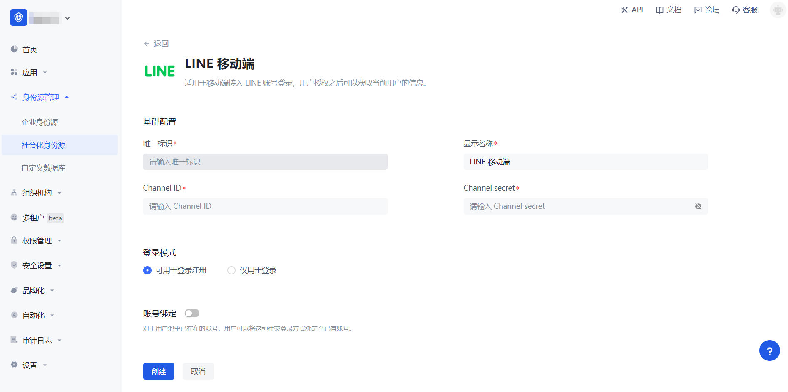
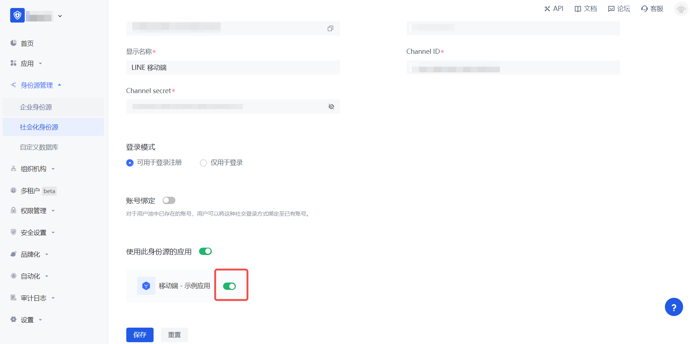

# LINE Mobile

<LastUpdated/>

## Scenario Introduction

### Overview

LINE social login allows users to log in to third-party applications or websites securely using LINE as the identity source. Configure and enable LINE social login in {{$localeConfig.brandName}} to quickly obtain basic LINE information and help users log in without passwords.

### Application Scenario

Mobile

### End User Preview

## Notes

- If you do not have a LINE Developers account, please go to [LINE Developers](https://developers.line.biz/console/profile) to register a developer account.
- If you have not opened a {{$localeConfig.brandName}} console account, please go to the [{{$localeConfig.brandName}} console](https://www.genauth.ai/) to register a developer account.

## Step 1: Create a Mobile LINE Login Channel in LINE Developers

Go to [LINE Developers](https://developers.line.biz/console/) and create a Channel.

1.1 Create a Provider.

1.2 Complete the creation of the LINE Login Channel, fill in the Channel information, **App types** check **Mobile APP**, record `Channel ID` and `Channel secret`.

1.3 Switch to the "LINE Login" TAB item and complete the iOS/Android APP information.

## Step 2: Configure LINE mobile terminal in the {{$localeConfig.brandName}} console

2.1 Please click the "Create social identity source" button on the "Social identity source" page of the {{$localeConfig.brandName}} console to enter the "Select social identity source" page.

2.2 Please click the "LINE" identity source button on the "Social identity source"-"Select social identity source" page of the {{$localeConfig.brandName}} console to enter the "LINE mobile terminal login mode" page.

2.3 Please configure the relevant field information in the "Social Identity Source" - "LINE Mobile" page of the {{$localeConfig.brandName}} console.

| Field/Function               | Description                                                                                                                                                                                                                                                                      |
| ---------------------------- | -------------------------------------------------------------------------------------------------------------------------------------------------------------------------------------------------------------------------------------------------------------------------------- |
| Unique ID                    | a. The unique ID consists of lowercase letters, numbers, and -, and its length is less than 32 bits. b. This is the unique ID of this connection and cannot be modified after setting.                                                                                           |
| Display Name                 | This name will be displayed on the button of the terminal user's login interface.                                                                                                                                                                                                |
| Channel ID                   | Previous step LINE Developers - Channel ID of LINE Login Channel.                                                                                                                                                                                                                |
| Channel secret               | Previous step LINE Developers - Channel secret of LINE Login Channel.                                                                                                                                                                                                            |
| Login mode                   | After turning on "Login only mode", you can only log in to existing accounts, and cannot create new accounts. Please choose carefully.                                                                                                                                           |
| Account identity association | When "Account identity association" is not turned on, a new user is created by default when a user logs in through an identity source. After turning on "Account identity association", users can be allowed to log in directly to an existing account through "field matching". |

After the configuration is completed, click the "Create" or "Save" button to complete the creation.

## Step 3: Development access

- **Recommended development access method**: SDK

- **Pros and cons description**: Simple operation and maintenance, which is responsible for {{$localeConfig.brandName}}. Each user pool has an independent secondary domain name; if you need to embed it in your application, you need to log in using the pop-up mode, that is, after clicking the login button, a window will pop up with the login page hosted by {{$localeConfig.brandName}}, or redirect the browser to the login page hosted by {{$localeConfig.brandName}}.

- **Detailed access method**:

  3.1 Create an application in the {{$localeConfig.brandName}} console. For details, see: [How to create an application in {{$localeConfig.brandName}}](/guides/app-new/create-app/create-app.md)

  3.2 On the created "LINE Mobile" identity source connection details page, open and associate an application created in the {{$localeConfig.brandName}} console

3.3 Experience LINE third-party login on the login page (as shown in the [end user preview](#end user preview)).
