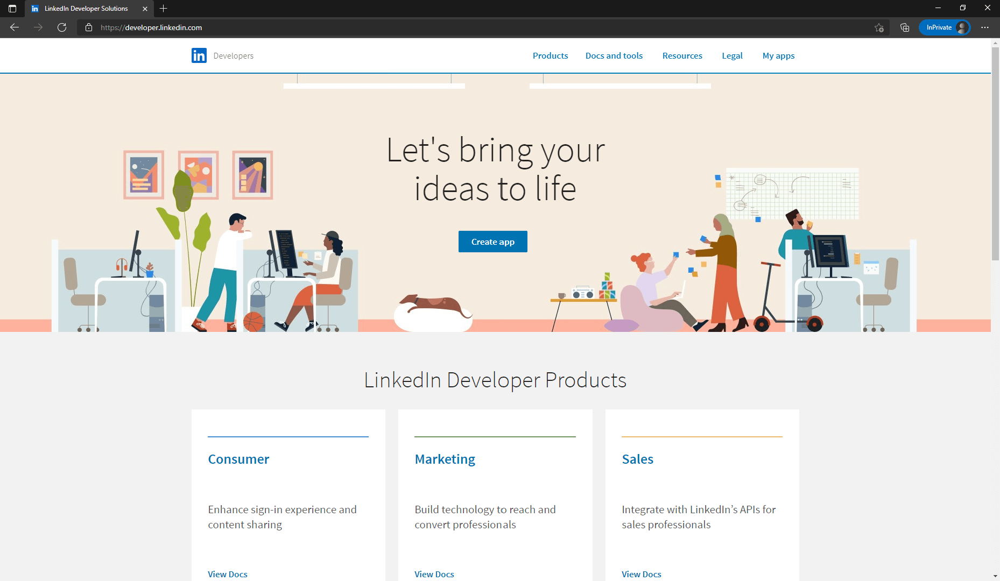
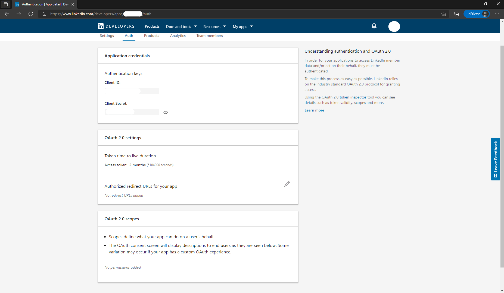

# LinkedIn

<LastUpdated/>

## Scenario Introduction

- **Overview**: LinkedIn social login allows users to log in to third-party applications or websites securely using LinkedIn as the identity source. Configure and enable LinkedIn social login in {{$localeConfig.brandName}} to quickly obtain basic open information on LinkedIn and help users log in without passwords.
- **Application scenario**: PC website
- **End user preview image**:

## Notes

- Please follow the [Microsoft documentation](https://docs.microsoft.com/en-us/linkedin/consumer/integrations/self-serve/sign-in-with-linkedin#getting-started) instructions to create an application.
- If you don't have a {{$localeConfig.brandName}} console account, please go to the [{{$localeConfig.brandName}} console](https://www.genauth.ai/) to register a developer account.

## Step 1: Create an app on LinkedIn

- On [LinkedIn Developers](https://developer.linkedin.com/), click Create app to start creating your app.

- Enter the relevant information of your app and click Create app to complete the creation.

- After the creation is completed, check the application information under the Settings, Auth, Products and other tabs, and set the callback address by editing the Authorized redirect URLs for your app. The callback address is set to: https://core.genauth.ai/connection/social/{ unique identifier }/{YOUR_USERPOOL_ID}/callback.

- As shown in the figure below, under the Products tab on this page, you will see all the products available for this app. Click the Select button to the right of Sign In with LinkedIn to select this feature and follow the subsequent prompts to complete the operation. Usually, LinkedIn will approve your app to use the Sign In with LinkedIn feature after a few minutes.

- Please use the following settings for the callback address: https://core.genauth.ai/connection/social/{ unique identifier }/{YOUR_USERPOOL_ID}/callback

> Replace { unique identifier } with the unique identifier filled in the identity source you are creating in GenAuth, and replace {YOUR_USERPOOL_ID} with your user pool ID

## Step 2: Configure LinkedIn in the {{$localeConfig.brandName}} console

2.1 Please click the "Create Social Identity Source" button on the "Social Identity Source" page of the {{$localeConfig.brandName}} console to enter the "Select Social Identity Source" page.

2.2 Please go to the "Social Identity Source" - "Select Social Identity Source" page in the {{$localeConfig.brandName}} console, click the "LinkedIn" identity source button to enter the "LinkedIn Login Mode" page.

2.3 Please go to the "Social Identity Source" - "LinkedIn" page in the {{$localeConfig.brandName}} console to configure the relevant field information.

| Field/Function   | Description                                                                                                                                                                      |
| ---------------- | -------------------------------------------------------------------------------------------------------------------------------------------------------------------------------- |
| Unique ID        | a. The unique ID consists of lowercase letters, numbers, and -, and is less than 32 bits long. b. This is the unique ID of this connection and cannot be modified after setting. |
| Display name     | This name will be displayed on the button of the end user's login interface.                                                                                                     |
| Client ID        | LinkedIn application ID, which needs to be obtained on linkedIn developers.                                                                                                      |
| Client secrets   | LinkedIn application key, which needs to be obtained on linkedIn developers.                                                                                                     |
| Callback URL     | You can fill in your business callback address, and the browser will jump to this address after the user completes the login.                                                    |
| Callback address | LinkedIn valid jump URI. This URL needs to be configured on linkedIn developers.                                                                                                 |
| Login mode       | After turning on "Login-only mode", you can only log in to existing accounts, not create new accounts, so please choose carefully.                                               |

After the configuration is completed, click the "Create" or "Save" button to complete the creation.

After creating the LinkedIn identity source on the {{$localeConfig.brandName}} console, you need to configure the callback address to the Authorized redirect URLs for your app on linkedIn developers.

## Step 3: Development access

- **Recommended development access method**: Use a hosted login page

- **Pros and cons description**: Simple operation and maintenance, {{$localeConfig.brandName}} is responsible for operation and maintenance. Each user pool has an independent secondary domain name; if you need to embed it into your application, you need to log in using the pop-up mode, that is: after clicking the login button, a window will pop up with the content of the {{$localeConfig.brandName}} hosted login page, or redirect the browser to the {{$localeConfig.brandName}} hosted login page.

- **Detailed access method**:

  3.1 Create an application in the {{$localeConfig.brandName}} console. For details, see: [How to create an application in {{$localeConfig.brandName}}](/guides/app-new/create-app/create-app.md)

  3.2 On the created LinkedIn identity source connection details page, open and associate an application created in the {{$localeConfig.brandName}} console

3.3 Experience LinkedIn third-party login on the login page

