# OPPO Mobile

<LastUpdated />

## Scenario Introduction

### Overview

OPPO social login allows users to log in to third-party applications or websites securely using OPPO as the identity source. Configure and enable OPPO social login in {{$localeConfig.brandName}} to quickly obtain OPPO's basic open information and help users log in without passwords.

### Application Scenario

Mobile

### Terminal User Preview

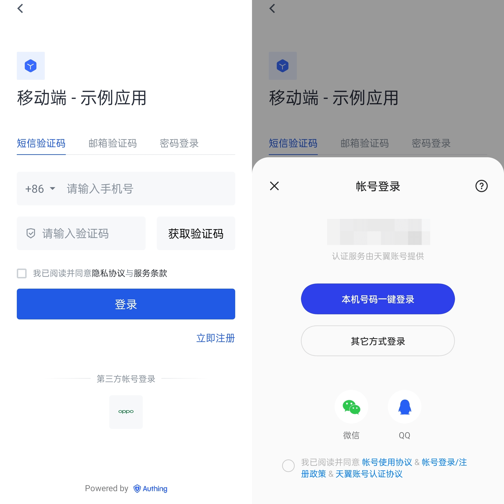

## Notes

- If you don't have an OPPO account yet, please go to [OPPO Open Platform](https://open.oppomobile.com/) to register as a developer.
- If you have not opened a {{$localeConfig.brandName}} console account, please go to [{{$localeConfig.brandName}} console](https://www.genauth.ai/) to register a developer account

## Step 1: Create an app on OPPO

Log in to [OPPO Open Platform](https://open.oppomobile.com/), click **Management Center**:
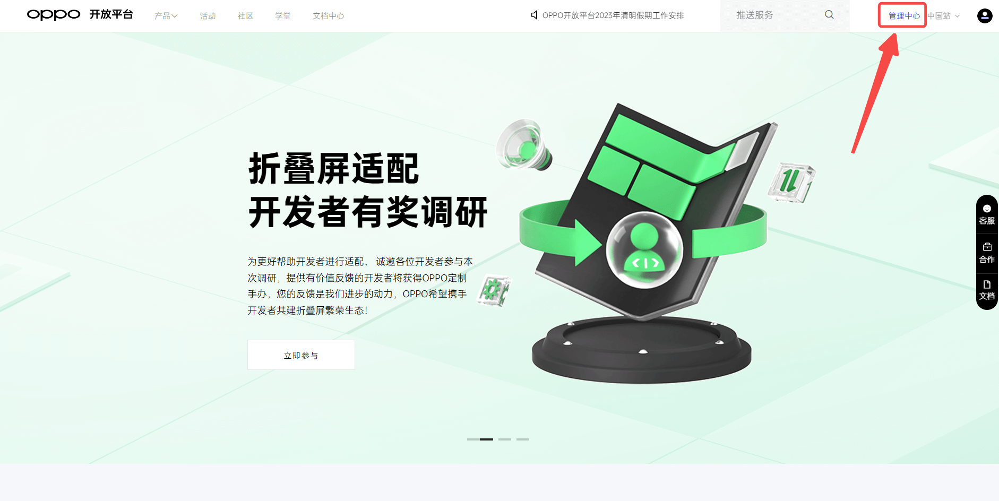

On the **Management Center** page, click **Account Services**:
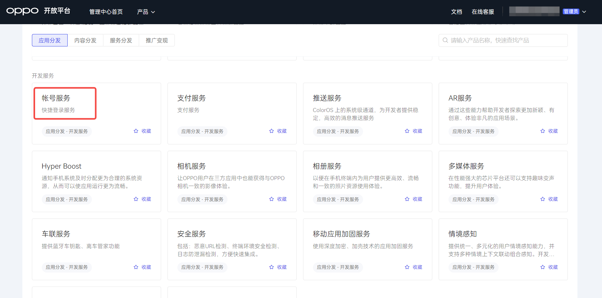

On the **Account Services** page, click **Create a new app** and select **Create an application**:
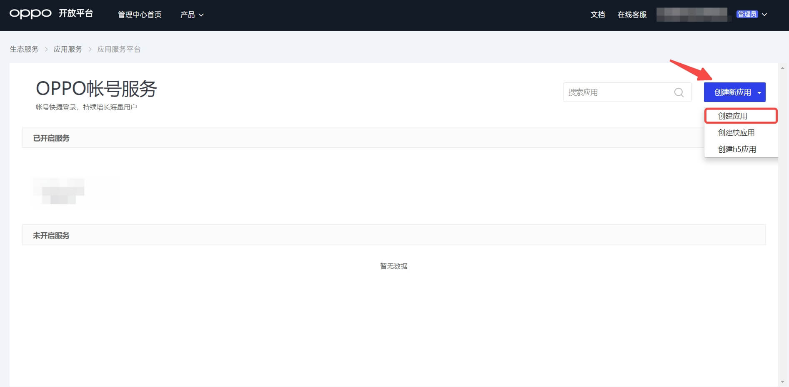

On the **Create a new application** page, fill in the application information and click Submit:
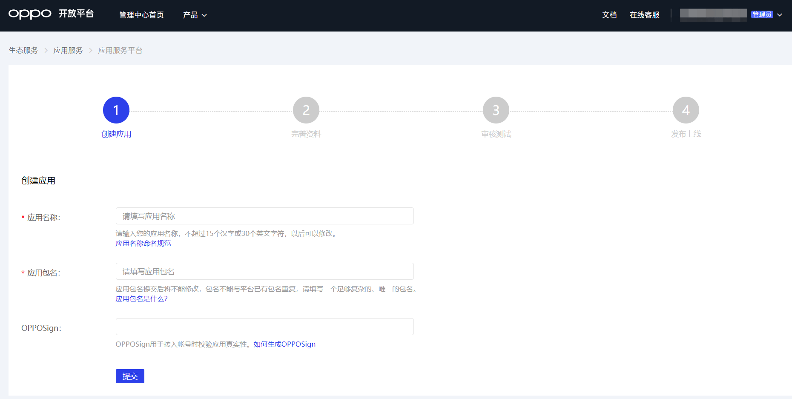

Connect the newly created application to the "Account Service", activate the account and enable capabilities:

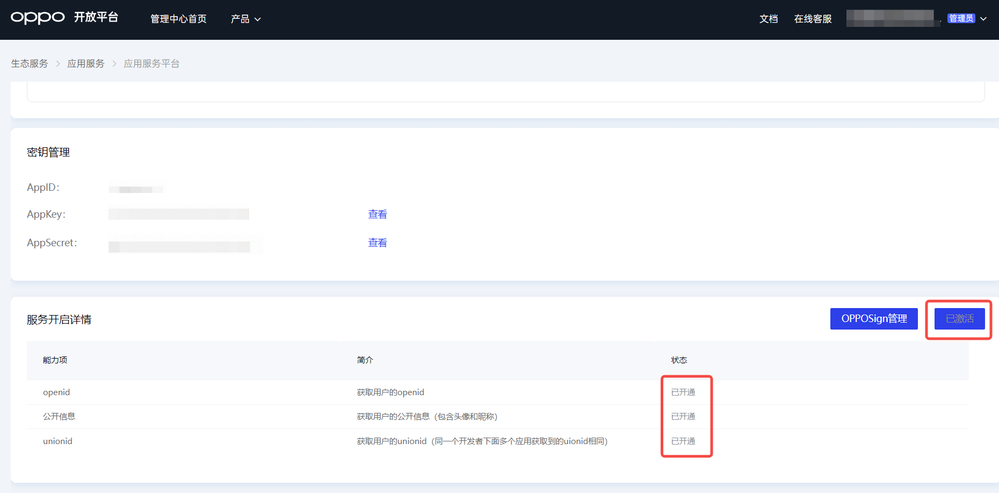

After the creation is complete, view the application details and record the `AppID`, `AppKey` and `AppSecret`, which will be used in the next step.
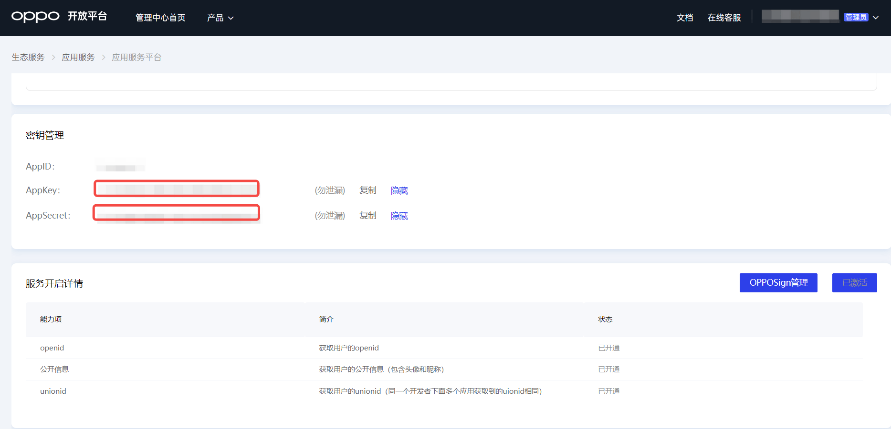

## Step 2: Configure OPPO application configuration in the {{$localeConfig.brandName}} console

2.1 Please click the "Create Social Identity Source" button on the "Social Identity Source" page of the {{$localeConfig.brandName}} console to enter the "Select Social Identity Source" page.

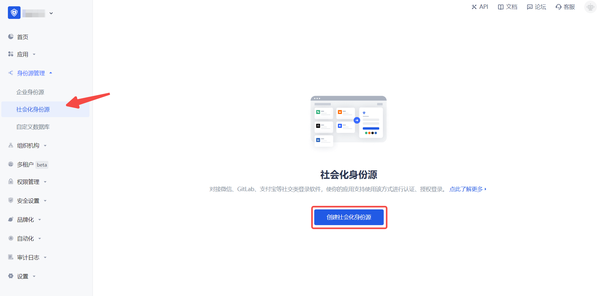

2.2 Please go to the {{$localeConfig.brandName}} console's "Social Identity Source" - "Select Social Identity Source" page, click the "OPPO" identity source button to enter the "OPPO Mobile Login Mode" page.

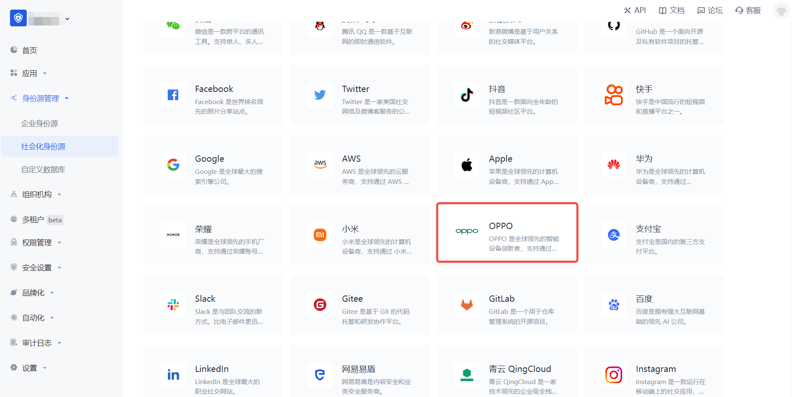

2.3 Please go to the {{$localeConfig.brandName}} console's "Social Identity Source" - "OPPO Mobile" page to configure the relevant field information.
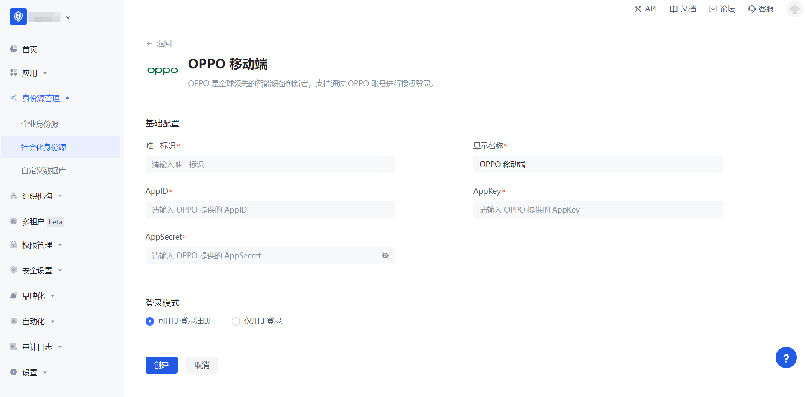

| Field        | Description                                                                                                                                                                             |
| ------------ | --------------------------------------------------------------------------------------------------------------------------------------------------------------------------------------- |
| Unique ID    | a. The unique ID consists of lowercase letters, numbers, and -, and is less than 32 bits long.  b. This is the unique ID for this connection and cannot be modified after setting. |
| Display Name | This name will be displayed on the button of the terminal user's login interface.                                                                                                       |
| AppID        | The OPPO application ID obtained in the previous step.                                                                                                                                  |
| AppKey       | The OPPO application key obtained in the previous step.                                                                                                                                 |
| AppSecret    | The OPPO application secret obtained in the previous step.                                                                                                                              |
| Login Mode   | After turning on "Login Only Mode", you can only log in to existing accounts, and cannot create new accounts. Please choose carefully.                                                  |

2.4 After the configuration is completed, click the "Create" or "Save" button to complete the creation.

## Step 3: Development Access

- **Recommended Development Access Method**: SDK
- **Advantages and Disadvantages**: Simple operation and maintenance, which is handled by {{$localeConfig.brandName}}. Each user pool has an independent secondary domain name; if you need to embed it in your application, you need to log in using the pop-up mode, that is, after clicking the login button, a window will pop up with the login page hosted by {{$localeConfig.brandName}}, or redirect the browser to the login page hosted by {{$localeConfig.brandName}}.
- **Detailed access method**:

  3.1 Create an application in the {{$localeConfig.brandName}} console. For details, see [How to create an application in {{$localeConfig.brandName}}](/guides/app-new/create-app/create-app.md)

  3.2 On the created "OPPO Mobile" identity source connection details page, open and associate an application created in the {{$localeConfig.brandName}} console

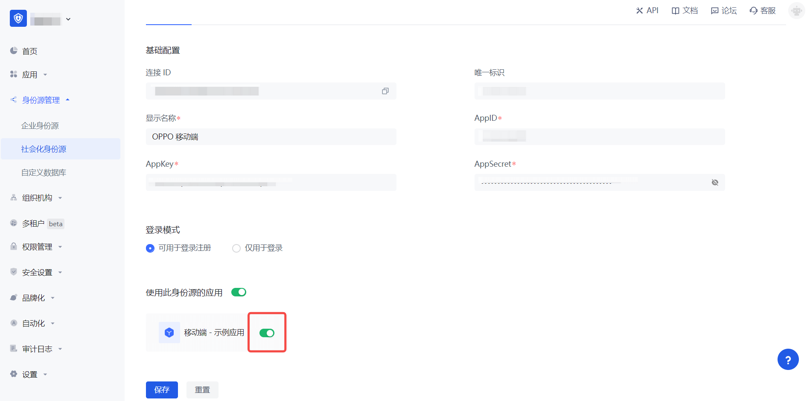

3.3 Experience OPPO third-party login on the login page (as shown in the [End User Preview](#End User Preview)).
