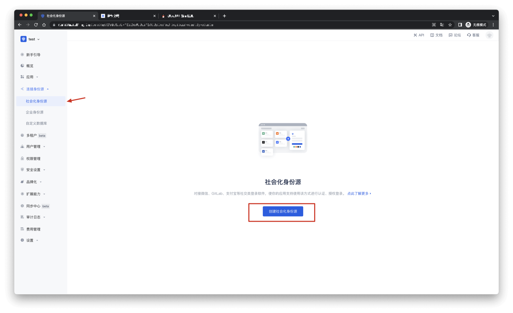

# Tencent QQ Mobile

<LastUpdated/>

## Scenario Introduction

### Overview

Tencent QQ social login is a user's secure login to a third-party application or website using Tencent QQ as the identity source. Configure and enable Tencent QQ social login in {{$localeConfig.brandName}}, and you can quickly obtain Tencent QQ's basic open information and help users log in without passwords through {{$localeConfig.brandName}}.

### Application Scenario

Mobile

### Terminal User Preview

## Notes

- If you have not opened a QQ interconnection platform account, please go to [QQ Interconnection Center](https://connect.qq.com/manage.html#/) to register a developer account.
- You need to pass the review before you can create an application.
- If you have not opened a {{$localeConfig.brandName}} console account, please go to [{{$localeConfig.brandName}} console](https://www.genauth.ai/) to register a developer account.

## Step 1: Create a mobile app on QQ Open Platform

Go to [QQ Connect Center](https://connect.qq.com/manage.html#/) to create a mobile app.

Click your personal QQ avatar on the upper left of the page to complete the registration and initiate the review, then click "Mobile App" and "Create App" to create a mobile app that uses QQ to log in. If you encounter any problems during the process, please refer to the QQ official "Documentation" at the top of the page.

## Step 2: Configure Tencent QQ in the {{$localeConfig.brandName}} console

2.1 Please click the "Create Social Identity Source" button on the "Social Identity Source" page of the {{$localeConfig.brandName}} console to enter the "Select Social Identity Source" page.

2.2 Please click the "Tencent QQ" identity source button on the "Social Identity Source"-"Select Social Identity Source" page of the {{$localeConfig.brandName}} console to enter the "Tencent QQ Login Mode" page.

2.3 Please configure the relevant field information on the "Social Identity Source"-"Tencent QQ Mobile" page of the {{$localeConfig.brandName}} console.

| Field/Function    | Description                                                                                                                                                                            |
| ----------------- | -------------------------------------------------------------------------------------------------------------------------------------------------------------------------------------- |
| Unique ID         | a. The unique ID consists of lowercase letters, numbers, and -, and its length is less than 32 bits. b. This is the unique ID of this connection and cannot be modified after setting. |
| Display Name      | This name will be displayed on the button of the terminal user's login interface.                                                                                                      |
| APP ID            | QQ application ID, which needs to be obtained on the QQ Open Platform.                                                                                                                 |
| APP Key           | QQ application key, which needs to be obtained on the QQ Open Platform.                                                                                                                |
| Apply for unionid | If enabled, you need to enable "Platform Unified ID Information" in the QQ Interconnection Application Interface first.                                                                |
| Login Mode        | After enabling "Login Only Mode", you can only log in to existing accounts and cannot create new accounts. Please choose carefully.                                                    |

After the configuration is completed, click the "Create" or "Save" button to complete the creation.

## Step 3: Development access

- **Recommended development access method**: SDK

- **Pros and cons description**: Simple operation and maintenance, which is handled by {{$localeConfig.brandName}}. Each user pool has an independent secondary domain name; if you need to embed it in your application, you need to log in using the pop-up mode, that is: after clicking the login button, a window will pop up with the login page hosted by {{$localeConfig.brandName}}, or redirect the browser to the login page hosted by {{$localeConfig.brandName}}.

- **Detailed access method**:

  3.1 Create an application in the {{$localeConfig.brandName}} console. For details, see: [How to create an application in {{$localeConfig.brandName}}](/guides/app-new/create-app/create-app.md)

  3.2 On the created QQ identity source connection details page, open and associate an application created in the {{$localeConfig.brandName}} console

3.3 Experience QQ third-party login on the login page (as shown in the [end user preview image](#end user preview image)).
