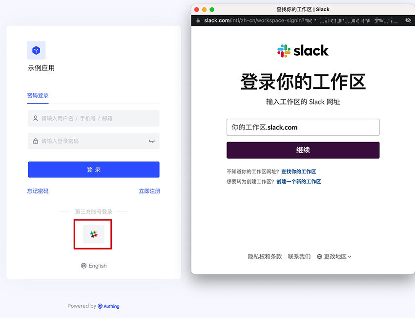
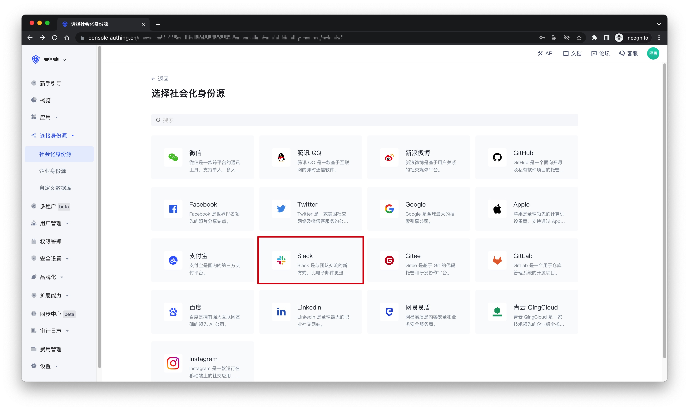
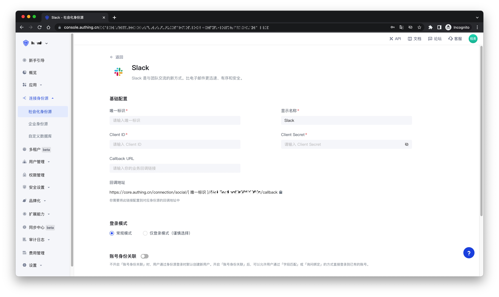
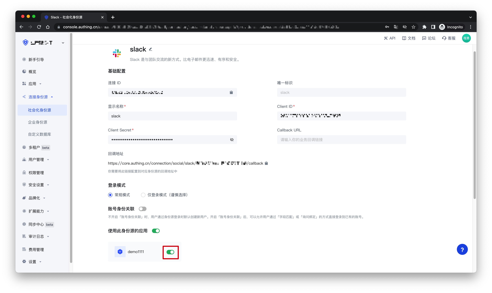
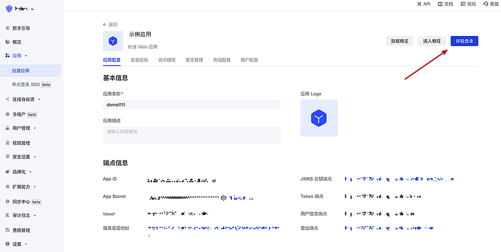
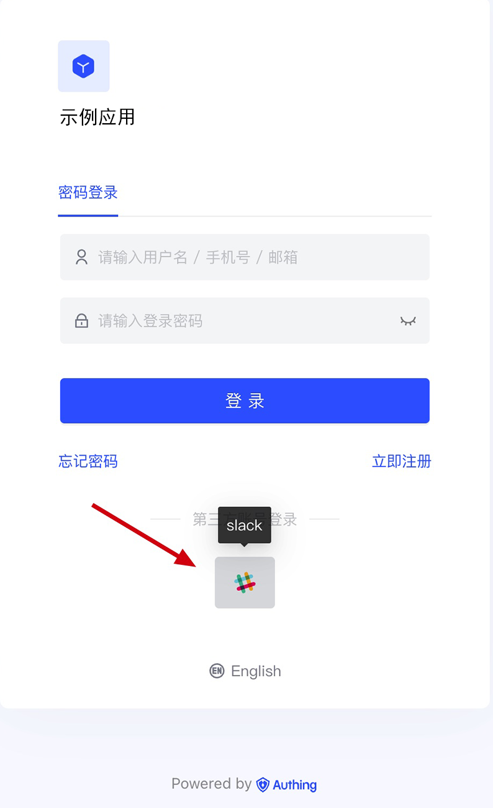

# Slack

<LastUpdated />

## Scenario Introduction

- **Overview**: Slack social login allows users to log in to third-party applications or websites securely using Slack as the identity source. Configure and enable Slack social login in {{$localeConfig.brandName}} to quickly obtain Slack's basic open information and help users log in without passwords.
- **Application scenario**: PC website
- **End user preview image**:

## Notes

- If you don't have a Slack account yet, please go to [slack.com](https://slack.com/get-started#/createnew) to register an account
- If you don't have a {{$localeConfig.brandName}} console account, please go to [{{$localeConfig.brandName}} console](https://www.genauth.ai/) to register a developer account

## Step 1: Create an application on the Slack API platform

Please follow the [Slack API documentation](https://api.slack.com/authentication/sign-in-with-slack#implementation) to create an application. You need to record the application's `App ID`, `Client ID`, `Client Secret`, and `Signing Secret`, which will be used later. You can also refer to the following process.

First, create an app through the [Slack API: Your Apps](https://api.slack.com/apps) and click “Create New App”.

If you have never used Slack before, you may need to create a workspace first: click “Create Another Workplace” and complete the creation.

Once you have a workspace, return to the [Slack API: Your Apps](https://api.slack.com/apps) and click “Create New App” to continue creating the app. If prompted to select a creation method, select From scratch. After entering the App Name and selecting the Workspace, click “Create App” to complete the creation.

After the creation is completed, you will see the basic information about this app. Scroll down to App Credentials, where `App ID`, `Client ID`, `Client Secret`, `Signing Secret` are recorded. You may need them later.

Finally, click "OAuth & Permissions" in the sidebar, find the "Redirect URLs" setting area on the page, click "Add New Redirect URL" to add the following callback address: `https://core.genauth.ai/connection/social/{ YOUR_IDENTITYSOURCE_ID }/{ GEN_AUTH_USERPOOL_ID }/callback`, you need to replace `{ YOUR_IDENTITYSOURCE_ID }` with the `Unique ID` filled in the identity source you are creating in GenAuth, and `{ GEN_AUTH_USERPOOL_ID }` with your [User Pool ID](/guides/faqs/get-userpool-id-and-secret.md). After adding, click "Save URLs" to save the settings.

## Step 2: Configure the Slack API application in the {{$localeConfig.brandName}} console

2.1 On the "Social Identity Source" page of the {{$localeConfig.brandName}} console, click the "Create Social Identity Source" button to enter the "Select Social Identity Source" page.

2.2 On the "Select Social Identity Source" page, click the "Slack" card.

2.3 On the "Slack" configuration page, fill in the relevant field information.

| Field                        | Description                                                                                                                                                                                                                                                                                          |
| ---------------------------- | ---------------------------------------------------------------------------------------------------------------------------------------------------------------------------------------------------------------------------------------------------------------------------------------------------- |
| Unique ID                    | a. The unique ID consists of lowercase letters, numbers, and -, and its length is less than 32 bits.  b. This is the unique ID of this connection and cannot be modified after setting.                                                                                                         |
| Display Name                 | This name will be displayed on the button of the end user's login interface.                                                                                                                                                                                                                         |
| Client ID                    | The Slack API application ID obtained in the previous step.                                                                                                                                                                                                                                          |
| Client Secret                | The Slack API application Secret obtained in the previous step.                                                                                                                                                                                                                                      |
| Callback URL                 | You can fill in your business callback address. After the user completes the login, the browser will jump to this address.                                                                                                                                                                           |
| Login Mode                   | After turning on "Login Only Mode", you can only log in to existing accounts, and you cannot create new accounts. Please choose carefully.                                                                                                                                                           |
| Account Identity Association | When "Account Identity Association" is not enabled, a new user is created by default when the user logs in through the identity source. After turning on "Account Identity Association", users can be allowed to log in directly to an existing account through "Field Matching" or "Query Binding". |

2.4 After the configuration is completed, click the "Create" or "Save" button to complete the creation.

## Step 3: Development Access

- **Recommended Development Access Method**: Use Hosted Login Page
- **Pros and Cons Description**: Simple operation and maintenance, which is handled by {{$localeConfig.brandName}}. Each user pool has an independent secondary domain name; if you need to embed it into your application, you need to use the pop-up mode to log in, that is: after clicking the login button, a window will pop up with the content of the {{$localeConfig.brandName}} hosted login page, or redirect the browser to the {{$localeConfig.brandName}} hosted login page.
- **Detailed access method**:

  3.1 Create an application in the {{$localeConfig.brandName}} console. For details, see: [How to create an application in {{$localeConfig.brandName}}](/guides/app-new/create-app/create-app.md)

  3.2 On the created "Slack" identity source connection details page, open and associate an application created in the {{$localeConfig.brandName}} console
  

  3.3 Click the "Experience Login" button of the {{$localeConfig.brandName}} console application, and experience the "Slack" login in the pop-up login window
  

