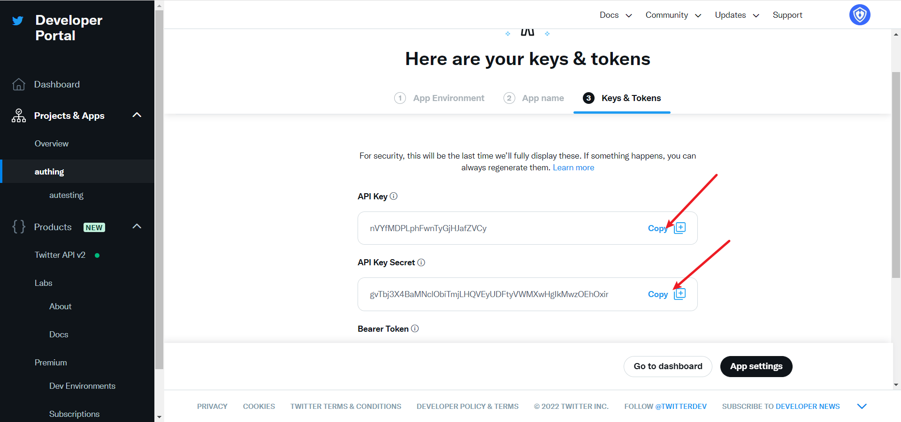
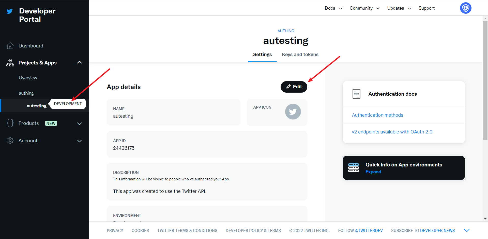

# Twitter Mobile

<LastUpdated/>

## Scenario Introduction

### Overview

GenAuth provides developers with a way to quickly jump to Twitter login and obtain user information in mobile (iOS or Android) applications. Twitter account access can be completed by simply calling the GenAuth mobile SDK.

### Application Scenario

Mobile APP

### End User Preview

## Notes

- If you don't have a Twitter account yet, please go to the [Twitter platform](https://twitter.com/) to register an account.
- Go to the [Twitter Developer Platform](https://developer.twitter.com/en/portal/) to complete the account information, and [apply for Elevated access permissions](https://developer.twitter.com/en/portal/petition/standard/basic-info) for the account.
- If you have not opened a {{$localeConfig.brandName}} console account, please go to [{{$localeConfig.brandName}} Console](https://www.genauth.ai/) to register a developer account;

## Step 1: Create a Twitter application

1.1 Create a project. In the sidebar **Projects & Apps**, select **Overview**, and in the **Elevated** directory, click **+New Project**.

Fill in **Project Name**, **Usage Scenario**, **Project Description** in turn, and start creating the application.

During the development stage, select **Development** for the application environment first, and switch to **Production** after debugging is completed

After filling in the name, you will see **APP Key** and **APP Key Secret**. Record them first, and they will be used when configuring the {{$localeConfig.brandName}} console

## Step 2: Configure Twitter mobile login in the {{$localeConfig.brandName}} console

2.1 On the "Social Identity Source" page of the {{$localeConfig.brandName}} Console, click the "Create Social Identity Source" button to enter the "Select Social Identity Source" page, select the "Twitter" identity source button, and enter the "Twitter Mobile Login Mode" page.

2.3 Please configure the relevant field information on the "Social Identity Source" - "Twitter Mobile" page of the {{$localeConfig.brandName}} Console console.

| Field/Function | Description                                                                                                                                                                            |
| -------------- | -------------------------------------------------------------------------------------------------------------------------------------------------------------------------------------- |
| Unique ID      | a. The unique ID consists of lowercase letters, numbers, and -, and its length is less than 32 bits. b. This is the unique ID of this connection and cannot be modified after setting. |
| Display Name   | This name will be displayed on the button of the end user's login interface.                                                                                                           |
| API Key        | Application ID, which needs to be obtained on the Twitter platform                                                                                                                     |
| API Key Secret | Application key, which needs to be obtained on the Twitter platform                                                                                                                    |
| Login Mode     | After turning on "Login Only Mode", you can only log in to existing accounts, and cannot create new accounts. Please choose carefully.                                                 |

After the configuration is completed, click the "Create" or "Save" button to complete the creation.

In the project created by Twitter, select the application you just created, scroll down, and under the **User authentication settings** column, click the **Set Up** button to enter the authentication settings page

Select the App permissions as needed. The default selection of **Read** can meet the authentication function

If you forget the application key, you can click **Keys and tokens** on the application page and select **Regenerate** to regenerate it.

After completing the configuration, return to the application settings page, click **Edit**, and switch the application environment to **Production**.

## Step 3: Development access

- **Recommended development access method**: SDK

- **Advantages and disadvantages**: Simple operation and maintenance, which is handled by {{$localeConfig.brandName}}. Each user pool has an independent secondary domain name; if you need to embed it in your application, you need to log in using the pop-up mode, that is: after clicking the login button, a window will pop up with the login page hosted by {{$localeConfig.brandName}}, or redirect the browser to the login page hosted by {{$localeConfig.brandName}}.

- **Detailed access method**:

  3.1 Create an application in the {{$localeConfig.brandName}} console. For details, see: [How to create an application in {{$localeConfig.brandName}}](/guides/app-new/create-app/create-app.md)

  3.2 On the created Twitter mobile identity source connection details page, open and associate an application created in the {{$localeConfig.brandName}} console

3.3 Experience Twitter third-party login on the login page (as shown in
](#end user preview image)).
