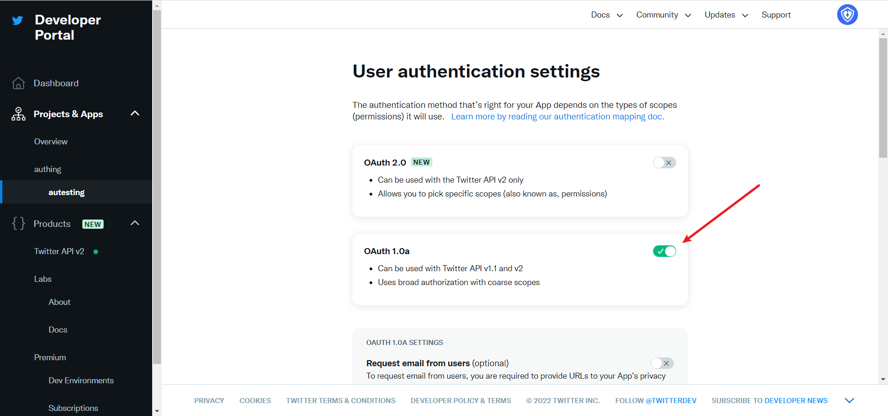
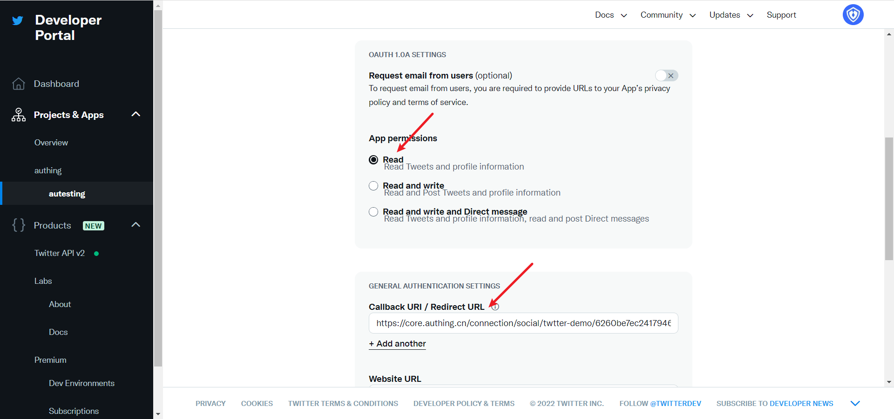
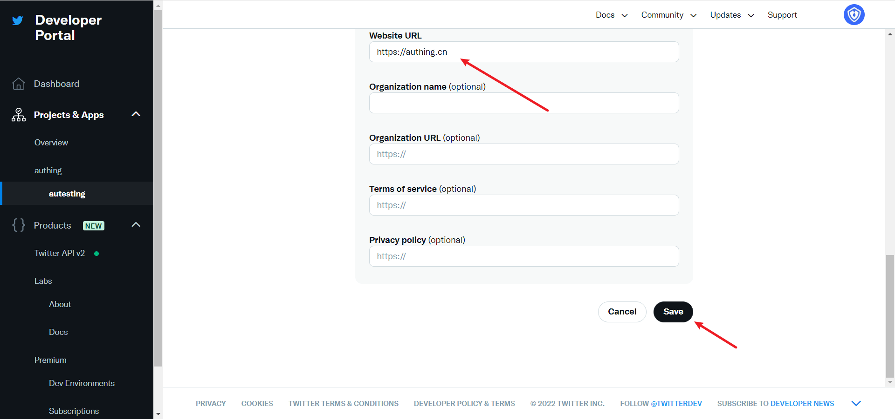

# Twitter

<LastUpdated/>

## Scenario Introduction

- **Overview** Twitter social login allows users to log in to third-party applications or websites securely using Twitter as the identity source. Configure and enable Twitter social login in {{$localeConfig.brandName}} to quickly obtain basic open information about Twitter and help users log in without a password.
- **Application scenario**: PC website
- **Terminal user preview image**:

## Notes

- If you don't have a Twitter account yet, please go to the [Twitter platform](https://twitter.com/) to register an account.
- Go to the [Twitter developer platform](https://developer.twitter.com/en/portal/) to complete the account information, and [apply for Elevated access permissions](https://developer.twitter.com/en/portal/petition/standard/basic-info) for the account.
- If you have not opened a {{$localeConfig.brandName}} console account, please go to [{{$localeConfig.brandName}} Console](https://www.genauth.ai/) to register a developer account;

## Step 1: Create a Twitter application

1.1 Create a project. In the sidebar **Projects & Apps**, select **Overview**, and in the **Elevated** directory, click **+New Project**.

Fill in **Project Name**, **Usage Scenario**, **Project Description** in turn, and start creating the application.

During the development phase, select **Development** for the application environment, and switch to **Production** after debugging is complete

After filling in the name, you will see **APP Key** and **APP Key Secret**. Record them first, and they will be used when configuring the {{$localeConfig.brandName}} console

## Step 2: Configure Twitter in the {{$localeConfig.brandName}} console

2.1 On the {{$localeConfig.brandName}} Console console, on the "Social Identity Source" page, click the "Create Social Identity Source" button, enter the "Select Social Identity Source" page, select the "Twitter" identity source button, and enter the "Twitter Login Mode" page.

2.3 Please configure the relevant field information on the "Social Identity Source" - "Twitter" page of the {{$localeConfig.brandName}} Console console.

| Field/Function   | Description                                                                                                                                                                                                                                                                                                                                                                                                                                                                                                                                                                                                               |
| ---------------- | ------------------------------------------------------------------------------------------------------------------------------------------------------------------------------------------------------------------------------------------------------------------------------------------------------------------------------------------------------------------------------------------------------------------------------------------------------------------------------------------------------------------------------------------------------------------------------------------------------------------------- |
| Unique ID        | a. The unique ID consists of lowercase letters, numbers, and -, and is less than 32 bits in length. b. This is the unique ID of this connection and cannot be modified after setting.                                                                                                                                                                                                                                                                                                                                                                                                                                     |
| Display Name     | This name will be displayed on the button of the end user's login interface.                                                                                                                                                                                                                                                                                                                                                                                                                                                                                                                                              |
| API Key          | Application ID, which needs to be obtained on the Twitter platform                                                                                                                                                                                                                                                                                                                                                                                                                                                                                                                                                        |
| API Secret Key   | Application secret key, which needs to be obtained on the Twitter platform                                                                                                                                                                                                                                                                                                                                                                                                                                                                                                                                                |
| Callback URL     | This is your business callback domain name, which is not the same as the callback link configured for the self-built application, and is also unrelated to the callback address configuration of the third-party social login console. For example, if your website domain is https://example.com and the url for handling {{$localeConfig.brandName}} callback request is /auth/callback, then you should fill it in https://example.com/auth/callback. This parameter is no longer recommended. It is recommended to configure the callback link separately in the application. You can fill in # for the address here. |
| Callback address | Twitter redirect URI. This URL needs to be configured to the callback address of the application created by the Twitter platform.                                                                                                                                                                                                                                                                                                                                                                                                                                                                                         |
| Login mode       | After turning on "Login-only mode", you can only log in to existing accounts and cannot create new accounts. Please choose carefully.                                                                                                                                                                                                                                                                                                                                                                                                                                                                                     |

After the configuration is completed, click the "Create" or "Save" button to complete the creation.

In the project created on Twitter, select the application you just created, scroll down, and under the **User authentication settings** column, click the **Set Up** button to enter the authentication settings page

Enable OAuth 1.0a

Select the permissions of the App as needed. The default selection of **Read** can meet the authentication function. **Callback URI / Redirect URL** fills in the callback address displayed after creating the Twitter identity source on the {{$localeConfig.brandName}} console.

**Website URL** fills in your site homepage, then click Save

If you forget the application key, you can click **Keys and tokens** on the application page and select **Regenerate** to regenerate.

After completing the configuration, return to the application settings page, click **Edit**, and switch the application environment to **Production**.

## Step 3: Development access

- **Recommended development access method**: Use a hosted login page

- **Pros and cons description**: Simple operation and maintenance, which is handled by {{$localeConfig.brandName}}. Each user pool has an independent secondary domain name; if you need to embed it into your application, you need to log in using the pop-up mode, that is: after clicking the login button, a window will pop up with the content of the login page hosted by {{$localeConfig.brandName}}, or redirect the browser to the login page hosted by {{$localeConfig.brandName}}.

- **Detailed access method**:

  3.1 Create an application in the {{$localeConfig.brandName}} console. For details, see: [How to create an application in {{$localeConfig.brandName}}](/guides/app-new/create-app/create-app.md)

  3.2 On the created Twitter identity source connection details page, open and associate an application created in the {{$localeConfig.brandName}} console

3.3 Experience Twitter third-party login on the login page

