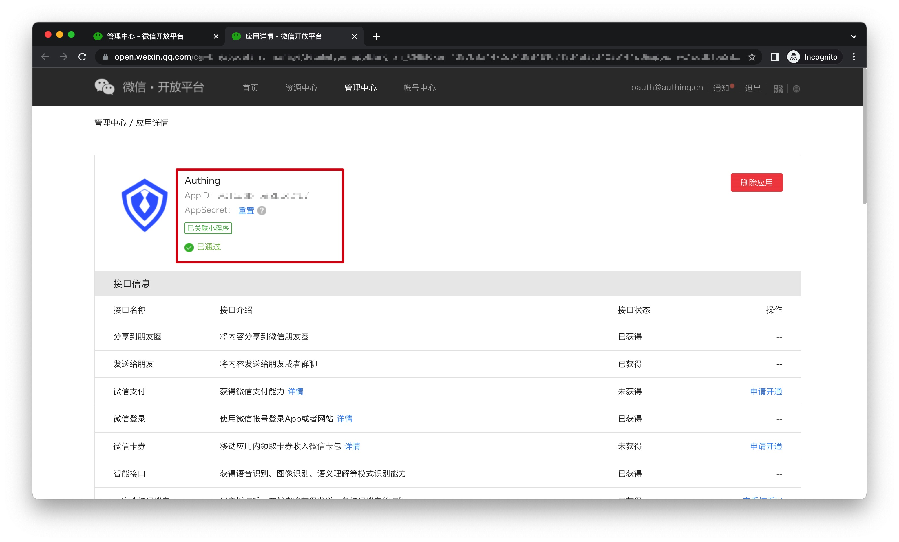
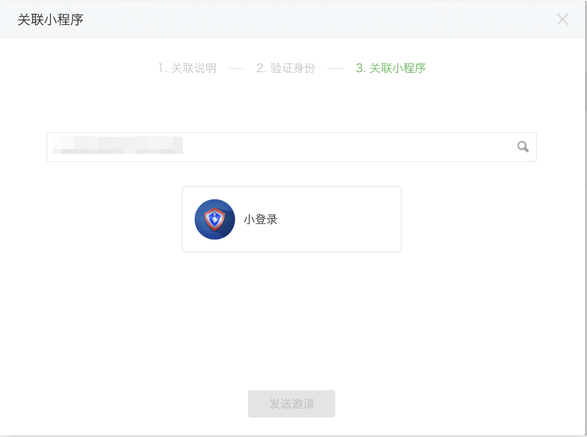
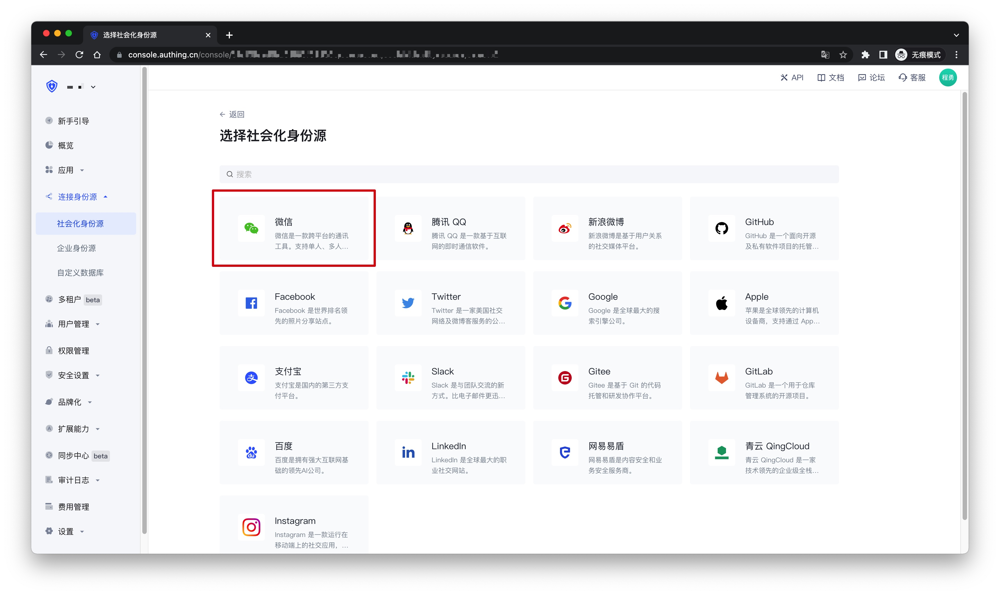
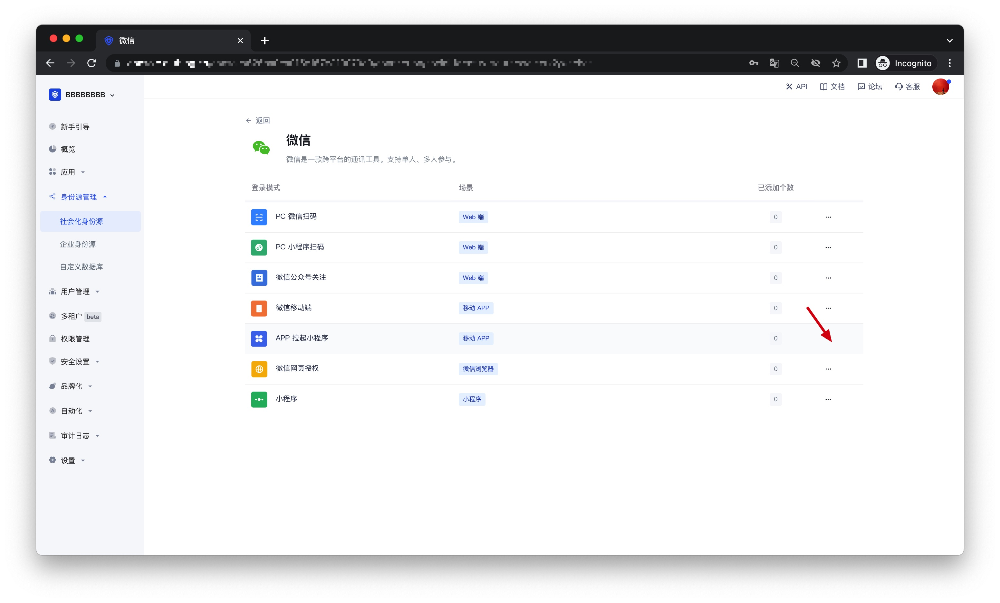
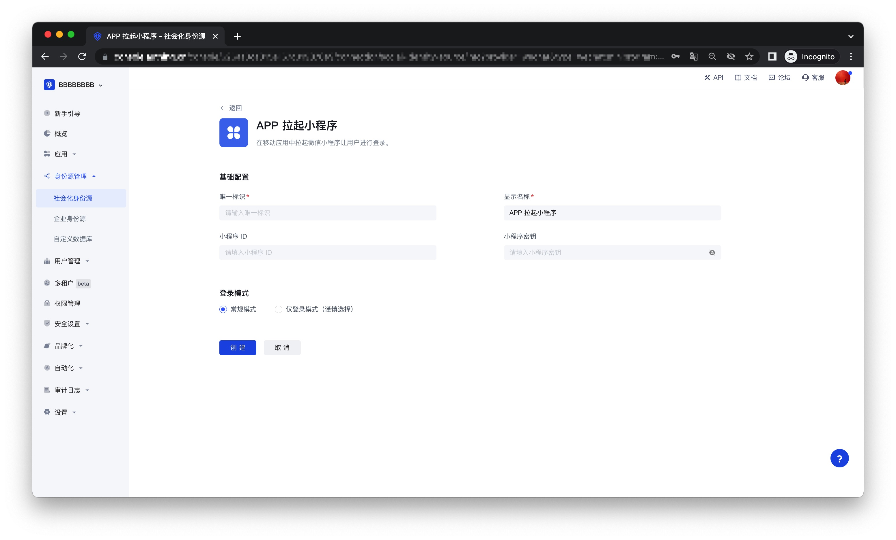
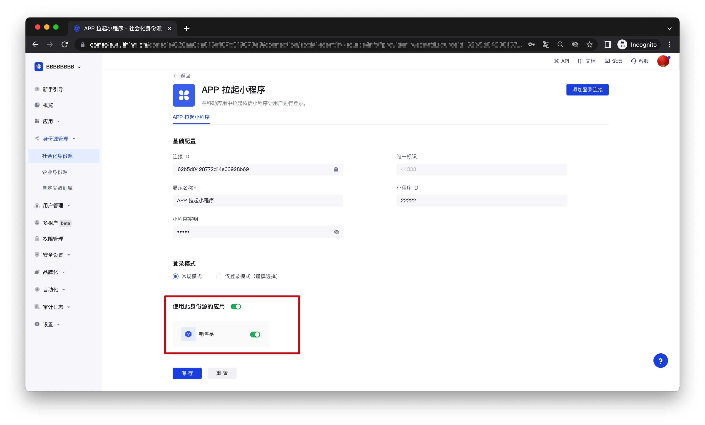

# APP launches WeChat Mini Program

<LastUpdated />

## Scenario Introduction

- **Overview**: {{$localeConfig.brandName}} provides developers with a method for mobile applications to quickly launch WeChat Mini Programs and obtain user information and complete login through SDK. Through the GenAuth SDK, you can easily obtain the user identity provided by WeChat and quickly establish an account system based on mobile phone numbers.

- **Application scenario**: Mobile APP

- **End user preview**:

## Notes

- If you have not opened a {{$localeConfig.brandName}} console account, please go to [{{$localeConfig.brandName}} console](https://www.genauth.ai/) to register a developer account;

## Step 1: Create a WeChat mobile application on WeChat Open Platform

Go to [WeChat Open Platform](https://open.weixin.qq.com/cgi-bin/index?t=home/index&lang=zh_CN) to create a **WeChat mobile application**.

After the creation is complete, you need to record the **AppID** and **AppSecret** of the application, which will be used later.

## Step 2: Associate the mini program in WeChat Open Platform

Go to [WeChat Open Platform](https://open.weixin.qq.com/cgi-bin/index?t=home/index&lang=zh_CN) **Admin Center->Mobile Application->Application Details->Associate Mini Program Information Page** to associate the mini program.

## Step 3: Create a WeChat mini program in WeChat Open Platform (optional)

By default, the default mini program provided by GenAuth will be used when the APP launches the mini program login. If you need stronger brand customization capabilities, or want to connect the WeChat account of the user who logs in through the mini program by scanning the code with your other WeChat public platforms, you need to apply for your own mini program. If you belong to one of these two scenarios:

Please follow the WeChat public platform instructions to create a WeChat mini program. You need to record the application's **AppID** and **AppSecret**, which will be needed later. At the same time, you need to contact us to obtain the source code of the mini-login. For details, please consult <a href="mailto:csm@genauth.ai">GenAuth after-sales service staff</a>.

## Step 4: Configure APP to launch the mini-program login in the {{$localeConfig.brandName}} console

1. Please click the "Create Social Identity Source" button on the "Social Identity Source" page of the {{$localeConfig.brandName}} console to enter the "Select Social Identity Source" page.

2. On the "Select Social Identity Source" page, click the "WeChat" card to enter the "WeChat Login Mode" page.

3. Click the "APP Launches Mini Program" login mode, or click **… Add** to open the "APP Launches Mini Program" configuration page.

4. On the "APP Launch Mini Program" configuration page, fill in the relevant field information.

| Field               | Description                                                                                                                                                                                  |
| ------------------- | -------------------------------------------------------------------------------------------------------------------------------------------------------------------------------------------- |
| Unique ID           | a. The unique ID consists of lowercase letters, numbers, and -, and its length is less than 32 bits.  b. This is the unique ID of this connection and cannot be modified after setting. |
| Display Name        | This name will be displayed on the button of the terminal user's login interface                                                                                                             |
| Mini Program ID     | Fill in if you choose to privatize the Mini Program                                                                                                                                          |
| Mini Program Secret | Fill in if you choose to privatize the Mini Program                                                                                                                                          |
| Login Mode          | After turning on "Login Only Mode", you can only log in to existing accounts and cannot create new accounts. Please choose carefully                                                         |

5. After the configuration is completed, click the "Create" or "Save" button to complete the creation.

## Step 5: Development access

- **Recommended development access method**: SDK

- **Pros and cons description**: Easy access, only a few lines of code are needed. Highest degree of customization.

- **Detailed access method**:

1. Refer to the SDK developer access documentation [Android](./../../../../reference/sdk-for-android/social/miniprogram.md) and [iOS](./../../../../reference/sdk-for-ios/social/miniprogram.md).
2. On the created "APP Launch Mini Program" identity source connection details page, open and associate a mobile app created in the {{$localeConfig.brandName}} console.

3. Go to the associated mobile app and experience the APP login function.

