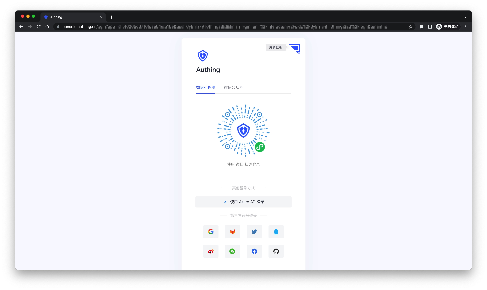
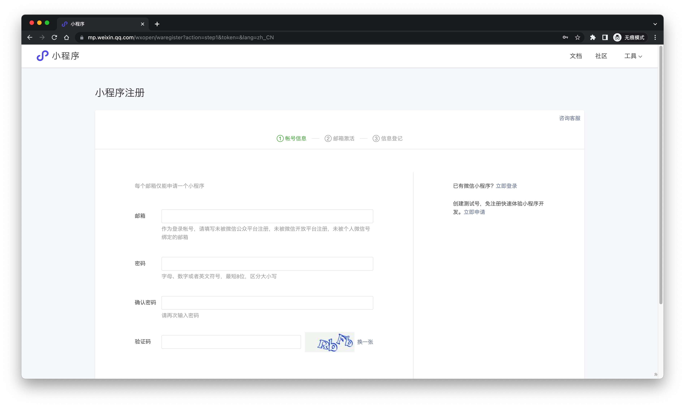
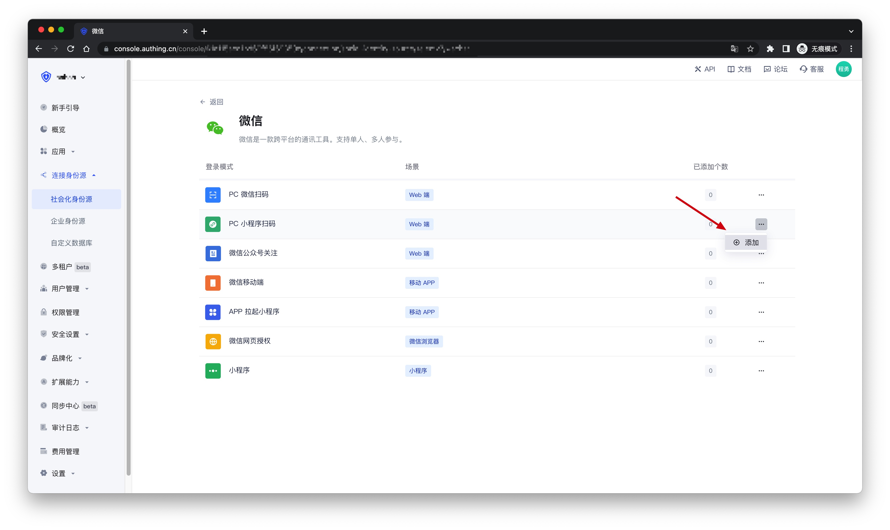
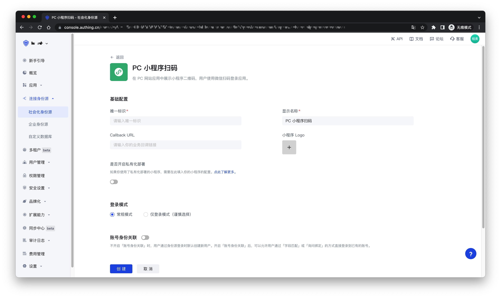
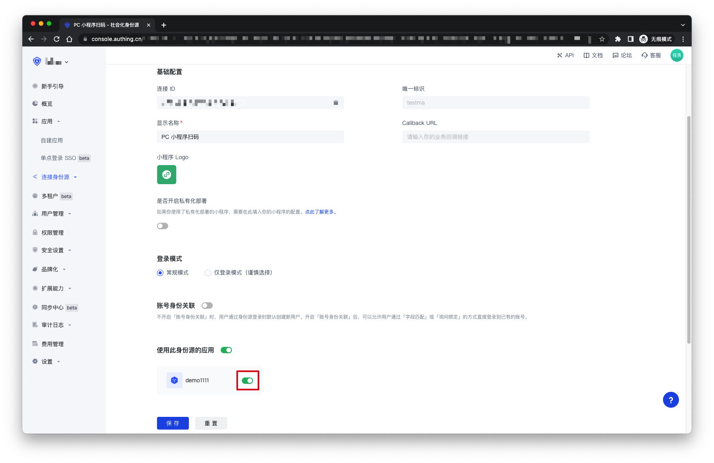
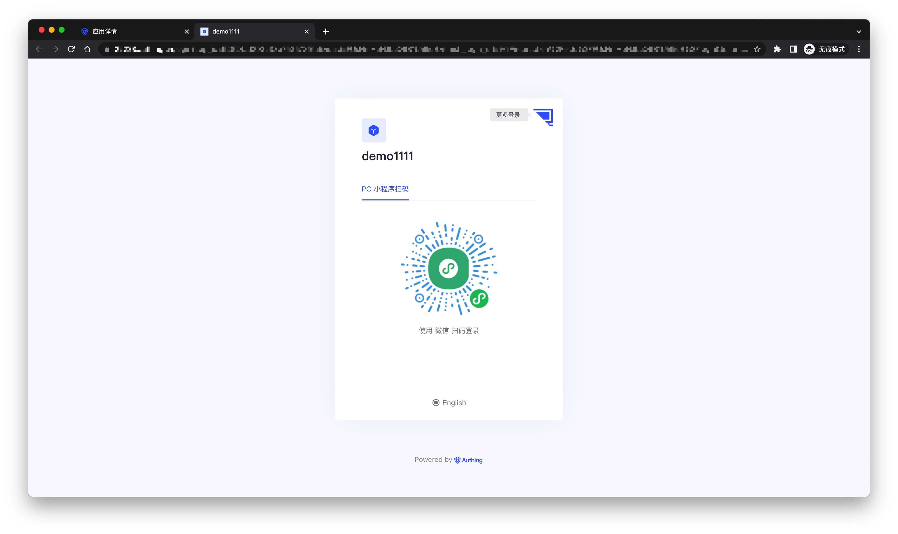

# WeChat PC applet code scanning

<LastUpdated />

## Scenario introduction

- **Overview**: This is a groundbreaking design of {{$localeConfig.brandName}}. After enabling scanning the small login QR code in {{$localeConfig.brandName}}, you can obtain the official WeChat real-name user information. Users can complete registration or login with their real number with one-click authorization, and establish an account system based on mobile phone numbers for developers.
- **Application scenario**: PC website
- **Terminal user preview image**:

## Notes

- If you have not opened a WeChat public platform account, please go to [WeChat public platform](https://mp.weixin.qq.com/wxopen/waregister?action=step1&token=&lang=zh_CN) to register and log in first.
- If you have not opened a {{$localeConfig.brandName}} console account, please go to [{{$localeConfig.brandName}} console](https://www.genauth.ai/) to register a developer account.

## Step 1: Create a mini program on WeChat public platform (optional)

By default, the mini program scan code login will use the default mini program provided by {{$localeConfig.brandName}}. If you need stronger brand customization capabilities, or want to connect the user WeChat account logged in through the mini program scan code with your other WeChat public platforms, you need to apply for your own mini program.

If you belong to one of these two scenarios, please go to [WeChat public platform](https://mp.weixin.qq.com/wxopen/waregister?action=step1&token=&lang=zh_CN) to create a WeChat mini program. You need to record the application's `App ID` and `App Secret`, which will be needed later.

At the same time, you need to contact us to obtain the source code of the mini-login. For details, please consult <a href="mailto:csm@genauth.ai">GenAuth after-sales service staff</a>.

## Step 2: Configure the WeChat mini-program in the {{$localeConfig.brandName}} console

2.1 Please click the **Create Social Identity Source** button on the **Social Identity Source** page of the {{$localeConfig.brandName}} console to enter the **Select Social Identity Source** page.

2.2 On the **Select Social Identity Source** page, click the **WeChat** card to enter the **WeChat Login Mode** page.

2.3 Continue to click **PC Mini Program Scan Code** login mode, or click **Add** to open the **PC Mini Program Scan Code** configuration page.

2.4 Fill in the relevant field information on the **PC Mini Program Scan Code** configuration page.

| Field                                | Description                                                                                                                                                                                                                                                                                                     |
| ------------------------------------ | --------------------------------------------------------------------------------------------------------------------------------------------------------------------------------------------------------------------------------------------------------------------------------------------------------------- |
| Unique ID                            | a. The unique ID consists of lowercase letters, numbers, and -, and its length is less than 32 bits.  b. This is the unique ID of this connection and cannot be modified after setting.                                                                                                                    |
| Display Name                         | This name will be displayed on the button of the terminal user's login interface.                                                                                                                                                                                                                               |
| Callback URL                         | The service callback address after the identity source completes authentication                                                                                                                                                                                                                                 |
| Mini Program Logo                    | The uploaded logo will be used as the logo in the center of the mini program QR code.                                                                                                                                                                                                                           |
| Whether to enable private deployment | If you want to use your own WeChat or customize the mini login mini program page style, you can contact us to obtain the source code of the mini login mini program. If this option is enabled, you must deploy your own mini login mini program and fill in the WeChat mini program's `AppID` and `AppSecret`. |
| Mini Program ID                      | The mini program's AppID, which is filled by users who choose to privatize the mini program.                                                                                                                                                                                                                    |
| Mini Program Key                     | The mini program's AppSecret, which is filled by users who choose to privatize the mini program.                                                                                                                                                                                                                |
| Login Mode                           | After enabling **Login Only Mode**, you can only log in to existing accounts and cannot create new accounts. Please choose carefully.                                                                                                                                                                           |
| Account Identity Association         | If **Account Identity Association** is not enabled, a new user is created by default when a user logs in through an identity source. After enabling **Account Identity Association**, users can be allowed to log in to existing accounts directly through **Field Match** or **Ask Binding**.                  |

2.5 After the configuration is completed, click the **Create** or **Save** button to complete the creation.

## Step 3: Development Access

- **Recommended Development Access Method**: Use Hosted Login Page
- **Pros and Cons**: Simple operation and maintenance, which is handled by {{$localeConfig.brandName}}. Each user pool has an independent secondary domain name; if you need to embed it into your application, you need to log in using the pop-up mode, that is: after clicking the login button, a window will pop up with the login page hosted by {{$localeConfig.brandName}}, or redirect the browser to the login page hosted by {{$localeConfig.brandName}}.
- **Detailed access method**:

  3.1 Create an application in the {{$localeConfig.brandName}} console. For details, see: [How to create an application in {{$localeConfig.brandName}}](/guides/app-new/create-app/create-app.md)

  3.2 On the created **PC Mini Program Scan Code** identity source connection details page, open and associate an application created in the {{$localeConfig.brandName}} console
  

  3.3 Click the **Experience Login** button in the {{$localeConfig.brandName}} console application, and experience the **PC Mini Program Scan Code** login in the pop-up login window
  

