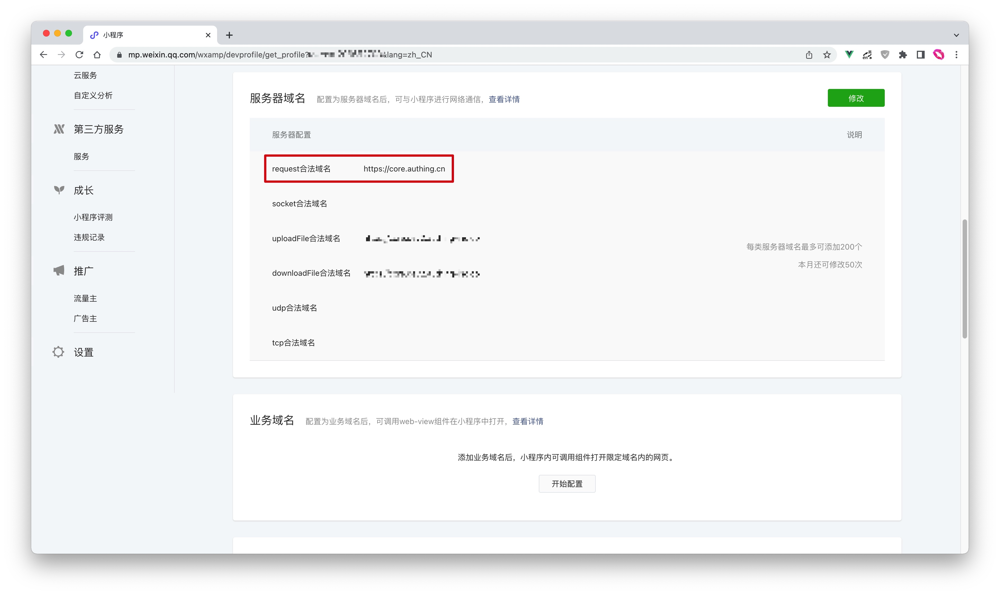
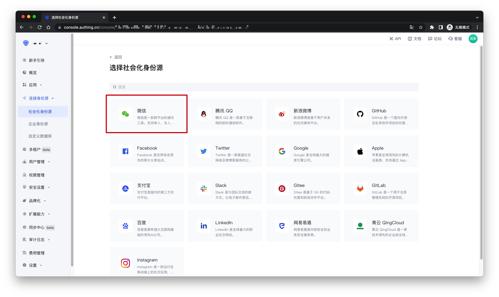

# WeChat Mini Program

<LastUpdated />

::: hint-info
GenAuth Mini Program SDK has used new documentation on March 20, 2024.
[GenAuth Mini Program SDK ](https://docs.genauth.ai/v3/reference/sdk/miniapp/quick.html)
:::

## Scenario Introduction

- **Overview**: {{$localeConfig.brandName}} SDK provides developers with a way to quickly obtain user information and complete login in the mini program. The GenAuth SDK can easily obtain the user identity provided by WeChat and quickly establish an account system based on mobile phone numbers.
- **Application scenario**: Mini Program
- **End user preview**:


## Notes

- If you have not opened a {{$localeConfig.brandName}} console account, please go to [{{$localeConfig.brandName}} console](https://www.genauth.ai/) to register a developer account;

## Step 1: Create a mini program on WeChat public platform

### Create WeChat mini program

Go to [WeChat public platform](https://mp.weixin.qq.com/wxopen/waregister?action=step1&token=&lang=zh_CN) to create a **WeChat mini program**.


After the creation is complete, you need to record the `AppID` and `AppSecret` of the application, which will be used later.


### Configure the server domain name

After that, you need to set the **request legal domain name** in **Server domain name** to `core.genauth.ai` in the **Development -> Development Management -> Development Settings** page of the WeChat Mini Program Management Backend.



### Configure the business domain name (optional)

:::hint-info
If you need to use webview to call {{$localeConfig.brandName}} to host the login page in the WeChat Mini Program, you need to configure the business domain name.
:::

In the **Development -> Development Management -> Development Settings** page of the WeChat Mini Program Management Backend, find the "**Business Domain Name**" configuration and click "**Start Configuration**"


After scanning the QR code to log in, fill in your application authentication address in the business domain name configuration and download the verification file for backup


## Step 2: Configure the WeChat Mini Program application in the {{$localeConfig.brandName}} console

2.1 Please click the "Create Social Identity Source" button on the "Social Identity Source" page of the {{$localeConfig.brandName}} console to enter the "Select Social Identity Source" page.


2.2 On the "Select Social Identity Source" page, click the "WeChat" card to enter the "WeChat Login Mode" page.


2.3 Continue to click the "Mini Program" login mode, or click **… Add** to open the "Mini Program" configuration page.


2.4 On the "Mini Program" configuration page, fill in the relevant field information.


| Field                    | Description                                                                                                                                                                                         |
| ------------------------ | --------------------------------------------------------------------------------------------------------------------------------------------------------------------------------------------------- |
| Unique ID                | a. The unique ID consists of lowercase letters, numbers, and -, and its length is less than 32 bits. <br />b. This is the unique identifier of this connection and cannot be modified after setting |
| Display name             | This name will be displayed on the button of the terminal user's login interface                                                                                                                    |
| Mini Program ID          | AppID obtained in step 1                                                                                                                                                                            |
| Mini Program password    | AppSecret obtained in step 1                                                                                                                                                                        |
| Domain verification file | If you need to use webview in the mini program to call the hosted login page of GenAuth, you need to upload the verification file provided by the mini program downloaded in step 1                 |
| Login mode               | After turning on "Login only mode", you can only log in to existing accounts and cannot create new accounts. Please choose carefully                                                                |

2.5 After the configuration is completed, click the "Create" or "Save" button to complete the creation.

## Step 3: Development access

Starting from Mini Program Basic Library version 2.2.1 or above, and Developer Tools 1.02.1808300 or above, Mini Program supports the use of npm to install third-party packages. For details, please see: [npm support | WeChat open document](https://developers.weixin.qq.com/miniprogram/dev/devtools/npm.html).

### Install npm package

```bash
$ yarn add authing-wxapp-sdk --save

# OR

$ npm install authing-wxapp-sdk --save
```

Click the menu bar in WeChat Developer Tools: **Tools --> Build npm**:


Check the `Use npm module` option (if this option is available, Stable 1.05.2204250 for MacOS does not have this option):


### Initialize SDK

To initialize `AuthenticationClient`, you need to pass in `AppId (application ID)`:

> You can view your application list in **Application** of the console.

```javascript
const { AuthenticationClient } = require("authing-wxapp-sdk");

const authing = new AuthenticationClient({
  userPoolId: "YOUR_USERPOOL_ID",
});
```

### Call login method

`AuthenticationClient` provides the `loginByCode` method, which can complete silent login through WeChat authorization:

```javascript
const { code } = await wx.login();
// No user authorization required
const user = await authing.loginByCode(code); // Successful login, write token to WeChat Storage

// You can do this after login
await authing.updateProfile({
  nickname: "Bob",
});
```

After the user completes the login, the SDK will write the user's token to WeChat Storage, and subsequent requests will automatically carry the token for access.


When the user opens the mini program again, if the user's token is saved in the mini program's Storage, the request to access authing will automatically carry the token.

```javascript
// The request can succeed because the user is logged in.
await authing.updateProfile({
  nickname: "Mick",
});
```

For details, please refer to the document: [Mini Program SDK](/reference/sdk-for-wxapp.md).

### Next

!!!include(common/what-to-do-when-you-get-userinfo.md)!!!
