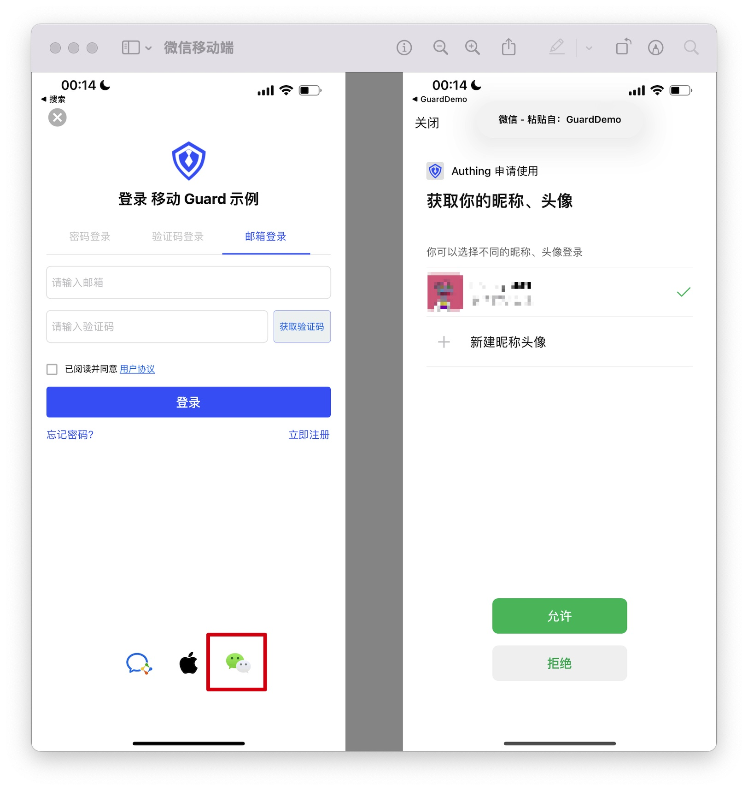
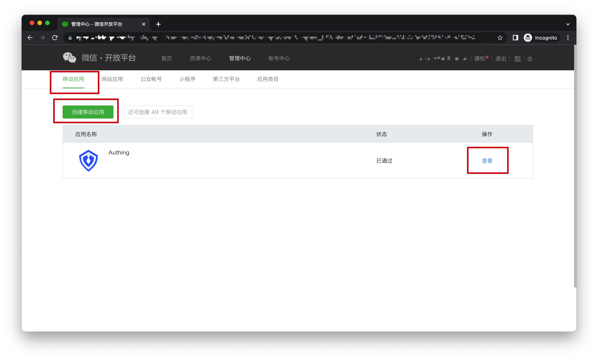
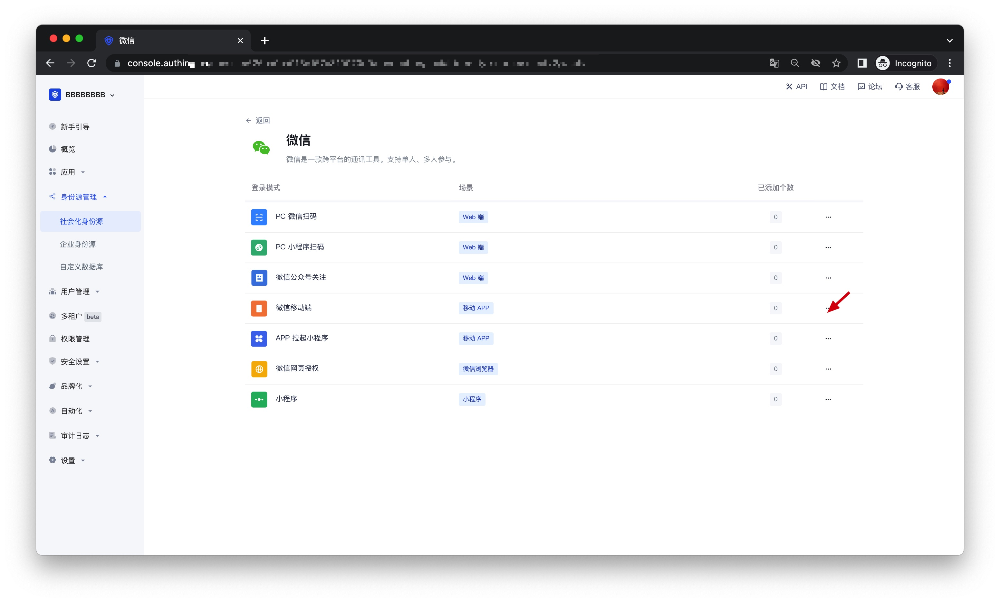
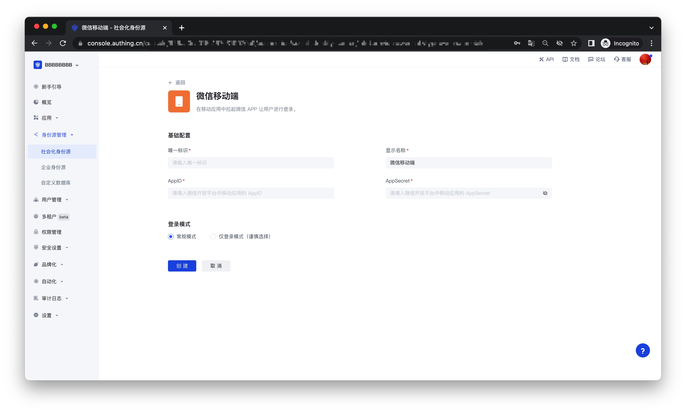
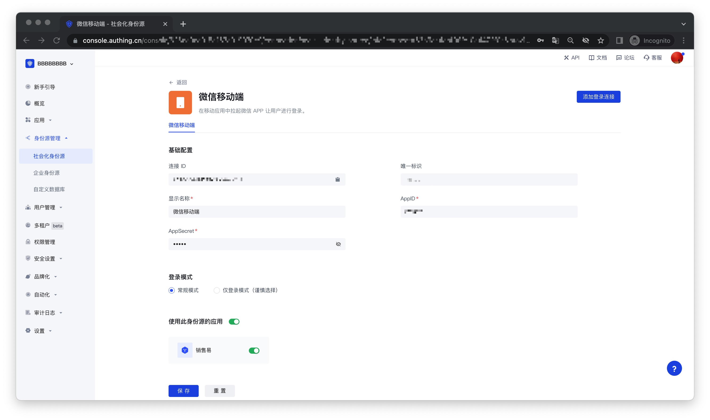

# WeChat Mobile

<LastUpdated />

## Scenario Introduction

- **Overview**: GenAuth provides developers with a way to quickly jump to WeChat login and obtain user information in mobile (iOS or Android) applications. WeChat account access can be completed by simply calling the GenAuth mobile SDK.
- **Application scenario**: Mobile APP
- **End user preview image**: Pull up the WeChat APP in the mobile application to log in;

## Notes

- If you have not opened a WeChat Open Platform account, please go to [WeChat Open Platform](https://open.weixin.qq.com/cgi-bin/index?t=home/index&lang=zh_CN) to register a developer account;
- If you have not opened a {{$localeConfig.brandName}} console account, please go to [{{$localeConfig.brandName}} console](https://www.genauth.ai/) to register a developer account;

## Step 1: Create a WeChat mobile application on the WeChat Open Platform

Go to [WeChat Open Platform](https://open.weixin.qq.com/cgi-bin/index?t=home/index&lang=zh_CN) to create a **WeChat mobile application**.

After the creation is complete, you need to record the `AppID` and `AppSecret` of the application, which will be used later.

## Step 2: Configure WeChat mobile login in the {{$localeConfig.brandName}} console

2.1 Please click the "Create Social Identity Source" button on the "Social Identity Source" page of the {{$localeConfig.brandName}} console to enter the "Select Social Identity Source" page.

2.2 On the "Select Social Identity Source" page, click the "WeChat" card to enter the "WeChat Login Mode" page.

2.3 Click the "WeChat Mobile" login mode, or click **… Add** to open the "WeChat Mobile" configuration page.

2.4 On the "WeChat Mobile" configuration page, fill in the relevant field information.

| Field        | Description                                                                                                                                                                                         |
| ------------ | --------------------------------------------------------------------------------------------------------------------------------------------------------------------------------------------------- |
| Unique ID    | a. The unique ID consists of lowercase letters, numbers, and -, and its length is less than 32 bits.  b. This is the unique identifier of this connection and cannot be modified after setting |
| Display name | This name will be displayed on the button of the terminal user's login interface                                                                                                                    |
| AppID        | AppID obtained in step 1                                                                                                                                                                            |
| App secret   | AppSecret obtained in step 1                                                                                                                                                                        |
| Login mode   | After turning on "Login only mode", you can only log in to existing accounts and cannot create new accounts. Please choose carefully                                                                |

2.5 After the configuration is completed, click the "Create" or "Save" button to complete the creation.

## Step 3: Development access

- **Recommended development access method**: SDK
- **Pros and cons description**: Simple access, only a few lines of code are required. Highest degree of customization.
- **Detailed access method**:

  3.1 Please follow the [WeChat Login SDK Access Document (Android)](https://docs.genauth.ai/reference/sdk-for-android/social/wechat.html) to access your Android application; please follow the [WeChat Login SDK Access Document (iOS)](https://docs.genauth.ai/reference/sdk-for-ios/social/wechat.html) to access your IOS application;

  3.2 Create a mobile application in the {{$localeConfig.brandName}} console. For details, see: [How to create an application in {{$localeConfig.brandName}}](/guides/app-new/create-app/create-app.md)

  3.3 On the created "WeChat Mobile" identity source connection details page, open and associate a mobile application created in the {{ $localeConfig.brandName}} console;
  

  3.4 Go to the associated mobile APP and experience the APP login function.

  
