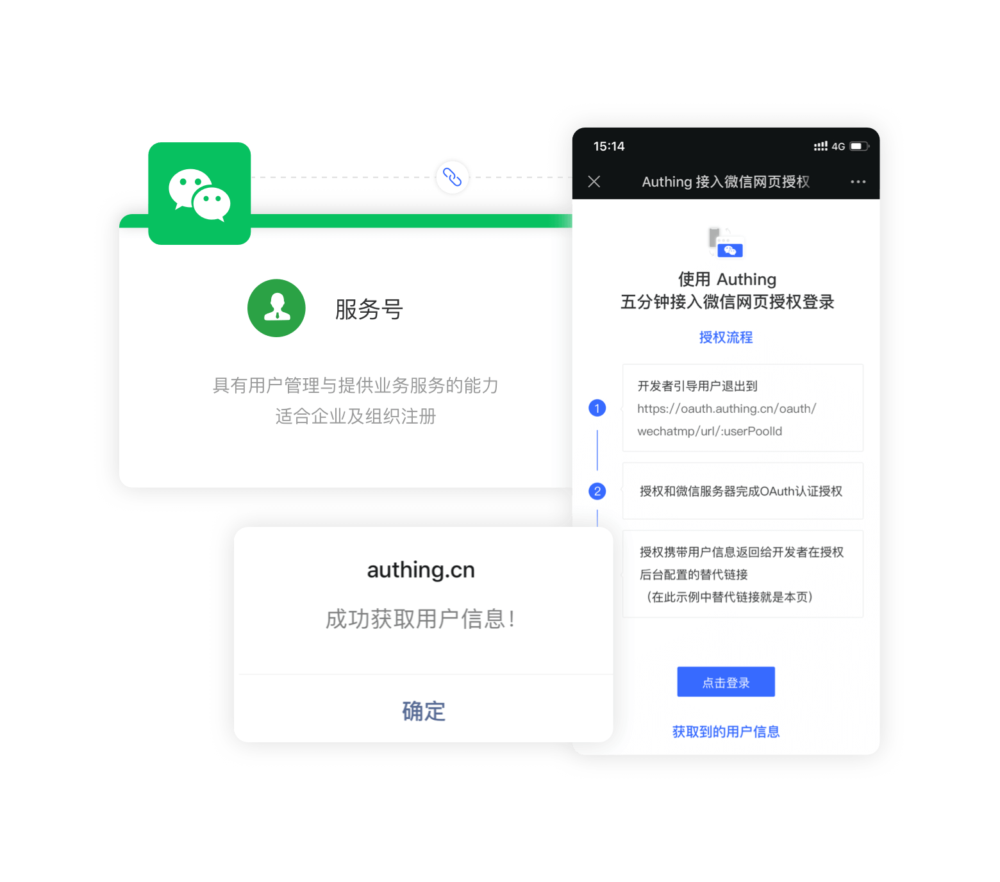

# WeChat web page authorization

<LastUpdated />

## Scenario introduction

- **Overview**: {{$localeConfig.brandName}} provides developers with a method to quickly obtain user information and complete login on the WeChat web page through the SDK. If a user visits a third-party web page or public account in the WeChat client, the WeChat web page authorization mechanism can be used to obtain basic user information and implement business logic.
- **Application scenario**: WeChat browser
- **End user preview**:



## Notes

- If you have not opened a {{$localeConfig.brandName}} console account, please go to [{{$localeConfig.brandName}} console](https://www.genauth.ai/) to register a developer account;

## Step 1: Create a WeChat service account on WeChat public platform

Go to [WeChat public platform](https://mp.weixin.qq.com/cgi-bin/readtemplate?t=register/step1_tmpl&lang=zh_CN) to create a **WeChat service account**.


After the creation is complete, you need to record the `AppID` and `AppSecret` of the application, which will be used later.


After that, you need to set the **web authorization domain name** to `core.genauth.ai` in the **Settings and Development -> Public Account Settings -> Function Settings** page of the WeChat public platform backend.
For security verification, the WeChat server needs to make a request verification with the GenAuth server. Developers need to download the txt file and record the **file name** and **text content**.


## Step 2: Configure WeChat web authorization application in the {{$localeConfig.brandName}} console

2.1 Please click the "Create Social Identity Source" button on the "Social Identity Source" page of the {{$localeConfig.brandName}} console to enter the "Select Social Identity Source" page.


2.2 On the "Select Social Identity Source" page, click the "WeChat" card to enter the "WeChat Login Mode" page.


2.3 Continue to click the "WeChat Web Authorization" login mode, or click **… Add** to open the "WeChat Web Authorization" configuration page.


2.4 On the "WeChat Web Authorization" configuration page, fill in the relevant field information.


| Field                            | Description                                                                                                                                                                                                                                                                                                                                                                                                                                                                                                          |
| -------------------------------- | -------------------------------------------------------------------------------------------------------------------------------------------------------------------------------------------------------------------------------------------------------------------------------------------------------------------------------------------------------------------------------------------------------------------------------------------------------------------------------------------------------------------- |
| Unique ID                        | a. The unique ID consists of lowercase letters, numbers, and -, and its length is less than 32 bits. <br />b. This is the unique ID of this connection and cannot be modified after setting.                                                                                                                                                                                                                                                                                                                         |
| Display Name                     | This name will be displayed on the button of the end user's login interface.                                                                                                                                                                                                                                                                                                                                                                                                                                         |
| Developer ID                     | The AppID obtained in step 1.                                                                                                                                                                                                                                                                                                                                                                                                                                                                                        |
| Developer password               | AppSecret obtained in step 1                                                                                                                                                                                                                                                                                                                                                                                                                                                                                         |
| Domain verification file name    | Domain verification file name obtained in step 1, for example: MP_verify_t1op33AC5w4rNIwE.txt                                                                                                                                                                                                                                                                                                                                                                                                                        |
| Domain verification file content | Domain verification file content obtained in step 1, for example: E1op22BD7w1rMItt                                                                                                                                                                                                                                                                                                                                                                                                                                   |
| Callback URL                     | Your business callback link                                                                                                                                                                                                                                                                                                                                                                                                                                                                                          |
| Scopes                           | Application authorization scope, snsapi_base (no pop-up authorization page, direct jump, can only obtain user openid), snsapi_userinfo (pop-up authorization page, nickname, gender, location can be obtained through openid. And, even if you don’t follow it, as long as the user authorizes, you can get its information). For details, please see [WeChat Official Account Webpage Authorization Documentation](https://developers.weixin.qq.com/doc/offiaccount/OA_Web_Apps/Wechat_webpage_authorization.html). |
| Login mode                       | After turning on "Login only mode", you can only log in to existing accounts and cannot create new accounts. Please choose carefully.                                                                                                                                                                                                                                                                                                                                                                                |
| Account identity association     | When "Account identity association" is not turned on, a new user is created by default when a user logs in through an identity source. After turning on "Account identity association", users can be allowed to log in directly to an existing account through "Field matching" or "Query binding".                                                                                                                                                                                                                  |

2.5 After the configuration is completed, click the "Create" or "Save" button to complete the creation.

## Step 3: Development access

> You can get the sample code here: [https://github.com/authing/wechat-eco-solution](https://github.com/authing/wechat-eco-solution), and visit the online [sample application](https://www.genauth.ai/sample-wx.html).

### Access using SDK

First, use CDN to import `authing-wxmp-sdk`

```html
<script src="https://cdn.authing.co/packages/authing-wxmp-sdk/<latest-version>/authing-wxmp-sdk.min.js"></script>
```

:::hint-info

Please replace `<latest-version>` with the latest version, which can be found at [https://www.npmjs.com/package/@authing/wxmp](https://www.npmjs.com/package/@authing/wxmp).

For detailed documentation on authing-wxmp-sdk, please see: [WeChat Web Authorization Login SDK](/reference/sdk-for-wxmp.md).

:::

#### Initialize SDK

Use user pool ID to initialize SDK:

```javascript
const authingWx = new AuthingWxmp({
  userPoolId: "YOUR_USERPOOLID",
});
```

#### Initiate WeChat authorization

Call `getAuthorizationUrl` method to obtain WeChat authorization login link, modify `window.location` to jump to WeChat login authorization page:

```javascript
window.location = authingWx.getAuthorizationUrl();
```

#### Get user information

After jumping back to the business callback link, use `getUserInfo` method to get user information:

```javascript
// If authingWx is not initialized on the callback page, it needs to be initialized first. For specific initialization methods, refer to the above
const { ok, userinfo, message } = authingWx.getUserInfo();
if (ok) {
  console.log(userinfo);
} else if (message) {
  // message contains an error message
  alert(message);
}
```

### Access using the embedded login component

Take `React` as an example.

#### Install `@authing/react-ui-components`

```bash

$ yarn add @authing/react-ui-components

# OR

$ npm install @authing/react-ui-components --save

```

#### Initialization

```js
import React from "react";
import ReactDOM from "react-dom";
import { AuthingGuard } from "@authing/react-ui-components";
//Introduce css file
import "@authing/react-ui-components/lib/index.min.css";

const App = () => {
  const appId = "GEN_AUTH_APP_ID";
  const onLogin = (userInfo) => {
    console.log(userInfo);
  };
  return <AuthingGuard appId={appId} onLogin={onLogin} />;
};

ReactDOM.render(<App />, root);
```

#### Usage

After initialization, open the page in WeChat and you will see the following button. Click it to authorize. After authorization, you will be redirected to the application callback link, and you can use [AuthenticationClient](/reference/sdk-for-node/authentication/AuthenticationClient.md) to obtain user information.


