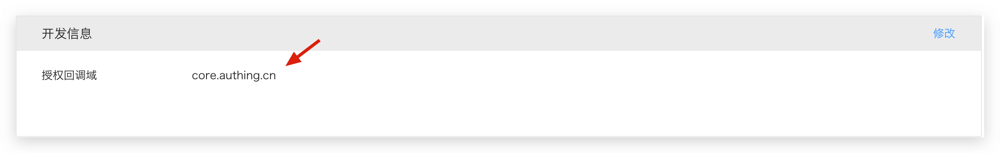

# PC WeChat QR code scanning

<LastUpdated />

## Scenario introduction

- **Overview**: PC WeChat QR code scanning login allows users to use WeChat identity to securely log in to third-party applications or websites. After enabling WeChat QR code scanning login in {{$localeConfig.brandName}}, you can quickly obtain WeChat user basic open information and help users realize basic open functions through {{$localeConfig.brandName}}.
- **Application scenario**: PC website
- **Terminal user preview image**:

## Notes

- If you have not opened a WeChat Open Platform account, please go to [WeChat Open Platform](https://open.weixin.qq.com/cgi-bin/frame?t=home/web_tmpl&lang=zh_CN) to register and log in first.
- If you have not opened a {{$localeConfig.brandName}} console account, please go to [{{$localeConfig.brandName}} console](https://www.genauth.ai/) to register a developer account.

## Step 1: Create a website application

Go to [WeChat Open Platform](https://open.weixin.qq.com/cgi-bin/frame?t=home/web_tmpl&lang=zh_CN), click **Admin Center -> Website Application -> Create Website Application**. After the creation is complete, you need to record the `AppID` and `AppSecret` of the application, which will be used later.

Please ensure that the application has obtained the permission for **WeChat login** and set the authorization callback domain to `core.genauth.ai`

## Step 2: Configure WeChat website application in the {{$localeConfig.brandName}} console

2.1 On the **Social Identity Source** page of the {{$localeConfig.brandName}} console, click the **Create Social Identity Source** button to enter the **Select Social Identity Source** page.

2.2 On the **Select Social Identity Source** page, click the **WeChat** card to enter the **WeChat Login Mode** page.

2.3 Continue to click **PC WeChat Scan** login mode, or click **Add** to open the **PC WeChat Scan** configuration page.

2.4 On the **PC WeChat Scan** configuration page, fill in the relevant field information.

| Field                        | Description                                                                                                                                                                                                                                                                                                                                                                                                                                                                                                                                                                                                                                   |
| ---------------------------- | --------------------------------------------------------------------------------------------------------------------------------------------------------------------------------------------------------------------------------------------------------------------------------------------------------------------------------------------------------------------------------------------------------------------------------------------------------------------------------------------------------------------------------------------------------------------------------------------------------------------------------------------- |
| Unique ID                    | a. The unique ID consists of lowercase letters, numbers, and -, and its length is less than 32 bits.  b. This is the unique ID of this connection and cannot be modified after setting.                                                                                                                                                                                                                                                                                                                                                                                                                                                  |
| Display Name                 | This name will be displayed on the button of the terminal user's login interface.                                                                                                                                                                                                                                                                                                                                                                                                                                                                                                                                                             |
| AppID                        | WeChat application ID.                                                                                                                                                                                                                                                                                                                                                                                                                                                                                                                                                                                                                        |
| AppSecret                    | WeChat Application Key                                                                                                                                                                                                                                                                                                                                                                                                                                                                                                                                                                                                                        |
| Callback URL                 | If you want to jump directly to the social identity source for authentication without any {{$localeConfig.brandName}} page in the middle, you can configure this parameter as the business callback address after successful authentication. {{$localeConfig.brandName}} will send the user's ID Token to this URL. For example, if your website domain is https://example.com, and the url for processing the {{$localeConfig.brandName}} callback request is /auth/callback, then you should fill it in as https://example.com/auth/callback. **This parameter has nothing to do with the callback link in the application configuration**. |
| Login Mode                   | After turning on **Login Only Mode**, you can only log in to existing accounts, and cannot create new accounts. Please choose carefully.                                                                                                                                                                                                                                                                                                                                                                                                                                                                                                      |
| Account Identity Association | When **Account Identity Association** is not turned on, a new user is created by default when a user logs in through an identity source. After turning on **Account Identity Association**, you can allow users to log in to existing accounts directly through **Field Match** or **Ask Binding**.                                                                                                                                                                                                                                                                                                                                           |

2.5 After the configuration is completed, click the **Create** or **Save** button to complete the creation.

## Step 3: Development Access

- **Recommended Development Access Method**: Use Hosted Login Page
- **Pros and Cons**: Simple operation and maintenance, which is handled by {{$localeConfig.brandName}}. Each user pool has an independent secondary domain name; if you need to embed it into your application, you need to log in using the pop-up mode, that is: after clicking the login button, a window will pop up with the login page hosted by {{$localeConfig.brandName}}, or redirect the browser to the login page hosted by {{$localeConfig.brandName}}.
- **Detailed access method**:

  3.1 Create an application in the {{$localeConfig.brandName}} console. For details, see: [How to create an application in {{$localeConfig.brandName}}](/guides/app-new/create-app/create-app.md)

  3.2 On the created **PC WeChat QR code scanning** identity source connection details page, open and associate an application created in the {{$localeConfig.brandName}} console
  

  3.3 Click the **Experience Login** button in the {{$localeConfig.brandName}} console application, and experience **PC WeChat QR code scanning** login in the pop-up login window
  

