# WeChat Official Account Follow

<LastUpdated />

## Scenario Introduction

- **Overview**: **Follow Official Account Login** refers to the process of generating a WeChat official account QR code on a PC website, and users use WeChat APP to scan the code and automatically log in after following the official account. Using **Follow Official Account Login** can quickly attract traffic to the official account and improve brand stickiness. With the **Follow Official Account Login** of {{$localeConfig.brandName}}, you hardly need to develop any code, just simple configuration, and it can be completed in a few minutes.
- **Application scenario**: PC website
- **End user preview image**:

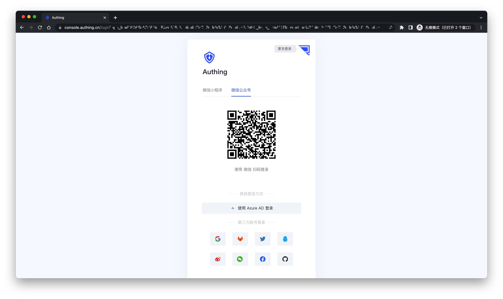

## Notes

- Due to the requirements of the WeChat platform, only service accounts have the [Generate a QR code with parameters](https://developers.weixin.qq.com/doc/offiaccount/Account_Management/Generating_a_Parametric_QR_Code.html) API capability. Please make sure that your public account is a service account type.
- If you have not opened a {{$localeConfig.brandName}} console account, please go to the [{{$localeConfig.brandName}} console](https://www.genauth.ai/) to register a developer account.

## Step 1: Enable server configuration

### Get public account development information

You can get the **Developer ID (AppID)** and **Developer Password (AppSecret)** on the **Settings and Development -> Basic Configuration** page in the WeChat public platform backend, which will be used in step 2.
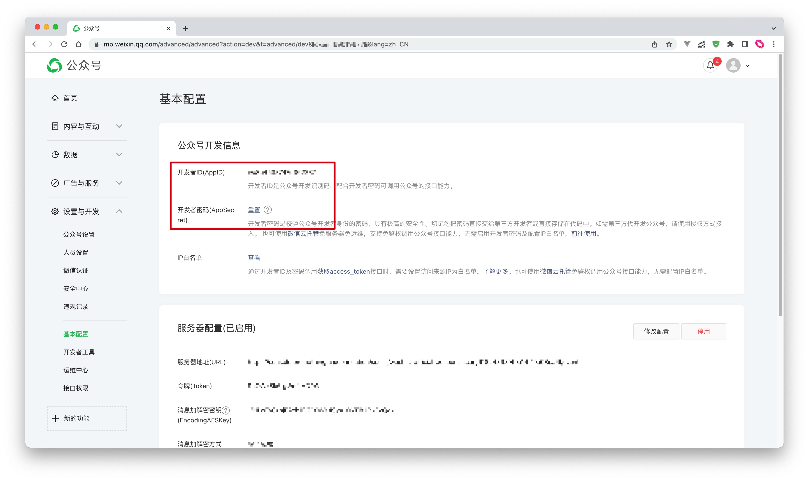

### Set IP whitelist

You need to add the IP of the {{$localeConfig.brandName}} server to the IP whitelist of the WeChat public account. You can [click here](https://core.genauth.ai/api/system/public-ips) to get the external IP list of the {{$localeConfig.brandName}} server.
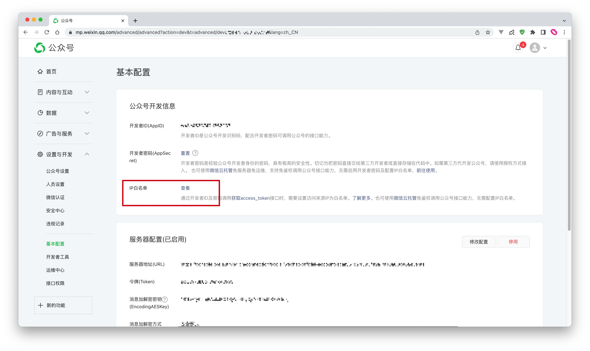

### Add API permissions

You need to add the [Generate a Parametric QR Code](https://developers.weixin.qq.com/doc/offiaccount/Account_Management/Generating_a_Parametric_QR_Code.html) interface permission on the WeChat Official Account Platform Settings and Development-Interface Permissions page:
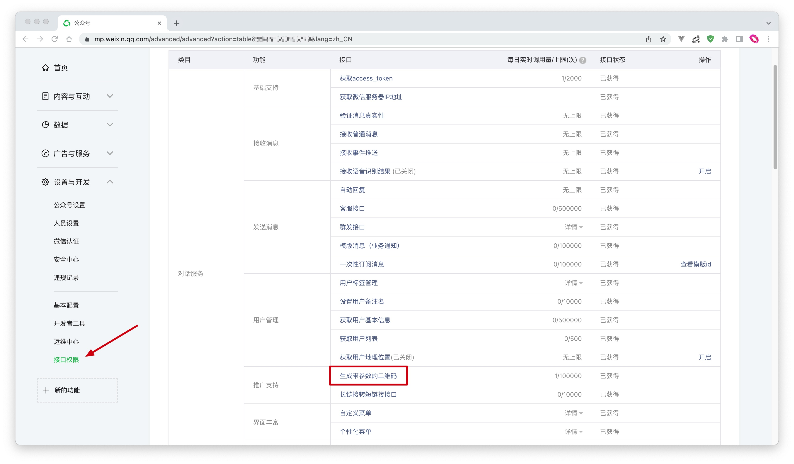

### Select the server configuration mode

You can enable server configuration on the **Settings and Development -> Basic Configuration** page in the WeChat Official Account Platform backend. When a user scans the official account QR code and follows the official account, {{$localeConfig.brandName}} can receive the user's scan and follow events to complete the login.

Since only one WeChat server configuration can be set, you need to choose two different modes according to your specific scenario:

- **Mode 1**: Set the server address to the {{$localeConfig.brandName}} server endpoint. This mode is the simplest, but all events of the WeChat official account will be pushed to the {{$localeConfig.brandName}} server, and you will lose other events except scanning and following.
- **Mode 2**: Set the server address to your own server, and then forward the scanning and following events to the {{$localeConfig.brandName}} server endpoint. This mode requires some development work, but will not lose events, and is conducive to more expansion based on official account events in the future.

#### Mode 1

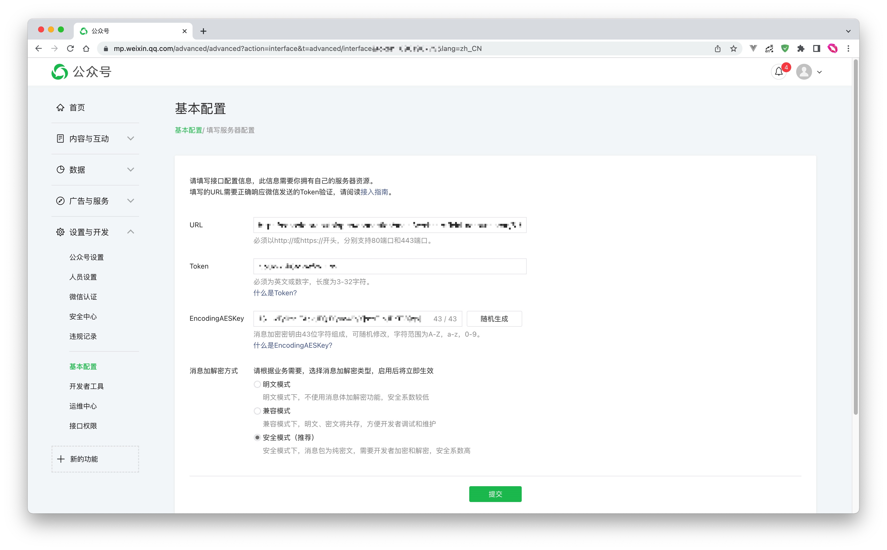

- **URL**: Set to `https://core.genauth.ai/connections/social/{Identifier}/{USERPOOL_ID}/events`, replace `{Identifier}` with the **unique identifier** you entered in the {{$localeConfig.brandName}} console configuration area, and replace `{USERPOOL_ID}` with your [User Pool ID](/guides/faqs/get-userpool-id-and-secret).
  > If you don't have an `Identifier` yet, you can create an identity source later and come back here to modify it.
- **Token**: You can set the Token in the WeChat official account to any string. It must be English or numbers and 3-32 characters long. Make sure the token you configure in the {{$localeConfig.brandName}} console is consistent with the token provided by the official account you need to connect to.
- **EncodingAESKey**: The message encryption key consists of 43 characters and can be modified randomly. The character range is A-Z, a-z, 0-9.
- **Message encryption and decryption method**: Please select according to business needs. It is recommended to use the safe mode.

<!--
Don't click Save for now. You need to fill in the above configuration and `AppID` and `AppSecret` in the {{$localeConfig.brandName}} console. Select **WeChat** in **Connect Identity Source - Social Login**, select **WeChat Official Account** as the connection method, and fill in the above configuration:

-->

Click Submit to save, and don’t forget to enable this server configuration:
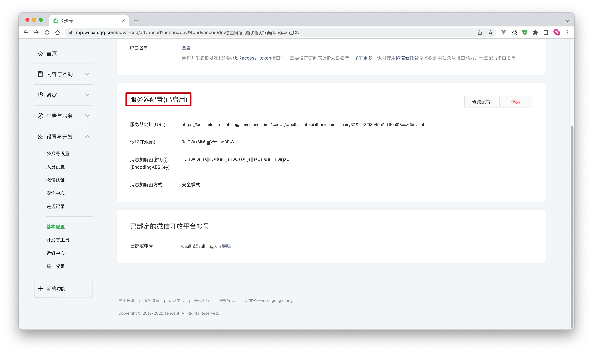

#### Mode 2

The configuration process is exactly the same as Mode 1. You only need to set `URL` to your own server address. You need to complete the interface verification and message forwarding operations on the server endpoint you configured.

For the specific process and sample code, please see this [Demo](https://github.com/Authing/authing-wechat-official-account).

## Step 2: Configure WeChat Official Account Follow in the {{$localeConfig.brandName}} console

2.1 On the **Social Identity Source** page of the {{$localeConfig.brandName}} console, click the **Create Social Identity Source** button to enter the **Select Social Identity Source** page.

2.2 On the **Select Social Identity Source** page, click the **WeChat** card to enter the **WeChat Login Mode** page.

2.3 Continue to click **WeChat Official Account Follow** Login Mode, or click **Add** to open the **WeChat Official Account Follow** configuration page.
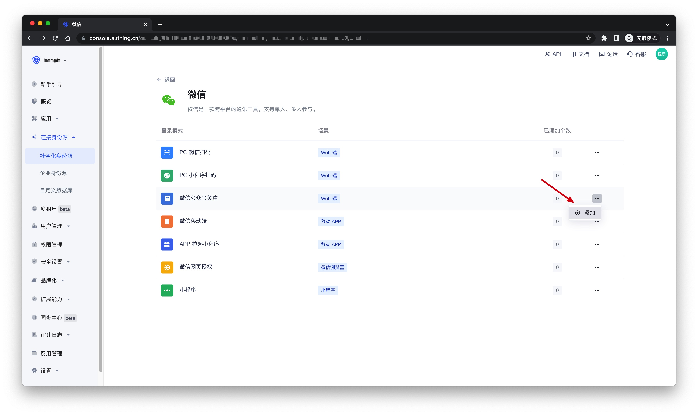

2.4 On the **WeChat Official Account Follow** configuration page, fill in the relevant field information obtained from step 1.
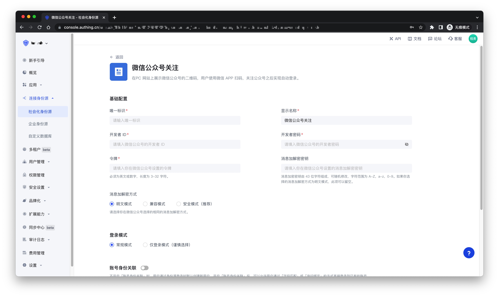

| Field                                    | Description                                                                                                                                                                                                                                                                                             |
| ---------------------------------------- | ------------------------------------------------------------------------------------------------------------------------------------------------------------------------------------------------------------------------------------------------------------------------------------------------------- |
| Unique ID                                | a. The unique ID consists of lowercase letters, numbers, and -, and its length is less than 32 bits.  b. This is the unique ID of this connection and cannot be modified after setting.                                                                                                            |
| Display Name                             | This name will be displayed on the button of the terminal user's login interface.                                                                                                                                                                                                                       |
| Developer ID                             | The developer ID is the public account development identification code. Together with the developer password, the public account's interface capabilities can be called.                                                                                                                                |
| Developer Password                       | The developer password is the password to verify the public account developer identity.                                                                                                                                                                                                                 |
| Token                                    | Must be English or numeric, with a length of 3-32 characters.                                                                                                                                                                                                                                           |
| Message Encryption and Decryption Key    | The message encryption key consists of 43 characters and can be modified randomly. The character range is A-Z, a-z, 0-9. If you choose the message encryption and decryption method as plain text mode, this item can be left blank.                                                                    |
| Message Encryption and Decryption Method | Please choose the same message encryption and decryption method you chose in the WeChat public account.                                                                                                                                                                                                 |
| Login mode                               | After enabling **Login-only mode**, you can only log in to existing accounts, and cannot create new accounts. Please choose carefully.                                                                                                                                                                  |
| Account identity association             | When **Account identity association** is not enabled, a new user is created by default when a user logs in through an identity source. After enabling **Account identity association**, users can be allowed to log in directly to an existing account through **Field matching** or **Query binding**. |

2.5 After the configuration is completed, click **Create** or **Save** to complete the creation.

## Step 3: Development access

- **Recommended development access method**: Use hosted login page
- **Pros and cons description**: Simple operation and maintenance, which is handled by {{$localeConfig.brandName}}. Each user pool has an independent secondary domain name; if you need to embed it in your application, you need to use the pop-up mode to log in, that is: after clicking the login button, a window will pop up with the login page hosted by {{$localeConfig.brandName}}, or redirect the browser to the login page hosted by {{$localeConfig.brandName}}.
- **Detailed access method**:

  3.1 Create an application in the {{$localeConfig.brandName}} console. For details, see: [How to create an application in {{$localeConfig.brandName}}](/guides/app-new/create-app/create-app.md)

  3.2 On the created **WeChat Official Account Follow** identity source connection details page, open and associate an application created in the {{$localeConfig.brandName}} console
  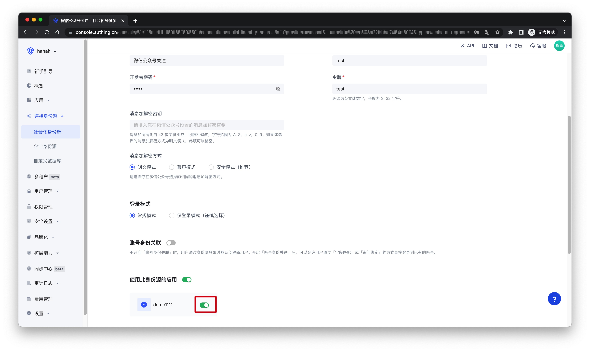

  3.3 Click the **Experience Login** button in the {{$localeConfig.brandName}} console application, and experience the **WeChat Official Account Follow** login in the pop-up login window
  

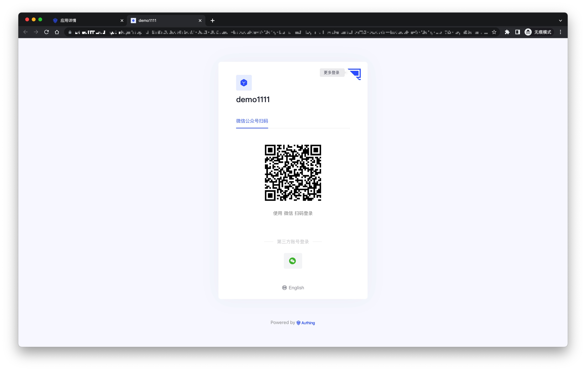

## How to cancel the official account's authorization to GenAuth as a third-party platform?

1. Log in to the WeChat official account platform;
2. Enter the "Settings and Development - Official Account Settings - Authorization Management" page;
3. As shown in the figure below, click "View Platform Details";
   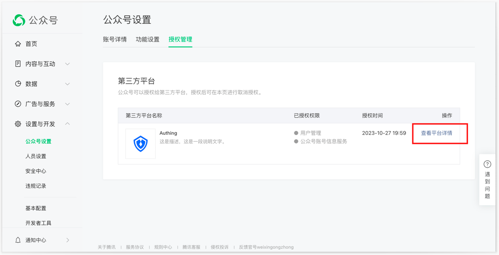
4. Enter the "Authorization Management" page, confirm the information, and click the "Cancel Authorization" button below to cancel the current official account's authorization to GenAuth as a third-party platform;
   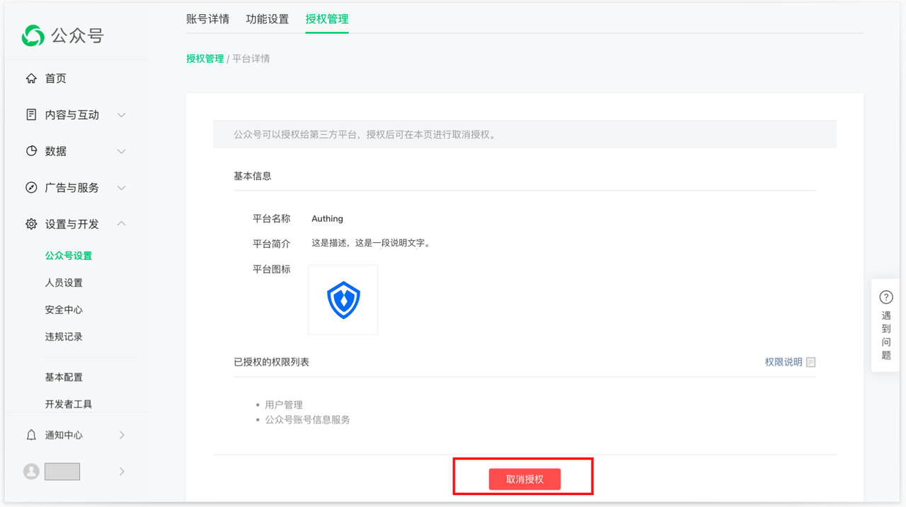
5. After canceling the authorization in the above figure, GenAuth will be automatically unbound. You can return to the GenAuth console page to view it, and the page will return to the state before authorization.
