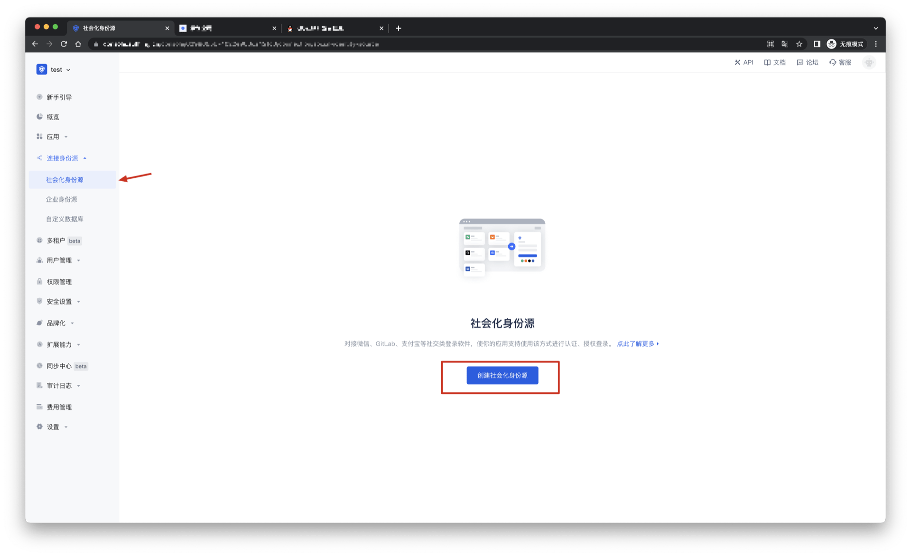

# Sina Weibo

<LastUpdated/>

## Scenario Introduction

- **Overview**: Sina Weibo social login is a user's secure login to a third-party application or website using Sina Weibo as the identity source. Configure and enable Sina Weibo social login in {{$localeConfig.brandName}}, and you can quickly obtain basic open information of Sina Weibo through {{$localeConfig.brandName}} and help users realize password-free login.
- **Application scenario**: Website access (PC), mobile application (MOBILE)
- **Terminal user preview image**:

## Notes

- If you have not opened a Weibo Open Platform account, please go to [Weibo Open Platform](https://open.weibo.com/connect) to register a developer account.
- You need to pass identity authentication before you can create an application.
- If you have not opened a {{$localeConfig.brandName}} console account, please go to [{{$localeConfig.brandName}} console](https://www.genauth.ai/) to register a developer account.

## Step 1: Create an application on Weibo Open Platform

Go to [Weibo Open Platform](https://open.weibo.com/connect) and follow the official instructions to create a website application.

Click the avatar icon in the upper right corner of the page, select Developer Information to perform basic information and identity authentication, and create a website application after the authentication is passed. If you have any unsolvable problems, you can send a private message to [Weibo Open Platform](https://weibo.com/1904178193) for consultation.

During the application creation process, you need to configure the allowed callback address. Please use the following settings: `https://core.genauth.ai/connection/social/<Unique Identifier>/<USERPOOL_ID>/callback`. You need to replace `<Unique Identifier>` with your `Unique Identifier` and `<USERPOOL_ID>` with your [User Pool ID](/guides/faqs/get-userpool-id-and-secret.md)

## Step 2: Configure Sina Weibo in the {{$localeConfig.brandName}} console

2.1 Please click the "Create Social Identity Source" button on the "Social Identity Source" page of the {{$localeConfig.brandName}} console to enter the "Select Social Identity Source" page.

2.2 Please go to the {{$localeConfig.brandName}} console's "Social Identity Source" - "Select Social Identity Source" page, click the "Sina Weibo" identity source button to enter the "Sina Weibo Login Mode" page.

2.3 Please go to the {{$localeConfig.brandName}} console's "Social Identity Source" - "Sina Weibo" page to configure the relevant field information.

| Field/Function               | Description                                                                                                                                                                                                                                                                          |
| ---------------------------- | ------------------------------------------------------------------------------------------------------------------------------------------------------------------------------------------------------------------------------------------------------------------------------------ |
| Unique ID                    | a. The unique ID consists of lowercase letters, numbers, and -, and is less than 32 bits long. b. This is the unique ID for this connection and cannot be modified after setting.                                                                                                    |
| Display Name                 | This name will be displayed on the button of the terminal user's login interface.                                                                                                                                                                                                    |
| APP ID                       | Sina Weibo ID, which needs to be obtained on Weibo Open Platform.                                                                                                                                                                                                                    |
| App Secret                   | Sina Weibo key, which needs to be obtained on Weibo Open Platform.                                                                                                                                                                                                                   |
| Callback URL                 | You can fill in your business callback address. After the user completes the login, the browser will jump to this address.                                                                                                                                                           |
| Scopes                       | By default, {{$localeConfig.brandName}} will only request authorization for basic user information (such as avatar, nickname, etc.) from the user. If you need more advanced permissions, you can check the corresponding options.                                                   |
| Callback URL                 | Sina Weibo valid jump URI. This URL needs to be configured on Weibo Open Platform.                                                                                                                                                                                                   |
| Login Mode                   | After turning on "Login Only Mode", you can only log in to existing accounts, and cannot create new accounts. Please choose carefully.                                                                                                                                               |
| Account Identity Association | When "Account Identity Association" is not turned on, a new user is created by default when the user logs in through the identity source. After enabling "Account Identity Association", users can log in directly to existing accounts through "Field Matching" or "Query Binding". |

After configuration is complete, click the "Create" or "Save" button to complete the creation.

After creating the Sina Weibo identity source on the {{$localeConfig.brandName}} console, you need to configure the callback address to the website callback domain in the platform information on the Weibo Open Platform.

## Step 3: Development Access

- **Recommended Development Access Method**: Use Hosted Login Page

- **Pros and Cons Description**: Simple operation and maintenance, {{$localeConfig.brandName}} is responsible for operation and maintenance. Each user pool has an independent secondary domain name; if you need to embed it into your application, you need to use the pop-up mode to log in, that is: after clicking the login button, a window will pop up with the content of the {{$localeConfig.brandName}} hosted login page, or redirect the browser to the {{$localeConfig.brandName}} hosted login page.

- **Detailed access method**:

  3.1 Create an application in the {{$localeConfig.brandName}} console. For details, see: [How to create an application in {{$localeConfig.brandName}}](/guides/app-new/create-app/create-app.md)

  3.2 On the created Sina Weibo identity source connection details page, open and associate an application created in the {{$localeConfig.brandName}} console

3.3 Experience Sina Weibo third-party login on the login page

