# Xiaomi Mobile

<LastUpdated />

## Scenario Introduction

### Overview

Xiaomi social login allows users to log in to third-party applications or websites securely using Xiaomi as the identity source. Configure and enable Xiaomi social login in {{$localeConfig.brandName}} to quickly obtain Xiaomi's basic open information and help users log in without passwords through {{$localeConfig.brandName}}.

### Application Scenario

Mobile

### Terminal User Preview

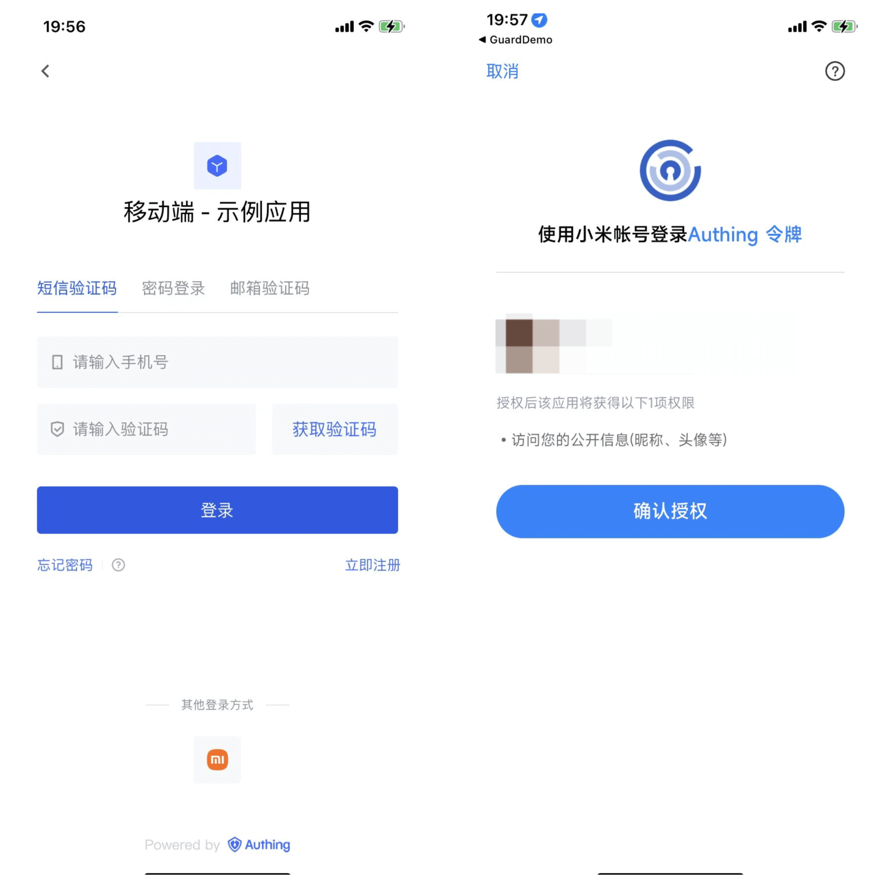

## Notes

- If you don't have a Xiaomi account yet, please go to [Xiaomi Open Platform](https://dev.mi.com/platform) to register as a developer.
- If you have not opened a {{$localeConfig.brandName}} console account, please go to [{{$localeConfig.brandName}} console](https://www.genauth.ai/) to register a developer account

## Step 1: Create a mobile/tablet application on Xiaomi

Log in to [Xiaomi Open Platform](https://dev.mi.com/platform) and click **Management Center**:

On the **Management Center** page, click **Account Services**:
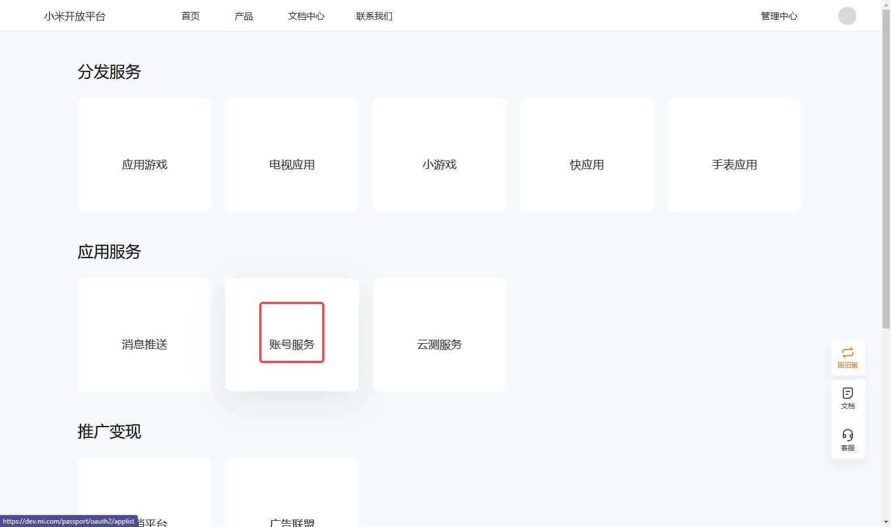

On the **Account Services** page, click **Create a new application** and select **Mobile/Tablet Application**:
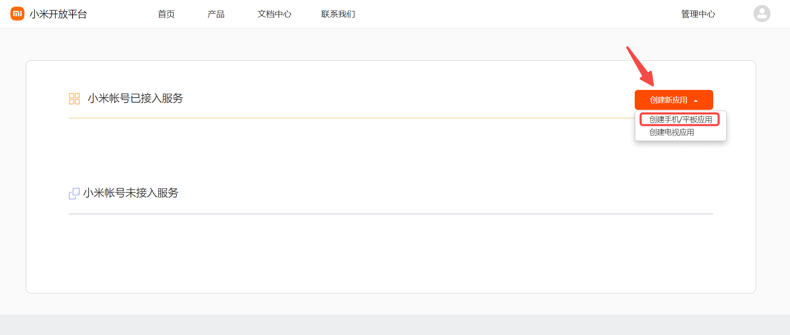

On the **Create New Application** page, fill in the application information and click Create:
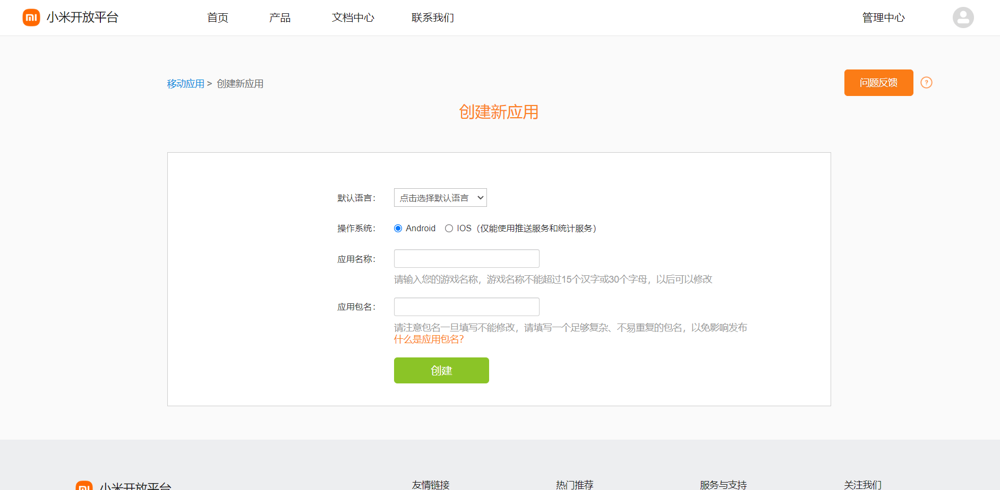

Connect the "Account Access Service" to the newly created application:

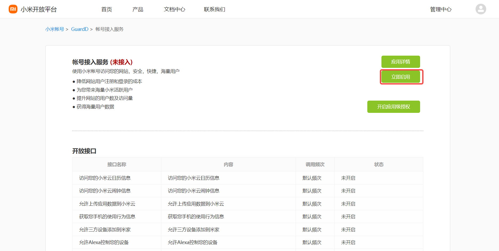

Configure the **Application Callback Address** in the pop-up window

- Application Callback Address: Fill in `https://core.genauth.ai/connection/social/{Unique Identifier}/{User Pool ID}/callback`, you need to replace `{Unique Identifier}` with the `Unique Identifier` filled in for the identity source you are creating in {{$localeConfig.brandName}}, and `{User Pool ID}` with your [User Pool ID](/guides/faqs/get-userpool-id-and-secret.md)

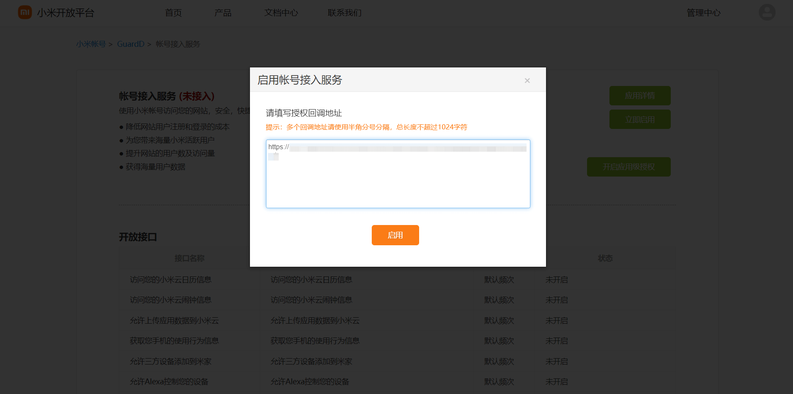

After the creation is complete, check the application details and record the `AppID` and `AppSecret`, which will be used in the next step.
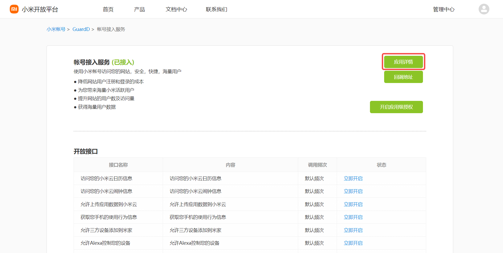
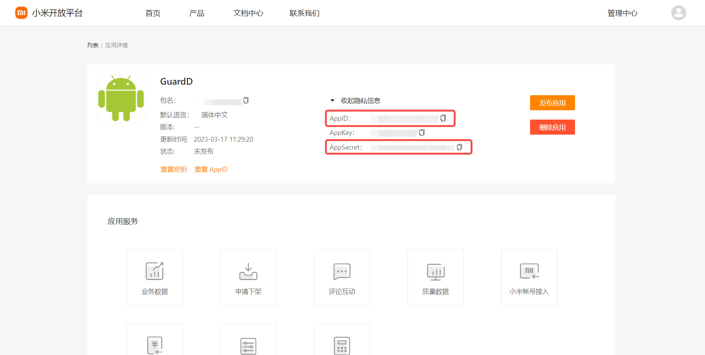

## Step 2: Configure Xiaomi application configuration in the {{$localeConfig.brandName}} console

2.1 Please click the "Create Social Identity Source" button on the "Social Identity Source" page of the {{$localeConfig.brandName}} console to enter the "Select Social Identity Source" page.

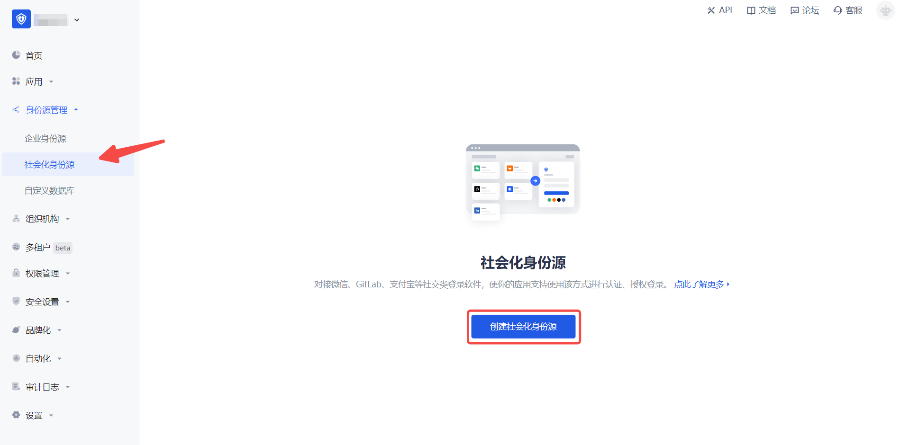

2.2 Please go to the {{$localeConfig.brandName}} console's "Social Identity Source" - "Select Social Identity Source" page, click the "Xiaomi" identity source button to enter the "Xiaomi Mobile Login Mode" page.

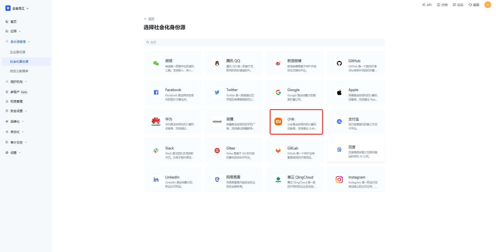

2.3 Please go to the {{$localeConfig.brandName}} console's "Social Identity Source" - "Xiaomi Mobile" page to configure the relevant field information.
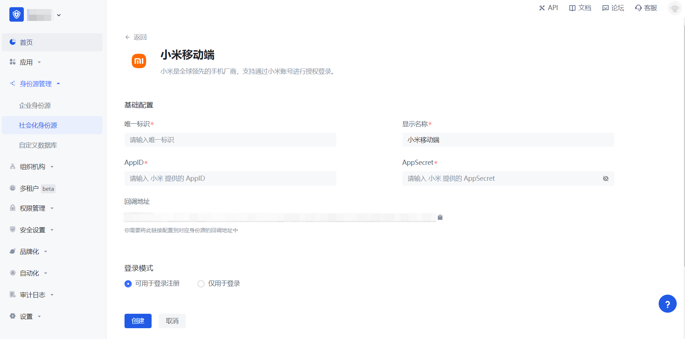

| Field            | Description                                                                                                                                                                                  |
| ---------------- | -------------------------------------------------------------------------------------------------------------------------------------------------------------------------------------------- |
| Unique ID        | a. The unique ID consists of lowercase letters, numbers, and -, and its length is less than 32 bits.  b. This is the unique ID of this connection and cannot be modified after setting. |
| Display Name     | This name will be displayed on the button of the terminal user's login interface.                                                                                                            |
| AppID            | The Xiaomi application ID obtained in the previous step.                                                                                                                                     |
| AppSecret        | The Xiaomi application Secret obtained in the previous step.                                                                                                                                 |
| Callback address | Xiaomi valid jump URI. This URL needs to be configured on the authorization callback page of the Xiaomi Open Platform mobile application.                                                    |
| Login mode       | After turning on "Login only mode", you can only log in to existing accounts, and cannot create new accounts. Please choose carefully.                                                       |

2.4 After the configuration is completed, click the "Create" or "Save" button to complete the creation.

After creating the Xiaomi mobile identity source on the {{$localeConfig.brandName}} console, you need to configure the callback address to the authorization callback address in the mobile application information on the Xiaomi Open Platform.

## Step 3: Development access

- **Recommended development access method**: SDK
- **Pros and cons description**: Simple operation and maintenance, {{$localeConfig.brandName}} is responsible for operation and maintenance. Each user pool has an independent secondary domain name; if you need to embed it in your application, you need to log in using the pop-up mode, that is, after clicking the login button, a window will pop up with the login page hosted by {{$localeConfig.brandName}}, or redirect the browser to the login page hosted by {{$localeConfig.brandName}}.
- **Detailed access method**:

  3.1 Create an application in the {{$localeConfig.brandName}} console. For details, see [How to create an application in {{$localeConfig.brandName}}](/guides/app-new/create-app/create-app.md)

  3.2 On the created "Xiaomi Mobile" identity source connection details page, open and associate an application created in the {{$localeConfig.brandName}} console

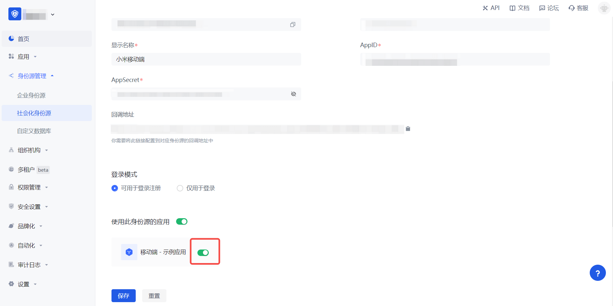

3.3 Experience Xiaomi third-party login on the login page (as shown in the [end user preview](#end user preview)).
