# Xiaomi

<LastUpdated />

## Scenario Introduction

- **Overview**: Xiaomi social login allows users to log in to third-party applications or websites securely using Xiaomi as the identity source. Configure and enable Xiaomi social login in {{$localeConfig.brandName}} to quickly obtain Xiaomi's basic open information and help users log in without passwords through {{$localeConfig.brandName}}.
- **Application scenario**: PC website
- **Terminal user preview image**:

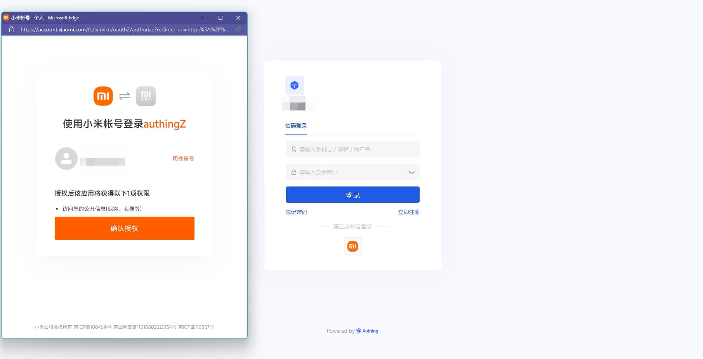

## Notes

- If you don't have a Xiaomi account yet, please go to [Xiaomi Open Platform](https://dev.mi.com/platform) to register as a developer.
- If you have not opened a {{$localeConfig.brandName}} console account, please go to [{{$localeConfig.brandName}} console](https://www.genauth.ai/) to register a developer account

## Step 1: Create a web app on Xiaomi

Log in to [Xiaomi Open Platform](https://dev.mi.com/platform) and click **Management Center**:
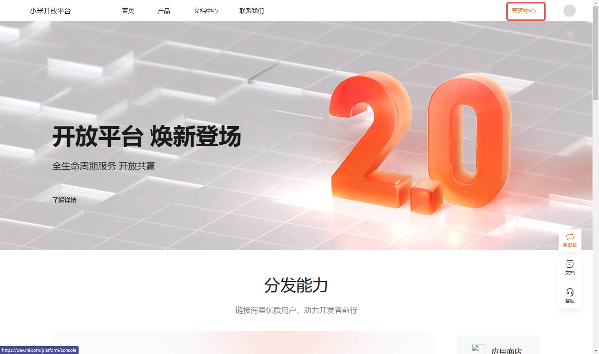

On the **Management Center** page, click **Account Services**:
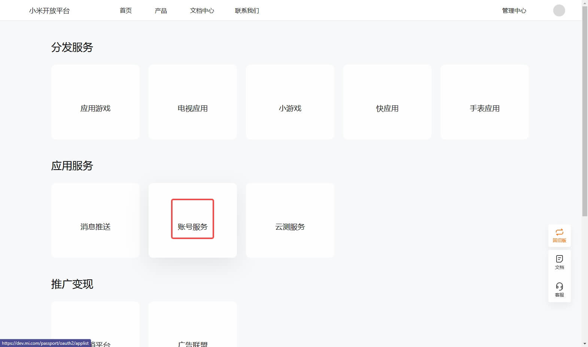

On the **Account Services** page, click **Create a new app** and select **Web application**:
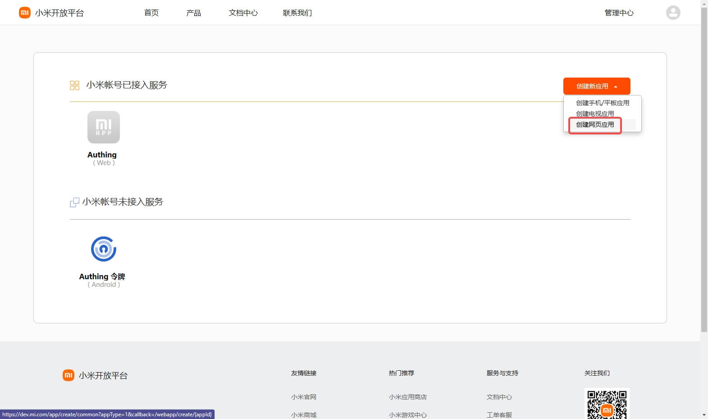

On the **Create application** page, fill in the application name and click OK:
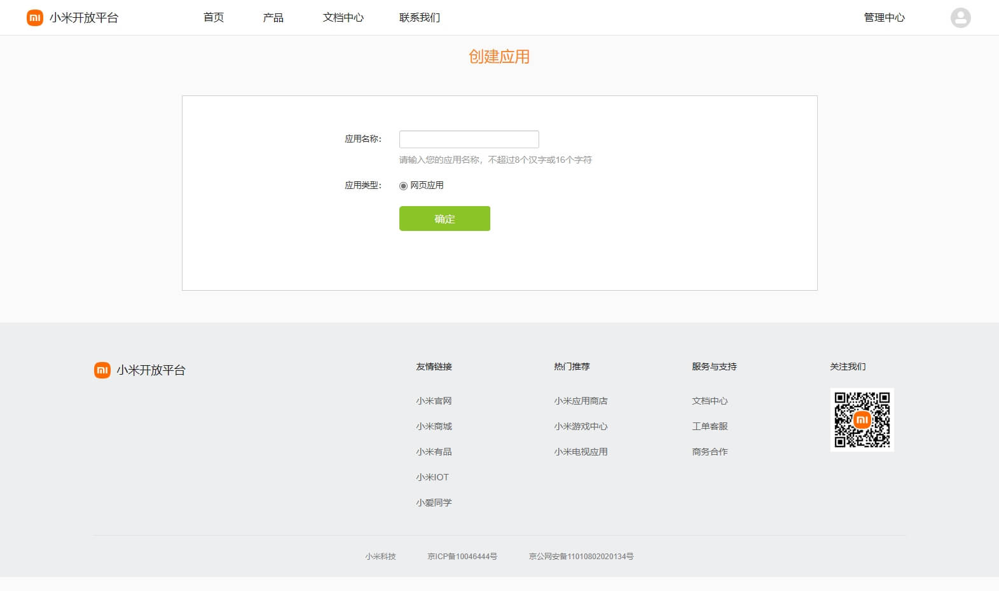

After the creation is complete, return to the **Account Service** page, click the newly created application, and select Enable immediately

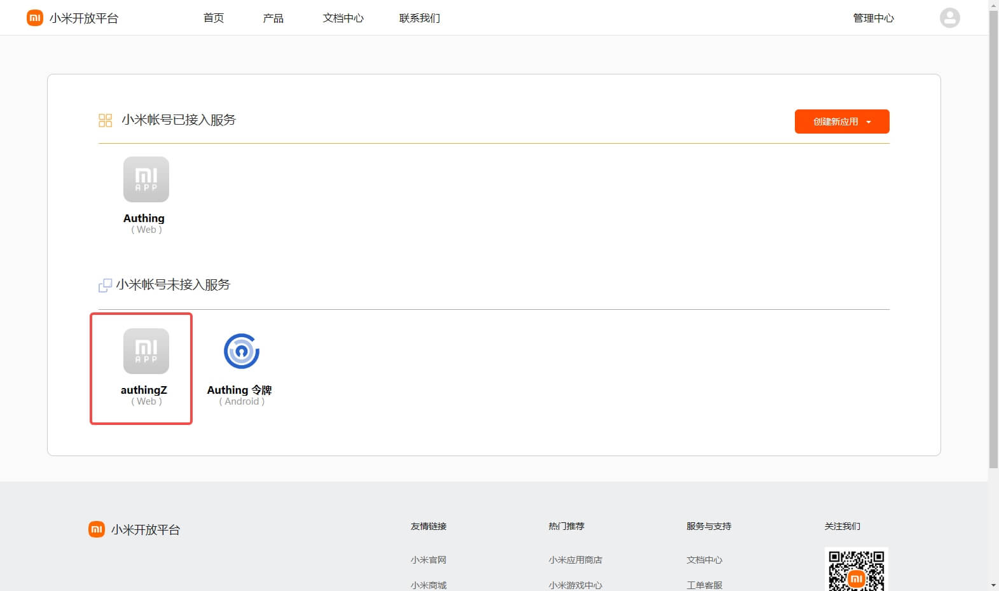

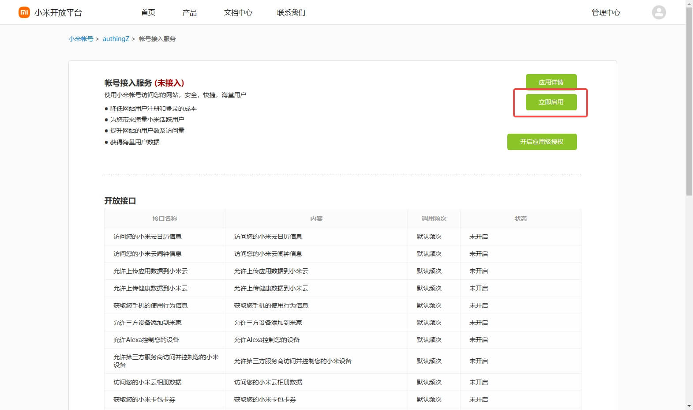

Configure the **Application callback address** in the pop-up window

- Application callback address: Fill in `https://core.genauth.ai/connection/social/{Unique ID}/{User Pool ID}/callback`, you need to replace `{Unique ID}` with the `Unique ID` filled in the identity source you are creating in {{$localeConfig.brandName}}, and `{User Pool ID}` with your [User Pool ID](/guides/faqs/get-userpool-id-and-secret.md)

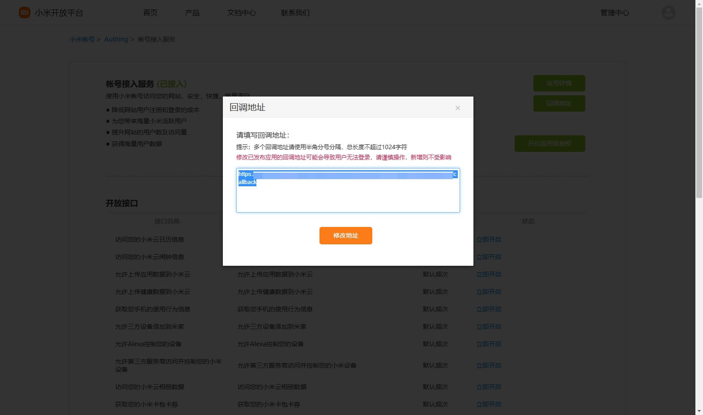

After the creation is complete, check the application details and record the `APP ID` and `APP SECRET`, which will be used in the next step.
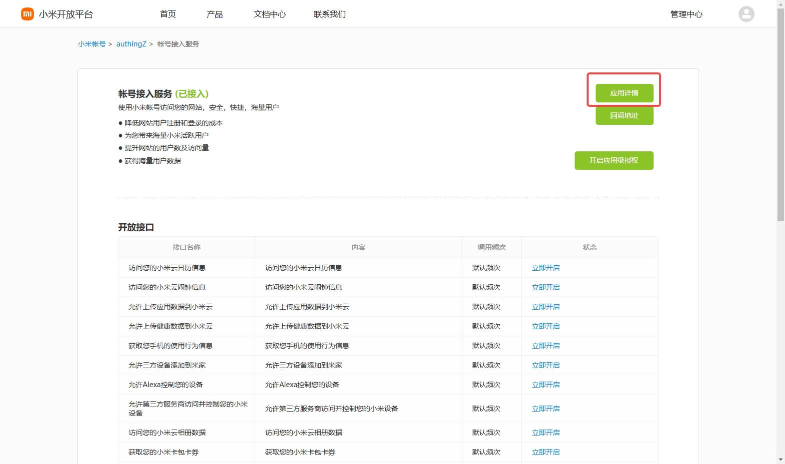
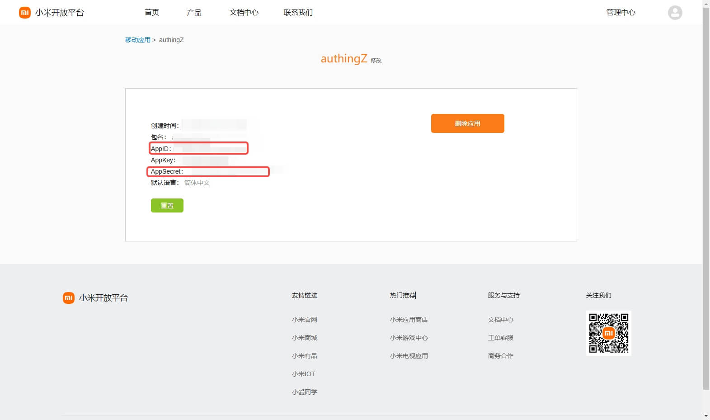

## Step 2: Configure Xiaomi application configuration in the {{$localeConfig.brandName}} console

2.1 Please click the "Create Social Identity Source" button on the "Social Identity Source" page of the {{$localeConfig.brandName}} console to enter the "Select Social Identity Source" page.

2.2 On the "Select Social Identity Source" page, click the "Xiaomi" card.
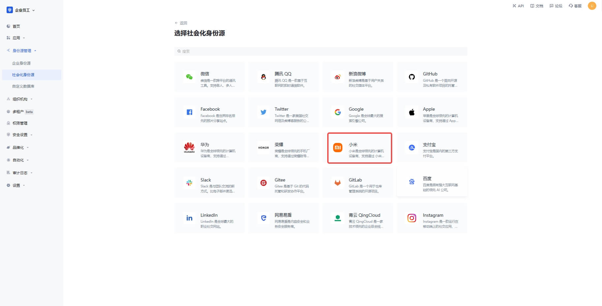

2.3 On the "Xiaomi" configuration page, fill in the relevant field information.
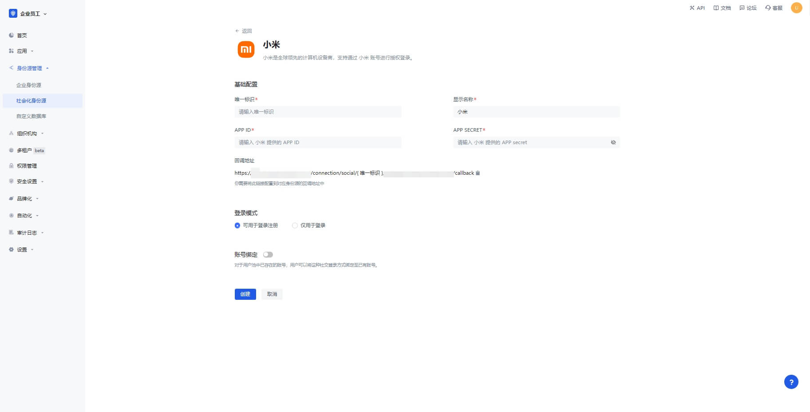

| Field                        | Description                                                                                                                                                                                                                                                                                         |
| ---------------------------- | --------------------------------------------------------------------------------------------------------------------------------------------------------------------------------------------------------------------------------------------------------------------------------------------------- |
| Unique ID                    | a. The unique ID consists of lowercase letters, numbers, and -, and its length is less than 32 bits.  b. This is the unique ID of this connection and cannot be modified after setting.                                                                                                        |
| Display Name                 | This name will be displayed on the button of the terminal user's login interface.                                                                                                                                                                                                                   |
| APP ID                       | The Xiaomi application ID obtained in the previous step.                                                                                                                                                                                                                                            |
| APP Secret                   | The Xiaomi application Secret obtained in the previous step.                                                                                                                                                                                                                                        |
| Login mode                   | After turning on "Login only mode", you can only log in to existing accounts, and you cannot create new accounts. Please choose carefully.                                                                                                                                                          |
| Account identity association | When "Account identity association" is not turned on, a new user is created by default when a user logs in through an identity source. After turning on "Account identity association", users can be allowed to log in directly to an existing account through "Field matching" or "Query binding". |

2.4 After the configuration is completed, click the "Create" or "Save" button to complete the creation.

## Step 3: Development access

- **Recommended development access method**: Use hosted login page
- **Pros and cons description**: Simple operation and maintenance, which is handled by {{$localeConfig.brandName}}. Each user pool has an independent secondary domain name; if you need to embed it in your application, you need to use the pop-up mode to log in, that is: after clicking the login button, a window will pop up with the login page hosted by {{$localeConfig.brandName}}, or redirect the browser to the login page hosted by {{$localeConfig.brandName}}.
- **Detailed access method**:

  3.1 Create an application in the {{$localeConfig.brandName}} console. For details, see: [How to create an application in {{$localeConfig.brandName}}](/guides/app-new/create-app/create-app.md)

  3.2 On the created "Xiaomi" identity source connection details page, open and associate an application created in the {{$localeConfig.brandName}} console

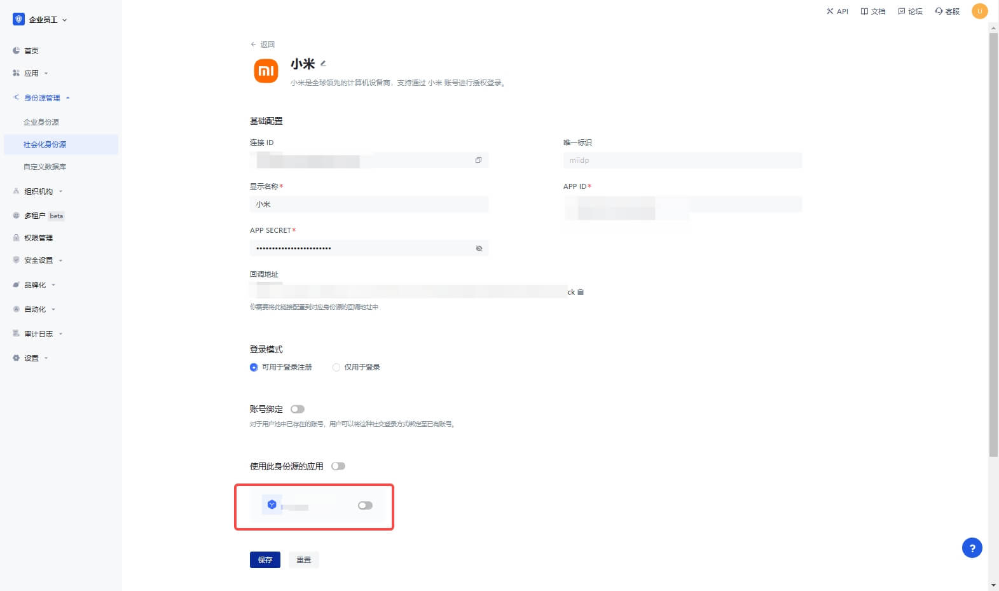

3.3 Click the "Experience Login" button of the {{$localeConfig.brandName}} console application to experience the "Xiaomi" login in the pop-up login window

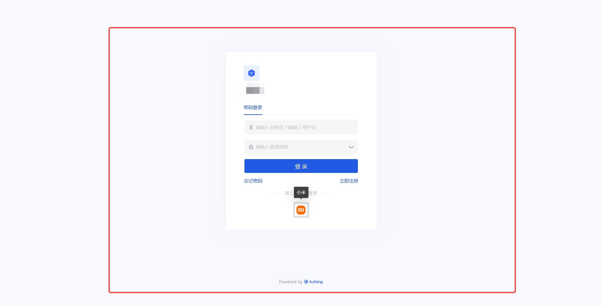
