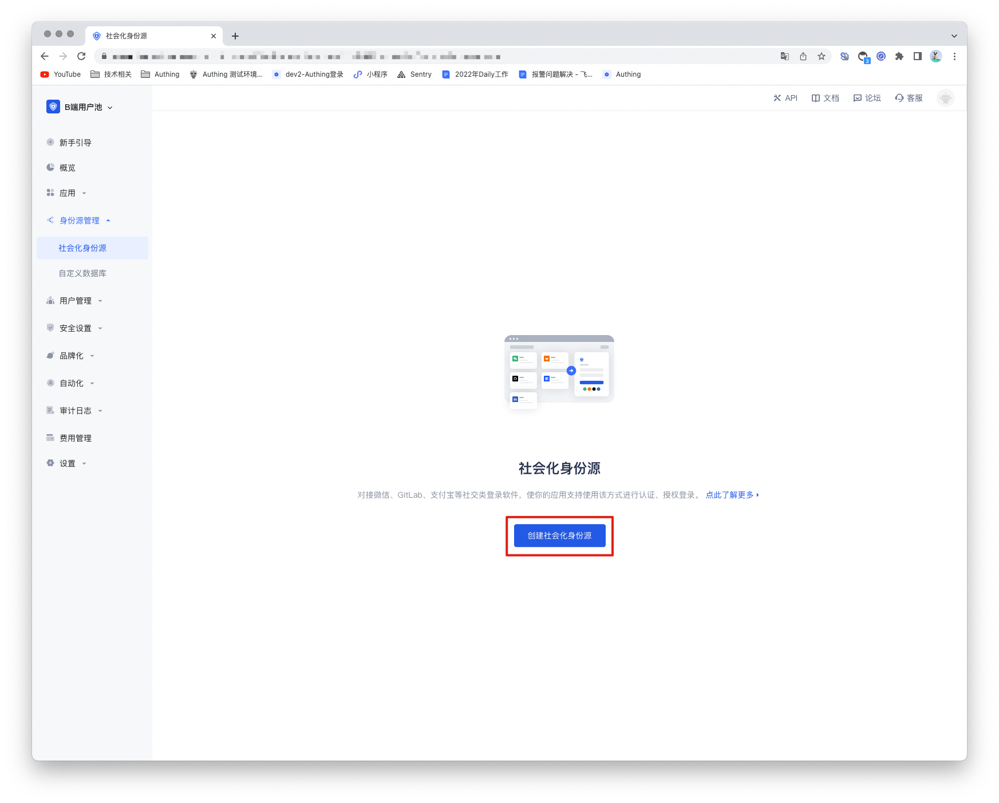
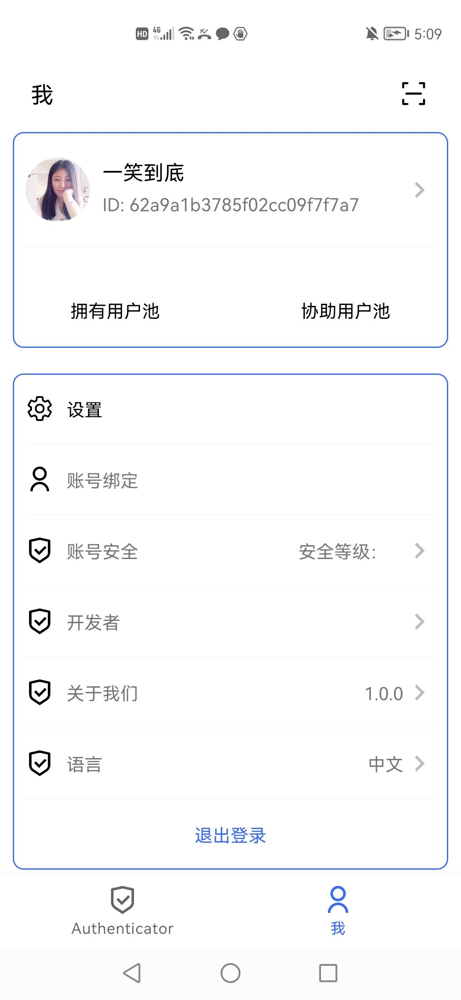

# NetEase Yidun (One-click login)

<LastUpdated/>

## Scenario Introduction

- **Overview**: One-click login with mobile phone number is an extremely convenient authentication method provided by the three major operators. Currently, GenAuth supports access to this capability through NetEase Yidun. NetEase Yidun integrates the one-click login SDK of the three major operators and provides a unified mobile application interface. You can configure the Yidun identity source on the GenAuth console to quickly complete the password-free login function on the mobile phone through GenAuth.
- **Application scenario**: Mobile
- **Terminal user preview image**:

## Notes

1. Go to [NetEase Yidun](https://dun.163.com/dashboard?v=0116&locale=zh-CN#/login/?referrer=%2F) to register an open account.
2. Go to [Yidun Service Management Backend](https://dun.163.com/dashboard#/m/verification/index) and follow the instructions to create a **website application**.
3. If you have not opened a GenAuth console account, please go to [GenAuth Console](https://www.genauth.ai/) to register a developer account.

## Step 1: Create an application

Log in to the Yidun Service Management Backend and create a business; then log in to the Application Management Backend and create an application; finally, bind the business. For detailed Yidun operations, please refer to [Yidun Number Authentication Console User Guide](https://support.dun.163.com/documents/287305921855672320?docId=424413790996844544).

After creating the application, setting the package name, uploading the signature, etc., you need to record the business ID (business Id) and the product key SecretId and SecretKey of the number authentication service access credential. This data will be required when configuring the Yidun identity source in the GenAuth console later.

## Step 2: Configure Yidun in the GenAuth console

2.1 Please click the "Create Social Identity Source" button on the "Social Identity Source" page of the GenAuth Console to enter the "Select Social Identity Source" page.

2.2 Please click the "Yidun" identity source button on the "Social Identity Source"-"Select Social Identity Source" page of the GenAuth Console to enter the "Yidun Login Mode" page.

2.3 Please configure the relevant field information on the "Social Identity Source"-"Yidun" page of the GenAuth console.

| Field/Function               | Description                                                                                                                                                                                                                                                                                       |
| ---------------------------- | ------------------------------------------------------------------------------------------------------------------------------------------------------------------------------------------------------------------------------------------------------------------------------------------------- |
| Unique ID                    | a. The unique ID consists of lowercase letters, numbers, and -, and its length is less than 32 bits. b. This is the unique ID of this connection and cannot be modified after setting.                                                                                                            |
| Display Name                 | This name will be displayed on the button of the terminal user's login interface.                                                                                                                                                                                                                 |
| Business ID                  | Business ID, the business ID (bussinessId) created on Yidun.                                                                                                                                                                                                                                      |
| SecretId                     | SecretId, the product key SecretId of the number authentication service access certificate.                                                                                                                                                                                                       |
| SecretKey                    | SecretKey, the product key SecretKey of the number authentication service access certificate.                                                                                                                                                                                                     |
| Login Mode                   | After turning on "Login Only Mode", you can only log in to existing accounts and cannot create new accounts. Please choose carefully.                                                                                                                                                             |
| Account Identity Association | When "Account Identity Association" is not turned on, a new user is created by default when a user logs in through an identity source. After enabling "Account Identity Association", users can be allowed to log in directly to an existing account through "Field Matching" or "Query Binding". |

After configuration is complete, click the "Create" or "Save" button to complete the creation.

## Step 3: Development Access

- **Recommended Development Access Method**: SDK Integration
- **Pros and Cons**: Easy access, only a few lines of code are required. Highest degree of customization.
- **Detailed Access Method**:

  3.1 Create an application in the GenAuth console. For details, see: [How to create an application in GenAuth](/guides/app-new/create-app/create-app.md).

  3.2 On the created EasyShield Identity Source Connection Details page, open and associate an application created in the GenAuth console.

3.3 Refer to the integration guide provided by GenAuth to complete the integration work, and then experience one-click login with mobile phone number on the mobile terminal.

- [Android Integration Guide](https://github.com/Authing/guard-android/blob/master/doc/topics/oneauth.md)

- [iOS Integration Guide](https://github.com/Authing/guard-ios/blob/main/doc/topics/oneauth.md)

