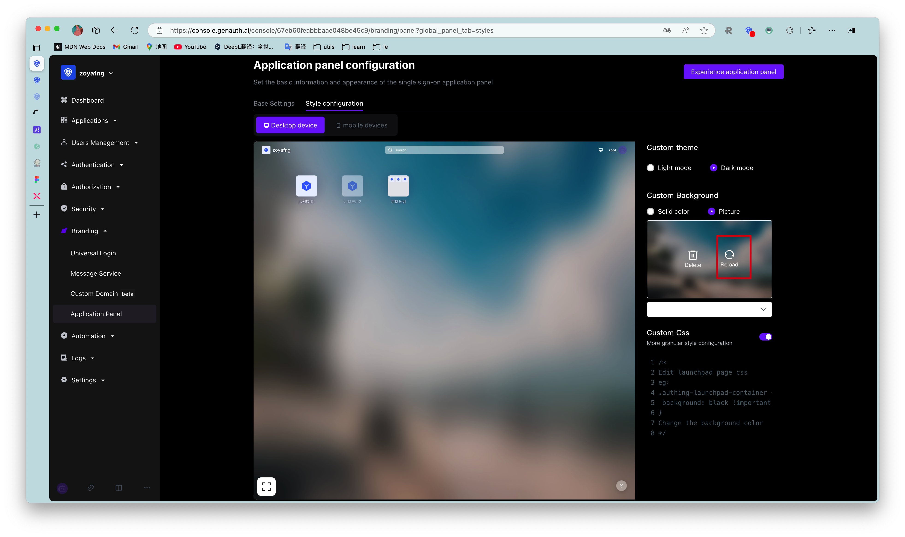

# Application panel configuration

Path: **Branding->Application panel**

[Application panel](https://docs.genauth.ai/guides/dashboard/#%E5%BA%94%E7%94%A8%E9%9D%A2%E6%9D%BF) is a carrier for displaying and accessing various applications that can use [Single Sign-On SSO](https://docs.genauth.ai/guides/app-new/sso/) within the user pool. Enterprise administrators can add various applications required by employees or target end users to the application panel to achieve single sign-on (SSO) for employees/end users to each application, improve work efficiency and ensure information security.

Application panel configuration supports modifying the panel name, logo, address, style, background and other information of the application panel. You can also build a beautiful and brand-friendly application panel by customizing css. More fine-grained branding configuration of the application panel can deepen the brand awareness of end users within the organization; or enhance credibility when used as an external business system, and further expand the applicable scenarios of the single sign-on panel.

::: hint-info
To use the **Branding->App Panel** function, the user pool must have enabled [Single Sign-On SSO](https://docs.genauth.ai/guides/app-new/sso/#%E5%8D%95%E7%82%B9%E7%99%BB%E5%BD%95-sso-%E7%BB%BC%E8%BF%B0) value-added functions
:::

## Basic Settings

Enterprise administrators or administrators with GenAuth console permissions can enter the console **Branding->App Panel->Basic Settings** to modify the basic information of the application panel:


| Serial number | Name              | Function description                                                                                                                                                             |
| :------------ | :---------------- | :------------------------------------------------------------------------------------------------------------------------------------------------------------------------------- |
| 1             | App Panel Name    | Customize the name of the App Panel that the end user sees after logging into the App Panel. The name is located in the upper left corner of the App Panel in the initial state. |
| 2             | App Panel Address | Customize the App Panel access address. After editing here, the end user logs in to the App Panel with this address.                                                             |
| 3             | App Panel Logo    | You can upload an image as the App Panel Logo. The Logo is located in the upper left corner of the App Panel in the initial state.                                               |
| 4             | App Panel Favicon | You can upload an image as the browser tab favicon of the App Panel.                                                                                                             |
| 5             | Preview           | Preview 1 - 4 customized content here                                                                                                                                            |

## Style Configuration

The style configuration of the App Panel is divided into desktop device style and mobile device style. Desktop devices support custom themes, custom backgrounds, and custom css; mobile devices support custom backgrounds and custom css.

### Custom App Panel Theme

Administrators can choose two themes for the App Panel: **Light Mode** and **Dark Mode**. Both themes preset a set of color and background style configurations for the App Panel; you can also edit custom colors and background styles based on this. The default theme is dark mode.


### Custom background

Administrators can set the background of the application panel to any solid color; or upload a picture as the background of the application panel. Here you can customize the background image that fits the corporate brand image/marketing needs. Taking desktop devices as an example, the operation steps are as follows:

1. Prepare a desktop device size background image
2. Open **Branding->Application Panel->Style Configuration**, select **Desktop Device->Custom Background->Image Background**
3. Hover the mouse over the image box, click [Retransmit], upload the image from the local computer, and view the preview effect

<br>
<br>

4. Click the button [Save Configuration] on the right side of the page header. After saving successfully, you can log in to the application panel to experience it.

<br>
<br>

::: hint-info
When uploading images, make sure the image size does not exceed 2M.
:::

### Custom CSS

To customize the application panel frame through custom CSS, you need to turn on the **Custom CSS** switch in the **Style Configuration** tab.


<br>
Custom CSS can achieve more detailed appearance control of the hosted application panel page to meet the expectations of your enterprise employees or end users for the application panel. By customizing CSS, you can make some advanced custom styles for the application panel frame, such as background and position of specific elements.

1. Take modifying the background color as an example:

```css
.authing-launchpad-container {
  background: #000 !important;
}
```

The effect is as follows:

<br>

2. Take modifying the position of page elements as an example:

```css
.authing-launchpad-header {
  position: absolute;
  bottom: 0px;
}
```

The effect is as follows:

<br>

#### Customizing CSS has the following precautions:####

- Try to control the scope of the specified CSS, and its generation rule depends on the last level of routing. </br>If you only want to style the application panel page, you can add `.launchpad` before all css selectors, such as `.launchpad` for the `/login` page.


<br>
* Try to specify the control panel rendering node to be modified. Common rendering nodes on the PC side are as follows:
  * .authing-launchpad-container
  * .authing-launchpad-header
  * .authing-launchpad-main

- Try to specify the control panel rendering node to be modified. Common rendering nodes on the mobile side are as follows:
  - .authing-launchpad-m-content
  - .authing-launchpad-m-content
  - .authing-launchpad-m-content-container
  - ...

</br>As shown in the figure below, the class name `.authing-launchpad-container` indicates that the launchpad is in the application panel node. Carrying this class name as the front selector, its style will only take effect in the application panel node.


<br>
* The specific css class name can be viewed through the Chrome console in the application panel interface of {{$localeConfig.brandName}}. The DOM tags that need custom styles are all provided with fixed class names. Class names with hash cannot be used because they change frequently.

- Try to select elements accurately. If the DOM hierarchy is very deep, it is recommended to use **copy selector** and use it with the first and second preceding selectors.


::: hint-info
**Application Panel** has been iterating and expanding its functions to better serve users. During this development process, there may be DOM structure adjustments and class name deprecations. If it affects the user's customized CSS style, please contact our developers to adjust the CSS.
:::
