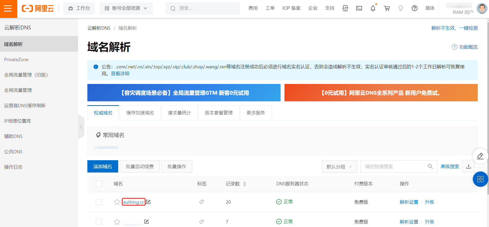
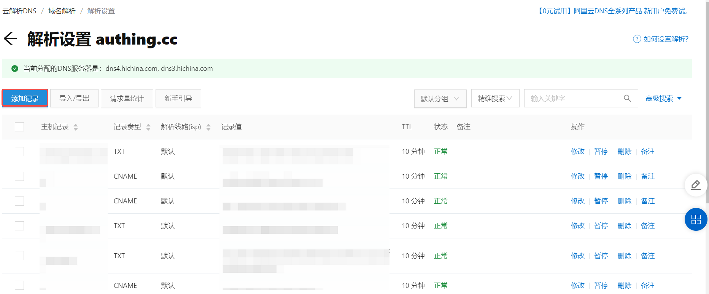
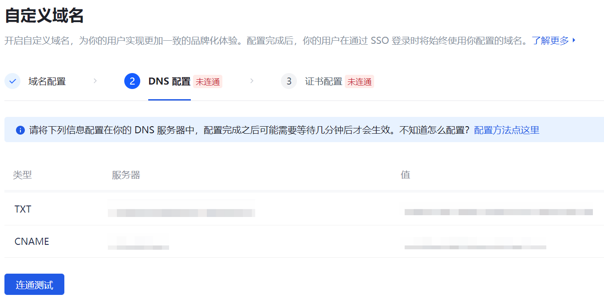
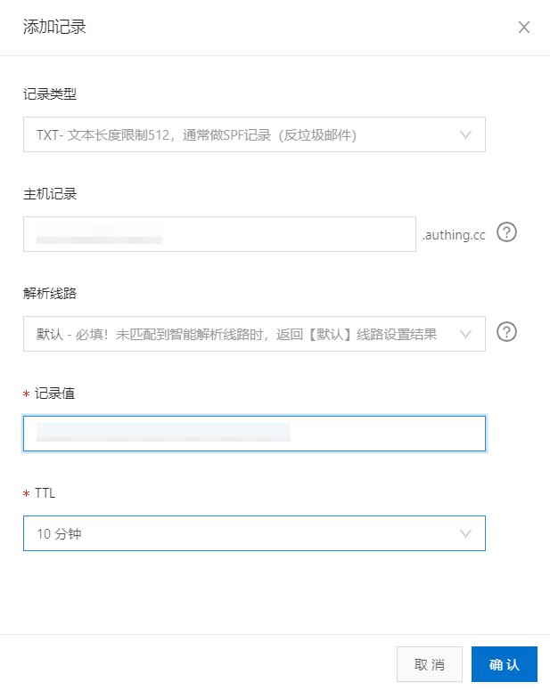

# Create a new CNAME pointing to GenAuth in Alibaba Cloud

## Step 1: Select the domain name to be resolved

1. If you have a valid domain name, select the domain name you want to add **CNAME** in the **Cloud Resolution DNS->Domain Resolution** function area of ​​the Alibaba Cloud console.

2. Enter the domain name resolution list and click the **Add Record** button in the upper left corner of the record list.  Open the **Add Record** drop-down box.

## Step 2: Add domain name resolution record ​

::: hint-info
You need to add a record for **TXT** and **CNAME** respectively.
:::

1. Add a **TXT** record in the sidebar as described in the table below.

| Field | Description |
| -------- | -------------------------------------------------------------- |
| Record Type | Select **TXT**. |
| Host Record | Fill in the **TXT** generated by {{$localeConfig.brandName}}. |
| Resolution Line | Select the default path. |
| Record Value | Fill in the value corresponding to the **TXT** generated by {{$localeConfig.brandName}}. |
| TTL | Cache time; the smaller the value, the faster the modified record will take effect in various places. The default is 10 minutes. |

::: img-description
GenAuth custom domain name DNS configuration page
:::

::: img-description
Alibaba Cloud Console DNS Configuration Page - TXT Record
:::

2. Add **CNAME** record in the side drop-down box.

::: img-description
Alibaba Cloud Console DNS Configuration Page - TXT Record
:::

The two newly generated records (**TXT** and **CNAME**) appear at the top of the domain name resolution list.

## Step 3: DNS Connectivity Test

After Alibaba Cloud completes DNS configuration, you can perform a connectivity test on the DNS configuration page of {{$localeConfig.brandName}}. Generally speaking, it takes some time for the domain name resolution configuration to take effect. If the configuration has been completed but the connectivity test has not been successful, you can wait for a while.

After the connectivity test is completed, you have completed the domain name resolution configuration between {{$localeConfig.brandName}} and the DNS server.
