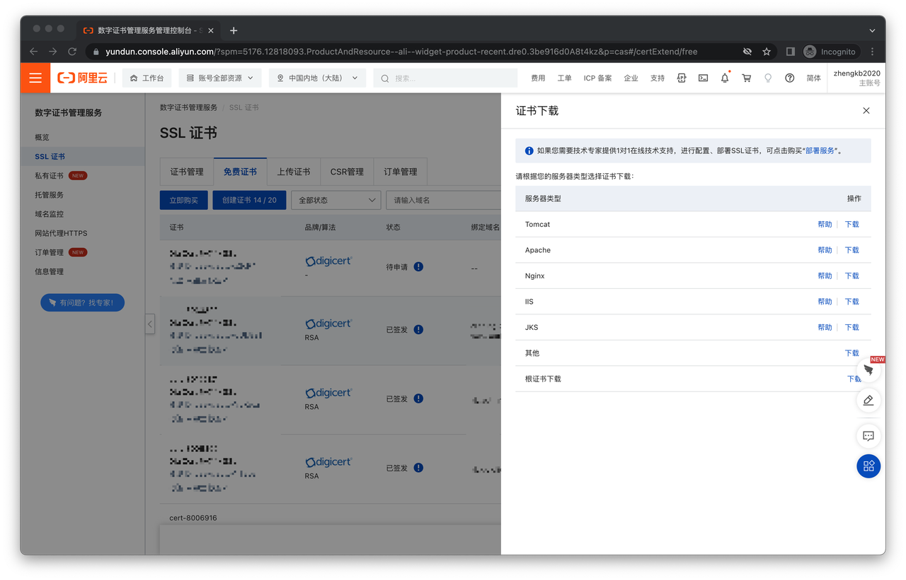
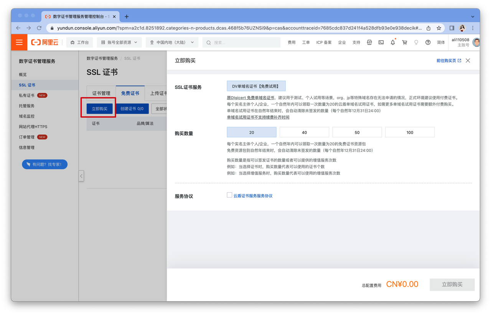
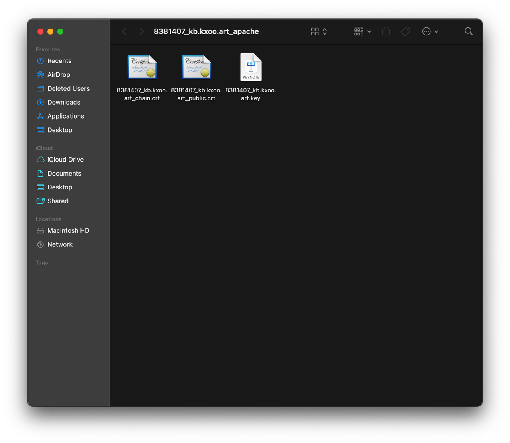
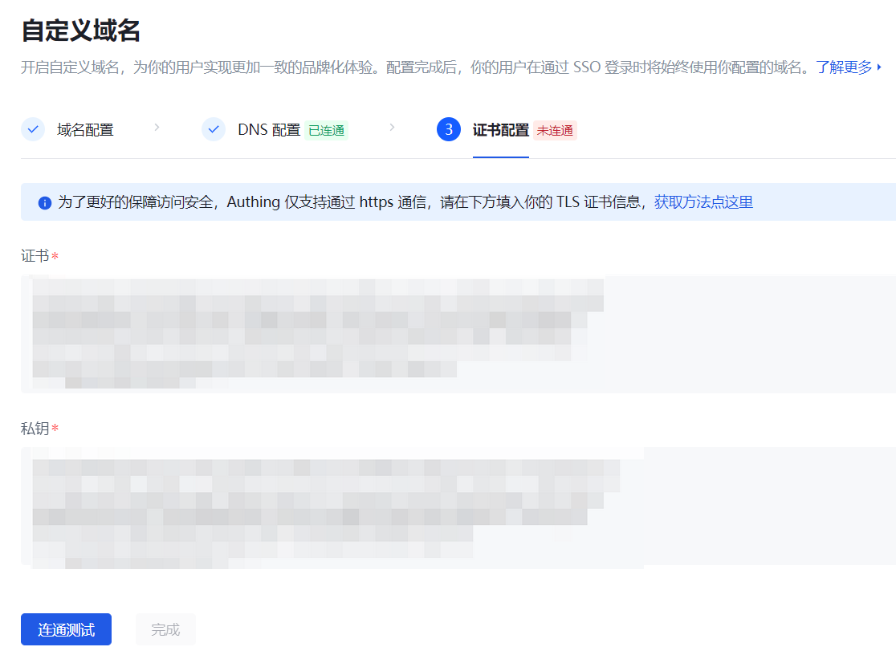

# Use Alibaba Cloud's SSL certificate information

## Step 1: Download the certificate corresponding to the domain name

Find the certificate you want to use in **Digital Certificate Management Service->SSL Certificate** of the Alibaba Cloud console, and select the corresponding certificate package to download according to your server type.

If you don't have a certificate yet, you can click **Buy Now** to generate a new certificate.

## Step 2: Get key certificate information

Take the Apache certificate package as an example. There are three files after decompression:

After opening, you can get the signature certificate, signature private key and certificate chain information.

::: hint-info
You need to ensure that the content and format of the certificate are correct.
:::

## Step 3: Test the validity of the SSL certificate

After filling in the valid certificate information in the SSL certificate configuration area of ​​{{$localeConfig.brandName}}, you can perform a connectivity test. GenAuth will verify the match between the certificate and the domain name and the validity period of the certificate. Once the verification passes, the SSL certificate configuration will take effect.

If your certificate is about to expire, you can click the **Edit** button to replace the relevant information of the certificate, and then re-**Connectivity Test** to complete the certificate update.
