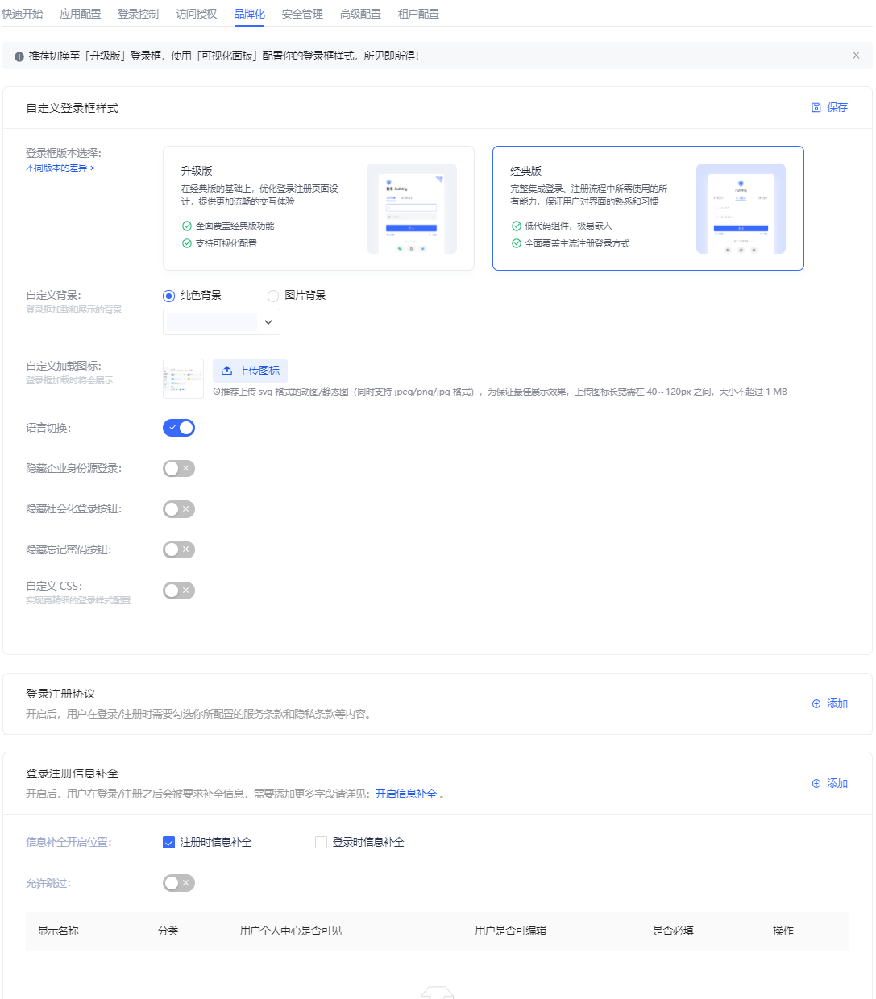

# Global Login Box

Path: **Branding->Global Login Box**

::: hint-info
For information about the {{$localeConfig.brandName}} user pool version that supports the "Global Login Box" feature benefit, please check the [Official Website "Pricing" Page](https://www.genauth.ai/pricing). If your version does not support this benefit and you want to try it, you can activate the trial period. For an introduction to the trial period and how to activate it, please check [Trial Period](/guides/basics/trial/README.md).
:::

Branding is one of the modules that GenAuth pays the most attention to, providing users with very powerful customization functions.

The following figure is an overview of the global login configuration.


| No. | Description                                                                                                                              |
| :-: | ---------------------------------------------------------------------------------------------------------------------------------------- |
|  1  | Style configuration: You can configure the login box style.                                                                              |
|  2  | Function configuration, you can configure the login registration agreement and login registration information completion.                |
|  3  | Experience login.                                                                                                                        |
|  4  | Overall style: Including login box style configuration and display page.                                                                 |
|  5  | General login: Configure the display and hiding of forgotten password, enterprise account login and social account login entrance.       |
|  6  | Login box preview language, including **Follow the system**, **Simplified Chinese**, **Traditional Chinese**, **English**, **Japanese**. |
|  7  | Web preview.                                                                                                                             |
|  8  | Mobile preview.                                                                                                                          |
|  9  | Full screen display, only applicable to web preview; click again to restore the original size.                                           |

::: hint-info
{{$localeConfig.brandName}} All branding configurations in the console will be read by applications that do not have the custom login box function enabled under this user pool.
:::

## Style configuration

You can configure the display style of the login box here.

### Overall style

The overall style applies to the entire process of application login/registration, including one-time authentication, two-time authentication, and information completion.

Administrators can customize the login/registration page background, loading icon, login box version, display language, CSS, etc. on the **Overall style** page.

#### Custom background

Administrators can set the login box display background to a solid color, or upload an image and use it as the background.

::: hint-info
When uploading an image, make sure the image size does not exceed 2M.
:::

#### Custom loading icon

Administrators can customize the icon displayed when the login box is loading in this module.

To delete the current loading icon, just click the checkbox and confirm the deletion.


#### Login box version

Administrators can choose between **Upgraded version** and **Classic version** login box configuration pages, with the default being the upgraded version.

::: hint-info
Starting from August 2022, newly created user pools will not support switching to the classic login box. All of our feature updates and performance maintenance will also be completed based on the upgraded login box. For user pools created before this point in time, the classic login box you are using will not be affected.
:::

The following figure is the classic version configuration page:



#### Default language

Define the display language of the login box:

- **Follow the system** </br>The display language of the login box may be different from the system language of the application after login. Administrators can set the display language of the login box to follow the system language of the application to improve the user login experience.
- **Simplified Chinese**
- **Traditional Chinese**
- **English**
- **日本語**

#### Switch language

Administrators can use the **Switch language** switch to define whether to display the language switch option at the bottom of the login box, so that users can customize the display language of the login box. If this switch is turned off, users cannot customize the display language of the login box. At this time, the interface display language is the one configured by the administrator in **Default language**.

#### Custom css

Custom css can achieve more detailed control over the hosted login page to meet user expectations for the login page. By customizing CSS, you can customize the login box with some advanced styles, such as changing the background color:

```css
.authing-guard-layout {
  background: gray;
}
```

To configure a personalized login box through custom CSS, you need to turn on the **Custom CSS** switch in the **Overall Style** tab.


Customizing CSS has the following points to note:

- Try to control the scope of the specified CSS, and its generation rule depends on the last level of routing. </br> If you only want to style the login page, you can add `.login` before all CSS selectors, such as `.login` for the `/login` page.


- Try to specify the guard rendering node to be modified, common rendering nodes such as:
  - .g2-view-login​
  - .g2-view-register​
  - .g2-forget-password​
  - .g2-need-help​
  - ...</br>As shown in the figure below, the class name `.g2-view-login` indicates that guard is in the login node. Carrying this class name as the front selector, its style will only take effect in the login node.


- The specific css class name can be viewed through the Chrome console on the login interface of {{$localeConfig.brandName}}. The dom tags that need custom styles all provide fixed class names. Class names with hash cannot be used because they change frequently.

- Try to select elements accurately. If the dom hierarchy is very deep, it is recommended to use **copy selector** and use it with the first and second preceding selectors.


::: hint-info
Guard has been iterating and expanding its functions to better serve users. During this development process, there may be dom structure adjustments and class name deprecations. If it affects user-defined css, please contact our developers for css adjustments.
:::

### General login

The so-called **General login** refers to password login and verification code login. This section will introduce the **Forgot password**, **Enterprise account login**, **Social account login** hide/show switches that are only applicable to general login.


#### Forgot password

Administrators can define whether to display the **Forgot password** component in the login box. After turning it on, users can click this button to reset their password when they forget their login password.

#### Enterprise account login

::: hint-info
**Enterprise account login** hide/show switch works only if a third-party enterprise login method has been added and enabled. Otherwise, even if the switch is turned on, the enterprise account login entrance cannot be displayed in the login box. For more information on adding enterprise login methods, see [Connecting enterprise identity sources](../../connections/enterprise.md).
:::

Administrators can define whether to display other enterprise account login entrances in the login box. After turning it on, users can log in using other enterprise application accounts.

#### Social Account Login

::: hint-info
**Social Account Login** The prerequisite for the hide/show switch to work is that third-party social login methods have been added and enabled. Otherwise, even if the switch is turned on, the social account login entrance cannot be displayed in the login box. For more information on adding social login methods, see [Connecting Social Identity Sources](../../connections/social.md).
:::

Administrators can define whether to display third-party social account login entrances in the login box. After turning it on, users can log in using third-party social accounts.

### Scan QR code login

{{$localeConfig.brandName}} supports users to log in by scanning QR codes on the mobile terminal. In addition to using mobile APP to scan QR codes, you can also use mobile third-party enterprise identity sources or social identity sources to scan QR codes.

Administrators can configure whether to enable enterprise account login and social account login here. After turning it on, users can see it on the scan code login page.

#### Enterprise account login

Same as [Regular login Enterprise account login](#Enterprise account login).

#### Social account login

Same as [Regular login Social account login](#Social account login).

## Function configuration

### Login and registration agreement

When users register, you need to let them understand and agree to your terms of service to help you avoid legal risks. To this end, {{$localeConfig.brandName}} provides the **Login and registration agreement** function.


| Serial number | Field                         | Description                                                                                                                                                                                                                                                                               |
| :-----------: | ----------------------------- | ----------------------------------------------------------------------------------------------------------------------------------------------------------------------------------------------------------------------------------------------------------------------------------------- |
|       1       | Add                           | Click to add a new registration agreement.                                                                                                                                                                                                                                                |
|       2       | Display location              | The location where the agreement is presented: on the **Registration interface** or the **Login interface**. </br>**Note**: Multiple selection is supported.                                                                                                                              |
|       3       | Required                      | Enabled by default when adding a registration agreement.                                                                                                                                                                                                                                  |
|       4       | Interface language            | **Note**: The currently configured agreement will only be displayed in the selected language interface. </br>You can click the **Add** button under the agreement adding panel to add different language versions of the registration agreement for the login box in different languages. |
|       5       | Check text                    | You can configure the registration agreement title and content here.                                                                                                                                                                                                                      |
|       6       | Undo                          | Undo the modification of the registration agreement title and content.                                                                                                                                                                                                                    |
|       7       | Redo                          | Restore the modification of the registration agreement title and content.                                                                                                                                                                                                                 |
|       8       | Agreement content             | Click to configure the specific agreement content.                                                                                                                                                                                                                                        |
|       9       | Registration Agreement Prompt | You can configure the registration agreement prompt to be viewed and checked here, which is visible when the user logs in/registers.                                                                                                                                                      |
|      10       | Save                          | Save configuration and modification.                                                                                                                                                                                                                                                      |
|      11       | Delete                        | Delete the current registration agreement configuration.                                                                                                                                                                                                                                  |
|      12       | Add                           | Same as 1.                                                                                                                                                                                                                                                                                |
|      13       | Address                       | The agreement content can be an external link: that is, you have deployed the page with the detailed content of the agreement, just enter the page address directly, and the user will jump to the link you configured when clicking the agreement title.                                 |
|      14       | Display Text                  | You can configure the agreement content title corresponding to the external link here.                                                                                                                                                                                                    |

To enable this function, perform the following steps:

1. In the **Branding->Function Configuration->Login Registration Agreement** module, click the **Add** button in the upper right corner. </br>Open the agreement addition panel below.

2. Check **Show Location**.

3. Select the interface language applicable to the registration agreement.

4. Configure the agreement content.

5. Click the **Save** button to save the current configuration.

After the configuration is completed, you can see the registration agreement on the registration interface. When logging in/registering, users need to review and check the terms of service and privacy terms you configured:


### Login registration information completion

Users usually need to provide personal information such as mobile phone number/email address when logging in and registering. In addition to these general personal information, administrators can specify users to complete specific information to complete login/registration for business data collection.

Administrators can specify the information to be completed (i.e. fields) in the console **Branding->Function Configuration->Login Registration Information Completion** module.


To configure the information to be completed, perform the following steps:

1. Select **Information completion start position**: **Information completion during registration** and/or **Information completion during login**.

2. Specify whether the user can skip the completion window when logging in/registering.

::: hint-info

- If the **Allow skip** switch is turned on, a **Skip** button will appear in the upper right corner of the completion window when the user logs in to complete the completion, and the user can click the button to skip the completion.

- If the **Allow skip** switch is turned off, the **Skip** button will not appear in the completion window.
  :::

3. In the **Login and registration information completion** module, click the **Add** button in the upper right corner to add the fields to be completed. </br>Open the **Add field** pop-up window.

4. Select the category of fields to be completed: **User basic fields**, **User extended fields**.

::: hint-info

- Administrators can view user basic fields and user extended fields in **Settings->Field Management**.

- Administrators can only edit user basic fields, and cannot add or delete them.
  :::

5. Specify whether the current field to be completed is **Required**.

::: hint-info

- After turning on **Required**, users must complete the required fields when logging in/registering.

- If the completion information has been provided when the user logs in/registers (such as mobile phone number, email address), regardless of whether the completion information is specified as **Required**, it will not appear in the completion window, that is, only the currently empty fields will appear in the completion window.
  :::

6. Select the field to be completed.

::: hint-info

- **Field name** is linked to **Category**, and the data source is synchronized with the **User Basic Field** list and **User Extended Field** list in **Settings->Field Management**.

- If the supplementary information is a user extended field, it needs to be configured in advance in the **Field Management** menu. For details on user extended field configuration, please refer to [Add Custom User Fields](/guides/users/user-defined-field/README.md).

- After selecting a field, the **Form Type** below is automatically displayed, which is consistent with the **Data Type** of the field in **Field Management** and cannot be modified.
  :::

7. Specify **Validation Rules**, including two options:

- **No validation**
- **Regular expression**: Enter the **Regular expression** and **Error message** below (required).

8. Click **Save**.

::: hint-info

- You can edit or delete the current field by clicking the corresponding button in the **Operation** column of the target field row in the supplementary field list.

- For the created completion fields, click the Edit button to modify only **Required** and **Validation Rules**.
  :::
